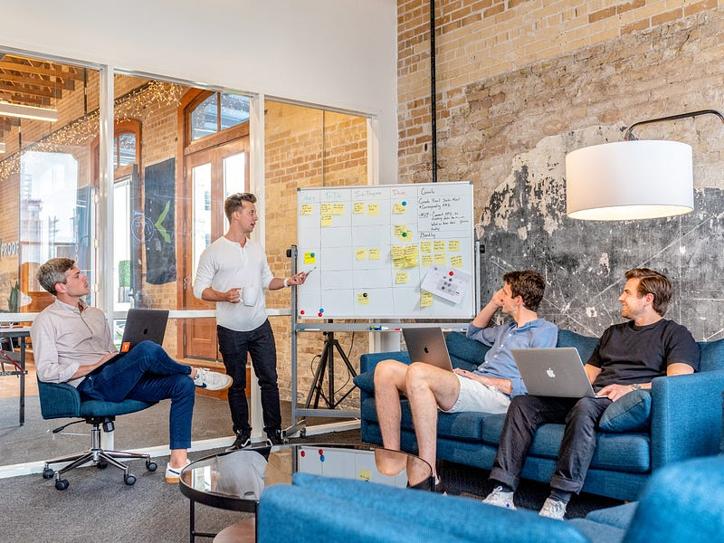
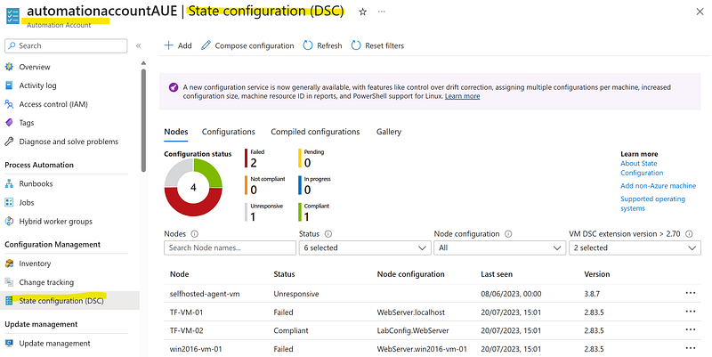
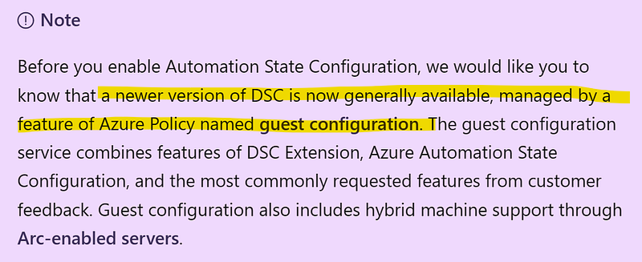
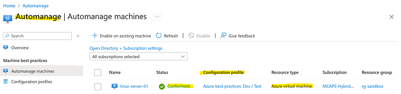

* * *

### 微軟雲端架構師 (Azure Cloud Solution Architect) 到底在做什麼? 第三集：Technical Guidance/Customer Meetings

Photo by [Austin Distel](https://unsplash.com/@austindistel?utm_source=medium&utm_medium=referral) on [Unsplash](https://unsplash.com?utm_source=medium&utm_medium=referral)

* * *

### 前言

這篇文章是 <<微軟雲端架構師 (Azure Cloud Solution Architect) 到底在做什麼?>> 系列的第三集。這個系列預計會有五篇文章，以雲端架構師在日常工作中最主要的任務為例 :

  1. Org Chart
  2. Solution Architecting
  3. **Technical Guidance/Customer Meetings >> 你正在閱讀的文章**
  4. Technical Presentation/Workshops
  5. Sales Pipeline Management

**還沒看過第一集的人請看這裡：**

[**微軟雲端架構師 (Azure Cloud Solution Architect) 到底在做什麼? 第一集：Org Chart & Solution Architecting**  
 _跟讀者們或是朋友們聊天時，他們對我提出的第一個問題總是，「所以雲端架構師(Solution Architect) 到底是在做什麼?」但我每次解釋後，大家看起來還是一知半解…_ medium.com](2023-07-28-ms-csa-1)

**還沒看過第二集的人請看這裡：**

[**微軟雲端架構師 (Azure Cloud Solution Architect) 到底在做什麼? 第二集：Solution Architecting**  
 _這篇文章將以 3-tier web app migration 跟大家分享微軟雲端架構師 (Azure Cloud Solution Architect) 是如何規劃雲端解決方案的，文章的最後還會跟大家分享當架構師所需的技能。_ medium.com](/posts/2023-07-28-ms-csa-2/)

**我希望大家在看完這個系列之後，可以留言告訴我:**

  1. 如果你不是微軟雲端架構師 (Azure Cloud Solution Architect)，你覺得這個職位符合你對於技術職位 (technical role) 的想像嗎?
  2. 如果你是微軟雲端架構師 (對，我最近發現有同事會看我的部落格! 太可怕了QAQ)，你覺得我對於 CSA 的工作描述還算客觀嗎?

**當然，總是要先放一下免責聲明XD**

這個系列完全是以我個人在澳洲微軟工作的親身經歷作為出發點，所以是我個人的主觀感受。雖然我敘述時會盡可能客觀呈現，讓各位讀者自行判斷。如果你在不同國家的微軟工作，甚至是你在不同的微軟團隊，你對於這個職位的感受可能會跟我略有出入或完全不同。

* * *

以下我會以時間線作為小標題，讓大家一同來體驗雲端架構師平常是如何跟客戶開會並提供技術指導。

### 週三早上: 收到客戶 CTO 來信，希望我可以跟客戶內部的 Domain Architect 聊一下DSC

客戶的信大概是以下這樣的:

> _Hi Ellie,_

> _Hope you are well._

> _I’m just wondering if you can spend some time talking about DSC with xxx?_

> _Thanks!_

在這之前我完全沒有聽過 DSC 哈哈哈～(DSC 是什麼？可以吃嗎?) 客戶的信件中也只寫了這個簡稱，完全沒有任何背景。感覺其實很像是上 PTT 問問題，但又不給資訊的通靈文?XD

所以雲端架構師的第一個能力就是通靈XDD 沒有啦，開玩笑的，所以第一個能力就是資訊收集。我上網查了一下，才發現 DSC 是 desired state configuration，通常是用來確保 server compliance status。

於是我查了一下我的行事曆，發現我只有週四跟下週一有空，於是回信給客戶兩個時間段，看他們哪個時間可以開會，然後心裡默默希望他們選週一，這樣我可以有更多時間準備。結果客戶選了週四下午哈哈哈哈，因為他希望趕快推進這件事~

### 週三下午跟週四早上：準備期間

瘋狂準備 DSC 相關的資料，然後我才發現 Azure 關於 DSC 的 offerings 有三種。

**Solution 1: Automation State Configuration**

  * **DSC 官方文件** : [Azure Automation State Configuration overview | Microsoft Learn](https://learn.microsoft.com/en-us/azure/automation/automation-dsc-overview)
  * **DSC 官方培訓** (這裡面有提供 demo configuration file，有興趣的人可以跟著動手做做看): [AZ-400: Manage infrastructure as code using Azure and DSC — Training | Microsoft Learn](https://learn.microsoft.com/en-us/training/paths/az-400-manage-infrastructure-as-code-using-azure/)
  * **YouTube Tutorial** : [Azure Automation Part3 — Working with the Desired State Configuration using Azure Automation — YouTube](https://www.youtube.com/watch?v=8plqKnxzDHA)

第一種解決方案非常直接明瞭就叫 DSC 哈哈！但要跟 Azure Automation Account 一起合併使用才可以，這個解決方案在官方文件跟 YouTube 上都有一些相關影片，我自己也簡單在 Azure Portal 上做了一個 demo。

DSC demo in Azure portal

* * *

**Solution 2: Azure Policy Guest Assignment >> Azure Automanage machine**

  * **官方文件** : [About Azure Automanage Machine Best Practices | Microsoft Learn](https://learn.microsoft.com/en-us/azure/automanage/overview-about)

Azure documenetation: newer version of DSC

但是在 DSC 的官方文件上，又寫說現在有更新版的 DSC，叫做 Azure Policy Guest Assignment，結果一點進去連結，又說 Azure Policy Guest Assignment 現在改名為 Azure Automanage machine 了。

我研究了一下，大概知道這個是用 Azure Policy 來執行跟判斷 server configuration 的 compliance status，但我在 Azure Portal 上試了一下，還是不太確定要怎麼用。Azure 官方文件我看了兩三次，然後也試著在 YouTube 上搜尋，但相關資訊真的不多

* * *

**Solution 3: Azure Automanage**

  * **官方文件** : [About Azure Automanage Machine Best Practices | Microsoft Learn](https://learn.microsoft.com/en-us/azure/automanage/overview-about)
  * **官方說明影片** : [Simplify Windows Server management in Azure with Automanage & Hotpatch — YouTube](https://www.youtube.com/watch?v=X7RoU5ZOnjg)

我後來發現還有另一個解決方案，是一個獨立的 Azure Service 叫 Automanage (是不是跟 Solution 2 名字超像！但他們兩個明顯又是不一樣的服務，真心莫名其妙哈哈哈哈哈)。

Solution 3 我也是官方文件看了幾次，YouTube影片看了幾個，然後成功在我自己的 Azure Portal 上做了一個 demo。

Automanage demo in Azure portal

因為我實在搞不懂 solution 2 跟 solution 1 & 3 之間的關係跟差異，所以我就放棄 solution 2 了。想說至少我現在研究出來兩種解決方案，而且都還有 demo，先跟客戶開會聽聽他們實際上的要求再說。

### 週四下午：Domain Architect 初次見面

我的客戶都是 Financial Services Enterprise Accounts (澳洲大型金融組織，例如澳洲央行)，雖然我只有六個 accounts，但這六個客戶裡面可能各自有 10–20 個以上的 internal tech teams (包括 developer teams for different products/business unit, infrastructure team, cloud team, IT Ops team 等等)。所以我其實常常要跟不同的 customer stakeholders 開會，這次要開會的人我就是第一次聽說有這個人，所以我不清楚他在客戶公司裡的職位跟負責哪一部分的項目。

一進入會議我就先自我介紹，然後講完他問我說「所以你是 TAM (Technical Account Manager)嗎？」我不是喔XD 只好又跟他解釋一番 Cloud Solution Architect 在微軟是在幹嘛的。你看，所以你們不知道我在做什麼其實也很正常，連這個產業裡的人都不一定知道我在幹嘛XD

接著換他自我介紹，他說他是 Domain Architect in Data，此時我已經有了一個不祥的預感。

微軟的 CSA 分為三個領域: core/infrastructure (就是我)、Application Innovation (同事D)、Data & AI (本來是A，但A上個月轉去新的部門了，我們至今還不知道新的 Data & AI CSA 是誰 XD)。既然他的職位是 Domain Architect in Data，有極大的可能他接下來要談的技術問題跟我負責的領域不相關哈哈

然後他說「不知道我們 CTO 有沒有跟你說過我們這個項目在幹嘛跟我負責做什麼？我們這個其實 SQL servers 有關。」

想當然爾，客戶 CTO 沒跟我說這件事！

其實這種情形不只發生在客戶身上，有時候我自己的內部團隊找我跟客戶開會，也是一點 context (背景脈絡) 都沒有，大家各憑本事直接上陣。事先問同事也沒用，因為他們就是什麼都不知道，然後就急急忙忙抓了一個 Solution Architect 就來開會 (當我們什麼都知道?)。

就算我接到會議邀請後，先寫信問客戶說「你好，那請問你們的 challenges & requirements 是什麼？ Would be great if you can share these with us before the meeting so that we can make sure that we have the relevant resources ready。」基本上客戶也都不會回信，大家就是直到開會的那一刻再來談lol

我覺得這種運作模式對於一個資深的 Solution Architect 可能沒有問題，因為他們可能有辦法運用自己過去的經驗來提供客戶技術建議。對於我這種，連跟 Azure 服務也還不熟的菜鳥 SA 就慘了，絕大部分的時候我是連客戶在講什麼都不知道的XD

好，回歸主題，這個客戶一講完，我就知道完蛋了哈哈哈哈！因為我之前準備的所有東西，都是跟 Azure Virtual Machines, physical servers and Azure Arc enabled servers 相關，也就是一般的 Windows 或 Linux servers，SQL servers 完全是另一個領域喔～

不過我還是硬著頭皮好好聆聽了一下客戶的要求 (說真的我其實沒有完全聽懂XD 但不用怕！下面我會教大家如何應付這種情形)，然後我接著說「關於 server configuration/compliance，我們有以下兩個服務，我簡單跟你介紹一下，跟你展示一下他們實際上在 Azure portal 是怎麼操作的，然後你再看看這兩個服務跟你的 use cases 有沒有相關 (然後我就講了我準備的 Solution 1 & 3)」。

講完之後客戶就直接跟我確認這兩個服務跟他想要解決的問題的確是不怎麼相關XDDDD

接著我就說「嗯嗯～其實我也這麼覺得！聽完你的要求，這個我覺得跟我們 Data CSA 負責的比較相關，你能不能在會議結束後寄一封簡短的 email 給我，list your SQL server specs (database engine version etc) and your specific requirements for SQL server configuration & compliance，這樣我就可以拿這個去找我們的 Data CSA 看看他們那邊有沒有適合的解決方案。(這招超級好用，尤其是當客戶的問題你只聽懂 7 成的時候，直接讓他們把要求列下來給你。但說真的，如果客戶一開始就做這件事，這個會根本不用開，或是我一開始就可以找 Data CSA 來開，但他們就偏不這樣，就是要先找一個人聊聊XD) 」

然後我跟客戶說，這禮拜可能有點趕 (因為今天週四了)，但我爭取early next week 給你回覆。結果客戶說「喔～可是我這幾天都不會進辦公室，我可能要下週三才能給你資料」。我當然是直接說沒關係啊，你慢慢來～ (但內心OS 是：是誰趕著今天要開會的!?)

### 後續

當然這件事不會這樣結束，下週二客戶的確把他的問題整理好寄給我了。但就像我之前說過的，Data CSA 同事 A 已經轉去當 TS 了 (想要重溫微軟 CSA 相關的組織架構，請參考這個系列的[<<第一集 Org Chart>>](2023-07-28-ms-csa-1))。於是我詢問了我的經理這件事要找誰，經理推薦了我們團隊的另一個 Data CSA 同事 L。我簡短地跟 L 聊了一下，發現他對於 SQL Server DSC 也不是太了解。

接著我跟我的 Specialist 同事 T 聊了一下這件事，他提醒了我「這個應該是 pre-sale 吧？ pre-sale 的話，就是 TS 負責啊，所以你還是可以去找同事 A！」真是一語驚醒夢中人耶～ 於是我又跑去找同事 A。

然後同事 A 果然還是滿罩的，他跟我稍微解釋了一下 SQL Server DSC 這件事目前在微軟的 Azure 雲服務裡面沒有相關的 native services，一般來說遇到這個問題，業界都是仰賴第三方軟體。於是他建議我去找 Data GBB，然後我就去找了 Data Specialist V 同事，請他幫忙去找 Data GBB。

哈哈哈哈～ 然後目前已經過了一個禮拜了！我還是沒聽到後續XD 不過至少釐清了一下這件事算是 data stream 的 pre-sale 活動，所以應該是 Data Specialist V 同事協同 Data TS A 同事跟 Data GBB 一起處理。簡而言之，不甘我的事XD

### 結論

希望這個系列可以用我實際工作上的例子，來讓大家更加了解 SA 的生活。有時候寫一寫我會轉換成英文，因為我覺得寫起來比較順，畢竟因為我的工作跟所有技術知識都是用英文，有時候我可能不知道這些名詞怎麼用中文表達才比較恰當，但如果你們覺得這樣中英交雜很煩的話，也請跟我說 (其實我自己有意識到這點，我會盡量維持中文表達XD)。

然後我今天的心得是，其實 SA 的工作是不是就是「代客學習」?

有時候客戶知道他們想要什麼，但是他們不知道怎麼學或是懶得學，於是就找我們來開會。我是不知道客戶要什麼，也不知道實際上怎麼運作，但我的工作就是快速學會這個領域在雲端上的知識與運用，然後把這些知識傳授給客戶。

但說真的我常常覺得，客戶其實可以自己學一學就好。畢竟他們都是各個領域的專家，也是每天在實務上運用這些技術的人，這些技術概念我都不懂，也沒有實務經驗。我只能自己上網學習，就像我上面舉的例子，我自學了DSC 這個技術概念是什麼，我還學了兩個新的 Azure services 跟做了 demo，其實還滿有趣的。不過我終究覺得，SA這樣的技術職位 (technical role)，其實不是我想走的職涯方向 (Is SA a technical role? Probably. But it’s not in the ‘technical’ way how I want to progress my technical career)


