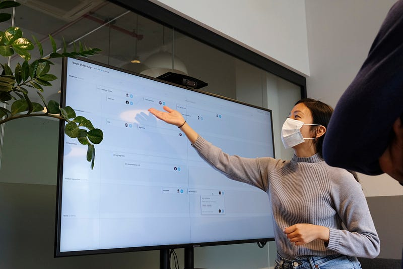
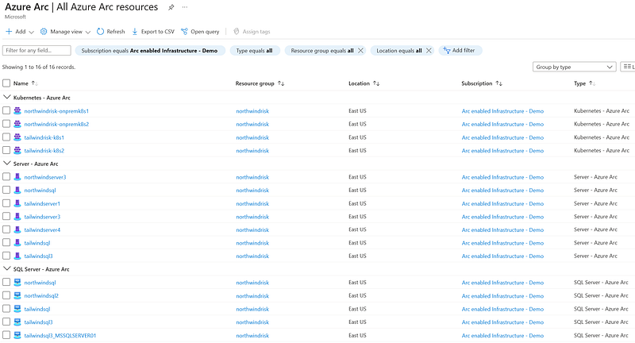
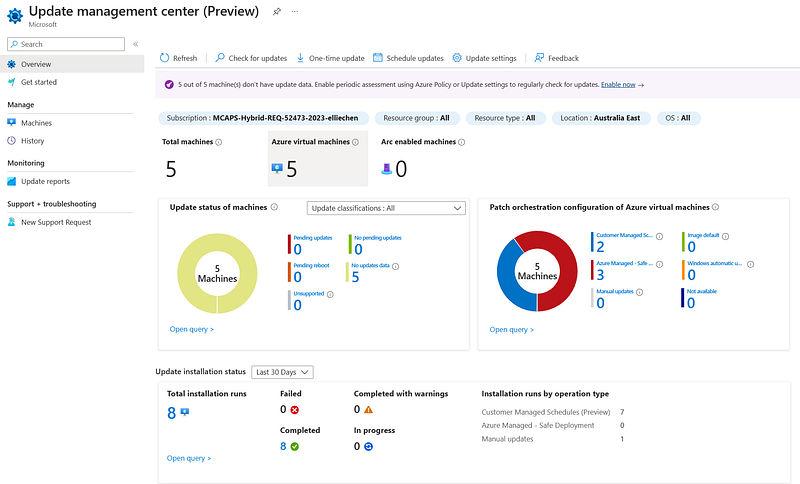
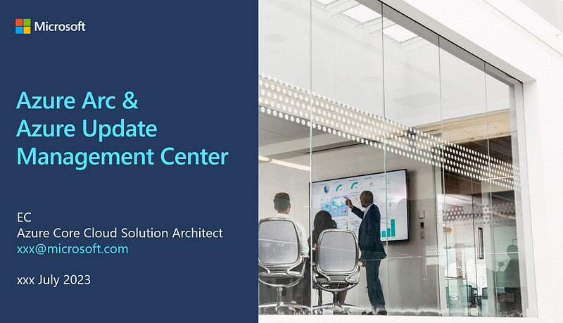

### 微軟雲端架構師 (Azure Cloud Solution Architect) 到底在做什麼? 第四集：Technical Presentation/Workshops

Photo by [airfocus](https://unsplash.com/@airfocus?utm_source=medium&utm_medium=referral) on [Unsplash](https://unsplash.com?utm_source=medium&utm_medium=referral)

* * *

### 前言

這篇文章是 <<微軟雲端架構師 (Azure Cloud Solution Architect) 到底在做什麼?>> 系列的第四集。這個系列預計會有五篇文章，以雲端架構師在日常工作中最主要的任務為例 :

  1. Org Chart
  2. Solution Architecting
  3. Technical Guidance/Customer Meetings
  4. **Technical Presentation/Workshops >> 你正在閱讀的文章**
  5. Sales Pipeline Management

**還沒看過第一集的人請看這裡：**

[**微軟雲端架構師 (Azure Cloud Solution Architect) 到底在做什麼? 第一集：Org Chart & Solution Architecting**  
 _跟讀者們或是朋友們聊天時，他們對我提出的第一個問題總是，「所以雲端架構師(Solution Architect) 到底是在做什麼?」但我每次解釋後，大家看起來還是一知半解…_ medium.com](2023-07-28-ms-csa-1)

**還沒看過第二集的人請看這裡：**

[**微軟雲端架構師 (Azure Cloud Solution Architect) 到底在做什麼? 第二集：Solution Architecting**  
 _這篇文章將以 3-tier web app migration 跟大家分享微軟雲端架構師 (Azure Cloud Solution Architect) 是如何規劃雲端解決方案的，文章的最後還會跟大家分享當架構師所需的技能。_ medium.com](/posts/2023-07-28-ms-csa-2/)

**還沒看過第三集的人請看這裡：**

[**微軟雲端架構師 (Azure Cloud Solution Architect) 到底在做什麼? 第三集：Technical Guidance/Customer Meetings**  
 _這篇文章將以我協助客戶了解SQL Server DSC (desired state configuration) 相關的 Azure 雲服務為例，跟大家分享微軟雲端架構師是如何學習雲端技術的相關知識、製作 demo…_ medium.com](/posts/2023-07-28-ms-csa-3/)

**我希望大家在看完這個系列之後，可以留言告訴我:**

  1. 如果你不是微軟雲端架構師 (Azure Cloud Solution Architect)，你覺得這個職位符合你對於技術職位 (technical role) 的想像嗎?
  2. 如果你是微軟雲端架構師 (對，我最近發現有同事會看我的部落格! 太可怕了QAQ)，你覺得我對於 CSA 的工作描述還算客觀嗎?

**當然，總是要先放一下免責聲明XD**

這個系列完全是以我個人在澳洲微軟工作的親身經歷作為出發點，所以是我個人的主觀感受。雖然我敘述時會盡可能客觀呈現，讓各位讀者自行判斷。如果你在不同國家的微軟工作，甚至是你在不同的微軟團隊，你對於這個職位的感受可能會跟我略有出入或完全不同。這次依然會以時間軸的推進作為小標，讓大家身入其境地體驗微軟架構師的生活XD

* * *

在架構師的日常中，我們也常常會應客戶或是內部同事的要求，針對某個主題或是特定的 Azure Services 來進行 technical presentation 或是 workshop。

### 前情提要

這個 workshop 光是要跟客戶喬定日期，就已經談了好幾個月，我看了一下我個人的筆記，我們從今年一月就已經把這件事列上議程 (我們跟這個客戶每週開會兩次)，一直談到七月終於敲定了日期，但沒有敲定講者XD

### Workshop 倒數 8 天

其實我覺得這件事真的好神奇，這麼早以前就已經開始談的事，會讓我覺得微軟這邊應該早就把資源都找好了，只要客戶一旦確定日期，我們就可以開始，沒想到不是這樣。我的 Sales Specialist 一直到八天前才開始寄信找資源，這時候他開始把我 cc 進內部郵件裡，我以為他都談好了，應該不需要我處理。

### Workshop 倒數 6 天

結果倒數前六天，Sales Specialist 跟我說找不到人，希望我可以出來做這個 workshop 或找到其他內部資源來幫忙。我覺得我不是不願意幫忙，只是你為什麼要拖到這麼晚才跟我說?XD 這個 workshop 的主題是 Security，Sales Specialist 希望我講以下兩個 Azure 服務：Azure Arc & Azure Update Management Center。

這兩個服務我都算是之前自學過，但還沒有正式應用過，所以我一開始是想說希望能有一個更有經驗的人來主導，然後我在一旁旁聽，然後下一次再讓我主導 (因為擔心客戶如果有實際應用上的問題，我沒有相關經驗可能會無法回答)。

  * **Azure Arc:**[**Azure Arc overview — Azure Arc | Microsoft Learn**](https://learn.microsoft.com/en-us/azure/azure-arc/overview)

 Azure Arc

其實 Azure Arc 是我覺得微軟最酷、跟其他雲服務最不一樣的服務! Azure Arc 可以讓你把在 on-premises 環境裡的 Windows & Linux servers 或是其他雲服務平台 (AWS/GCP etc) 的伺服器，變成像是 native Azure Virtual Machines 一樣。所以在 Azure Arc 上你就可以使用 Azure native services like tagging, Azure Policy, Virtual Machine Insights 等等服務來管理你在其他地方的伺服器，超級酷!

  * **Azure Update Managment Center:**[**Update management center (preview) overview | Microsoft Learn**](https://learn.microsoft.com/en-us/azure/update-center/overview?tabs=azure-vms)

 Azure UMC

Azure Update Management Center (UMC) 則是 Azure 最新的伺服器 patching 服務。

這裡又要吐槽一下微軟，Azure Update Management Center 算是這個服務的 2.0 版本。你們知道 1.0 版本叫做什麼嗎? 1.0 版本叫做 Azure Update Management，哈哈哈哈哈! 就只差了一個 center 而已，你說夠不夠混淆?

而且 2.0 版本跟 1.0 版本分別放在不同地方!!! 2.0 版本的 UMC 是一個獨立的 Azure 服務，1.0 版本的 Azure Update Managment 其實是包含在另一個 Azure 服 「Azure Automation Account」裡面的一個小功能而已。我後來發現不僅是客戶不知道這件事，我後來大概跟 10 個同事說過這件事，他們也都不知道出了2.0 版本XDD

總之，我立刻找 GBB (Global Black Belt) 跟 Corp CSA 幫忙，結果聯絡了一堆人，大家都在踢皮球，最後發現還是只能靠我上場。

### Workshop 倒數 4 天

這天終於找到機會跟 Sales Specialist 和 Account Technology Specialist (ATS) 開會，瞭解客戶的需求 (因為微軟的員工都很忙，所以有時候要找他們開會都還約不出時間)。結果發現他們其實也不知道客戶的需求囧 題目不是他們訂的嗎? 都不知道客戶想要了解這兩個服務的哪些地方跟他們的 use cases 是什麼，就決定要講這個主題嗎?XD

好吧! 那也就算了，那我自己挑這兩個服務的重點來準備吧。接著我問說，那你們可以把 workshop meeting invite 轉發給我嗎? 因為我到那天都還沒有收到會議邀請，結果 ATS 跟我說「喔~ 因為我還沒有寄出會議邀請給客戶啊~你想要的話，我先寄一個 meeting placeholder 給你?」我說不用了，等正式的出來再寄正式的 meeting invite 給我吧，先寄一個假的給我有什麼用哈哈哈

### Workshop 倒數 3 天

今天意外有一個 Corp CSA 聯絡我，我一開始還以為他可以幫忙來講 workshop，結果他只是提供我一些 slides and demo 資源而已。不過後來我沒有用他的 demo 資源，而是用我自己另外找到的，因為他給的 demo 資源太複雜了，這個 workshop 根本不用展現的那麼深入，而且他給我的 Azure UMC slides 還是 1.0 版本，所以其實也不能用哈哈哈

### Workshop 倒數 2 天

正式開始準備 workshop 當天要用的 demo & slides (通常這些資源我都要在茫茫的微軟資源海上自己尋找適合用的材料，也沒有人會告訴你哪些東西要去哪裡找。這次居然還有一個 Corp CSA 跳出來要幫忙給我資源，實屬難得，但說真的他給的東西大多都不適合，但還是感謝他的幫忙啦!)。

好險這兩個 Azure services 我之前學過，不然準備的時間還要更久。然後終於在今天收到 ATS 的 Workshop meeting invite，當天其實是一整天的活動，我負責的只是其中一個小時，但我突然發現議程上我負責的部分從 60 分鐘被改為 75 分鐘，但完全沒有人通知我，也完全沒有人要問我的意見XD (是的，就是如此隨性！雖然我個人是覺得這樣還蠻沒有禮貌的 lol)

### Workshop 倒數 1 天

ATS 突然傳訊息問我有什麼需要幫忙的嗎？我心想，少在那邊噓寒問暖XDD 其實他自己也是一個 technical role，他如果真的要「幫忙」，這個環節他完全可以自己上台講就好，根本不需要找我來講。然後他叮嚀我說客戶非常technical，要我不要講太多 sales slides，最好是從頭到尾 demo。我心想如果不先介紹一下這兩個服務在幹嘛，客戶最好是跟我們的雲服務有這麼熟。我說「我準備了 11 張投影片，至少先確定客戶瞭解這兩個服務在做什麼，剩下的時間都會在 demo 上」。而且這種客戶需求，你前一天才講是??? 要是我沒有事先準備好很多 demo scenarios，我今天要加班趕出來?

另外一件事是 ATS 跟我說，那天微軟的 Chief Architect (出現了第一集的 Org Chart 裡面沒出現的新角色！但這個角色大概也快被廢了，所以就不多做介紹了，大家可以想像成這個人是比一般架構師更高級的 Architect 職位) 也會去，叫我記得跟 Chief Architect connect一下，是說我也不知道是要connect 什麼。但既然他都交代了，我就去了，結果聊一聊 Chief Architect 說他只會待開場那一小時，也就是說我還沒開始講他就會提前離開XD

### Workshop 當日

我當天的投影片首頁

這個 workshop 是 hybrid 的模式，客戶的雪梨團隊會到雪梨辦公室，其他客戶會遠端加入。微軟這邊也是，一些人在雪梨現場，一些人遠端加入。

當天我早早準備好，因為我跟客戶有時差，所以客戶的十點其實是我所在地區的早上八點。十點要開始一整天的 workshop，結果客戶十點才到微軟辦公室，然後一到辦公室問說能不能去樓下買咖啡。ATS 說當然可以啊，然後就帶他們下去買了 20 分鐘的咖啡。(線上的人除了沒有咖啡喝，還只能乾等，因為也不知道他們什麼時候會回來)

接著由 Chief Architect 開場。議程上開場只有15分鐘，但他講了20分鐘(我看他有 31 頁投影片，想說你才講開場不需要這麼多頁吧XD)，此時 agenda 已經大延遲。

ATS 私訊我說看來會延遲一下，我問說那還是按照計劃12點結束嗎？結果他說可以延到 12:15。我心想好吧，我本來還想說那我可以少講一點哈哈。

開場結束後，下一個環節是客戶講他們的 organisation security strategy。沒想到客戶來一記回馬槍，預計講 30分 鐘的環節，他們只講了5分鐘，於是我的環節又立刻回到 75 分鐘。

接著就該我上場了，我先用 20 分鐘講完我準備的 11 頁投影片，然後用 55 分鐘做了 demo 跟 Q&A，我覺得自己表現得很不錯，而且時間掌控很完美，然後我就下台一鞠躬了。

講到一半我問大家有沒有問題，結果一個我不認識的同事 (他們人都在現場，這個客戶的團隊我也是第一次見，所以其實有人現場提問的時候我都搞不清楚，他們到底是客戶的人還是我們的人XD)，大概是接下來的講者提問說：EC 好像把我等一下要講的東西都講完了XD。你們看，這就是微軟內部有多不統一的結果。其實還有另一個我不認識的同事提問說「我不知道 UMC 有 2.0 版本耶，這是什麼時候發行的呢?」

### 結論

其實我覺得這個系列到目前為止，與其說描述架構師的日常，好像更多是對於微軟的抱怨，但我真的沒有XDDD 我只是想要忠實地呈現我的日常工作生活，順便讓大家知道，你們不要以為大公司裡面的事情運作就會非常有規劃或是非常有效率，並不會。你們在工作上會遇到的日常鳥事，就是我在日常工作上會遇到的鳥事哈哈哈


