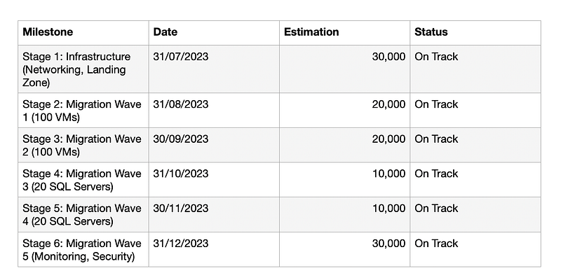
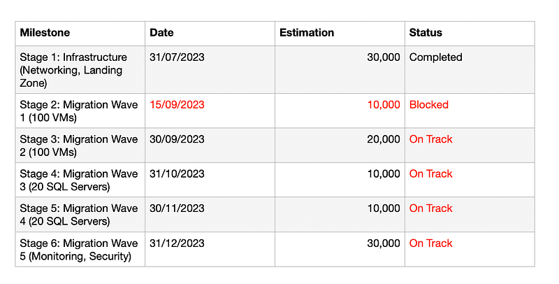
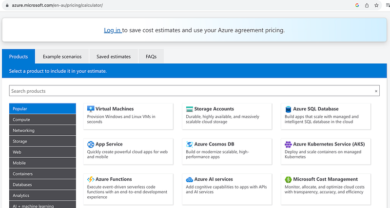
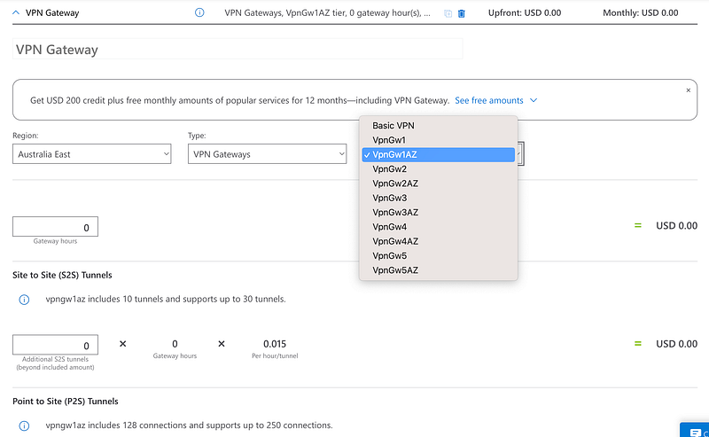
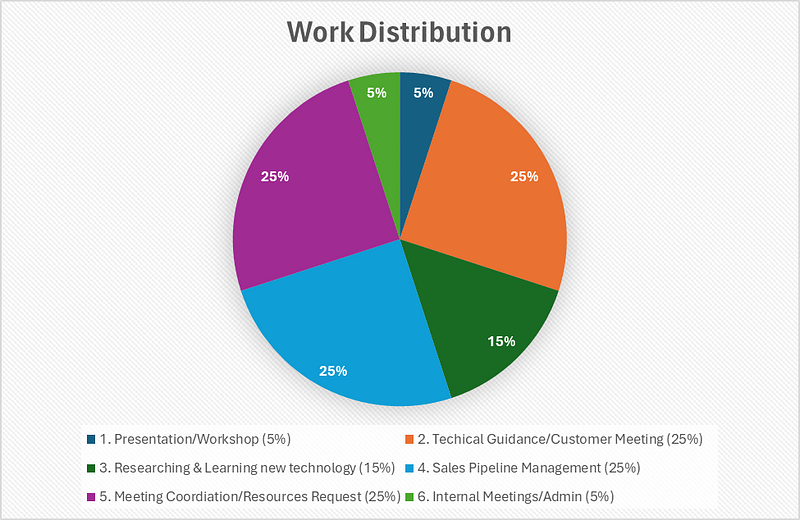

### [職場] 微軟雲端架構師 (Azure Cloud Solution Architect) 到底在做什麼? 第五集：Sales Pipeline Management

Photo by [Markus Spiske](https://unsplash.com/@markusspiske?utm_source=medium&utm_medium=referral) on [Unsplash](https://unsplash.com?utm_source=medium&utm_medium=referral)

### 前言

這篇文章是 <<微軟雲端架構師 (Azure Cloud Solution Architect) 到底在做什麼?>> 系列的最終章。這個系列總共有五篇文章，以雲端架構師在日常工作中最主要的任務為例 :

  1. Org Chart
  2. Solution Architecting
  3. Technical Guidance/Customer Meetings
  4. Technical Presentation/Workshops
  5. **Sales Pipeline Management >> 你正在閱讀的文章**

**還沒看過第一集的人請看這裡：**

[**[職場] 微軟雲端架構師 (Azure Cloud Solution Architect) 到底在做什麼? 第一集：Org Chart & Solution Architecting**  
 _跟讀者們或是朋友們聊天時，他們對我提出的第一個問題總是，「所以雲端架構師(Solution Architect) 到底是在做什麼?」但我每次解釋後，大家看起來還是一知半解…_ medium.com](2023-07-28-ms-csa-1)

**還沒看過第二集的人請看這裡：**

[**[職場] 微軟雲端架構師 (Azure Cloud Solution Architect) 到底在做什麼? 第二集：Solution Architecting**  
 _這篇文章將以 3-tier web app migration 跟大家分享微軟雲端架構師 (Azure Cloud Solution Architect) 是如何規劃雲端解決方案的，文章的最後還會跟大家分享當架構師所需的技能。_ medium.com](/posts/2023-07-28-ms-csa-2/)

**還沒看過第三集的人請看這裡：**

[**[職場] 微軟雲端架構師 (Azure Cloud Solution Architect) 到底在做什麼? 第三集：Technical Guidance/Customer Meetings**  
 _這篇文章將以我協助客戶了解SQL Server DSC (desired state configuration) 相關的 Azure 雲服務為例，跟大家分享微軟雲端架構師是如何學習雲端技術的相關知識、製作 demo…_ medium.com](/posts/2023-07-28-ms-csa-3/)

**還沒看過第四集的人請看這裡：**

[**[職場] 微軟雲端架構師 (Azure Cloud Solution Architect) 到底在做什麼? 第四集：Technical Presentation/Workshops**  
 _這篇文章將以我準備 technical workshop 的過程，跟大家分享微軟雲端架構師是如何做 technical presentation。_ medium.com](/posts/2023-07-28-ms-csa-4/)

**當然，總是要先放一下免責聲明XD**

這個系列完全是以我個人在澳洲微軟工作的親身經歷作為出發點，所以是我個人的主觀感受。雖然我敘述時會盡可能客觀呈現，讓各位讀者自行判斷。如果你在不同國家的微軟工作，甚至是你在不同的微軟團隊，你對於這個職位的感受可能會跟我略有出入或完全不同。這次依然會以時間軸的推進作為小標，讓大家身入其境地體驗微軟架構師的生活XD

* * *

### Sales Pipeline

Solution Architect 這個職位在不同公司或是不同地方(例如 service companies like AWS/Mircrosoft、consulting companies like Accenture/EY 或是 customer side like 銀行/一般企業)，可能會有不一樣職責。

但在微軟，Solution Architect 就是 technical sales，也就是說我們的薪資組成裡面有 25% 是 sales commission，實際計算的公式有點複雜，但裡面佔比例最高的要素我們叫做 Azure Consumption Revenue (ACR)。

假設 ABC 銀行是微軟的客戶，ABC 銀行打算把他們的核心銀行系統從 on-premises data center 搬到 Azure 上，上雲後他們一個月花在 Azure Infrastructure (例如 Azure VMs, ExpressRoute, VPN, storage accounts, SQL database etc)上的錢是 $100,000/月，這 10 萬塊就是我這個 account 的 ACR。

假設這個 migration project 的設計在三月談好了，預計七月開始部署到雲上，這個項目預計做到年底完成，所以我在 sales pipeline 上就必須要列出像下面這個表格，上面寫著客戶預計在哪個日期部署哪些服務、這些服務會花多少錢、以及每個 milestone 的進度。

一開始的項目進度

### 執行上的困難

如果順利完成那就還好，如果有任何問題（例如進度不如預期、或是客戶突然發現有實行上的困難、或是客戶突然沒預算了），那就必須要在系統上寫筆記、寫原因，然後我就會開始被我的經理追殺，然後我的經理就會被微軟的高層追殺。

我前面說過 Microsoft ANZ (Australia & New Zealand) 追求的是 100% forecasting accuracy，也就是説這個我今年三月訂好的計畫只要有任何時間或是金額上的更動都不行。

實際上的項目進度

  1. 例如客戶說「EC 啊～我們這個項目的進度有點延遲，八月的 migration 我們現在可能要延遲兩週，變成 9/15 才能部署」。我就要在系統裡做筆記，然後通知我的經理，然後我的經理就會問我說是什麼問題呢？微軟要怎麼幫助他們呢？我說客戶好像沒錢，不如你幫他出錢？XD (這是開玩笑的，但客戶很常有預算問題是真的，下面會更詳細說明)。
  2. 或是客戶說「EC 啊～我們這個項目的進度有點延遲，八月的我們只能 migrate 50個 VMs)」，然後我的經理就會說「EC 啊～你八月的 ACR 怎麼只有一萬呢？這樣不行啊，快跟我解釋一下為什麼，我要去跟微軟高層解釋。」

最慘的例子就是我到了 9/7 問客戶說 9/15的部屬沒問題吧？客戶說沒問題啊，然後等到 9/15再跟我說又因為總總原因進行不了，又要再延遲兩個禮拜，然後我又要去跟我的經理解釋。我每個禮拜就在問客戶他們到底錢花了嗎？客戶最後就發火了說「EC 啊～我真的沒有看過哪個公司這麼在乎我們的項目進度，我說了會部署 100 個 VM 就是會部署100 個 VM，我這個禮拜部署、下禮拜部署或是下個月部署對你們來說真的有差嗎？反正微軟都會拿到錢啊，不要再問我了，我不知道，反正我們內部準備好了就會部署。」

這就是我最討厭的 SA 工作內容哈哈哈！我其實認同客戶的說法，追求 100% accuracy 對客戶來說一點幫助都沒有，也不會讓我變成一個更好的 solution architect，對我的經理也沒有任何管理上的幫助，可能只有爽到微軟高層吧？因為他們就可以拿去跟更高層說，你們看我們今年的 sales forecasting 100% 準確！但說真的，這件事根本就不合邏輯，天氣預報都不會 100% 準確，我也不知道我明天午餐要吃什麼？我 (或客戶) 怎麼可能三月的時候就預測七月到十二月的時候會發生什麼事？XD

### **Cost Estimation**

SA 的工作除了要幫 ABC 銀行規劃他們在 Azure 雲上的 architecture design，我們還要負責幫 ABC 銀行估算上雲之後他們會在 Azure 上花多少錢。有時候算完錢之後，客戶可能就說太貴了他們不做了，或是嫌太貴了就開始想要改 solution design，改來改去就把本來一個規劃得好好的改成四不像，這裡最常見的衝突有兩種：

  1. **項目預算跟 solution design 完善度上的衝突** ：對於我個人來說，我其實不在乎客戶在Azure 雲上花多少錢，只是有一些客戶會因為項目預算而把設計改得亂七八糟，然後事後再來跟我們抱怨說Azure 雲很難用啊、達不到他們本來的目的啊、早知道就不要 migrate 到雲上了之類的。我心想，啊你們就把 solution 改得歪七扭八，當然難用啊XD
  2. **項目預算跟 Security/compliance requirements 的衝突** ：solution design 最怕什麼？最怕技術談完了、費用也談完了，客戶內部資源跟外部資源都協調好了，客戶高層也準備要 sign off 了，這個時候有人突然想到「咦！我們好像還沒找 Security Team 來加入討論」，然後 Security Team 一加入討論，這個項目就從此不用進行下去了XD 因爲 Security Team 可能會說，因為要符合 security controls/compliance controls，所以 design 要改成怎樣怎樣，然後預算就加倍了。或是 Security Team 説每一個用到的 Azure services 跟 third-party services 都需要通過一定的 compliance review，然後一個 service 他們要 review 1–2個月，那假設我們的 solution design 有 10 services，那等他們全部 review 完之後，我們 20 個月後再來 implement? XDD 到時候客戶的環境都不知道變成怎樣了，於是又要重新 discovery 跟 solution design 一次XD

基本上 cost estimation 我們通常都是用 Azure Pricing Calculator 算的，這個網頁是公開的，有興趣的人可以自己上去玩玩看：<https://azure.microsoft.com/en-au/pricing/calculator/>

Azure Pricing Calculator

我也遇過一些奇葩客戶，例如有一個客戶狂改他們的 networking design，下子說他們要用 VPN Gateway，一下子說他們要用 Virtual WAN。然後叫我算價錢給他們，但又不給我參數。例如要算VPN Gateway的價格我必須要知道他們要選哪一個 VPN Gateway SKU，然後他們又不告訴他們需要的 throughput 有多少，是要叫我去通靈嗎？XD

VPN Gateway Pricing Calculator

好，所以我就自己用了一些常見的 assumptions 算了一個數字給他們 (通靈就通靈！)，然後請客戶確認是否跟他們內部的參數和項目預算相符，然後客戶就不回信了。就算我再三 follow up，跟不同人follow up，請其他們去 follow up 也都不回我。大哭！

兩個月後客戶再回來跟我說「你好，我們的 networking solution design 又改了一個新的設計，請問這個設計能做嗎？實行上會遇到什麼問題？如果能做的話，請問這個要花多少錢？」然後我再度幫客戶解決技術跟設計問題，然後再算一次錢給他們，然後再寄信請他們確認，然後再度石沈大海。

在此同時，我的微軟經理會不斷催促我說「EC 啊～這家 CDE 公司的 ACR 到底是多少啊？客戶確認設計了嗎？這個 ACR 會按照計畫實現嗎？」

我不知道啊！！！！

### 工作時間分配

如果讓我換一個圓餅圖來表示 SA 的工作時間分配，其實是長這樣子的（前提：這是以微軟的 SA 工作為例，聽說 AWS 的 SA 不需要花這麼多時間在Sales Pipeline Managment）

Microsoft CSA Work Distribution

**Task 1 Presentation/Workshops & Task 2 Technical Guidance/Customer Meeting**：算是技術相關的工作內容，合起來佔 30%。但我其實也很好奇，你們覺得提供 technical guidance、creating technical demo & poc、 presentation 這樣就算是一個技術職位嗎? 還是只有 hardcode programming 才算哈哈？

我打算之後來寫一篇 <<Software Engineer、Cloud Engineer、DevOps Engineer，你寫的 code 跟我寫的到底有什麼不同?>>，裡面會提供一些 code samples，來進一步跟大家解析這三個 engineer 職位的不同，有興趣的人請在下方加1 XD

**Task 3 Researching and Learning new technology：** 佔 15%，算是工作上的福利，因為可以用工作時間學習新技術，這點我很喜歡。

**Task 4 Sales Pipeline Management & 5：Meeting/Resources Coordination**:，合起來佔 50%，我覺得基本上是浪費生命XD 但這就是微軟領導階層唯一重視的東西，是的，他們不管你幫助客戶解決了那些技術難題或是規畫出怎樣符合他們技術要求的架構方案，他們只在乎你的 sales pipeline forecasting 是否100% accurate XD

**Task 6 Internal Meetings/Admin** ：佔 5%，這是每個工作都逃不掉的必要之惡，我就不多提了。

### **結語**

如果你成功追完這個連載系列，我必須要幫你拍拍手！也請你們下方留言告訴我:

  1. 如果你不是微軟雲端架構師 (Azure Cloud Solution Architect)，你覺得這個職位符合你對於技術職位 (technical role) 的想像嗎?
  2. 如果你是微軟雲端架構師，你覺得我對於 CSA 的工作描述還算客觀嗎?

希望這個系列可以幫助大家更了解這個職位～ 如果還有什麼其他想看的主題或是有任何問題，都歡迎在下方留言！

**延伸閱讀**

  * [[職場] 澳洲微軟菜鳥 Azure Cloud Solution Architect 的一天](/posts/2022-12-16-day-of-ms-csa/)
  * [[職場] 微軟員工績效評估 (Microsoft Employee Performance Review)](/posts/2023-06-03-ms-performance-review/)
  * [[職場] 雲端證照真的會帶領你走向夢想中的工作嗎? AWS 與 Azure 證照的解析](/posts/2023-02-04-cloud-certs/)
  * [[職涯] 微軟雲端架構師 (Azure Cloud Solution Architect) 入職九個月的反思](/posts/2023-07-28-ms-csa-in-9-months/)
  * [[職涯] Solution Architect、Technical Consultant、Software Developer 比較](/posts/2023-03-17-sa-vs-cloud-engineer/)

