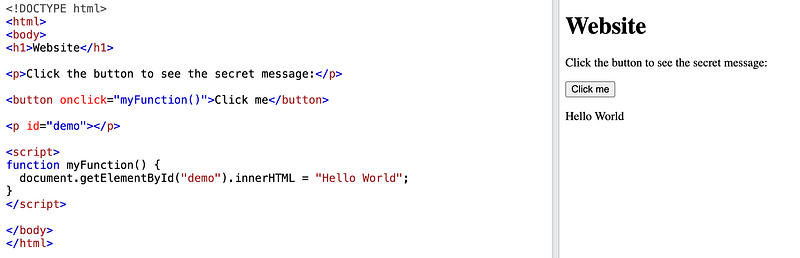
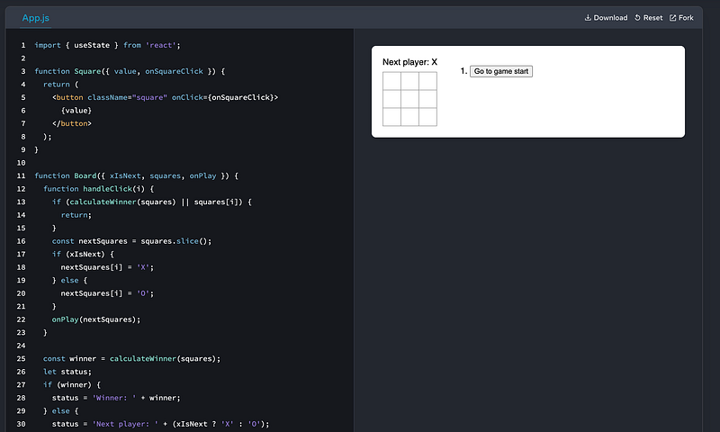
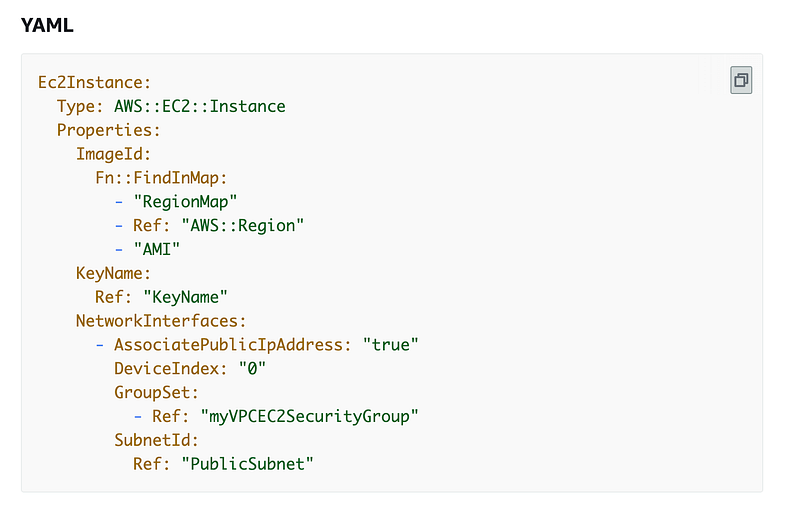
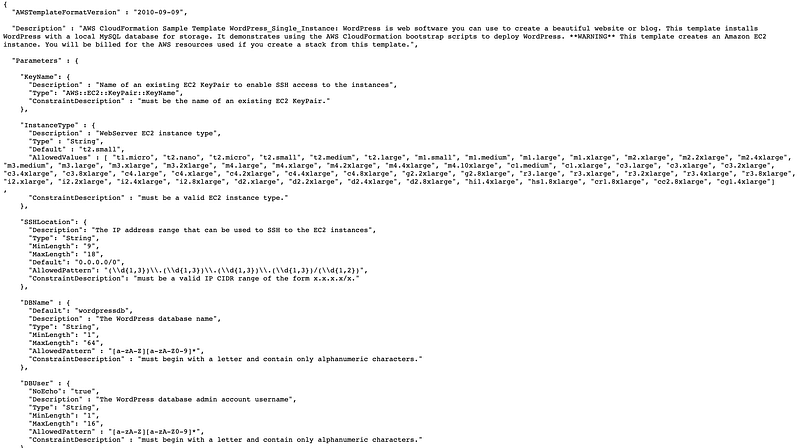
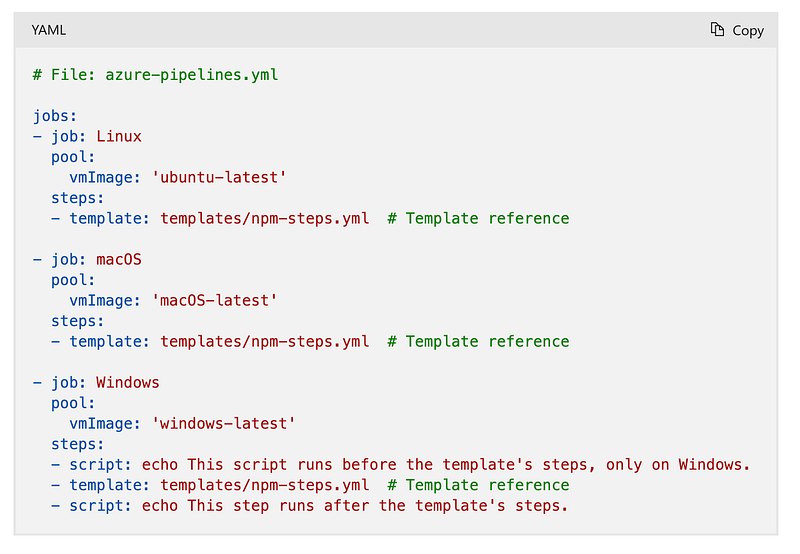

* * *

### Software Engineer、Cloud Engineer、DevOps Engineer 熱門職位技能樹大公開：都是工程師，我們寫的程式居然不一樣？

Photo by [Jossuha Théophile](https://unsplash.com/@nunchakouy?utm_source=medium&utm_medium=referral) on [Unsplash](https://unsplash.com?utm_source=medium&utm_medium=referral)

### 前言

除了 Solution Architect 這個職位之外，很多人也都會問我「EC，所謂的 Cloud Architect/Cloud Consultant/Cloud Engineer 又是怎樣的職位? 跟 Solution Architect 一樣嗎？」

所以我決定要以我個人本身的經驗，透過一些實際的 code samples 來進一步跟大家解析這三個工程師職位的不同！

這集算是我的 **< 微軟雲端架構師 (Azure Cloud Solution Architect) 到底在做什麼?>>** 系列的番外篇。如果你想要暸解我在微軟擔任「雲端解決方案架構師 (Solution Architect)」的實際工作內容，請你千萬不要錯過這個系列！

第一集的傳送門在此：

[**[職場] 微軟雲端架構師 (Azure Cloud Solution Architect) 到底在做什麼? 第一集：Org Chart & Solution Architecting**  
 _跟讀者們或是朋友們聊天時，他們對我提出的第一個問題總是，「所以雲端架構師(Solution Architect) 到底是在做什麼?」但我每次解釋後，大家看起來還是一知半解…_ medium.com](https://medium.com/@cloudarchitectec/day-in-the-life-of-solution-architect-01-org-chart-3710bdec8416)

### 軟體工程師 (Software Engineer)

其實這個分類裡又可以分成寫系統軟體跟寫網頁軟體的工程師。近年來掀起一陣轉職風潮的工程師職位主要屬於網頁軟體的類別，因為入門門檻比較低，其中又可以再細分成：前端工程師 (Frontend Engineer)、後端工程師(Backend Engineer)、全端工程師 (Full-Stack Engineer)。

  * **前端工程師** ：前端工程師所寫的程式通常跟網頁介面相關，也就是使用者可以看到、也可以互動的地方。例如說網站的首頁、表格等等。基本的技能樹有：HTML、CSS、JavaScript，跟常見的前端框架例如 React、Angular、 Vue。
  * **後端工程師** ：後端工程師所寫的程式通常跟網頁邏輯以及 API 相關，也就是使用者通常看不到的地方。後端工程師通常也會需要有資料庫 (database) 相關的知識跟技能，例如說要至少要會寫一點 SQL (Structured Query Language) 之類的。基本的技能樹有：REST API、GraphQL 等等。關於資料庫管理，其實這裡還有一個專門的職位叫 DBA (Database Admin)，但這跟我們今天的主題離的比較遠，所以我就不細談了。
  * **全端工程師** ：顧名思義，也就是前端跟後端的工作都要會做。當年我轉職的時候(2020 年)，澳洲的 IT 業界普遍有個迷思，就是**後端工程師** 跟**全端工程師** 才是真正厲害的工程師，而**前端工程師** 就只是改改 HTML/CSS 而已。但我其實不這麼認為！我認為前端跟後端各有他們專精的地方跟有趣的地方，而所謂的全端，我覺得有時候也是只是慣老闆們開不出兩個職位的薪水的藉口而已？XD

總結來說我覺得三個職位各有優缺點：

**全端工程師** 會比較了解整體的軟體開發流程，也不用靠別人 (例如後端在等前端改UI，前端在等後端把 API endpoints 架好)，工作內容比較豐富有趣。

**前端工程師** 寫出來的 components 會立刻出現在網頁上，互動性很高，很有成就感。

**後端工程師** 寫出來的程式碼就是一個網站最核心的骨架，需要邏輯性強的人。

> 題外話，如果你是相關領域的人士，請問 API 的全稱是什麼？你可以不 Google 就回答出來嗎？會問這個，是因為我之前在 AWS (Amazon Web Services) 當 Cloud Consultant 時，發現這是我同事出的面試題之一XDDD

> 好的，我要公佈答案了，API 的全稱是 Application programming interface。但其實你回答不出來我們也不會因此扣你分數啦，我也不懂我同事問這個要幹嘛哈哈

**以下我就以一個前端工程師會寫出來的程式舉例：**

如果我們用 vanilla JavaScript 舉例，左邊的程式碼會生成一個按鈕，按下去後會出現 HelloWorld 這個字。

JavaScript Code from W3School

複雜一點的例子可以用 React 這個奠基於 JavaScript 的 frontend framework (目前的業界標準應該是用 TypeScript 寫居多) 來寫一個圈圈叉叉的遊戲 。下面的程式碼是個 React functional component ，左手邊的這幾行程式，會變成右手邊那一個圈圈叉叉的遊戲。(題外話：圈圈叉叉這個遊戲的英文叫做 Tic-Tac-Toe，很有趣吧)。如果看完整的程式碼或是想要自己玩玩看，這個程式碼來自 [React 的官方部落格](https://react.dev/blog/2023/03/16/introducing-react-dev)。

Tic-Tac-Toe from React Doc

### 雲端顧問/雲端工程師 (Cloud Consultant/Cloud Engineer)

就我個人的定義來說，這兩個職位的工作內容是差不多的，主要的差別在於Cloud Consultant 通常受僱於顧問公司 (consulting companies)，例如常見的四大會計顧問公司 Big 4 (EY, PwC, KPMG, Deloitte)、Accenture、印度的TCS (Tata Consulting Services) 跟 Infosys 等等。

AWS 跟微軟也有自己的 consulting department，例如我之前工作的 AWS Professional Services (裡面的 Cloud Consultant 的職稱叫做 Cloud Architect)，微軟的顧問部門一直改名，之前叫 MCS (Microsoft Consulting Services)，現在叫什麼我忘了XD

所謂的 Cloud Consultant 就是被派到客戶公司做 Cloud Engineer 的工作＋提供顧問服務。雲端顧問/雲端工程師基本的技能樹有：

  * **cloud infrastructure:** AWS, Azure or GCP
  * **infrastructure as code (IaC):** 如果是 AWS 平台那就是 AWS CloudFormation in Json or YAML、SDK、CDK。如果是 Azure 平台那就是 Bicep 或 Azure Resource Manager。如果是要跨平台的話，目前業界最常用的工具是 Terraform。
  * **程式語言：** 最常見的是 TypeScripte 或 Python。

所以一個雲端顧問/雲端工程師會寫的程式碼如下。這是用 CloudFormation in YAML 寫出來的程式碼，目的是在 AWS 上面部署一個有 public IP 的 EC2 instance，完整說明可以參考[官方文件](https://docs.aws.amazon.com/AWSCloudFormation/latest/UserGuide/aws-properties-ec2-instance.html)。

EC2 in yaml from AWS

如果我們舉一個比較複雜的例子，假設我們要在 AWS 上部署一個 Wordpress 網站跟一個 MySQL DB 作為資料庫，那我們的程式碼就會像圖片裡那樣。完整的程式碼來自 [AWS 網站](https://docs.aws.amazon.com/AWSCloudFormation/latest/UserGuide/sample-templates-applications-ap-southeast-2.html)的[這個連結](https://s3.ap-southeast-2.amazonaws.com/cloudformation-templates-ap-southeast-2/WordPress_Single_Instance.template)。

CloudFormation template from AWS

### DevOps 工程師 (DevOps Engineer)

DevOps 工程師的工作內容包山包海，包括 cloud infrastructure, platform managment, CI/CD (continuous integration and continuous delivery/continuous deployment), pipelien automation, logging/monitoring, system administration, DevOps tools managment, scripting。算是一個在軟體工程師跟雲端工程師之間，但又偏向雲端工程師的職位。

DevOps 工程師還有一個變體叫 SRE (Site Reliability Engineer)，我們在此也先不討論。

DevOps 工程師的技能樹有：

  * **cloud infrastructure:** AWS, Azure or GCP
  * **infrastructure as code (IaC)** : 如果是 AWS 平台那就是 AWS CloudFormation in Json or YAML、SDK、CDK。如果是 Azure 平台那就是 Bicep 或 Azure Resource Manager。如果是要跨平台的話，目前業界最常用的工具是 Terraform。
  * **程式語言** ：最常見的是 TypeScripte 或 Python。
  * **CI/CD tools:** AWS 的 CodePipeline 系列、Azure 的 Azure DevOps、第三方軟體像是 Jenkins、OptusDeploy 等等
  * **Logging/monitoring：** AWS CloudWatch、Azure Monitor、DataDog、Splunk 等等
  * **Scripting** ：Bash script, PowerShell script

讓我們以 Azure DevOps Pipeline 的程式碼為例，完整程式碼可以參考[微軟網站](https://learn.microsoft.com/en-us/azure/devops/pipelines/process/templates?view=azure-devops&pivots=templates-includes)。

Azure DevOps Pipeline tempalte from Microsoft

就 DevOps 工程師的日常來說，雖然寫程式是日常，但很大部分的重點其實是在 tooling 跟 automation 上面。

### 結論

我個人當初想轉職時想當的是 Software Engineer (特別是 Frontend Engieer)，結果投了200個工作，最後都沒有拿到 Software Engineer 的相關 offer。我唯一拿到的 offer 就是 AWS Cloud Architect (Cloud Consultant)，從此踏上我的雲端之路。其實回頭想想也是超級幸運，因為我後來真的很喜歡 cloud engineering！(其實我在還沒踏入這個業界之前，我完全不知道 Cloud Engineer、DevOps Engineer 這兩個職位存在XDD)

後來第二份工作是在微軟當 Solution Architect，我覺得這個職位其實不是很適合我。如果看過我相關文章的讀者肯定知道為什麼，這裡就不多說了XD

最近開始在能源公司開始當 DevOps Engineer，目前做了三個禮拜我天天都超級開心！因為我目前的技能樹只點在雲端技術跟雲端平台上(喔～還有軟體開發，我當年 coding bootcamp 學的是 JavaScript、React、MongoDB、 Express)，所以很多 DevOps 概念、技術跟工具對我來說都是新的，每天都在學習新東西！例如我最近在寫 PowerShell scripting 來改善我們的 deployment pipeline (我從來沒寫過 PowerShell，但是我當年學習的程式概念還在，所以邊學邊寫也是非常有趣)，我的第一個 PR 已經進 production 了，非常有成就感!!! 還收到來自 developer 的感謝XD

希望我可以繼續順利在 DevOps Engineer 的路上走下去～

好的，以上就是 Software Engineer、Cloud Engineer、DevOps Engineer 這三個工程師職位的技能樹比較，並提供了實際的程式碼作為例子。看完這篇文章，是否幫助你更加了解這三個職位了呢？如果有不清楚的地方，也可以再留言問我XD

如果可以選擇的話，哪一個職位你比較感興趣呢？歡迎留言告訴我！

* * *

👩‍💻 **需要職涯導師嗎？澳洲雲端架構師 EC 提供轉職工程師、澳洲求職、移民生活等全方位諮詢服務。**

👉點擊 [<<澳洲雲端架構師 EC：專為轉職者量身打造的職涯諮詢｜海外職場×履歷優化 × 面試攻略 × DevOps /雲端職涯>>](./2018-01-03-ec-consultation/index.md)，開啟你的職涯新篇章!

📬 **不想錯過更多海外生活、澳洲職場、文組轉職工程師的精選文章？**  
👉 按此訂閱[澳洲雲端架構師 EC 的 Medium 部落格](https://medium.com/@cloudarchitectec/subscribe)，不錯過最新文章！

**📱 想追蹤更多？**

  * 📘 Facebook 粉專：澳洲雲端架構師 EC
  * 🧵****Threads：Cloud Architect EC
  * ☕ 喜歡我的創作分享？[請 EC 喝杯咖啡吧](https://donate.stripe.com/8wM8xU44n5Ld9Q4bIJ)
  * 📩 合作信箱：[cloudarchitectec@gmail.com](mailto:cloudarchitectec@gmail.com)

