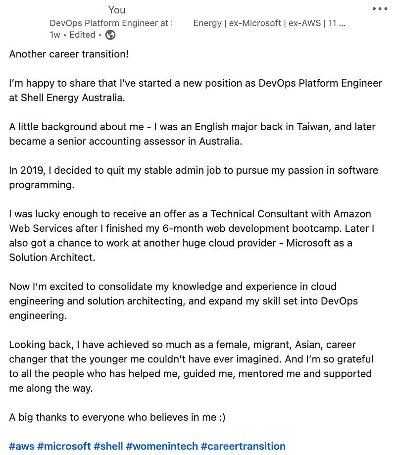
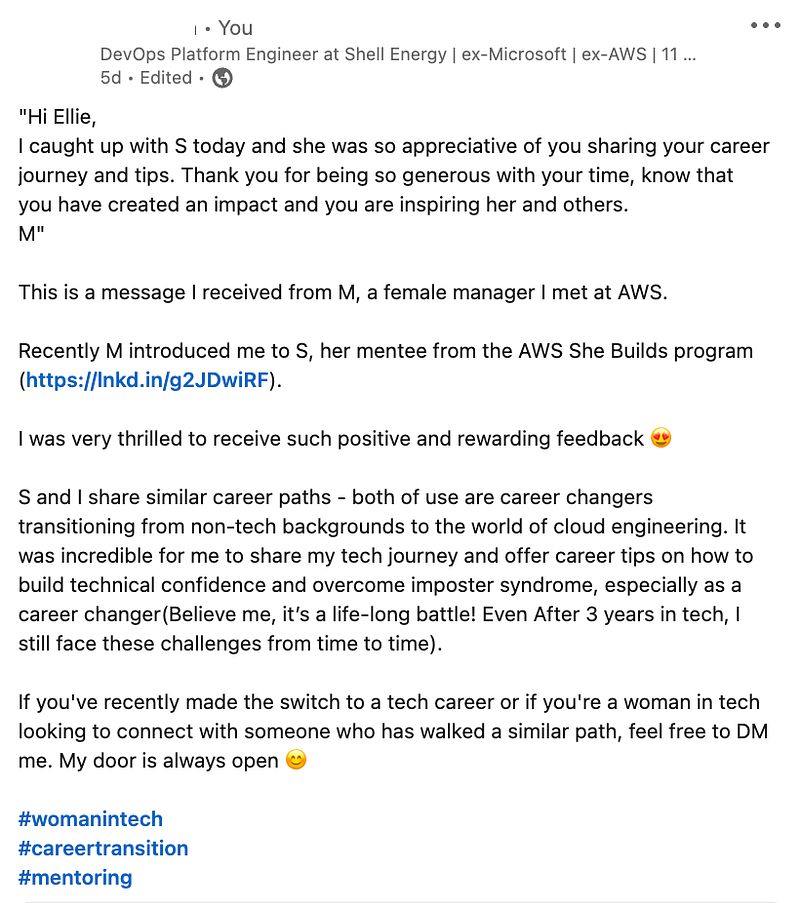

* * *

### 轉職成功了，然後呢？從文組到澳洲 FAANG 工程師，我作為「倖存者」的掙扎與反思

### 前言

上週我在 LinkedIn 上發表了一篇文章，跟大家分享我的新工作，還有我轉職的心路歷程，談我一路怎麼從英文系、移民澳洲並成為紐澳會計師協會的Senior Accounting Assessor (工作內容是協助澳洲移民局審核澳洲會計師移民資格)、辭掉安定的工作去讀程式訓練營、加入 AWS 成為 Technical Consultant、加入微軟成為 Solution Architect，最近又轉職成 DevOps Engineer 的故事，收到了不少迴響。

*LinkedIn Post about my new job as DevOps Engineer*

幾天後，我收到了一封很溫暖的訊息！來自我的 AWS 前同事感謝我撥出時間跟她的 mentee 分享我的轉職心得。在這篇 LinkedIn 文章發表後，我又收到幾位同樣轉職成功或是正在轉職路上的人私訊我，希望我能給他們一些意見。

於是興起了我想要寫這篇文章的念頭！

作為一個轉職成功者，轉職後的人生其實不如我想像中一帆風順XD

而我後來發現有很多轉職成功者都跟我有過一樣的心路歷程，我們一樣都曾經懷疑過自己的決定、一樣都懷疑過我是不是不適合當工程師、我是不是對於寫程式沒有天份？

我希望這篇文章在我成功進入 IT 業擔任技術職三年後，回過頭以一個過來人的身份來跟大家分享我對轉職成功這件事的體悟。

如果你想要知道更多關於我的故事，歡迎參考：

[**澳洲雲端架構師 EC ｜大家好，我是 EC | 澳洲雲端架構師 EC**  
 _在澳洲生活超過10年的台灣人，文組出身，一路經過澳洲打工度假、留學，成功移民澳洲並且轉職科技業工程師，進入 Amazon 以及微軟工_](https://vocus.cc/article/670a679ffd8978000178efe2)

* * *

### 一定是我不夠好

我發現這是很多轉職成功的人遇到困難的時候會陷入的思考誤區。

例如你今天在解一個 bug，你花了很久的時間，但怎麼樣就是解決不了。或是今天你在學習一個工作上要用到的新技術，但不管怎麼學，你的進度總是非常緩慢，總覺得好像有學沒有懂。這時候如果你的心態有所偏差，你就會開始對你自己說「一定是因為我只讀了六個月的coding bootcamp，基礎不夠紮實，所以我才解不出來！」、「一定是因為我太笨了才會花這麼多時間還是學不會！會不會我其實根本不適合當工程師？」

於是你就會開始懷疑自己的能力，也開始懷疑自己的決定，「會不會轉職根本是一個錯誤的職涯決定？」於是就開始陷入自我懷疑、自我否定的低潮期。相信我，我完全能理解這種感受，因為在我成功轉職的第一年這個念頭常常在我腦中揮之不去。

那我為什麼要說這其實是一個思想誤區呢？

因為我發現跟我同期入職的同事，他們大多都是澳洲跟新加坡頂尖大學的畢業生(大家就把他們想像成台清交成的畢業生吧)，當他們遇到一樣的困難時(例如bug 解不出來，或是新技術的概念怎樣都搞不明白)，他們並不會覺得說「一定是因為我是台大畢業的，這些學校沒教，所以我才解不出來！」、「一定是因為我太笨了才會花這麼多時間還是學不會！會不會我其實根本不適合當工程師？」

再舉另一個例子，有一次我在跟同事開會，有個澳洲同事 A 講了落落長的一段話，繞來繞去我完全抓不到重點，我心裡想「一定是因為我是個移民，英文不夠好，所以才聽不懂他想表達的意思」(但其實我的英文能力不錯，雅思閱讀跟聽力都是滿分 9 分XD)。於是開會結束後，我就私下傳訊息給另一位澳洲同事 B，問他說「不好意思，可能是我英文太差了，剛剛開會 A 在講什麼我其實沒聽懂，你能再跟我解釋一下嗎？」。結果澳洲同事 B 直接回我說「呃，我其實也沒聽懂他在講什麼，但我覺得好像不是很重要哈哈哈！而且你的英文很好啊～是 A 在那邊不知道在講什麼東西吧哈哈哈」

你們發現了嗎？B 同樣也聽不懂 A 在講什麼，但他就不會有「我怎麼都聽不懂，一定是因為我雖然是澳洲人，但是英文不夠好」的想法。

於是我發現這種「是我不夠好」的心態，其實是因為對於自己的某個特質感到不自信，所以當你遇到挫折或是困難時，你會很容易就把遇到挫折與困難的原因歸諸於你不自信的地方。這裡我只想要跟大家說，就像我上述提到的例子一樣，有時候這些挫折與困難，就是會發生在每個人身上，跟你是否是轉職者其實沒有一定的關係。

再來是遇到問題或是不懂的地方，可以自己先做功課研究，但是如果你花了一段時間還是沒有辦法解決，這時候千萬不要自己躲起來煩惱，然後開始陷入負面情緒。這時候可以多跟同事聊聊，說不定有些人已經研究出來了，還可以解釋給你聽，幫助你了解，兩個人一起教學相長。或是你跟其他三個人聊了，發現他們其實也不會，那你就可以安心了，反正大家都不會，至少你的心理會好過很多XDDD

### 給時間一點時間

「給時間一點時間」這是我朋友對我說過的一句話，我覺得很有哲理。其實對於轉職者來說，我們大多都只學過 3–6 個月的程式，工程師的世界博大精深，要是我們在這麼短的時間內就可以融會貫通，所有的問題都迎刃而解，那那些做了十幾二十幾年的工程師不就白幹了嗎？XD

所以這時候你必須對自己有個正確的認識，在工程師/寫程式這條路上，你就只是個 baby，還需要很多時間才能成長茁壯。而很多事情，你就是需要花一段時間經歷過各種大大小小不同的事件，你才會逐漸從累積的經驗中提煉出當工程師的直覺。

其實我覺得 engineering mindset 是需要培養！當你遇到問題的時候，你有沒有辦法以一個工程師的心態來面對問題、分析問題，進而有系統性地解決問題？我已經成功轉職三年了，曾經在 AWS 工作過兩年跟微軟工作過近一年，但我一直到最近這一陣子，才突然覺得，我好像是一個工程師了，因為我學會用工程師的角度看待問題跟挑戰了XD

曾經有一個擔任工程師的中國女生跟我說：「世界上沒有解不出來的 bug，只是端看我最後找出怎麼樣的方法來解決這個問題而已！」我真的覺得她超級霸氣的，可以說出這樣的話也太酷了吧！期許有一天我們都能跟她一樣對自己擅長的領域這麼地有自信 :)

### 或許我不適合寫程式

另一個轉職者很常問我的問題，也是我之前一直不斷在問自己的問題就是「我真的適合寫程式嗎？我到底要怎樣才知道自己適不適合寫程式？」

一個月前，當我通知我的微軟同事我要離職的時候，我其實聽到很多反對的聲音。我跟他們說「我覺得微軟 Solution Architect 這個職位不適合我 (因為當 SA 一點 coding 都不用做，只要負責 solution architecting 跟 solution design 就好)，我還是想要當一個 hands-on technical engineer。」好幾位微軟SA同事對我說「我覺得你可能是對自己的認知有問題吧？你超級適合當 SA的啊，當 engineer 不適合你！」

這樣的聲音聽多了，我有時候也開始懷疑自己的決定，真的是這樣嗎? 其實我比較適合當 SA? (可是當 SA 的我很不快樂怎麼辦?) 這些同事們比我更了解我自己嗎? (是因為他們都比我有經驗很多，所以他們能看到我看不到的東西嗎?)

現在我已經成功轉職 DevOps Engineer 一個月了，我只能說我每天都過得很開心！因為我每天都在解決不同的 engineering problems、每天都在學習新的概念跟新的技術，然後把它們應用在我的實際工作中。而且我再也不需要chasing sales numbers, managing stakeholder expectations, managing project progress, working on resource coordination)了！現在的我可以把所有時間跟精力都專注在我想要成長的地方。

同時，我也發現原來其實我可以寫程式，雖然稱不上是個有天份的工程師，但我覺得我至少是個 mediocre engineer XD

這讓我想到當年我讀完 coding bootcamp 後，在一家新創公司作為一個前端工程師實習了一個月。當時的我非常挫折，因為我發現雖然學了六個月的 coding bootcamp，但我不僅是程式寫不出來，遇到問題，我常常還毫無頭緒，根本不知道該如何下手。讓我懷疑自己完全做了一個錯誤的轉職決定。在實習的最後，實習公司沒有給我 job offer。實習結束後的一個月，我因為一直找不到工作，還回去問實習公司他們能不能再讓我延長實習。他們也拒絕了，因為公司小，沒有太多資源，他們已經決定給當時的另一個實習生 full time offer。

其實這點我早有察覺，在coding bootcamp 時其他同學解題總是比我快。畢業後，我花了三個月，投了200份工作申請，最後只拿到一個 job offer。雖然我進了 Amazon，但我總是覺得自己不如別人。即使是兩年後，同期的 AWS 同事已經開始準備他們的 L5 promottion 了，我還是覺得自己不知道該何去何從。後來我沒有申請內部 promotion，而是直接跳槽去微軟，拿了一個 L5 的 offer。既微軟之後，我又再轉職了一次，跑到了 DevOps 領域，在轉職三年後現在的我終於覺得自己還算是能勝任工程師這個工作😆 (不能說我做得很好喔，只能說我還過得去XD)

其實我後來覺得，大家是不是普遍太神化工程師這個職業了？認為你一定要有足夠的天份，你才能成為一個很會寫程式的工程師？

其實工程師跟世界上其他職業一樣，這只是一個職涯選擇，是一個對於你自己偏好的工作型態跟生活型態的一種選擇。所以我覺得與其問自己說「我是不是不適合寫程式？我是不是該放棄當工程師？」，你應該要問自己的是「我喜歡當工程師的生活嗎？我喜歡每天面對不同的挑戰嗎？我喜歡解決完一個問題之後，還有千千萬萬個問題在等我去解決嗎？我喜歡學習新科技嗎？我有辦法忍受每天長時間坐在電腦前嗎？我喜歡這種工程師這個職業帶給我的成就感跟彈性嗎？」如果你的答案都是 Yes，那你就適合寫程式，那你就可以當一個工程師。如果你的答案不一定是 Yes，那花點時間好好思考，或許有其他職業的工作型態跟生活型態更適合你？

### 幾點小建議

最後，我想要給大家幾點建議：

  * **Imposter syndrome is real (冒牌者症候群是真的會發生的)：** 以前的我以為那只是一個很酷炫的名詞，但自己實際經歷過才知道這件事對我的身心靈健康影響有多大。如果你發現自己有類似現象，千萬不要責怪自己，多敞開心胸跟其他人聊聊，你會發現絕大多數轉職者都有這個問題XD 當你覺得自己不孤單的時候，心情總是會好很多，你也會更有足夠的心靈能量面對挫折與困難。
  * **給自己一點時間** ：我們常常都希望自己可以成長得再快一點，但有時候經驗就是需要時間來累積，每一個挫折與困難都是你將來成長茁壯的養分。
  * **停止內耗！害怕跟擔心 won’t lead you anywhere** ： 以前的我總是花很多時間在擔心自己不夠好、擔心有一天公司會發現我很能力很差，然後解僱我、擔心自己 bug 解不出來，project 做不好，總是很焦慮、總是很沮喪、總是很低潮。但說真的，我害怕跟擔心的事從來沒有真正發生過，反倒是我浪費了很多能量在跟自己內耗。而且說真的擔心既不能解決問題，也不會讓我比較好過XD 我覺得與其花時間在擔心/害怕/焦慮，不如直接開始做，開始做了之後無形的負面能量就變成了實際可以解決的問題。例如我晚上花 3 個小時在擔心明天 bug 解決不出來，不如直接打開電腦開始做，說不定做了之後我就解出來了，或是做了之後我發現我還真的解不了，那就只能明天去跟前輩或同事求救。不管怎樣，一旦你開始行動，事情至少會有所進展，而不是停在你對於困難的負面想像。

### 結語

這篇文章算是我對於近期收到的問題有感而發！如果你也成功轉職了，歡迎你跟我分享你的轉職心路歷程！上面提到的困難你經歷過嗎？我的分享對你有所幫助嗎？或是如果你對於轉職有其他問題，也歡迎留言給我喔～
