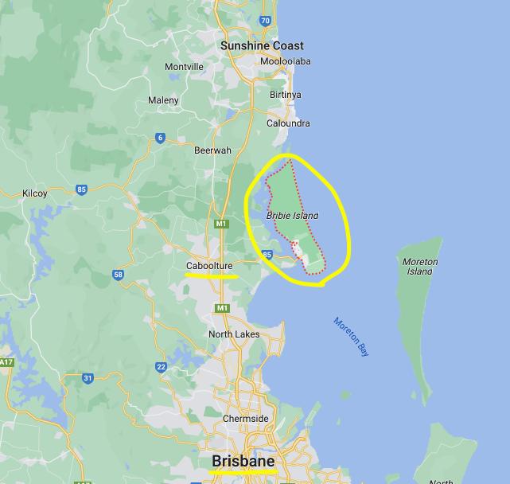
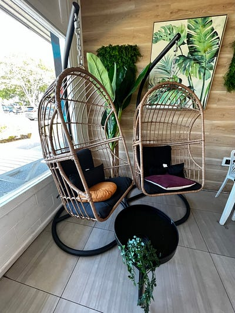
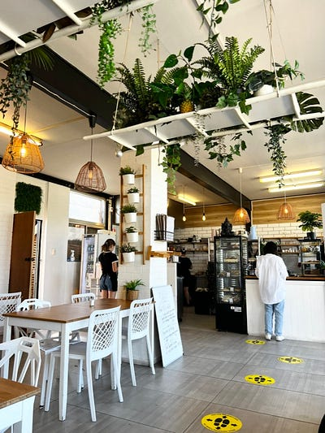
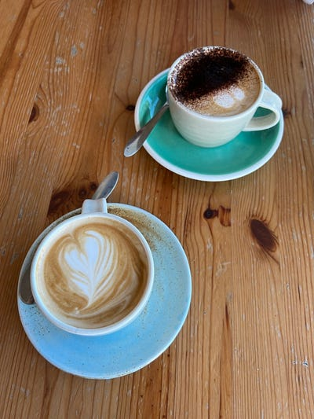
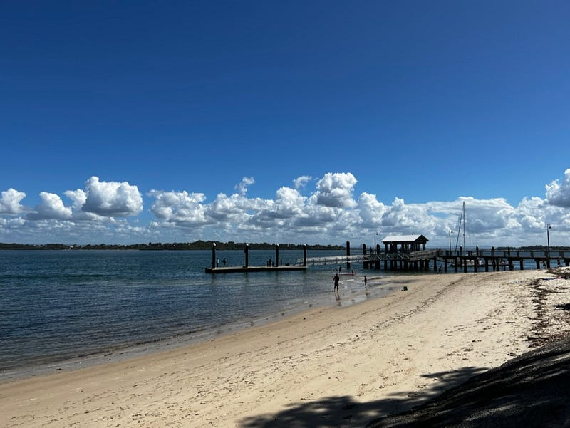
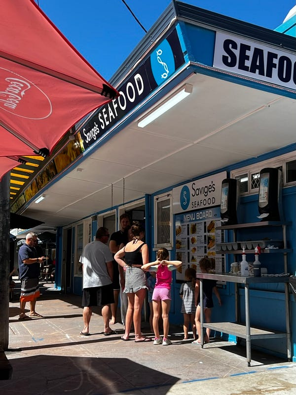
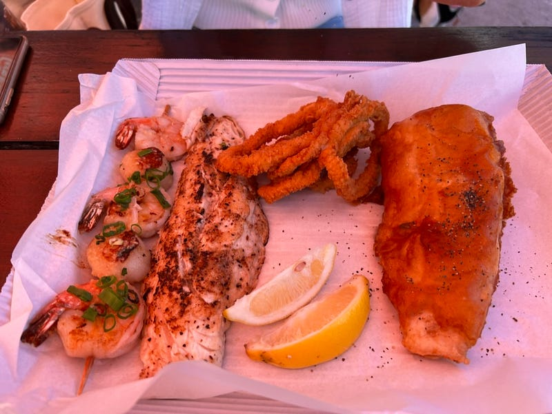
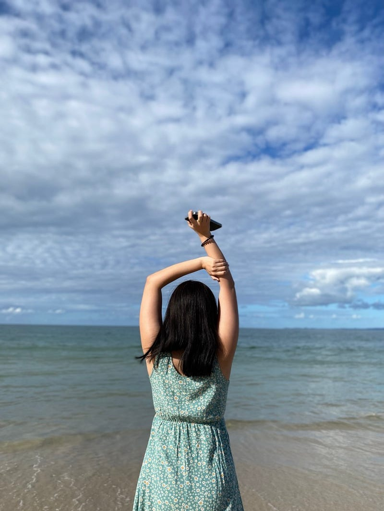
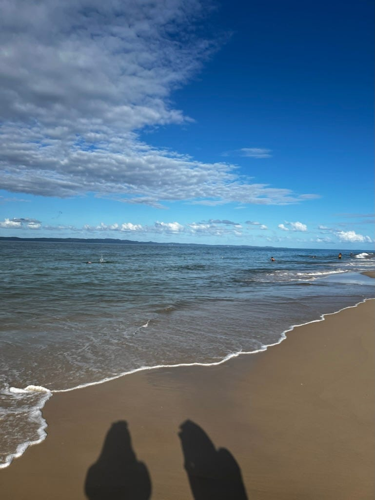

* * *

### 澳洲布里斯本：開車可抵達的可愛小島 Bribie Island 一日遊，陽光、沙灘、放空

Bribie Island on Google Maps

### 前言

感覺最近都在寫一些職場話題，我決定這週來換個趣味性比較高的旅遊閒聊話題XD

  * 官方網站：<https://parks.des.qld.gov.au/parks/bribie-island>
  * Bribie Island 距離布里斯本市區約 85 公里，開車大約 1.5 小時，這對澳洲人來說算是一個不算太遠的距離XD
  * 註：是說這個小島念 Bribie (布萊比) 喔，不是 Barbie ( 芭比) 喔～😆

### 遊記

這天我跟室友 C 一起去探索了距離我們家車程 40分鐘的 Bribie Island，完全是我覺得布里斯本遠北區 (far north Brisbane) 最值得一訪的景點👍

[**2023.04.15 Bribie Island**  
youtube.com](https://youtube.com/shorts/dZvqFVXJ_N4)

去程完全由 Learner Driver 室友 C 主開，這也是她第一次開車上澳洲高速公路，請大家幫她掌聲鼓勵👏👏👏

在澳洲要拿到 full driving license，必須一路從 learner、紅P 、綠 P 開始練習，大概需要四年才能拿到正式駕照。L牌駕駛不能獨自開車，一定要在有full license 的人的陪同下才能上路，我頓時有種變成學姊的感覺😆

### **Gather & Feast **咖啡店

一開始我們先到了一家位於卡布丘的咖啡店 [**Gather & Feast**](https://maps.app.goo.gl/bGFKDigfQJPu1FmcA?g_st=ic)，裝潢非常有氣氛！我們看到別桌客人的餐點份量都很巨大、擺盤也都很美，不過藉於我們剛吃完早餐才出門，所以這次就只點了咖啡，他們的咖啡非常好喝(雖然拉花有點弱)，我們已經決定會再拜訪這家店！

Gather & Feast

接著就是前往今天的重頭戲 Bribie Island 了，這個島跟澳洲本土有個跨海大橋連接，所以不用坐船，一到達島上我們立刻驚呼連連，這個島實在太美了!

Bribie Island 一景

我們兩個先在免費的博物館裡玩得不亦樂乎，然後就去吃了當地知名的炸魚薯條店 [Savige’s Seafood](https://maps.app.goo.gl/vjGiqj46dK4dPDgo8?g_st=ic)，真心好吃耶！

Savige’s Seafood

吃完午餐本來打算去吃冰淇淋的，結果我們突發奇想，突然好奇這個小島上不知道有沒有珍奶店，於是我們就到了一家開在日式旋轉壽司店裡的珍奶店，也是這個小島的唯一一家珍奶店[Cube Tea Bribie Island](https://maps.app.goo.gl/1EaasG65dQjm36us6?g_st=ic)，有夠神奇😆 (但是珍奶沒有特別好喝，建議不要來XD 我們還開車繞了超久才到這家珍奶店！)

然後我們就開始模仿IG拍一些意義不明的網美照，但是真的好難喔！通常拍了十幾張也只會成功一張，常常還不成功🤣🤣🤣

意義不明的舉手照，到底是誰想到這種姿勢的XD

歡迎大家跟我們分享拍網美照的秘訣😆

覺得這一天真心太完美，咖啡好喝、午餐好吃，珍奶略嫌不足，但也還可以，重點是風景真是太美了！

而且這裡的人潮不多，有一種步調緩慢的悠閒渡假感，推薦給大家♥️

我與室友C


