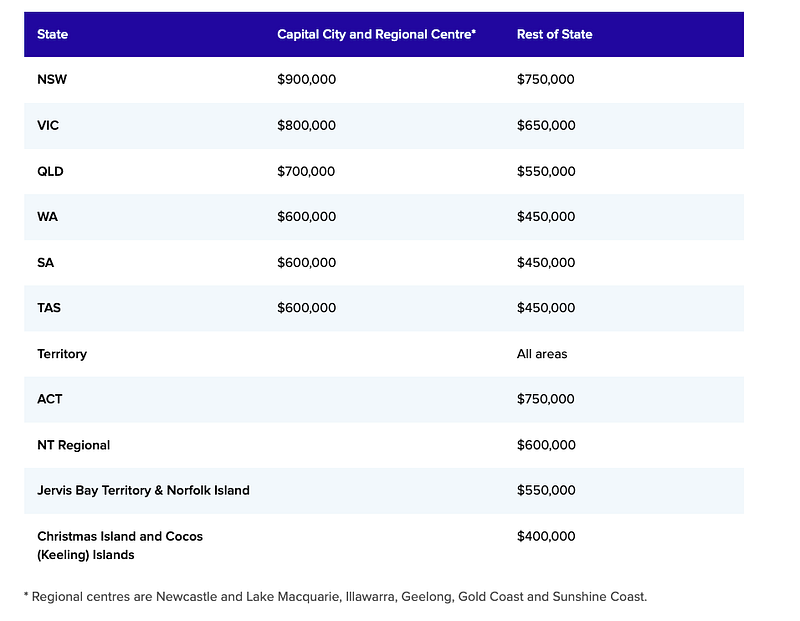

---

title: "澳洲首次置業指南-昆士蘭篇I：2023 首次置業擔保計劃全解析｜Home Guarantee Scheme"
date: 2023-09-23
slug: "2023-09-23-qld-first-home-1"
cover:
  image: "images/medium-0*y2wpY7FCgV16jMh5.jpg"
  alt: "澳洲首次置業房地產"
  credit:
    photographer: "Tierra Mallorca"
    photographer_url: "https://unsplash.com/@tierramallorca"
    photo_url: "https://unsplash.com"
images: ['images/medium-0*y2wpY7FCgV16jMh5.jpg', 'images/medium-1*wh4Po5nGc7B1UG8mCEuP2Q.png']
categories: ["投資理財"]
tags: ["澳洲首次置業指南","澳洲房地產","昆士蘭"]
episodeseries: ["QLD 首購房"]
---

有鑒於我最近的個人 side project 就是在研究昆州房產，身邊也有很多沒買過房子的朋友蠢蠢欲動 (?) 想買房，但又因為不太熟悉相關的政府措施而感受到無限的問號，我決定要來寫一篇文章造福大家XD

* * *

> 按照慣例，在文章開始前必須來個免責聲明XD

> 我只是一個近期致力於研究昆州房產的電腦工程師（並非房產相關專業人士），以下言論不能作為任何法律或是房產投資的建議。如需任何專業建議，請大家自行諮詢律師、過戶師、銀行、貸款經理人等等專業人士。

> 本篇文章所有的資訊都來自政府的官方網站 [NHFIC](https://www.nhfic.gov.au/support-buy-home) ，我只是幫大家翻譯跟分析而已。這裡要提醒大家網路上有很多資料 (這篇文章也是XD)，但我希望大家行有餘力的話，還是要看第一手官方資料，避免因為他人的錯誤解讀，而讓自己的權利受損 (by 自己搞定澳洲移民跟澳洲買房的 EC XD)

### 置業擔保計劃 (Home Guarantee Scheme)

  * 完整官方說明請參考：[NHFIC](https://www.nhfic.gov.au/support-buy-home)

大家都知道，要買房有兩大難題：

首先就是你的貸款能力，這點通常跟你的薪資所得息息相關。一般來說，如果購買自己能力所及之內的房產，有穩定工作的人通常有一定貸款能力。

第二個難題就是那兩成的頭期款，頭期款會根據你買房的地區跟房型而定，但多久可以存到頭期款就跟你收入減掉支出之後能存下多少有關。不過在房價不斷上漲的同時，你存款的速度可能遠遠趕不上房價增長的速度，這也就是澳洲政府為什麼推出自住房政府擔保計劃的原因。

在澳洲如果要貸款超過 80% 的話，通常必須支付銀行一筆額外的 LMI (Lender Mortgage Insurance) 費用，約 1–2萬澳幣不等，依照貸款的金額與比例而定。但有了自住房政府擔保計劃的資格之後，你再也不用存到 20 ％，也可以免除掉這筆 1–2萬澳幣的 LMI 支出，只要存到房價的 2–5% 自備款，你就可以由澳洲政府擔任你的房貸擔保人，借到 95–98% 貸款。（但要注意的是，政府只是擔任你的保人而已，房貸你還是要自己還XD）

自住房政府擔保計劃其實全澳適用，不限於昆州。這個計畫分為三個部分：

  * **首次置業者擔保 First Home Guarantee (FHBG)** —協助符合資格的自住買家最低以房價 5% 的頭期款來買房。2023–24 財政年有 35,000 個名額。這也是我 2021 年在坎培拉買下人生第一套房產時所使用的福利政策，詳情請參考這篇文章：

[《澳洲首次置業指南：2021 坎培拉購房流程經驗分享｜First Home Loan Deposit Scheme 實際應用》](/posts/2021-04-22-2021-fhlds/)

  * **偏遠地區首次置業者擔保 Regional First Home Buyer Guarantee (RFHBG)** — 協助符合資格的自住買家能夠在偏遠地區 (regional area) 最低以房價 5% 的頭期款來買房。2023–24 財政年有 10,000 個名額。那要怎麼知道哪些地區屬於偏遠地區呢？別擔心，澳洲政府提供了一個 [Regional Checker](https://www.nhfic.gov.au/support-buy-home/regional-checker)，只要輸入你想買地區的郵遞區號，網站就會立刻告訴你該地區是否符合偏遠地區的資格。
  * **單親首次置業者擔保 Family Home Guarantee (FHG)** — 協助單親父母最低以房價 2% 的頭期款來買房。2023–24 財政年有 5,000 個名額。我覺得這個福利真的很棒(但也可以知道澳洲的單親父母真的很多，因為政府還特地為他們制定了相關的政策)。不過只支出房價 2% 的頭期款也就代表申請人要背負房價 98% 的貸款，其實也是一個滿沈重的負擔，所以大家一定要先好好衡量過自己的經濟情況再決定。

### **首次置業者擔保 First Home Guarantee (FHBG)**

有鑒於首次置業者擔保應該是最多人適用的，這裡我就來幫大家仔細分析一下。

**申請資格**

  * 年滿十八歲的澳洲公民或澳洲 PR（身份判斷以在房屋貸款簽約的那一刻為準）
  * 除了單身者可以自己申請、夫妻/同居伴侶可以一起申請，現在任何兩個人(包括朋友、兄弟姐妹、其他親戚) 都可以一起遞交聯合申請
  * 單身的年收入不超過 $125,000 澳幣，聯合申請人雙方的年收入總和不超過 $200,000 澳幣 (以去年報稅時的 ATO Notice of Assessment 為準)
  * 購入的房子只能作為自住房
  * 申請人在過去十年在澳洲沒有擁有過任何房產
  * 如果不確定自己是否符合申請資格，可以使用政府的線上工具來判斷：[Eligibility Tool](https://www.nhfic.gov.au/support-buy-home/eligibility-tool)

**自備款**

  * 自備款最少需要在 5% — 20% 之間，雖然最低的規定是 5%，但實際貸款的申請規定以該銀行或金融機構為主。
  * 這裡要注意的是，如果想要拿到首次置業者擔保，你只能跟政府清單上的金融組織貸款，所以不是每一家銀行都可以。2023 財年符合這個計畫的金融組織有 33 家，其中澳洲四大銀行裡面只有 CBA、NAB、Westpac 參加，完整清單請參考參加此計畫的[銀行清單](https://www.nhfic.gov.au/participating-lenders)。

**房產類型跟房價限制**

符合資格的房產類型有如下：

  * 二手 house、townhouse、apartment
  * house and land package (也就是買地建房)
  * 土地以及分開的建屋合同
  * 公寓或 townhouse 樓花 (樓花為中國用語，台灣用語為預售屋)

**房價限制根據各州而有所不同**

以昆州為例，布里斯本、黃金海岸跟陽光海岸的房價限制為 70萬以下，昆州其他地區則為 55萬以下，完整規定可以參考 [Property Price Gap](https://www.nhfic.gov.au/support-buy-home/property-price-caps)。

如果你不確定自己想要買房的區域位於哪一個類別，你也可以使用 [Postcode search tool ](https://www.nhfic.gov.au/support-buy-home/property-price-caps)輸入你想買房的那區的郵遞區號，即可得知你的房價限制。

**申請辦法**

  * 可以直接跟參加此計畫的銀行申請（點此看[銀行清單](https://www.nhfic.gov.au/participating-lenders)），或是找貸款經理人(Mortage Broker) 幫你申請。
  * 這裡要注意每間銀行的申請規定會有所不同，例如我當年申請的時候 CBA 直接跟我說該年的申請名額已經用完了，我只能排候補。NAB 則是直接告訴我他們還有位置，現在申請立刻可以給我名額。由於當年四大銀行只有 CBA 跟 NAB 參與，我又不想找其他小銀行，所以我二話不說就直接跟 NAB 申請了，也沒有比較其他銀行的貸款利率。（通常在澳洲申請房貸時，其實是可以跟銀行談利率的，但如果使用首次置業者擔保的話，基本上利率就是由你申請的銀行決定，沒有談判空間。）

### 申請流程

申請流程簡單來說如下：

  1. 確定參與該計畫哪些銀行或金融機構還有名額：你可以自己選擇直接詢問銀行或是找貸款經理人
  2. 在還有名額的金融機構裡選一家利率或是服務你喜歡的銀行遞出申請
  3. 繳交一般申請銀行房貸需要的申請文件，例如證件 ID、兩到三張工資單、存款證明、其他財力證明等等。
  4. 拿到首次置業者擔保的資格
  5. 開始看房子
  6. 看到喜歡的房子、出價、賣家接受出價、合同簽約時告訴你的銀行/貸款經理人你要買房了，然後銀行就會開始跑貸款流程

### 結語

本來想要一次寫完的，但寫一寫發現太長了。只好分成三集：

  * **昆士蘭首次置業補助金 (QLD First Home Owner Grant)**

[《澳洲首次置業指南-昆士蘭篇II：2023 首次購屋補助怎麼領？First Home Owner Grant 申請攻略》](/posts/2023-09-23-qld-first-home-2/)

  * **昆士蘭首次置業印花稅減免 (QLD First Home Concession)**

[《澳洲首次置業指南-昆士蘭篇III：印花稅減免怎麼算？QLD First Home Concession 節稅懶人包》](/posts/2023-09-23-qld-first-home-3/)

如果你對昆州購屋補助、貸款流程或首次置業的操作細節有任何問題，歡迎留言或點擊「拍手」支持我這個工程師的 side project 🚀

未來我會持續分享更多澳洲生活、房產、職涯與 IT 相關資源，有興趣也歡迎訂閱、追蹤，或預約我聊聊職涯／技術轉職顧問諮詢！
