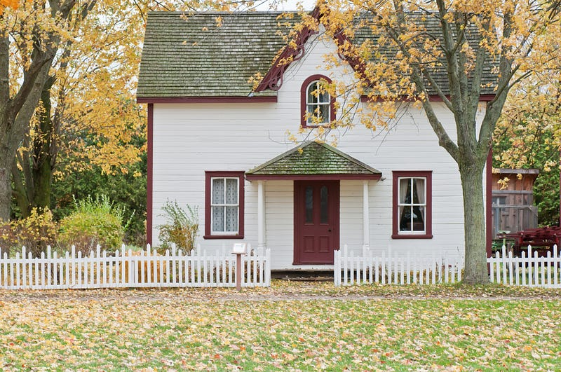

* * *

### **澳洲首次置業指南-昆士蘭篇II：2023 首次購屋補助怎麼領？First Home Owner Grant 申請攻略**

 Photo by [Scott Webb](https://unsplash.com/@scottwebb?utm_source=medium&utm_medium=referral) on [Unsplash](https://unsplash.com?utm_source=medium&utm_medium=referral)

這個系列要來跟大家分享在澳洲第一次買房有哪些政府福利措施可利用!

如果你想要利用**置業擔保計劃 (Home Guarantee Scheme)** 讓澳洲政府擔任你的房貸擔保人，使用房價 2% 或 5% 的頭期款買下你在澳洲的第一套自住房，請參考第一集:

[**澳洲首次置業指南-昆士蘭篇I：2023 首次置業擔保計劃全解析｜Home Guarantee Scheme**  
 _這篇文章是我整理 2023 澳洲首次置業擔保計畫（Home Guarantee Scheme）的實用懶人包，帶你一次搞懂申請資格、房價門檻、自備款比例等重點。只要準備 2% 或 5%…](/posts/2023-09-23-qld-first-home-1/)

按照慣例，在文章開始前必須來個免責聲明XD

> 我只是一個近期致力於研究昆州房產的電腦工程師（並非房產相關專業人士），以下言論不能作為任何法律或是房產投資的建議。如需任何專業建議，請大家自行諮詢律師、過戶師、銀行、貸款經理人等等專業人士。

> 本篇文章所有的資訊都來自政府的官方網站 [Queensland Revenue Office — First Home Owner Grant](https://qro.qld.gov.au/property-concessions-grants/first-home-grant/)，我只是幫大家翻譯跟分析而已。這裡要提醒大家網路上有很多資料 (這篇文章也是XD)，但我希望大家行有餘力的話，還是要看第一手官方資料，避免因為他人的錯誤解讀，而讓自己的權利受損 (by 自己搞定澳洲移民跟澳洲買房的 EC XD)

### 昆州首次置業補助金 (First Home Owner Grant)

  * 完整官方說明請參考：[Queensland Revenue Office — First Home Owner Grant](https://qro.qld.gov.au/property-concessions-grants/first-home-grant/)

### 金額

  * 符合資格的申請人可以獲得一筆一次性的**15,000 澳幣** 補助金。

### 重要提醒

  * 由於這筆補助金發放的時間會根據你申請的方法與時間點而不同，同時也根據你是購入自住房還是自建自住房有關，所以**強烈建議申請人最好不要把這筆補助金算作為你購房的自備款 (deposit) 的一部分** ，以免你因為時間點計算錯誤或是沒有辦法獲得這筆補助金而導致房屋過戶失敗。關於補助金入帳的時間點，請參考：<https://qro.qld.gov.au/property-concessions-grants/first-home-grant/obligations/>

### 房產規定

  * 你購買或是建造的房屋價值必須在 **75 萬澳幣以下 (包含土地價值)。**
  * 該房產必須是新房，新房的定義為**從未以被銷售過**(意即申請人必須為第一手屋主)且**從來沒被人居住過**(意即在申請人入住之前沒有其他人入住過)的房產。

### **申請資格**

  * 年滿十八歲的自然人(意思就是公司法人是不能申請的)
  * 申請人其中之一必須是澳洲公民或是澳洲 PR。在這裡昆州政府把持有特殊簽證的紐西蘭公民也視為澳洲 PR，所以符合資格的紐西蘭公民也可以申請這項福利。這點跟 Home Guarantee Scheme 不同(Home Guarantee Scheme 並不把紐西蘭公民視為澳洲PR。)

> 題外話，因為澳洲跟紐西蘭兩國的關係緊密，所以澳洲政府跟紐西蘭政府有許多互惠措施，例如澳洲公民具有紐西蘭 PR 的資格，可以隨意入境紐西蘭並長期在紐西蘭居住且工作，無需申請簽證。很多澳洲政府給澳洲 PR 的福利政策同樣也適用於紐西蘭公民，但詳細規定可能會根據不同政策或是不同州/領地而有所不同，大家一定要注意閱讀條款。

  * 申請人以及申請人的配偶之前沒有在澳洲其他州/領地領取過該州/領地的首次置業補助金 (如果你或是你的配偶之前在新州領過新州的首次置業補助金，那你們就沒有辦法再領昆州的首次置業補助金了)
  * 申請人以及申請人的配偶之前沒有在澳洲其他州/領地擁有過[住宅] (原文為 residential property)。這裡的住宅 (residential property) 是跟商業房產 (commercial property) 相對應。residential property 之下又再區分成自住房 (owner-occupied property) 跟投資房 (investment property)。

  1. 這裡根據 2000 年 7 月 1 號這個時間點有不同的規定。在這個日期前只要**你名下曾經擁有過住宅** 就算你擁有過 residential property (不管你有沒有在裡面居住過)，在這個日期之後只有在**你名下曾經擁有過民宅** 並且**你在該房產裡面居住過** 才算。
  2. 也就是說如果在 2000 年 7 月 1 號後，如果你的名下只有投資房，然後你現在要買的房子是你的第一間自住房，那你還是有機會申請昆州政府的首次置業補助金的。不過你必須提供這段期間的租約跟水電帳單、報稅資料等等證明你之前購入的房產是投資房，而非自住房。

看了這麼多，如果你不確定自己是否符合**昆州首次置業補助金** 的申請資格的話，可以使用昆州政府提供的小工具：[**First home owner grant eligibility tester**](https://qro.qld.gov.au/property-concessions-grants/first-home-grant/tester/)。

### 申請時間

  * **購入自住房** — 必須在自住房過戶一年內申請。
  * **自建自住房** — 必須在新房建好的一年內申請 (新房建好的時間點以獲得 [final inspection certificate](https://qro.qld.gov.au/definitions/?q=final%20inspection%20certificate%201a) 的時間點為主)。

### 申請方式

  * 可以自行透過 Queensland Revenue Office 申請：<https://www.firsthome.gov.au/apply/qld/>
  * 也可以透過符合資格的銀行或是貸款機構申請：<https://qro.qld.gov.au/property-concessions-grants/first-home-grant/apply/>

### 申請文件

  * 所需的申請文件請參考這裡：<https://qro.qld.gov.au/property-concessions-grants/first-home-grant/documents/>

### 居住規定

  * 房子過戶後的一年內申請人必須要入住你的自住房，並且在裡面連續居住至少六個月。
  * 在這六個月當中，你可以把你家的其中一間房或是多間房出租。但是這樣做的話，雖然不至於影響你的昆州首次置業補助金 (First Home Owner Grant)，但有可能會影響你獲得**首套住房印花税減免 (**[**first home concession**](https://qro.qld.gov.au/duties/transfer-duty/concessions/homes/first-home/)**)** 或 [first home vacant land concession](https://qro.qld.gov.au/duties/transfer-duty/concessions/homes/first-home-vacant-land/) 的權利。(這個系列的第三集我們會來講首套住房印花税減免)。所以如果你想要利用首次購房的機會，一次把政府的相關福利措施拿好拿滿的話，需要注意一下這點。

[**澳洲首次置業指南-昆士蘭篇III：印花稅減免怎麼算？QLD First Home Concession 節稅懶人包**  
 _這篇是 EC 整理的昆士蘭首次置業印花稅減免（QLD First Home Concession）攻略，帶你了解如何省下高達 $15,925…](/posts/2023-09-23-qld-first-home-3/)

### 結語

這段期間我自己正在忙著在昆州購入我自己的第二套投資房，請大家敬請期待～

如果你對昆州購屋補助、貸款流程或首次置業的操作細節有任何問題，歡迎留言或點擊「拍手」支持我這個工程師的 side project 🚀

未來我會持續分享更多澳洲生活、房產、職涯與 IT 相關資源，有興趣也歡迎訂閱、追蹤，或預約我聊聊職涯／技術轉職顧問諮詢！


