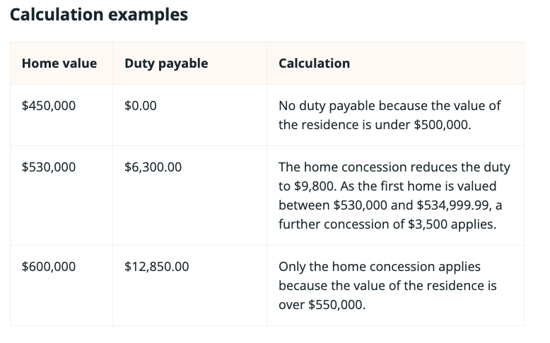

---

title: "澳洲首次置業指南-昆士蘭篇III：2023 印花稅減免怎麼算？QLD First Home Concession 節稅懶人包"
date: 2023-09-23
lastmod: 2026-07-22
description: "昆士蘭首次置業印花稅減免（First Home Concession）的資格、計算方式，以及如何同時符合三項首購補助。本文為 2023 年版本，印花稅制度已大幅修改。"
slug: "2023-09-23-qld-first-home-3"
cover:
  image: "images/hHz4yrvxwlA-unsplash.jpg"
  alt: "白色與棕色現代雙層住宅及泳池"
  credit:
    photographer: "Avi Werde"
    photographer_url: "https://unsplash.com/@aviwerde"
    photo_url: "https://unsplash.com/photos/white-and-brown-concrete-building-hHz4yrvxwlA"
images: ['images/hHz4yrvxwlA-unsplash.jpg', 'images/medium-1*U_aWTB3yxU3FMn3MDKqeqQ.png']
categories: ["投資理財"]
tags: ["澳洲首次置業指南","澳洲房地產","昆士蘭"]
episodeseries: ["QLD 首購房"]
---


昆州的印花稅制度已大幅修改，本文的門檻、金額與試算例子皆已作廢。截至 2026 年 7 月的主要變化：

- 自 2024 年 6 月 9 日起：first home concession 的全額減免門檻由 55 萬提高至 70 萬澳幣（70 萬以下印花稅為零）；70 萬到 80 萬之間仍可獲得部分減免，房價超過 80 萬才完全不適用
- 自 2025 年 5 月 1 日起：首購族購買新建房、樓花或自建土地的印花稅全額免徵，且無房價上限（官方名稱：First home (new home) concession）
- 購屋後不得分租的限制已放寬
- 本文的 $15,925 減免上限、55 萬門檻、三個試算例子與印花稅試算表圖片，全部不再適用

最新規定請以官方頁面為準：[QRO — First home concession](https://qro.qld.gov.au/duties/transfer-duty/concessions/homes/first-home/) ／ [QRO — First home (new home) concession](https://qro.qld.gov.au/duties/transfer-duty/concessions/homes/first-home-new-home/)

如果你正在研究昆州首購，歡迎在下方留言交流。


這個系列要來跟大家分享在澳洲第一次買房有哪些政府福利措施可利用!

如果你想要利用「置業擔保計劃 (Home Guarantee Scheme)」讓澳洲政府擔任你的房貸擔保人，使用房價 2% 或 5% 的頭期款買下你在澳洲的第一套自住房，請參考第一集:[**澳洲首次置業指南-昆士蘭篇I：2023 首次置業擔保計劃全解析｜Home Guarantee Scheme**](/posts/2023-09-23-qld-first-home-1/)

如果你想要利用「昆士蘭首次置業補助金 (First Home Owner Grant)」 ，在購入你的自住房的同時獲得一筆澳幣 15,000 的政府補助金，請參考第二集：[**澳洲首次置業指南-昆士蘭篇II：2023 首次購屋補助怎麼領？First Home Owner Grant 申請攻略**](/posts/2023-09-23-qld-first-home-2/)

按照慣例，在文章開始前必須來個免責聲明XD

> 我只是一個近期致力於研究昆州房產的電腦工程師（並非房產相關專業人士），以下言論不能作為任何法律或是房產投資的建議。如需任何專業建議，請大家自行諮詢律師、過戶師、銀行、貸款經理人等等專業人士。

> 本篇文章所有的資訊都來自政府的官方網站 [Queensland Revenue Office — First Home Concession](https://qro.qld.gov.au/duties/transfer-duty/concessions/homes/first-home/)，我只是幫大家翻譯跟分析而已。這裡要提醒大家網路上有很多資料 (這篇文章也是XD)，但我希望大家行有餘力的話，還是要看第一手官方資料，避免因為他人的錯誤解讀，而讓自己的權利受損 (by 自己搞定澳洲移民跟澳洲買房的 EC XD)

### 昆士蘭首次置業印花稅減免 (QLD First Home Concession)

  * 完整政府規定請參考：[**Queensland Revenue Office — First Home Concession**](https://qro.qld.gov.au/duties/transfer-duty/concessions/homes/first-home/)

### 金額

  * 符合資格的申請人如果購買澳幣 55 萬以下的自住房，可以獲得高達 $15,925 澳幣的印花稅減免 。⚠️（門檻已於 2024/6/9 提高至 70 萬；購買新建房或樓花更已於 2025/5/1 起全額免徵印花稅）如果購入的房產價值高於澳幣 55 萬，那申請人還是可能透過 [home concession](https://qro.qld.gov.au/duties/transfer-duty/concessions/homes/home-concession/) 獲得相當程度的印花稅減免，只是幅度不會像昆士蘭首次置業印花稅減免 (QLD First Home Concession) 一樣高。

### 重要提醒

  * 申請人不需要擁有澳洲公民或是澳洲 PR 的身份資格，但如果是以外國人的身份來申請昆士蘭首次置業印花稅減免的話，需要參考額外的[Additional foreign acquirer duty](https://qro.qld.gov.au/duties/investors/afad/)。

### 申請資格

  * 年滿十八歲的自然人(意思就是公司法人是不能申請的)
  * 沒有申請過 [first home vacant land concession](https://qro.qld.gov.au/duties/transfer-duty/concessions/homes/first-home-vacant-land/)
  * 申請人沒有在澳洲其他州/領地或是海外擁有過房產
  * 房子過戶後的一年內申請人必須要入住你的自住房，並且在裡面連續居住至少一年。
  * 在入住前不能分租或出售你的自住房，在入住後的一年內也不能分租或出售你的自住房 (例外：如果在你購房前，房子就已經有租客存在的話，租客最晚必須在房子過戶後的六個月搬出。)
  * 如果你的自住房的價值在澳幣 $500,001 and $549,999 之間的話，你支付的房產價格必須為市場價 (market value)

看了這麼多，如果你不確定自己是否符合「昆士蘭首次置業印花稅減免」的申請資格，可以使用昆州政府提供的小工具： [home concession eligibility tester](https://qro.qld.gov.au/duties/transfer-duty/concessions/homes/eligibility-tester/)。

### 印花稅 (Transfer Duty)的計算方式

以下使用昆州政府提供的表格來簡單解釋一個印花稅的計算有多複雜XD

⚠️ 以下三個試算例子與表格為 2023 年制度，門檻與稅額均已變動，請勿據此計算。

  * 例子 1 — 房價為 45 萬澳幣，結果為不需要付任何印花稅：因為房價 50 萬澳幣以下的房子不需要支付印花稅。
  * 例子 2 — 房價為 53 萬澳幣，結果為需要付澳幣 6,300 印花稅：首先因為 home concession，53 萬的自住房需要支付澳幣 9,800 印花稅。接下來因為申請人符合昆士蘭首次置業印花稅減免，所以印花稅可以再進一步減少澳幣 3,500，最後需要支付澳幣 6,300 印花稅。
  * 例子 3 — 房價為 60 萬澳幣，結果為需要付澳幣 12,850 印花稅：首先因為 home concession， 60 萬的自住房需要支付澳幣 12,850 印花稅。再來因為 60 萬超過昆士蘭首次置業印花稅減免的房產資格，所以這裡申請人沒辦法再進一步獲得其他印花稅減免。

印花稅的計算方式相較於其他政府補助來說更加複雜，除了跟房價有關係，也跟申請人的資格有關係(例如一對夫妻一起申請，他們各自符合的減免可能不同)。如果你不確定自己可以獲得多少「昆士蘭首次置業印花稅減免」 ，可以使用昆州政府提供的小工具：[transfer duty calculator](https://amun.osr.qld.gov.au/sap/osrqld/wd_tfr_calc_com?WDDISABLEUSERPERSONALIZATION=X)

### 申請時間

  * 印花稅減免的申請時間通常是在房子過戶 (settlement) 的過程中，你的律師再詢問你的買房目的跟資格後，會一併幫你申請。

### 如何同時符合三項首次置業補助

說了這麼多，讓我們來總結一下，身為昆州的首次置業者，如果你想要「同時符合這三項政府的首次購房補助並且最大化你的印花稅減免」

  1. 置業擔保計劃 (Home Guarantee Scheme)
  2. 昆士蘭首次置業補助金 (First Home Owner Grant)
  3. 昆士蘭首次置業印花稅減免 (QLD First Home Concession)

**那作為申請人你需要符合的條件有：**

  * 年滿十八歲的澳洲公民或澳洲 PR (規定來源：首次置業者擔保 &昆士蘭首次置業補助金)
  * 最少擁有房價 5% 的自備款 (規定來源：首次置業者擔保)
  * 單身的年收入不超過 $125,000 澳幣，聯合申請人雙方的年收入總和不超過 $200,000 澳幣 (規定來源：首次置業者擔保) ⚠️（收入上限已於 2025/10/1 取消）
  * 申請人以及申請人的配偶之前沒有在澳洲其他州/領地 或是海外 擁有過房產 (規定來源：昆士蘭首次置業補助金)
  * 申請人以及申請人的配偶之前沒有在「澳洲其他州/領地領取過該州/領地的首次置業補助金」 (規定來源：昆士蘭首次置業補助金)
  * 申請人沒有申請過 [first home vacant land concession](https://qro.qld.gov.au/duties/transfer-duty/concessions/homes/first-home-vacant-land/) (規定來源：昆士蘭首次置業印花稅減免)

**你可以購買的房產的條件為：**

  * 購入的房子只能作為自住房 (規定來源：首次置業者擔保、昆士蘭首次置業補助金、昆士蘭首次置業印花稅減免)
  * 如果要獲得最大化的印花稅減免的話，購入的昆州房產房價須為 55 萬以下(規定來源：昆士蘭首次置業印花稅減免) ⚠️（門檻已提高至 70 萬，新建房更已全額免徵）。如果房價超出這個範圍，那申請人還是可能透過 [home concession](https://qro.qld.gov.au/duties/transfer-duty/concessions/homes/home-concession/) 獲得相當程度的印花稅減免。
  * 該房產必須是新房 ，新房的定義為從未以被銷售過 (意即申請人必須為第一手屋主) 且從來沒被人居住過 (意即在申請人入住之前沒有其他人入住過) 的房產。 (規定來源：昆士蘭首次置業補助金)

**購入自住房之後的居住條件為：**

  * 「房子過戶後的一年內申請人必須要入住你的自住房」 ，並且在裡面「連續居住至少 12 個月」 。(規定來源：首次置業者擔保)
  * 在申請人把房子的貸款還到房價的 80% 以下之前，「你不能出售或出租、分租你的房產」 。一旦你的貸款還款金額超過房價的 20%，澳洲政府的置業擔保計劃規定就不再適用了。(規定來源：首次置業者擔保)

### 結語

房產投資是一門非常複雜的學問，尤其是澳洲身為聯邦國家，除了聯邦政府有全國統一的規定之外，每個州/領地都有自己關於房地產買賣相關的規定跟不同的補助，建議大家除了諮詢相關專業人士之外，也可以自己好好上官方網站閱讀他們的相關規定。

如果你對昆州購屋補助、貸款流程或首次置業的操作細節有任何問題，歡迎留言!

未來我會持續分享更多澳洲生活、房產、職涯與 IT 相關資源，有興趣也歡迎訂閱、追蹤，或預約我聊聊職涯／技術轉職顧問諮詢！
