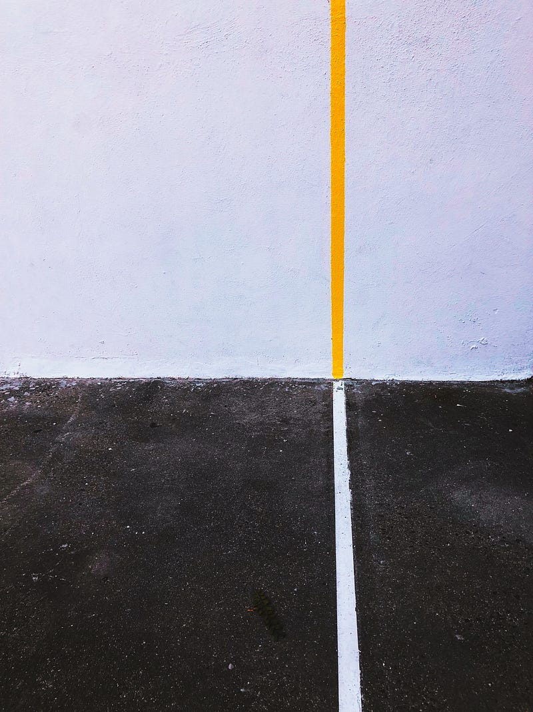

---

### 澳洲微軟 Industry Solution Engineering — Software Engineer 面試經驗分享

Photo by [Jon Tyson](https://unsplash.com/@jontyson?utm_source=medium&utm_medium=referral) on [Unsplash](https://unsplash.com?utm_source=medium&utm_medium=referral)

如果有在追蹤我的朋友，看到這篇文章一定會覺得很奇怪「EC 你不是今年八月才從微軟離職嗎? 怎麼又會去微軟面試 software engineer 這個職位?」

### 前情提要

這件事真是說來話長！大約七月時，我在微軟內部申請了一個 software engineer 的工作，甚至還私下傳訊息聯繫 hiring manager，但完全沒有收到任何回覆、申請系統上也沒有任何進展，後來我確定自己真的不喜歡 Cloud Solution Architect (CSA) 這個職位，又收到了能源公司的 DevOps Engineer 的 offer，於是我就辭職離開微軟啦～

沒想到在九月中，我突然收到一封來自微軟 recruiter 的信，大意是「EC 你好～ 我們現在準備處理你的申請了，但是我們發現你已經離開微軟了，這個職缺其實也關閉了，想請問你對於這個職缺還有興趣嗎？如果有的話，我們可以重新開一個職缺讓你申請。」

雖然我非常滿意自己現在的工作，絲毫沒有考慮回到微軟，但基於我對於 Industry Solution Engineering (ISE) 這個部門的好奇心，我還是答應了 recruiter 的要求 (其實在看到這個職缺前，我從來不知道有這個部門存在XD)。

收到申請後，Recruiter 迅速地幫我安排了三關面試。這點跟我第一次面試微軟的經驗非常不一樣，當初的我只有確定前一關面試通過後才會開始安排下一關的面試時間。

Recruiter 也說我的身份其實有點特殊，因為我申請的時候其實是內部員工，其實只要面試兩關即可，但因為我現在是外部申請人了，所以還是要面試三關。當時的我沒有多想 (畢竟也沒有真的想要回去)，所以也沒有爭取要豁免第三關。

### Industry Solution Engineering (ISE) 部門簡介

在 YouTube 上其實有相關介紹，雖然影片中寫的是 Commercial Solution Engineering (CSE)，但這應該只是改名前的 ISE，有興趣的人可以看一下介紹影片。

Introducing Commercial Software Engineering

* * *

### 第一關面試: Drive for Results、Technical Excellence、Values

第一關的面試官是一個 Business Program Manager，是個偏 business side 的職位，不過面試官本身是 software engineer 出身，也做過微軟 CSA，算是非常多元的技術背景。

第一關主要就是根據以下三個面試問題來作為延伸:

  1. Tell me about a mistake you made. How did you fix it and what did you do afterwards?
  2. Tell me about a project that you encountered technical complexity. What was the technical difficulty? How did you navigate the troubleshooting process and how did you resolve the issue?
  3. Tell me about a time that you did something to improve the code quality. How did you do it? What was the result?

其實第一關我覺得我表現得不太好，主要是第二題的 technical difficulty 我回答完之後面試官直接說「我覺得你剛剛描述的困難比較像是 business 或是 proecess 上的困難，而不是真的 technical complexity」。

這點我其實滿認同的，因為就我過去三年的職涯來說，我的確是沒有解過比較困難的/比較複雜的 engineering problems。在 AWS 時，因為我只是個 associate cloud architect，有前輩罩，所以這些比較困難的技術問題都是前輩負責 design，我只要執行就好。之前在微軟當 CSA 時，我的職位基本上只要用嘴寫 code，根本不用動手，所以也沒有真的遇到過 complex engineering problems。

說實話我因為這段時間太忙了(忙著買房子搞到我整個人心力憔悴)，所以根本沒有做任何準備就上場了，真心是違反我以往的面試前要做好盡職調查跟準備的原則😭

面試完第一關後我立刻覺得自己真的是自討苦吃 (因為我又不想換工作XDD 何苦走這一遭？)，甚至非常想要寫信給 recruiter 立刻取消第二關面試。但是因為第二關面試其實就是第一關面試結束後的一個小時，我覺得要突然取消好像也太趕了，於是就在整個人很心累又很挫折的情況下，進行了第二關面試。

### 第二關面試: Technical Excellence, Growth Mindset, Accountability

第二關的面試官是一個 Senior Software Engineer，但一進入 Teams 會議我就發現在場還有另一個面試官，是個 Principal Software Engineer，據說是應他老闆的要求來觀摩這場面試的。

第二關的面試也是三題，接著面試官會針對這三題進行延伸：

  * Tell me about a time you thought a task, assignment, or goal was unachievable? What was it and how did you help your team try to achieve it?
  * Describe a time when you were unable to complete an assigned task and why you were unable to complete it.
  * Tell me about a time that things didn’t go as you expected (e.g. received negative feedback or customer didn’t accept your solution design).

因為這場有兩個面試官，我覺得相較之下容易很多，比較沒有一對一的緊張感(?)。這場我覺得我表現得還可以，雖然舉例時 technical details 講得不多、主要都是用我的 consulting skills 混過去了，但面試官似乎對我的表現還算滿意的XD

### ISE 這個部門到底在幹嘛？

經過兩次面試與面試官的交流，我覺得我總算稍微搞懂 ISE 這個部門在幹嘛了！在大公司工作的壞處是，有時候真的其實也搞不懂其他部門的工作內容XD

其實我覺得 ISE 的團隊定義滿微妙的，因為他們的運作模式其實很像一般的 consulting services (或是在 AWS 我們稱之為 Professional Services)，基本上就是派一個工程師團隊加入客戶的工程師團隊，然後一起幫客戶做項目。

不同的點在於，通常 AWS Professional Services 或是 Microsoft Consulting Services (MCS，後來又改名叫 Industry Solution Delivery，ISD)，都是非常昂貴的 consulting 資源，一般來說會比其他顧問公司 (Big 4、Accenture etc) 貴很多。但是 ISE 對於客戶來說是免費的資源，他們不靠跟客戶 charge billable hours 維生，反倒是由 Microsoft 內部的 product engineering teams 來提供資金。

這個運作模式我覺得非常微妙！

首先，如果 ISE 對客戶來說是 free resources，好處可能是客戶對他們的預期可能比較低，不會像是請 consulting services 一樣，因為每一分每一秒都在燒客戶的錢，所以客戶通常會希望 consulting services 的 engineers 能夠在很短的時間就 deliver 成果。但壞處就是，既然 ISE 不跟客戶收錢，對於微軟來說這個部門就不是一個會賺錢的部門，通常這種部門在裁員時很容易就會變成公司開刀的對象。我之前待的微軟 CSA 部門也是這個模式，所以我們遭遇了好幾波裁員，最後微軟高層甚至決定今年七月起要改變 CSA 部門的運作模式，把 CSA 部門從 free resources 改向 delivery 模式 (也就是開始跟客戶收取費用)。

再來是 ISE 似乎滿自負的，他們只接 Fortune 500 的客戶 (也就是公司規模太小的還找不到他們出馬)，再來是他們對於 projects 的挑選標準也很嚴格，他們只做全新的 solutions (也就是說如果客戶要求的 solutions 在市場上有第三方產品/軟體可以使用的話， ISE 是不會幫你做的)。最後是 ISE (至少我遇到的那四個面試官都是) 覺得自己比 ISD 厲害得多，他們覺得 ISD 技術很弱、常常搞不定客戶需求 (EC: 你們都是微軟的部門，何必文人相輕XDD)。

### 糾結

面試完兩關後我其實很糾結要不要繼續，畢竟我也沒有真的想要離開現在的工作，然後關於 ISE 這個團隊我也了解的七七八八了。過程中我一直跟 recruiter 說希望她能告知我 salary range，但她從來沒給我一個範圍，只說 engineering 的薪資結構跟 CSA 是不一樣的 (這個 ISE Software Engineer 跟我之前在微軟的 CSA 職位都一樣是 Level 61)。

最後在我的糾結之下，面試的那天也就到了，所以我後來還是跑完了這個流程。

### 第三關面試: Diverse & Inclusive, Technical Excellence, Adaptability

第三關的面試官是一個 Principal Software Engineer，基本上也就是問了我三個大問題，然後從中延伸：

  * **Diverse & Inclusive:** What steps do you take to encourage culturally sensitive behaviours when working in team environments. Please provide specific examples.
  * **Technical Excellence:** Tell me about a time when you sought out a challenging technical problem.
  * **Adaptability:** Describe a time when you presented a proposal or provided a service that was given an unfavourable response by stakeholders.

最後一關在微軟的面試流程來說稱為 As Appropriate (AA round)，通常面試官都是特別資深的微軟高層，受過特別的面試訓練，而且據說在決定是否給你 offer 的會議上有一票否決權。

這一關的面試官在知道我之前是微軟員工後，突然就放鬆了很多，所以我們的面試基本上半小時就結束了（也或者是他已經做出 hire or not hire 的決定了，所以覺得不需要再收集更多 data points），剩下的時間就是讓我問問題。不過當天的視訊品質不是很好，所以他的回答一直斷斷續續的，雖然我問的每個問題他都給了我一個超長的回答，但我總覺得他都沒有提到我想要知道的點XDD

### 總結

我覺得這四個微軟面試官，好像都沒有看過我的履歷XDDD

因為每次在自我介紹，提到我上一份工作是在微軟做 CSA，他們都覺得超級驚訝！還會追問我什麼時候離職的？聽到「八月」之後臉上都有種微妙的表情。

再來是我覺得 ISE 這個部門基本上就承襲了微軟一樣的文化，大家對於自己的職責範圍，都有不一樣的解讀，而且對於這個部門的 KPI 似乎沒有一個衡量的標準，例如其中一個面試官告訴我 ISE 主要的 KPI 有兩個：一個是 generating intellectual property for interal use (這個我覺得合理，而且好衡量)。但另一個是 promoting Azure consumption，但又說他們不是用 azure consumption revenue 來衡量 (他最後直接跟我說：「其實我們沒有真的在 measure 啦」)。再再都讓我回想起 CSA 部門那種一片混亂，連 leadership 都搞不清楚自己真的想要達到什麼的組織文化。

總之我覺得這三輪還算是一個有趣的體驗，但我還是維持我對於微軟的觀感，這果然是一家不管怎樣我都不想要在那邊工作的公司XDDD

最後來開個賭盤吧！你們覺得我最後會收到這個職位的 offer 嗎？

請留言XD

* * *

👉 **需要職涯導師嗎？澳洲雲端架構師 EC 提供轉職工程師、澳洲求職、移民生活等全方位諮詢服務。想進一步了解諮詢細節，請點擊** [**<<澳洲雲端架師 EC：專為轉職者量身打造的職涯諮詢｜海外職場×履歷優化 × 面試攻略 × DevOps /雲端職涯>>**](/posts/2018-01-03-ec-consultation/)**，開啟你的職涯新篇章!**

☕️ **如果想要進一步支持 EC，歡迎請我喝杯咖啡！**

**📱 想追蹤更多？**

  * 📘 [Facebook 粉專：澳洲雲端架構師 EC](https://www.facebook.com/cloudarchitectec)
  * 🧵 [Threads：Cloud Architect EC](https://www.threads.com/@cloud_architect_ec)
  * 📩 合作信箱：[cloudarchitectec@gmail.com](mailto:cloudarchitectec@gmail.com)
