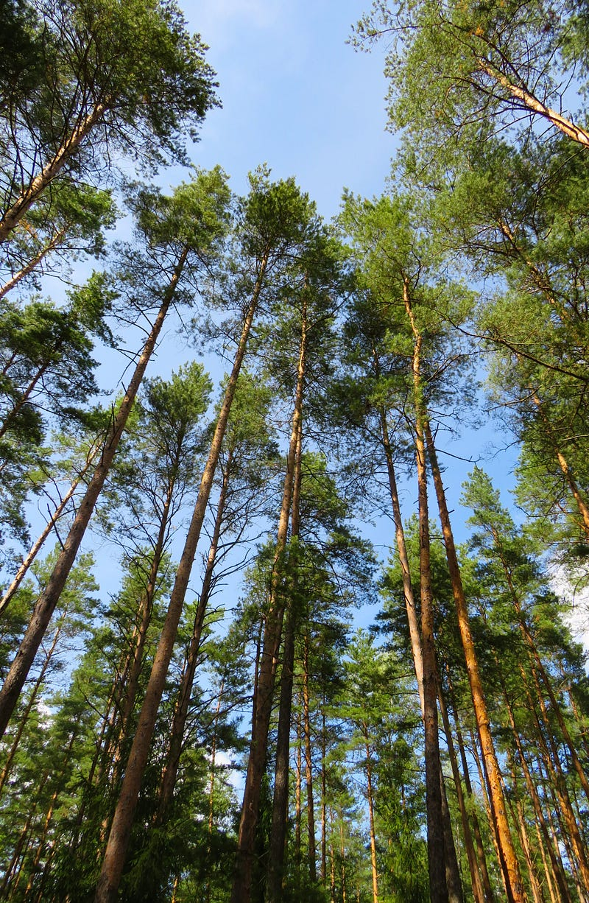
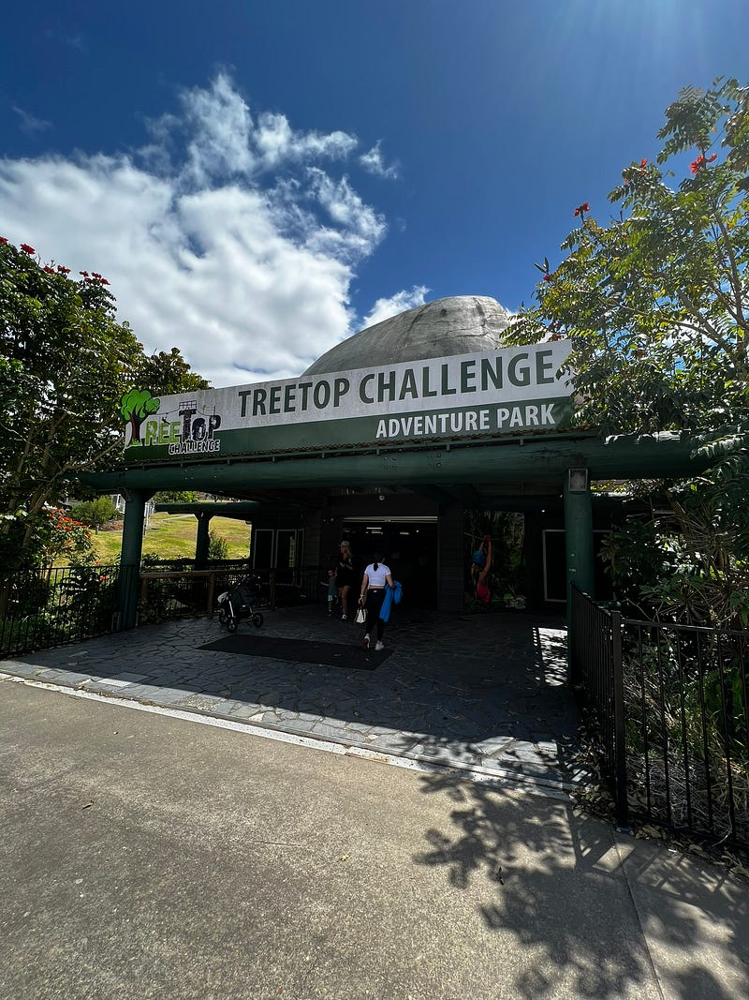
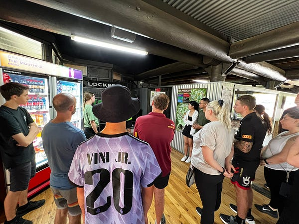
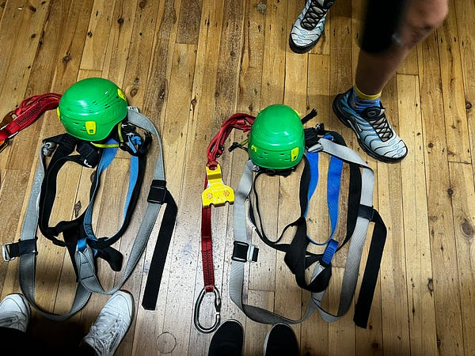
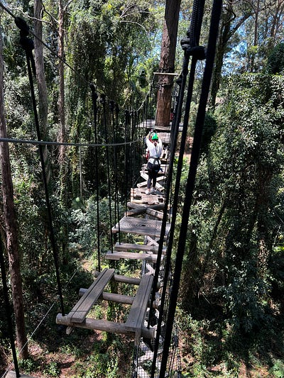
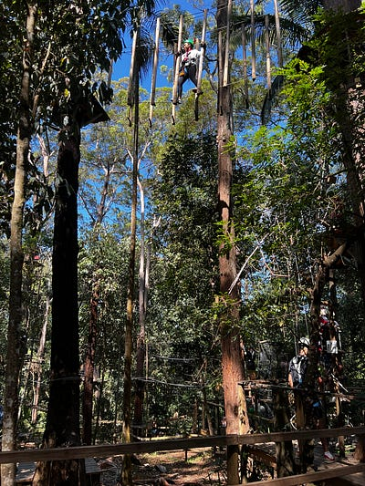
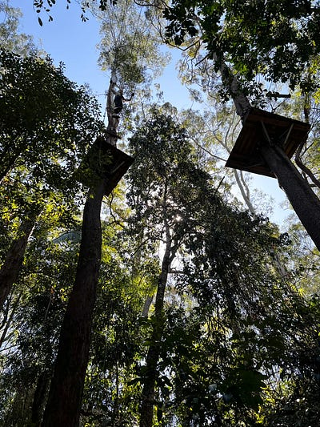
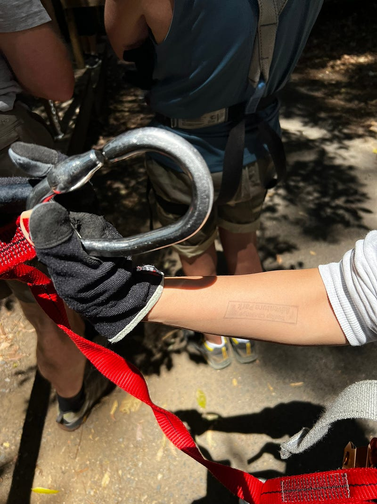
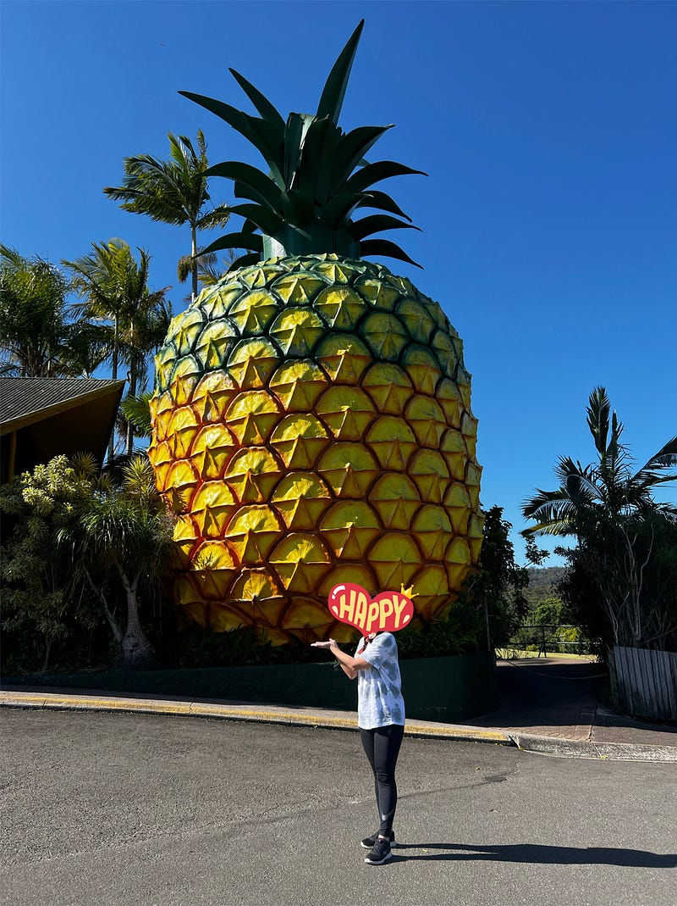

* * *

### 澳洲布里斯本：陽光海岸高空樹頂挑戰 (Tree Top Challenge Big Pineapple) 初體驗，玩的就是心跳！

Photo by [Anastasiya Romanova](https://unsplash.com/@nanichkar?utm_source=medium&utm_medium=referral) on [Unsplash](https://unsplash.com?utm_source=medium&utm_medium=referral)

### 前言

今天要來跟大家分享澳洲一個很有趣的戶外活動 — 高空樹頂挑戰 (Tree Top Challenge)。我跟室友 C 去的是位於陽光海岸的 [Tree Top Challenges Big Pineapple](https://www.treetopchallenge.com.au/sunshine-coast-adventure) 🍍(地址為：76 Nambour Connection Rd, Woombye QLD 4559)。

他們還有另外兩個園區，分別在黃金海岸的 [Mount Tamborine](https://www.treetopchallenge.com.au/tamborine-treetop-adventure?gad_source=1&gad_campaignid=12309401030&gbraid=0AAAAADtI7kR0hMmQhL7nptbtGg8td3Cpv&gclid=CjwKCAjwruXBBhArEiwACBRtHVjoxRZRjKkTi3H5mtEY8lgn6XDv5eBYbIEpBElkcbImi88GJeYegBoCQb8QAvD_BwE) 跟 [Currumbin](https://www.treetopchallenge.com.au/adventure-park/currumbin-wildlife-sanctuary?gad_source=1&gad_campaignid=12309401030&gbraid=0AAAAADtI7kR0hMmQhL7nptbtGg8td3Cpv&gclid=CjwKCAjwruXBBhArEiwACBRtHas9NpVJBmg8yCiY92AJW_9FqwiLIX0-L7K2PVtpciJHS1kgwLub_xoCNaUQAvD_BwE)。

每個時段都有限定的入場人數，大家出發前記得要先上官網選時段購票 (成人 $65澳幣)，網站上說大概需要三小時完成挑戰，但其實入場後並沒有時間限制，如果你想待更久也可以。

對 tree top challenge 沒有概念的人，可以看這個官方介紹影片，非常刺激喔XDD

### 出發

陽光海岸距離我住的地方大約一小時車程，沿途的公路風景其實還滿美的！

開車前往陽光海岸

這天在出門前，我們兩個早上還先去上了皮拉提茲課 (自以為時間很多XDD)，好險最後還是順利在預定時間抵達了園區。

Tree Top Challenge — Big Pineapple

進去簡單報到之後，就會先開始著裝。一開始工作人員會把裝備都先在地板上擺好，之後只要按照教練一個口令一個動作著裝即可。

安全說明 ＆ 上裝備

在正式開始之前，室友 C 表示興奮期待，我表示瑟瑟發抖 （好險我本人其實不怕高，我只是孬 🤣🤣🤣）。

Tree top challenges 是一個體能挑戰，根據難易程度分成 easy (綠色/紫色)、intermediate (紅色)、advanced (藍色)、expert (黑色/鑽石)。建議所有參加者都循序漸進，完成 easy 程度之後再挑戰其他難度。

根據難度不同，樹的高度大概在 3–30 公尺之間，挑戰的內容包含溜索(一開始我被那種滑下去，腳底懸空的失重感嚇得要死，後來發現這個是最簡單的挑戰，因為完全不用出力😆)、爬樓梯、走繩索、走高空木板等等各式體能挑戰。每個挑戰視難度大概耗時 25–45 分鐘不等。

各式挑戰

這是一個全身的運動，需要用到核心、伸展度、臂力、腿。我玩到第二個 challenge 中間，手臂就沒力了，之後的好幾關都是靠硬撐跟運氣才沒有掉下去 (過程中無法退出，也沒辦法讓別人先走，所以也不太能休息，真的是滿想哭的，下面會詳細解釋為什麼）。

### 感想

**優點：** 我覺得他們的安全機制做得滿好的，講解很仔細，也有各種不同的設施。園區滿大的，有各種難度可以讓大家根據自己的狀況挑選。

**缺點：** 一旦你決定開始一個挑戰（把勾勾掛上去），沒有完成你是不能下來的。而且也不能讓你後面的人越過你先走，所以其實壓力滿大的！像排我後面的迪迪超強，他完全被我從頭擋到尾。不過澳洲人都很好，基本上也不會有人催你，大家就是默默等待。

安全掛鉤

我也看到有個國中生妹妹不管怎樣就是抓不到下一塊木板，所以她就是在前一塊上面坐著。而且那是那個挑戰的第一關，所以後面的人全部等她等了30–40分鐘，都不能玩（這也是為什麼室友 C 這次也沒挑戰到黑色挑戰的原因，因為真的玩不了）。

在很極端的情況下，另一個高中生妹妹也是直接坐在高空中木板上哭，因為她真的移動不了，抓不到前面的懸吊木板，也抓不到後面的，整個人就卡在上面無所適從。最後只好請工作人員爬上去救她下來（類似登山救援那樣，把妹妹的掛鉤綁在他身上，把妹妹拖回來）。

### **總結**

  1. 雖然我覺得門票有點貴（我覺得一個人$30–40差不多吧？雖然我問一下身邊的人，大多都覺得這個價錢很合理，有的人甚至覺得一個人 $100 也很合理)，但我覺得是一筆我會願意花的錢，也願意再去挑戰一次（只是下次去之前體能跟臂力得先練好一點，不然狂擋別人真的是很尷尬)。因為有各式不一樣的挑戰，很有趣也很有成就感👍
  2. 建議可以選最早的時段，我們這次選了10:30，除了第一關 easy 綠色小排隊，剩下每關都排了20–30分鐘不只，因為人潮滿多的，而且我們都有遇到卡在上面動彈不得的人😂
  3. 來的人也建議穿有口袋且口袋有拉鍊的褲子，這樣才能放手機(樹都很高，手機掉下去絕對沒救)。玩的過程不能帶包，也不能帶水(但後來看到工作人員身上帶了有掛勾的水壺，如果你有這類裝備請記得帶)。雖然玩得過程中也沒什麼機會拿手機拍照（因為後面所有人都在等你，只有前面有人大卡住時才能拿出來拍一點，但排隊時可以玩手機還不錯)😆

講了這麼多，為什麼這個地方叫 Tree Top Challenge Big Pineapple 呢？就由圖片來揭曉吧🍍(Big Pineapple 是這附近的一個地標：<https://maps.app.goo.gl/FBdUgLQu4hmrXegYA>)

與大鳳梨合照

* * *

👉 **需要職涯導師嗎？澳洲雲端架構師 EC 提供轉職工程師、澳洲求職、移民生活等全方位諮詢服務。想進一步了解諮詢細節，請點擊** [**<<澳洲雲端架師 EC：專為轉職者量身打造的職涯諮詢｜海外職場×履歷優化 × 面試攻略 × DevOps /雲端職涯>>**](/posts/2018-01-03-ec-consultation/)**，開啟你的職涯新篇章!**

☕️ **如果想要進一步支持 EC，歡迎請我喝杯咖啡！**

**📱 想追蹤更多？**

  * 📘 [Facebook 粉專：澳洲雲端架構師 EC](https://www.facebook.com/cloudarchitectec)
  * 🧵 [Threads：Cloud Architect EC](https://www.threads.com/@cloud_architect_ec)
  * 📩 合作信箱：[cloudarchitectec@gmail.com](mailto:cloudarchitectec@gmail.com)

