* * *

### 微軟 Azure 和 AWS 證照更新規定比較 — ChatGPT 比我更會考證照考試？順利更新 Azure Solutions Architect Expert 證照！

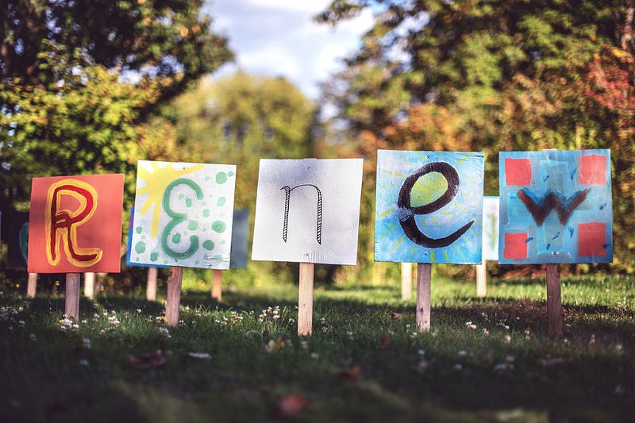Photo by [Tim Mossholder](https://unsplash.com/@timmossholder?utm_source=medium&utm_medium=referral) on [Unsplash](https://unsplash.com?utm_source=medium&utm_medium=referral)

非 Medium 付費會員，請[點此免費閱讀這篇文章](https://medium.com/@cloudarchitectec/1f4084c07216?source=friends_link&sk=5e7fbf30423c8301e6ca6c530be05c5e)！當然如果你願意加入 Medium 付費會員來支持創作者，那就更棒囉～感謝你的閱讀！

* * *

今天要來跟大家分享我更新微軟證照 Microsoft Azure Solutions Architect Expert 的經驗，還有我用 ChatGPT 幫我考 Microsoft Azure Administrator Associate 證照更新考試的心得 (究竟 ChatGPT 有沒有比我聰明呢? XD），以及微軟 Azure 和 AWS 雲端證照在更新證照規定上的差異。

### 前言

在過去三年內我考過了 5 張微軟 Azure 雲端證照以及 6 張 AWS 雲端證照。

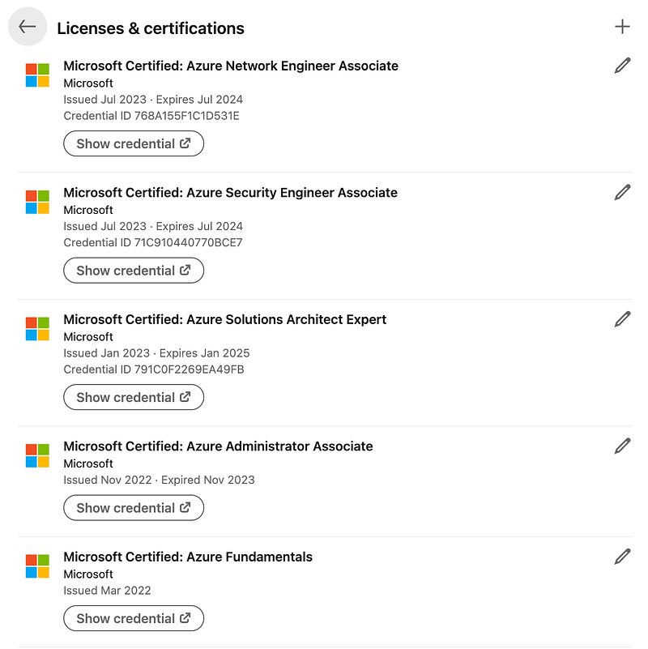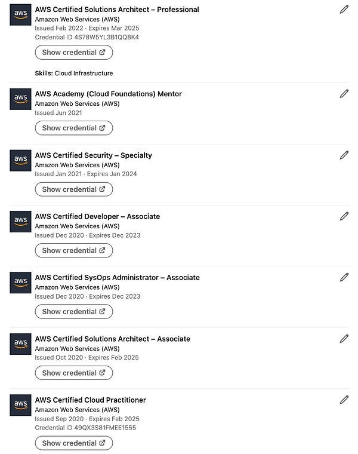11 張雲端證照

會考這麼多，一方面是因為我之前在微軟和 AWS 工作，證照費由公司全額補助 (仔細想想賺了大概 2000–3000 澳幣的證照費XD)，另一方面可能是因為我那時候剛入行，比較有衝勁，而且還很閒(?)

現在的我顯然已經失去了那些動力哈哈哈!

我在離開微軟前，利用微軟的資源預約了其他三場考試，分別為 [HashiCorp Certified: Terraform Associate (003)](https://www.hashicorp.com/certification/terraform-associate)、[Microsoft Azure AI Engineer Associate (AI-102)](https://learn.microsoft.com/en-us/credentials/certifications/azure-ai-engineer/)、 [Microsoft DevOps Engineer Expert (AZ-400)](https://learn.microsoft.com/en-us/credentials/certifications/devops-engineer/)，我至今還沒有去考。這幾場考試時間一路被我從八月延到十二月，我現在甚至不排除把他們一路延到明年XDDD

如果想要了解我對雲端證照的看法，以及兩個證照系統的比較，歡迎參考我的這篇文章：

[**雲端證照真的會帶領你走向夢想中的工作嗎? AWS 與 Azure 證照的解析**  
 _擁有11張雲端證照的我想要來分享我對 AWS & Microsoft Azure 兩種證照體系的比較，最後則會分享我對雲端證照的看法。_medium.com](https://medium.com/@cloudarchitectec/%E8%81%B7%E5%A0%B4-%E9%9B%B2%E7%AB%AF%E8%AD%89%E7%85%A7%E7%9C%9F%E7%9A%84%E6%9C%83%E7%82%BA%E8%81%B7%E5%A0%B4%E5%8A%A0%E5%88%86%E5%97%8E-aws-%E8%88%87-azure-%E8%AD%89%E7%85%A7%E6%AF%94%E8%BC%83-6fac635933b8)

### 如何更新微軟 Azure 和 AWS 雲端證照

有一點在那篇文章裡沒有提到的微軟 Azure 和 AWS 雲端證照差異，是拿到證照後，在這兩個系統理我們要如何更新證照呢？

**就 AWS 證照來說，更新的方法有兩種：**

第一種是直接再參加一次考試，對於考生的時間成本跟經濟成本來說都是一筆不小的支出。以 AWS Solution Architect Associate 為例，重新驗證的成本是 150 USD 的測驗費、130 分鐘的考試時間，以及你準備考證所需要的準備時間。

第二種則是通過更高一級的考試。以 AWS Solution Architect Associate 為例，如果你在證照有效期內通過 AWS Solution Architect Professional，那麼你的 AWS Solution Architect Associate 也就會隨之延長。

例如下圖我在 2022.02.19 通過 AWS Solution Architect Professional (該證照的有限期限為三年，到 2025.02.19)，你們可以看到我的 AWS Cloud Practitioner 跟 AWS Solution Architect Associate 有限期限也就隨之被延長到 2025.02.19。

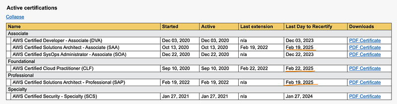AWS 證照

不過第二種方式只適用於兩條主要的 AWS 證照路線 ：

  * Solution Architect 路線：AWS Cloud Practitioner > AWS Solution Architect Associate > AWS Solution Architect Professional
  * Developer 路線：AWS Cloud Practitioner > AWS Developer Associate / AWS SysOps Administrator > AWS DevOps Engineer Professional

如果你的證照是 Speciality level，例如圖中的 AWS Security Speciality，那你更新證照的唯一方式，就只有重新再考一次 lol

**更新微軟 Azure 雲端的證照方式則簡單得多：**

  * 你只需要通過一個線上測驗
  * 線上測驗是個不計時的開卷考（可以 Google，可以用 ChatGPT），而且還免費！！！
  * 線上測驗可以重考無數次，聽起來是不是有夠簡單呢？（唯一的規定是：如果考第一次沒有通過，可以立刻再考第二次。不過第二次失敗之後，每次重考需要間隔 24 小時）

跟 AWS 證照相較之下，微軟 Azure 雲端證照的更新方式簡直太佛心了！

### Microsoft Azure Administrator Associate 證照更新考試心得

微軟證照的更新方式聽起來如此簡單，於是今天我就趁著假日來體驗一下。

就 Microsoft Azure Administrator Associate 證照更新考試來說，題目是 26 提選擇題(單選)。但是我真的太久沒有碰 Azure 了，考試前也完全沒準備，考試中也沒有認真查資料，所以我獲得了一個這樣的下場：

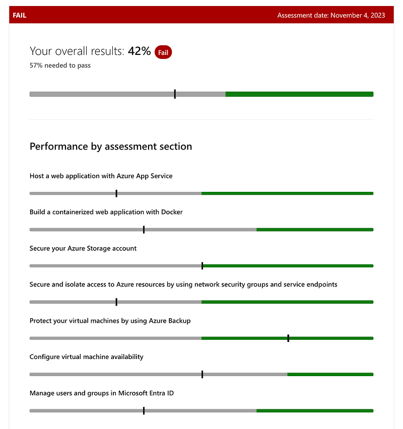第一次證照更新考試分數 — EC

57% 就能通過的開卷考，我居然還考了 42%，真是爛斃了XDD

事實證明大家還是不要自恃聰明、心存僥倖(?)

### ChatGPT 有比我更會考試嗎？

第一次失敗後，我立刻開始了第二次考試。此時我突然想到，既然是開卷考，那我不如請 ChatGPT 來試試? 於是我把每一個問題跟答案丟給 ChatGPT，結果它獲得的分數是：

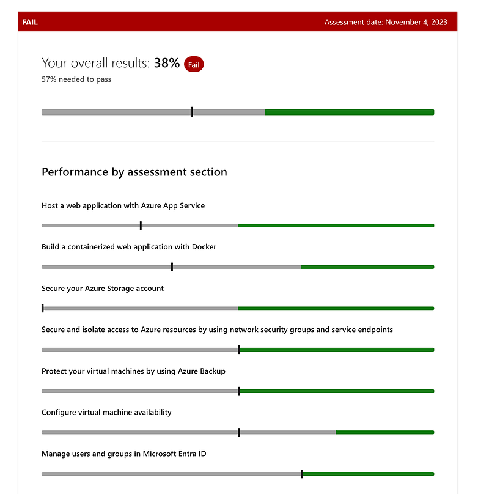第二次證照更新考試分數- ChatGPT

事實證明 ChatGPT 考得比我還差XDDD (果然有沒有連網還是有差哈哈！)

於是我現在只能在等 24 小時再考一次了，不過既然是開卷考，最後要通過應該是不難啦，所以我也沒有太擔心。

**接下來我要來分享一下我用 ChatGPT 作答的心得：**

  1. 我覺得 ChatGPT 「感覺」還是滿聰明的，因為它每選擇一個答案，都還會給我一些解釋。(雖然就最終結果來說，它的答題正確率並沒有特別高？)

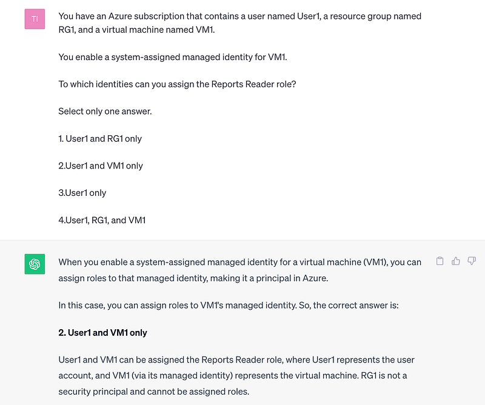ChatGPT 回答範例一

2\. ChatGPT 有著基本的語意判斷邏輯，不會因為我少給了它一個選項，就只在我給的選項中選答案。

這一題的答案其實有五個選項，但我複製過來後，加上選項數字時少加了一個，不過 ChatGPT 並沒有因此被我迷惑，還是選出了正確答案「 DiskA, DiskB, DiskC, and DiskD」。

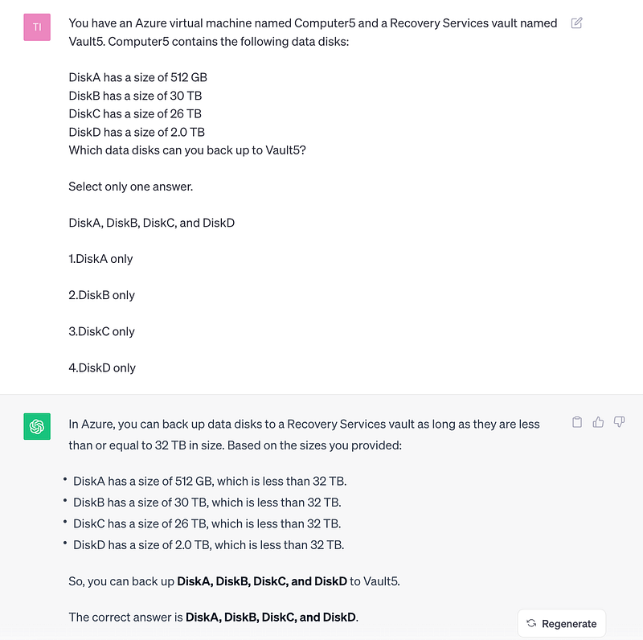ChatGPT 回答範例二

3\. ChatGPT 有自己的看法，例如我明明給了它四個選項，它卻告訴我此題無解XD

雖然我也覺得這題題目沒有出得很好，而且 ChatGPT 應該是對的，因為 banned password Contoso 很明顯應該是禁不了選項Ａ(裡面用 0 取代了英文字母Ｏ)。但如果真心硬要選一個答案的話，我覺得 D 應該還是一個比較有可能的選項。這也是 ChatGPT 跟人類不一樣的地方，像我們明知道考題出錯了，但為了避免失分，我們還是會硬選一個，而不是直接不作答。

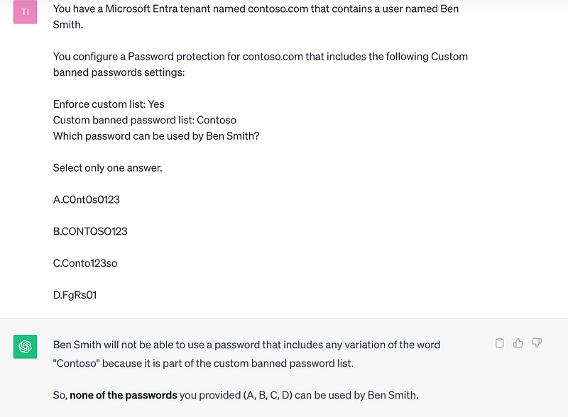ChatGPT 回答範例三

### Microsoft Azure Solutions Architect Expert 證照更新考試心得

跟 ChatGPT 玩完之後(?)，我立刻考了下一個證照更新考試 Microsoft Azure Solutions Architect Expert。

事實證明我不愧是做過 Microsoft Solution Architect 的女子，立刻輕鬆高分通過XDD

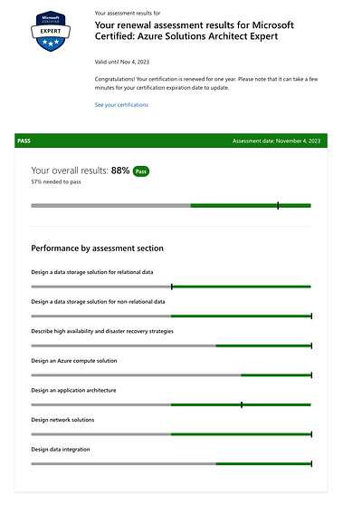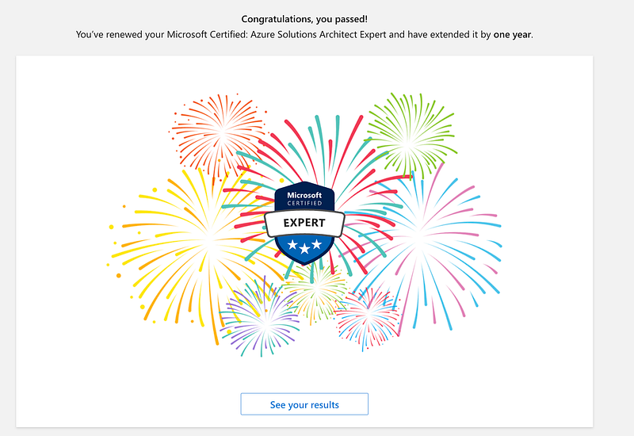Microsoft Solution Architect 證照更新考試結果

好吧，所以我覺得追根究底可能只是因為 Microsoft Azure Administrator Associate 跟Microsoft Solution Architect 的考試方向差異極大，前者專注於考一些實際操作上的細節 (說真的根本沒有人會默背那些細節，要操作時再看 documentation 就可以了)，後者則是考驗 solution design 跟 solution architecting 的概念。

如果想要參考我以前考 Microsoft Azure Administrator 的心得 (抱怨?)，歡迎閱讀這篇文章：

[**微軟 Azure 雲端證照: AZ-104 Azure Administrator Associate 考試心得**  
 _跟大家分享我的第二張 Azure 證照 AZ-104 Microsoft Azure Administrator Associate 的考試心得，並分析我覺得 Azure Associate Level 證照比起 AWS…_ medium.com](https://medium.com/@cloudarchitectec/az-104-azure-%E8%AD%89%E7%85%A7%E9%80%9A%E9%81%8E%E5%BF%83%E5%BE%97-80625af7c654)

### 結語

以上就是兩個雲端證照系統的證照更新比較、使用 ChatGPT 來幫我考試的心得，以及最後兩個微軟證照考試的成功與失敗的心得。這裡想要來跟大家探討幾個問題：

  1. 你們對於 AWS 跟微軟 Azure 證照更新的系統有什麼想法呢？我覺得 AWS 的方式雖然勞民傷財，但似乎是一個比較有效的驗證方式，畢竟你要麻重考一次要麻通過更高等級的考試。微軟 Azure 證照更新超級簡單省力，但如果你只是隨便查查網路資訊就可以每年更新的話，維持這個證照的有效期限似乎也不太有意義？
  2. 大家覺得 ChatGPT 的表現如何呢？這還是我第一次用它來考試，就結果論來說沒有太成功。但我很喜歡用 ChatGPT 來寫 email 或是給同事的 feedback。

歡迎留言跟我分享你的想法喔～

* * *

**如果你喜歡海外生活、澳洲職場、文組轉職工程師的相關文章，歡迎按下「拍手」給我鼓勵 (喜歡的話請多拍幾次！)。同時記得「**[**按此訂閱我的Medium部落格**](https://medium.com/@cloudarchitectec/subscribe)**」，這樣你就不會錯過我的更新囉～**

**如果想要進一步支持我，歡迎透過以下連結請我喝一杯咖啡！你們的支持是我持續創作的動力，如有任何問題或是想要看的主題，歡迎留言與我互動 :)**

  * 中文部落格: [https://medium.com/@cloudarchitectec](/@cloudarchitectec?source=about_page-------------------------------------)
  * 英文部落格: [https://medium.com/architecting-your-cloud-career](https://medium.com/architecting-your-cloud-career?source=about_page-------------------------------------)
  * Email: [cloudarchitectec@gmail.com](mailto:cloudarchitectec@gmail.com?source=about_page-------------------------------------)
  * 臉書粉絲頁(文章與中文部落格相同): [https://www.facebook.com/cloudarchitectec/](https://www.facebook.com/cloudarchitectec/?source=about_page-------------------------------------)

* * *

**延伸閱讀**

  * [微軟雲端架構師 Microsoft Azure Cloud Solution Architect 面試心得 (同場加映 AWS 面試心得)](https://medium.com/@cloudarchitectec/%E6%BE%B3%E6%B4%B2%E5%BE%AE%E8%BB%9F%E9%9B%B2%E7%AB%AF%E6%9E%B6%E6%A7%8B%E5%B8%AB-microsoft-azure-cloud-solution-architect-%E9%9D%A2%E8%A9%A6%E5%BF%83%E5%BE%97-%E5%90%8C%E5%A0%B4%E5%8A%A0%E6%98%A0-aws-%E9%9D%A2%E8%A9%A6%E5%BF%83%E5%BE%97-9dff9fc59ae8)
  * [微軟 Azure 證照: 如何只用 40 小時準備 AZ-104 Azure Administrator Associate 證照並順利通過考試](https://medium.com/@cloudarchitectec/%E5%A6%82%E4%BD%95%E6%BA%96%E5%82%99-az-104-azure-administrator-associate-%E8%AD%89%E7%85%A7-ce4e5e16bebc)
  * [給成功轉職軟體工程師的你的一封信](https://medium.com/@cloudarchitectec/a-letter-to-all-career-changers-8fd7a3422ec7)
  * [Software Engineer? Cloud Engineer? DevOps Engineer? 你寫的 code 跟我寫的到底有什麼不同?](https://medium.com/@cloudarchitectec/software-engineer-cloud-engineer-devops-engineer-what-do-they-do-56f3aedfe4ac)
  * [轉職可以一轉再轉嗎？薪水是轉職最重要的考量？](https://medium.com/@cloudarchitectec/%E8%81%B7%E6%B6%AF-%E8%BD%89%E8%81%B7%E5%8F%AF%E4%BB%A5%E4%B8%80%E8%BD%89%E5%86%8D%E8%BD%89%E5%97%8E-%E8%96%AA%E6%B0%B4%E6%98%AF%E8%BD%89%E8%81%B7%E6%9C%80%E9%87%8D%E8%A6%81%E7%9A%84%E8%80%83%E9%87%8F-f6e9ee6e7d85)

