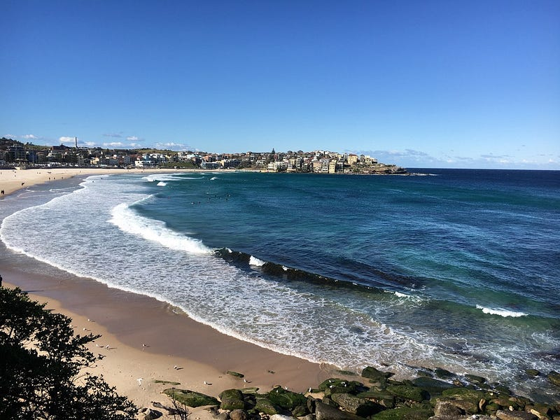
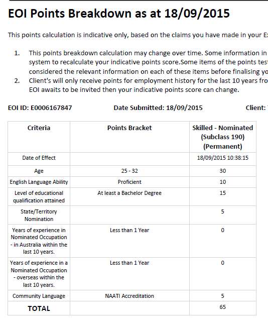
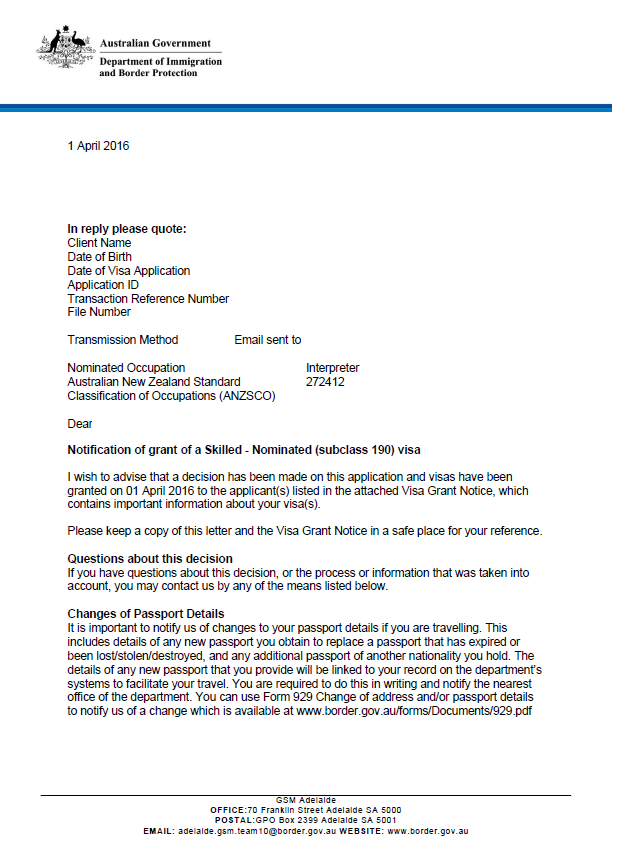

* * *

### 從非移民專業到澳洲PR：我如何靠研究政府法規，創造專屬自己的技術移民機會！

Photo by [wuz](https://unsplash.com/@yungwuz_?utm_source=medium&utm_medium=referral) on [Unsplash](https://unsplash.com?utm_source=medium&utm_medium=referral)

今天要來分享我 2016 年是如何另闢蹊徑，透過自己閱讀澳洲政府網站的移民規定，在不可能中發現可能，最後成功幫助自己以及我最好的朋友成功拿到澳洲身份的故事！

* * *

此篇文章感謝讀者 Peter 的支持，不然這篇文章可能會持續難產中！這個故事告訴我們，向你支持的作者許願還是有用的，請大家快來跟我許願你們想看什麼樣的文章吧XDD (其實我最近靈感枯竭，是真的很需要你們提供我一點建議哈哈)

一樣先來個免責聲明: 我在 2016 年成功拿到澳洲永居權/綠卡 (permanent residency) 的，距離現在為時已久，移民法規已經改過千萬次了，我相信以下文章分享的方式應該已經不適用於現在澳洲移民法規，所以請把這篇文章當作單純的經驗分享吧XD

### 背景

政大英文系畢業後，我在一間台北的科技翻譯公司工作，職位是專案經理身兼筆譯，沒想到工作一年之後就覺得職場倦怠XD，於是決定去澳洲打工度假兩年。

我至今仍然覺得這是個非常棒的決定，我走過澳洲各大城市，住過的地方遠比我大多數澳洲朋友多，也認識了非常多非常棒的人，然後經歷了各式奇妙體驗，至今仍然讓我回味不已！

*Bondi Beach — NSW*

在我出發前往澳洲前，有個好朋友跟我說她打算去考師大翻譯所，我因為職場倦怠，想說台灣考研究所的報名費也不貴，所以就在沒有怎麼準備的情況之下去應考了，沒想到居然幸運考上(我記得我是當年的筆譯組第三名，果然考試就是我人生的強項XD)。我還記得當年的筆試考題考了周杰倫的青花瓷歌詞，非常有創意！

其實當時的我也有點掙扎要不要去澳洲，因為剛好考上研究所，去澳洲這個計畫就變得非常完美，也不用擔心打工度假回來之後很難找工作，於是考上之後我就休學安心去澳洲了。

澳洲打工度假二簽結束後，我按照原定計畫回台灣讀師大翻譯所，沒想到突然覺得我開始不適應台北的生活(明明之前就在那邊生活了五年XD)，想念澳洲的文化跟生活環境，於是我決定重回澳洲。

### 澳洲留學

當時的我一邊讀師大翻譯所，一邊準備留學申請。說真的，其實澳洲留學申請滿簡單的（相較於歐美來說），我也成功在第一次考雅思就考到四個七，所以就順利申請上學校了。

當年準備再度回到澳洲的我，內心其實已經有了移民澳洲的想法，而當年的我也知道，翻譯其實不屬於移民清單上的科系，但因為我個人對於語言跟文學很有興趣，所以我還是一意孤行選了這個科系，想說到時候到了澳洲再想辦法。

這裡必須要提到澳洲政府每年都會公布[技術移民職業清單列表 (Skilled Occupation List)](https://immi.homeaffairs.gov.au/visas/working-in-australia/skill-occupation-list)，通常大家喜歡讀的科系有幾個，文組就是會計、教育、社工，理組讀的就是 IT（因為門檻比較低，比較容易達成）。如果有興趣想要移民的人，在選擇科系時可以優先考量這些學科，比較省時省力。不過雖是這樣說，我相信跟我一樣不邪的朋友應該還是不少XD

但我身邊真的有不少這樣的人，只想讀自己有興趣的科系 (通常都不能移民)，所以兜兜轉轉在澳洲待了十幾年也還是沒有拿到身份，所以大家下決定前一定要多多考慮一下。

### 開始踏上移民過程

我當年讀的是 Macquarie University Master of Translation and Interpreting Studies，這是一個兩年的口筆譯碩士學位。讀完一年之後，我成功考取了澳洲的 NAATI 翻譯職業證照：三級筆譯與三級口譯，也開始體會到我自己是認真想要移民澳洲。但是口筆譯並不在移民清單上，於是我開始開始找其他方法，同時也諮詢了許多移民仲介。

這個時候我發現澳洲的移民仲介參差不齊 (其實我當時也在一間移民仲介打工，看過很多鬼故事XD)。在此建議大家一定要多多跟幾個仲介聊聊，結合不同人的說法，再加上自己去閱讀移民局的官方的資訊，才不會因為不專業的仲介而多走冤望路。 (在此同時，我們翻譯所大概有 20 位同學，每個人都想移民，不過大多數人都決定先把學位讀完再說)。

我覺得明知道這條路走不通，還硬要走下去，這種堅持其實滿傻的（不過我也傻了一年就是了XD）。我的想法是這樣的：如果你都知道自己想要到達Ａ，但卻不往Ａ走，硬是要繞遠路，感覺好像不太符合邏輯（當然說不定繞遠路可以看到不一樣的風景？XD）。再加上我一向就是一個決定好自己的目標之後就會開始多方查詢資訊、制定計劃，然後開始執行的人，於是我就毅然決然從 Macquaire University 休學了。

前面說過當年最容易的移民選項就是讀一個教育學碩士或是會計學碩士，我一開始其實是想選教育的，因為教育的移民標準比較高(需要考過雅思四個八才能通過職業評估)，我覺得競爭比較小。沒想到申請了幾間學校，我居然拿不到教育學碩士 offer lol

後來就決定去改讀會計，那時候我也在好幾個學校中選擇，最後選了一個野雞學校 (因為學費最便宜，而且這間學校一年有 3 個學期，可以比較快拿到學位) XDDD

雖然現在講起來很輕鬆，但當時的我其實很糾結，因為我在台灣已經休學過一次了，沒想到居然在澳洲又要休學一次。這真的是一個對的決定嗎？要是我後來沒有成功移民，也放棄了我本來喜歡的翻譯碩士學位，會不會很可惜呢？

而且說來可笑，讀野雞學校這件事在我內心其實也滿掙扎的，畢竟我的求學生涯基本上讀的都是頂尖學府 (政大英文系、師大翻譯所，我還是當年屏東縣指考最高分)，但現在回頭一看其實學歷根本沒什麼大不了的XD 果然人生每個階段的著重點都不一樣呢！哈哈

### 雅思啊雅思

於是我就這樣修完了會計課程，這時候的移民分數已經比我當年決定要來澳洲留學時高出了不少 (這也是為什麼我一開始勸大家選科系要想清楚的原因，因為移民這件事只會隨著時間越來越難 QAQ)，為了湊足移民分數，我必須要考到雅思四個八。沒想到這個我當初以為稍微努力一下就能達成的目標，在我考了四次雅思跟一次PTE 之後，還是無法達成！

其實我的英文能力還是不錯的，我考過兩次雅思閱讀跟聽力滿分9分，但是不管怎樣，我的寫作跟口說總是在7上下徘徊。我最後一次考雅思的成績是閱讀9/聽力9/寫作6.5/口說6.5，讓我整個人崩潰到不行！！！因為這時候我已經在澳洲留學兩年了，還通過口筆譯檢定，結果寫作跟口說比我當年在台灣第一次考雅思還差，完全就是晴天霹靂囧

### 沒有機會，就創造機會

會計課程畢業後，我在雅思跟 PTE 的考試上苦苦掙扎。有一天我突發奇想，跑去新州政府的網站上查詢了一下[州政府擔保技術移民 (190 Visa)](https://www.nsw.gov.au/visas-and-migration/skilled-visas/skilled-nominated-visa-subclass-190) 的規定。

當年的網站上面寫著，新州政府只會優先考慮在清單一：[技術移民職業清單列表 (Skilled Occupation List)](https://immi.homeaffairs.gov.au/visas/working-in-australia/skill-occupation-list) 上的申請者，並列出每個職業新州政府需要的名額。網站上還列了一個清單二，上面寫著「但是在某些特殊情況下，如果有需要的話，我們也有可能會挑選一些在清單二上的職業，但我們不保證我們會從清單二上挑選職業，也不能保證會有多少名額。」

我點開清單二，赫然發現筆譯跟口譯這兩個職業居然列在上面。當時我想，反正申請 EOI 很簡單，而且免費，我就來申請一下好了。

其實當年要靠筆譯或是口譯移民根本就是不可能的，而且說真的在考不到雅思四個八的情況下，我的移民分數也不夠高，感覺被選上的機會是微乎其微 (澳洲移民是打分制，基本的運作方式就是先挑職業，然後從高分的申請人開始發簽證邀請)。

當時的我沒有想太多，只覺得既然符合了規定，我就先來申請看看吧 (申請的那天是 2015.09.18)！雖然這是一個列在公開網站上的資訊，但我當時諮詢過的所有移民仲介中，完全沒有人提到這件事，甚至是我自己打工的移民仲介的老闆跟同事也都不知道這件事。可能是因為他們覺得機率太低了，又或是他們不會像我這麼無聊把網站上的每個規定都細細讀過一遍?XD

*當年的 NSW 190 Nomination EOI 申請紀錄 (我的分數真的很低，加上州擔保的 5 分之後也才 65)*

### 奇蹟發生了

申請完後我也沒有特別放在心上，因為感覺被選到的機率真是太低了，所以我繼續一邊打工一邊跟英文檢定奮戰。沒想到在 2016.01.29 我的信箱裡面突然收到了一封來自新州政府的移民邀請信！！！

我當下簡直不敢相信我的眼睛，沒想到過了半年，新州政府突然決定他們需要翻譯。我當下也立刻跟我的好朋友 W 說，讓她也立刻上去新州政府網站上申請。W 申請之後也是過了幾天就收到新州政府的 190 Nomination 邀請信，所以我不僅成功讓我自己移民了，還幫我的好友 W 移民了XDD

接下來就是一陣兵荒馬亂、心驚膽戰的文件準備跟簽證申請過程。過程簡單來說是這樣的：收到新州政府的邀請後，我必須要把材料準備好讓他們審核。審核通過後，我就獲得了新州州政府擔保，這時我除了可以拿到額外五分的移民分數，新州政府會通知澳洲移民局，請他們發 PR 簽證的申請邀請給我。

最後就在 2016.04.01 當天，我收到了澳洲永久居留權。沒錯，你沒看錯，就是愚人節當天！當下我真的覺得很幽默XDDD

*澳洲永居下簽信*

時間線如下：

  * 2015.09.18 遞交新州政府 190 Nomination EOI
  * 2016.01.29 收到新州政府的 190 Nomination 邀請信 (邀請職業：口譯)
  * 2016.02.02 收到新州政府的 190 Nomination 邀請信 (邀請職業：筆譯)。這時候你們就知道我這個人做事有多全面，我有兩個口譯跟筆譯的職業評估，所以我就兩個職業都遞了XD (即使是在我知道不管哪個職業被選中的機會都微乎其微的狀況下)
  * 2016.02.02 遞交新州政府 190 Nomination 申請
  * 2016.02.23 申請補件
  * 2016.02.29 新州政府 190 Nomination 審核通過
  * 2016.03.02 遞交移民局 190 簽證申請 (190 是永久居民簽證的一種)
  * 2016.03.16 簽證體檢
  * 2016.04.01 澳洲永久居民簽下簽

### 結語

就像前面說過的，因為年代久遠，想要複製我的經驗可能有點困難。而且這件事完全就是靠運氣，但我覺得我還是有幾點心得可以跟大家分享：

  1. 最關心你的人生目標的人只有你自己！所以平常一定要做好充足的功課，秉持著「總有刁民想害朕」的心態XD，不要人云亦云，收集資訊後一定要自己好好核實，總結各方資訊，制定最有效達成目標的計畫。
  2. 不要害怕嘗試！其實我一路以來就靠著這個心態完成了不少人生里程碑，例如移民(心態：反正申請免費啊，雖然覺得根本不可能會被選中，但既然符合規定那我就來申請一下～)，也例如在讀完六個月程式訓練營後成功入職 Amazon (心態：雖然Amazon 會邀我去面試的機會微乎其微，但我還是丟一下，說不定就幸運被選到？收到 Amazon 面試邀請時，我也覺得自己不可能拿到 offer，但我秉持著能被 Amazon 面試也是一個值得驕傲的經驗，所以我就去了，沒想到後來就成功入職了)
  3. 當機會來臨的時候，你準備好了嗎？當我收到新州政府 190 Nomination 的時候，除了好友 W 之外，我之前還跟另外兩個好友 T 跟 R 分享。我們四個都是 Macquarire 翻譯所的同學，但是很可惜 T 跟 R 當時都缺少了申請的某個要件，所以無法申請。後來他們兩位比我多花了好幾年，才成功拿到澳洲 PR。所以大家平常還是要把能準備好的東西先準備好，例如留學期間就先把雅思成績考到(成績有效期是三年)，而不是等畢業後再準備。

好的～以下就是我首次公開分享我如何移民澳洲的過程！很多朋友可能以為我當年是靠著改讀移民專業會計而成功移民，但其實不是哈哈哈

如果你看完這篇文章有什麼心得，請記得留言！如果想看我寫什麼主題的文章，也請讓我知道喔～


