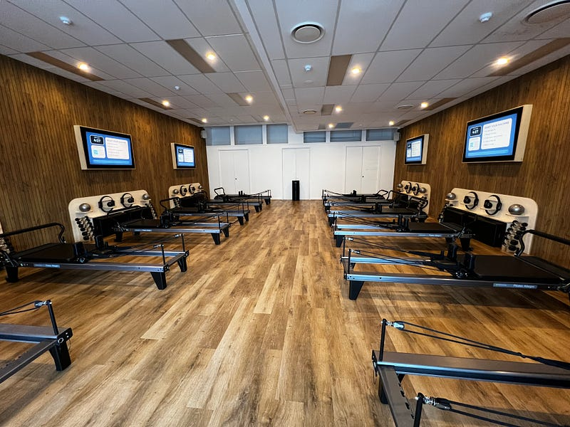
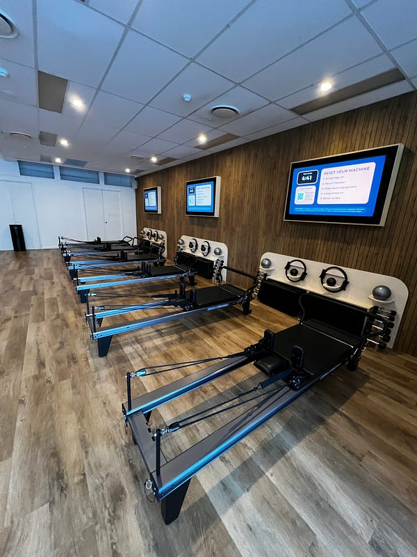
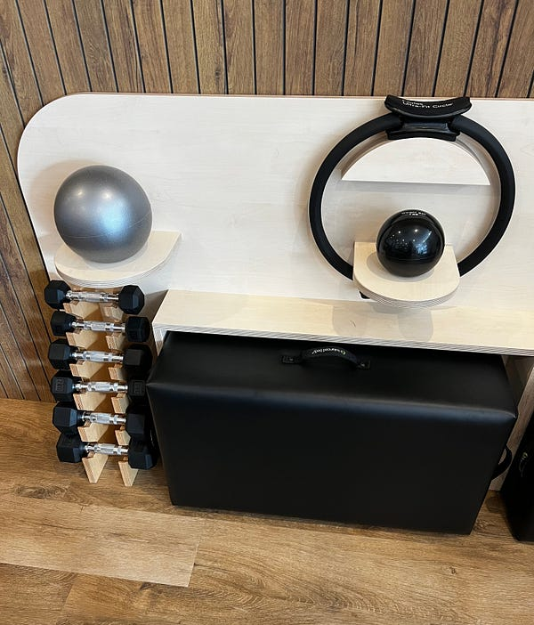
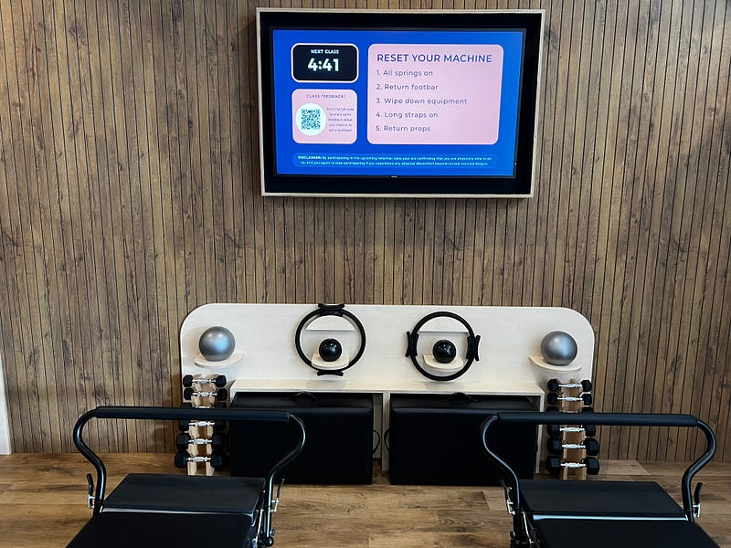
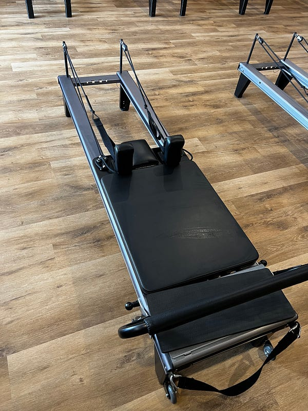
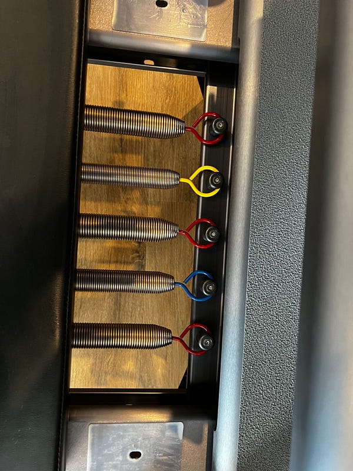

* * *

### 我在澳洲練皮拉提茲：Studio Pilates vs Pronto Pilates 課程比較

### 為什麼開始皮拉提茲 (pilates)

其實我這個人一向沒什麼運動習慣XD (雖是這樣說，我是個很目的導向的人。之前想要嘗試跑步，然後我就跑去跑了兩次半馬，一次是在黃金海岸的 Gold Coast Marathon，另一次是在雪梨的 Western Sydney Marathon)

前一陣子覺得自己每天都宅在家也不是個辦法，既不利於我的身體健康，也不利於我的心靈健康，於是我就開始尋覓運動課程，好讓我自己動起來。

一開始想加入健身房，但健身房通常都是會員制。入會時要先繳交一筆入會費 (在澳洲大約要 $60–100 澳幣不等)，每週的健身房費用約 $20–30 澳幣(便宜的)，貴的可能要 $50–70 澳幣，而且至少需要綁約一年，所以一年大約需要 $1100 澳幣 (22750 台幣)。我覺得自己才剛開始，也不知道這股熱情會持續多久，感覺還是挑一些不太需要就投入太多金錢的活動。

接下來想到瑜珈，查了一下在布里斯本一堂課大約 $18 澳幣 (372 台幣)，價錢還算可以接受，不過我想要強度比瑜伽稍微強烈一點的運動XD

於是我去上了一堂 F45 的體驗課，F45 是一種高強度間歇性訓練（High-Intensity Interval Training）的健身方法，也是一家全球性的健身連鎖品牌。F45 Training 的名稱中的 F 代表 Functional（功能性），45 則代表每次訓練的時間為 45 分鐘。F45 的特點之一是它提供多樣化的訓練課程，每堂課的設計都不同，以確保會員可以得到全面的身體鍛煉。課程通常結合了心肺適能、力量訓練和功能性訓練，以及高強度的間歇性運動，這有助於提高代謝率、燃燒卡路里，同時改善力量和耐力。

結果上了一堂 F45 後，我回家身體痛了一個禮拜XDDD

是那種痛到我覺得我好像肌肉拉傷了的那種疼痛，所以我也立刻打退堂鼓，覺得這個運動感覺好像不是太安全lol

最後我查到皮拉提茲這個運動，一堂的課程時間是 45 分鐘，感覺運動強度不是很高，但又可以訓練核心肌群，上了一堂體驗課之後我就決定加入了。

當時的我還是微軟的員工，澳洲微軟有個福利是每財政年度可以有 $300 澳幣的體適能 (fitness 補助)，剛好被我拿去購買 Studio Pilates 的課程，澳洲的財政年是 7/1 開始，所以我在微軟的九個月剛好橫跨了兩個財政年度，於是我總共拿了微軟的 $600 澳幣 (一萬二台幣) 去上皮拉提茲。真是感恩微軟～讚嘆微軟！

### 什麼是皮拉提茲

*皮拉提茲教室與器材*

皮拉提斯是一種以整合身體與心靈為目標的運動方式，由德國人約瑟夫·皮拉提斯（Joseph Pilates）在 20 世紀初所創立。這種運動方法強調控制、中心力量、流動性、精確度和呼吸的結合，以提升身體的平衡、柔韌性和肌肉力量。皮拉提斯會透過特殊的運動設備來進行，號稱即使是身體有傷痛的人，也可以透過器材的輔助，進行全面的鍛練，適合各個年齡層和體能水平的人。

皮拉提斯的核心概念包括以下幾點：

  1. **核心力量** ： 皮拉提斯強調發展身體的核心，即腹部、腰部和臀部的肌肉，有助於支撐身體的其他部分，提高身體的穩定性。
  2. **精確控制** ： 強調精確控制身體某部分肌肉來進行動作，避免無謂的擺動或是錯誤的用力方式，強調對身體的細微感覺和控制，有助於提高肌肉的控制力和協調性。
  3. **流動性** ： 透過一系列流暢、連貫的動作，以及平滑的過渡，來維持身體的靈活性。

*除了基本的 reformer 機器之外，還會有啞鈴、彈力環、彈力球等其他輔助道具*

### Studio Pilates 與 Pronto Pilates 課程比較

**收費方式**

上面說過我一開始加入的是 [Studio Pilates](https://www.studiopilates.com/studios/nundah-village/?gad_source=1&gclid=Cj0KCQiA3uGqBhDdARIsAFeJ5r2CUujP-StmP20NLy3Y8zWhSgelTR_ALCcpyb5EZADsGpHz51LXtq8aAjT8EALw_wcB)。他們有不同的收費方式，但簡單來說就是一次購買的堂數越多，每堂的價格就更便宜，我當初買的是 10 堂澳幣 $260 的課程，也就是一堂 $26 澳幣 (537 台幣)。Pilates Studio 的上課方式是每堂課都會有老師帶著同學一起做動作，如果動作做得不對，老師會從旁幫你調整。除此之外，每個人旁邊會有一台電視，所以聽不懂指示的話，也可以照著影片上的人依樣畫葫蘆。

微軟的補助經費用完之後，我覺得我真的還滿喜歡皮拉提茲這個運動的，但是一堂要 $26 澳幣真的好貴，於是我決定加入了第二間皮拉提茲教室 [Pronto Pilates](https://www.prontopilates.com.au/qld/northlakes/?utm_source=v_adwords&utm_medium=search&utm_campaign=brand_north_lakes&gad_source=1&gclid=Cj0KCQiA3uGqBhDdARIsAFeJ5r3_X28ZUGbAJ8Wf_mZzMzmqV-eJTheQMPH26BXe6CF_6K09RxRG4JgaAhY7EALw_wcB)，他們雖然也是會員制，但是不需要入會費，也隨時可以解約，無需罰款，我選的是一個月 11 堂課 $77 的課程，也就是說一堂課只要 $7 澳幣 (144 台幣)，真的是非常便宜！

但便宜是有原因的，Pronto Pilates 的課程是沒有老師指導的，也就是說你只能看著電視影片上的指示來做動作，也不會有人幫你調整動作。但自動化的好處是，Pronto Pilates 的課程時間非常多，一天可以有 23 個上課時段可以選擇，非常方便。

**暖身有無**

Studio Pilates 的課程設計裡是沒有暖身跟事後伸展身體的時間的，也就是說你的課程會整整上滿 45 分鐘，感覺比較值回票價！但是因為課程都是連續的，上完課之後下一堂課的同學立刻就會來，所以每次上完都覺得身體還沒舒緩過來就得走了，感覺就長期運動來說不是一個很好的方式。

Pronto Pilates 則是在課程的前後會加上兩個跟瑜伽很類似的暖身動作，我個人覺得比較有一種完整的開始跟結束感，但壞處就是有大概 5 分鐘的運動時間會被吃掉？我覺得各有利弊XD

**動作流暢度**

皮拉提茲的課程主要是透過這個黑色的 reformer 的器材輔助來進行。機器上面會有不同重量的彈簧（以顏色標示）。根據不同動作，以及每個人的身體強度，可以自由調整重量。

*Reformer 與彈簧*

Studio Pilates 的動作的連續性有時候設計的滿不流暢的，一下子做上半身、一下子做下半身，然後彈簧的強度有時候每個動作都要調一次，讓人有一種身體一直移來移去不知道在忙什麼的感覺XDD

相較之下 Pronto Pilates 的課程設計就做得非常好，每一個動作都是延續上一個動作，循序漸進，逐漸加強動作強度與複雜性。這點完全是 Pronto 大勝。

### 三個月後我有什麼改變

上完三個月課程的我，有什麼改變呢？前面說過皮拉提茲不同算是一個運動強度很高的運動，所以其實我沒有變瘦多少，大概就 1–2 公斤吧XD

但我覺得自己的體態有稍微變得更好，而且每次運動都會用到一些我自己從來沒有注意過的肌肉，隔天身體痠痛時會有一種「原來我昨天練的動作是練到這邊的肌肉啊」的發現，其實還滿有趣的。

另外因為一堂課只有 45 分鐘，所以也沒什麼壓力，就算中間有時候會覺得自己快撐不下去了，但其實撐一撐也就結束了XD

而且持續運動真的會讓人心情變比較好，也算是一個在家工作的人的好幫手。我通常都是約 5:15 分的課程，強迫自己五點一定要下班XDD

到目前為止我個人覺得還滿喜歡的皮拉提茲，所以應該會持續下去一陣子。

不知道看完以上分享大家有沒有什麼想法，在台灣或其他國家上皮拉提茲的感覺是怎樣？課程費用比澳洲貴或是便宜？也有這麼平價又自由的選擇嗎？ 歡迎留言跟我分享你的經驗～
