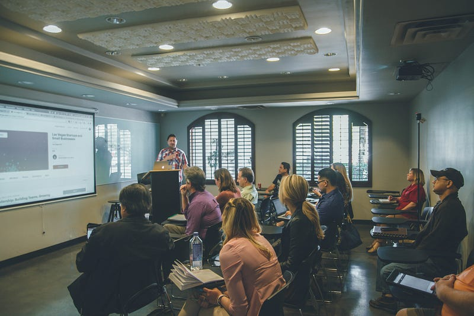Photo by [Kenny Eliason](https://unsplash.com/@neonbrand?utm_source=medium&utm_medium=referral) on [Unsplash](https://unsplash.com?utm_source=medium&utm_medium=referral)

### 前言

Tech meet-ups 是澳洲科技業非常盛行的活動，由主辦團體根據不同主題請講者來與大家分享任何技術、文化以及新知。你可以通過 [Meetups](https://www.meetup.com/lp/how-to-group-start?utm_medium=SEM&utm_source=google&utm_campaign=mmrk_adwords_orgacq_au_branded_ny23&utm_term=group&utm_content=lp_grp_v2&gclid=Cj0KCQiA0oagBhDHARIsAI-Bbgdp11Txnrid62gvvvBf09LPS1i95SDv497XJ2pROE7oMqmxORXPLmQaAhPdEALw_wcB) 網站來尋找自己有興趣的 meetups 聚會，他們同時也有手機 app 可以下載 — [Andriod](https://play.google.com/store/apps/details?id=com.meetup&hl=en-AU&pli=1) 及 [Iphone](https://apps.apple.com/us/app/meetup-social-events-groups/id375990038) 。如果想的話，你也可以號招志同道合的好友成立一個 meetup 團體喔～

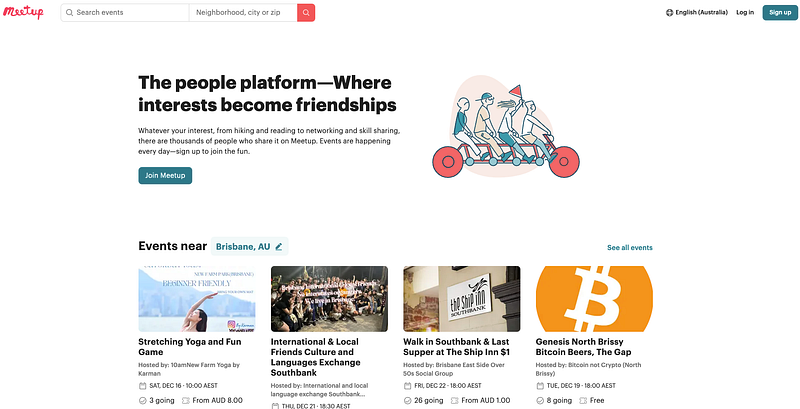Meet up website

Meetup 通常會提供食物 (大多是披薩) 以及酒水 (啤酒汽水等等) 給參加者，是一個非常好的 networking 機會 (或是你就想成去蹭一頓免費的晚餐也可以XD)。活動大部分都是免費的，只有少部分特殊活動需要事先付費。不管是你想要增進業界人脈、正在找工作或是剛到一個新的城市，我完全都會推薦大家多多去參與 meet ups。

以下就來跟大家分享我自己去過覺得不錯的 meet ups。有些團體會在活動前一兩週才會公布活動，所以建議大家可以先加入團體，之後有新活動的時候就會收到通知囉～

### 雪梨

  1. **Ｍuses Code JS:**[**https://www.meetup.com/en-AU/MusesCodeJS/**](https://www.meetup.com/en-AU/MusesCodeJS/)

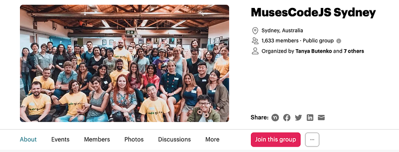

介紹：如果你是一個在科技界工作的女性或其他性別認同 (LGBTQ+) 的人，想要學習寫程式卻不知從何開始？或者你已經會寫程式了，但想要更深入地學習 JavaScript 和 Node? 想要擴大人脈，結識有共同興趣的新朋友嗎? 那麼這個群組正適合你。我們舉辦技術以及非技術工作坊，以協助你在 IT 職業生涯中成長，同時也幫助初學者踏入科技領域。

心得：算是我參加過最多次的 meetups，他們會不定期舉辦一整天的 JavaScript/Node 相關的 workshops，活動非常有趣，而且參與的人通常也滿多的。我有一次還自願成為 workshop mentor，協助 workshop 參與者解決學習寫程式上的問題，我覺得非常有意義。

**2\. Women Who Code Sydney:**[**https://www.meetup.com/en-AU/Women-Who-Code-Sydney/**](https://www.meetup.com/en-AU/Women-Who-Code-Sydney/)

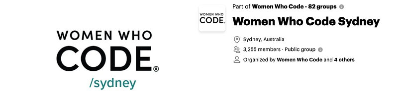 Ｗomen Who Code

介紹：Women Who Code 是雪梨最大、最活躍的工程師社群，致力於激勵女性在科技職業中取得卓越成就。我們期待這個世界能有更多女性在技術執行官、創辦人、風險投資家、董事會成員和軟體工程師等職位上發光發熱，我們團體成立的宗旨就是在於幫助更多女性達成這個目標。

心得：這是一個針對女性的 coding meetup，我去的那次是一個 hands-on coding workshop，可以現場學習寫程式並且跟其他對於科技有興趣的女生交流，我覺得非常不錯！

**3\. Ruby on Rails Oceania Sydney:**<https://www.meetup.com/en-AU/Ruby-On-Rails-Oceania-Sydney/>

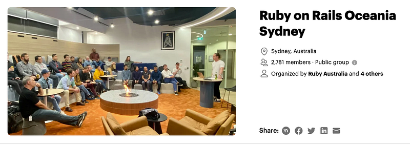

介紹：Ruby on Rails 開發者熱衷於開發一些最優秀、行業領先的網絡應用程程式。我們同樣熱愛我們的社群，並歡迎新成員加入我們這個擴大有趣的群體。我們在雪梨每月都會舉辦聚會，進行演講並討論有關Ruby on Rails、軟體開發的相關主題。

心得：這應該算是我去過最多次的 meet ups，剛從 bootcamp 畢業的那段時間我每個月都會去。這個 meet up 特別的地方是在活動即將結束前，他們會開放一個時間讓正在找工作的人上台自我介紹、宣傳自己，在場的其他工程師或是獵頭如果覺得適合的話，可能就會幫忙介紹工作機會。

**4\. Sydney CSS:**[**https://www.meetup.com/en-AU/sydcss/**](https://www.meetup.com/en-AU/sydcss/)

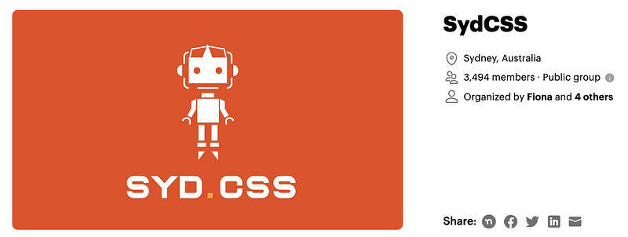

介紹：SydCSS 是雪梨唯一專注於 CSS 相關事物的團體。如果你想要深入了解 floats 和 flexboxes，或者了解 LESS 和 Sass 的區別，這裡就是適合你的聚會地點。我們會聚在一起討論最新的技巧和技術，所以如果您和我們一樣熱愛一切與CSS有關的事物，現在就加入我們的群組吧！

其實雪梨的 tech meet ups 團體非常非常多，我覺得如果我全部寫出來會累死XD，所以我就先列舉幾個，其他的就等著大家去發掘囉～

### **布里斯本**

  1. **ReactJS:**[**https://www.meetup.com/en-AU/reactbris/**](https://www.meetup.com/en-AU/reactbris/)

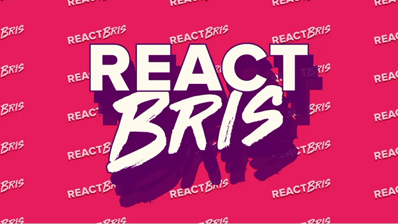 ReactBris Logo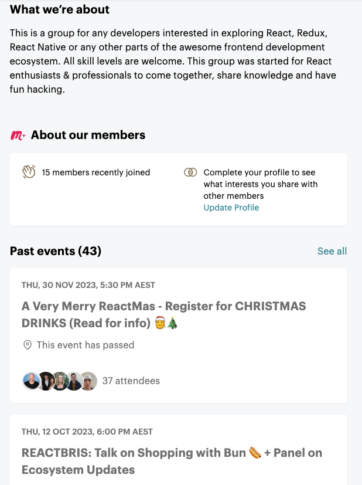ReactBris 介紹＆近期活動

介紹：這是一個對於 React、Redux、React Native 或其他前端開發生態系統中感興趣的開發人員的群組。這個群體是為 React 愛好者和專業人士成立的，讓大家聚在一起，分享知識，並一同享受開發的樂趣。

心得：這個團體目前成員超過兩千人，就我所知算是布里斯本網頁工程師最大的 meet up 團體之一。我去過兩次他們的活動都覺得還不錯，也在活動中認識了一些新朋友。

**2\. GDG Brisbane:**[**https://www.meetup.com/en-AU/gdg-brisbane/**](https://www.meetup.com/en-AU/gdg-brisbane/)

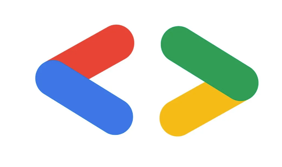 GDG (Google Developer Group)

介紹：GDG Brisbane 歡迎所有對學習 Android 以及 Google 相關開發技術有興趣的人，活動主題包括 Angular、Kotlin、Java、Flutter、Firebase、機器學習、虛擬現實、Google助手、可穿戴裝置和物聯網。

**3\. Brisbane AWS User Group:**[**https://www.meetup.com/en-AU/aws-brisbane/**](https://www.meetup.com/en-AU/aws-brisbane/)

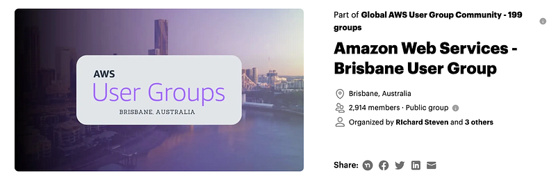

介紹：歡迎加入 Brisbane AWS 用戶群組！ 我們每個月舉辦的 AWS Meetup活動將為您敞開學習雲端技術的大門。Brisbane AWS 用戶群組是一個由 IT 專業人員、商業人士、創新者和企業家組成，我們對 Amazon Web Services 抱有極大的熱情。AWS 不斷挑戰我們以不同的方式來思考我們的工作，讓我們更大膽、更靈活、更有創造力。

心得：前前東家 AWS (Amazon Web Services) 布里斯本辦的 meet up 團體。活動通常是在布里斯本 AWS 辦公室進行，主題大多都是跟 AWS 雲端技術相關。辦公室位於市中心 30 樓，風景很好。因為公司大、活動經費多，我上次去覺得食物好吃 (是廚師外燴，而不像一般活動都只是訂披薩而已)，布里斯本 AWS 辦公室還有特殊的 beer tap （中文我不會說，但請看以下示意圖）。這個是布里斯本辦公室特有的，有機會去的人一定要體驗看看XD 就當作免費去參觀 AWS 辦公室也值得XD

beer tap 是意圖，圖片來源：<https://englishlive.ef.com/zh-tw/blog/english-in-the-real-world/bar-pub/>

另外因為是AWS舉辦的活動，所以去那邊可以認識很多在 AWS 工作的人，不失為一個更加了解 AWS 的方式。

**4\. Brisbane Azure User Group：**[**https://www.meetup.com/en-AU/Brisbane-Azure-User-Group/**](https://www.meetup.com/en-AU/Brisbane-Azure-User-Group/)

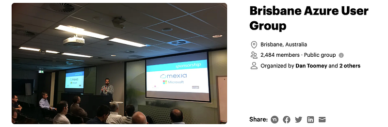

介紹：此社群旨在代表昆士蘭地區迅速增長的 Azure 社群，為大家提供一個聚會、學習、討論和探索Microsoft Azure平台的場所。聚會定於每月的第二個星期三晚上（6–8pm）舉行，地點將設在微軟布里斯本辦公室。大多數聚會將包括較短的技術分享和較長的深度技術會議，使我們有機會定期深入研究 Microsoft Azure 平台。

心得：介紹完前前東家就不能不介紹一下前東家微軟的 meet up 團體，基本上跟 AWS 類似，主題圍繞在 Azure 雲端技術。舉辦的地點也大多在微軟的布里斯本辦公室，因為微軟的布里斯本辦公室規模很小，所以辦公室本身不太值得期待，食物就是一般的披薩，酒還要從鎖上辦公室儲物間廚房拿出來XDD (辦公室本身不值得參觀，比一些小公司都不如XD) 不過一樣可以遇到很多微軟的員工，也是一個 networking 的好機會。

### **坎培拉**

  1. **Canberra AWS User Group:**[**https://www.meetup.com/en-AU/awscbr/**](https://www.meetup.com/en-AU/awscbr/)

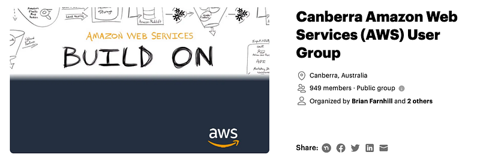

介紹：歡迎加入AWS坎培拉用戶組！我們致力於建立一個AWS用戶的社區，讓大家可以聚在一起，分享彼此的經驗，並從組內其他成員中學習。我們討論人們如何使用AWS，樂於聽取人們對平台喜歡和不喜歡的看法，並歡迎任何對AWS和雲計算感興趣的人加入我們！

心得：坎培拉的 AWS 團體，主辦人是我之前在 AWS 的 manager，請大家多多支持XD 活動多半辦在坎培拉 AWS 辦公室，但我記得他們同時也會在 twitch/YouTube 直播，所以也可以遠距參與。

### 結論

除了上述介紹的 meetup 團體之外，各個城市都還有更多不同的 meetup 團體等著大家去發掘！如果你們有什麼喜歡的 meet up 活動，也歡迎在下面留言跟我分享。

另外這篇文章以職場/科技業為切入角度，所以著重於 tech meet ups，但其實 meetup 上面有很多運動、嗜好甚至是聯誼相關的社團，是一個認識新朋友很好的渠道，歡迎大家多多嘗試。


