---

title: "斐濟自助旅遊 2022.10.10  Day 1: 初來乍到之這裡真的不是屏東嗎?"
date: 2024-01-30
slug: "2024-01-30-fiji-day-1"
cover:
  image: "images/medium-0*O5Bsg-U6NkTtsexS.jpg"
  alt: "雪梨機場航廈出發大廳"
  caption: "從雪梨機場出發"
images: ['images/medium-0*O5Bsg-U6NkTtsexS.jpg', 'images/medium-0*Ur3Ct6osVz0SMS2S.jpg', 'images/medium-0*xmZJL-rxSSvzti2d.jpg', 'images/medium-0*UViUUzYHR855trQG.jpg', 'images/medium-0*X1YPZ_byvFgy9vvY.jpg', 'images/medium-0*opxsp1CbN83N2ijw.jpg', 'images/medium-0*cyBcrR1JXVgt8jYA.jpg', 'images/medium-0*wHGn-BWg88cku4NP.jpg', 'images/medium-0*NCkv3nLUbqStxDQ-.jpg', 'images/medium-0*5qokt42-Vvfwjemf.jpg', 'images/medium-0*S_9Mv4N0NThC0zzU.jpg', 'images/medium-0*pDobfaSWYVpF9XWV.jpg']
categories: ["旅行紀錄"]
tags: ["旅遊", "斐濟"]
episodeseries: ["斐濟旅記"]
---

* * *

### 前言

2022 年九月我決定從 Amazon 離職。在開始我在微軟的新工作前，我幫自己安排了一趟斐濟行。當初會挑選斐濟作為目的地，是因為我年紀大了(?)，想挑選一個離澳洲飛行時間五個小時以內，又能提供放鬆形成的國家，於是斐濟就雀屏中選了。

在開始這趟說走就走的旅行之前，我在臉書上詢問有沒有朋友想要跟我一起，沒想到還真的有一位工作到很厭世的雪梨朋友 Christina，決定請假來跟我共襄盛舉XD

於是我的斐濟行程如下：

  * **10.10–10.14** : 一個人入住 Fiji 本島 Nadi 的飯店，在本島逛逛或是參加 day tour
  * **10.15–10.19** : 參加 Awesome Fiji 的 Island Adventure 5 Days | 4 Nights | 3 Islands 跳島行程，詳細行程請參考[這裡](https://www.awesomefiji.com/inclusive-packages/island-adventure/)
  * **10.20** : 19 號回斐濟本島 Nadi 住宿一晚，然後搭 20 號的飛機返回雪梨

### 航空公司

雖然我是在 Qantas 澳航網站上訂的票，但航班是 Jetstar 捷星的。出發前查了航班詳情才知道這班飛機沒有附餐，沒想到正當我在飛機上睡得迷迷糊糊時，空姐突然叫醒我跟我說，我的機票有附 $15 credit（看來透過澳航的網站訂捷星的航班還是有點好處?XD），於是就獲得了 chicken wrap $11 & orange juice $4（作為一個精打細算的台灣人，就是要迅速找出菜單上的 15 元最佳解XD）。

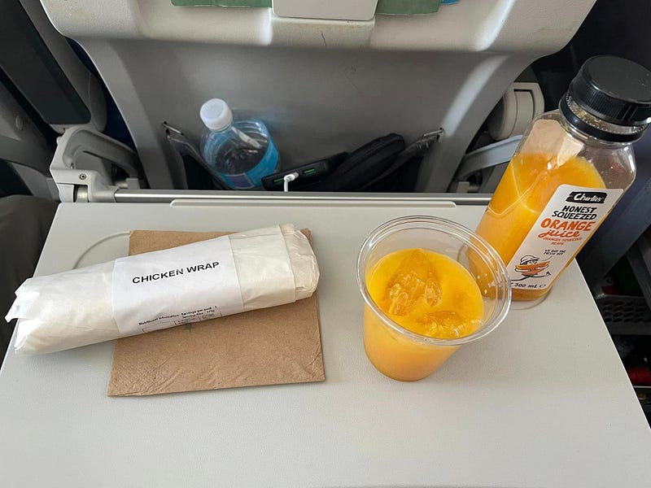

*飛機餐*

### 抵達 Nadi 楠迪機場

出發前我看了很多斐濟遊記，大家都說下了飛機後會有人唱歌迎接你，結果居然是真的！！！不過我抵達的時候，杯杯們唱了 20 秒之後就結束了，感覺非常想下班XD

出了 Nadi 機場之後，就看到外面有一些工作人員跟接駁車 (機場其實不大，很迷你)。

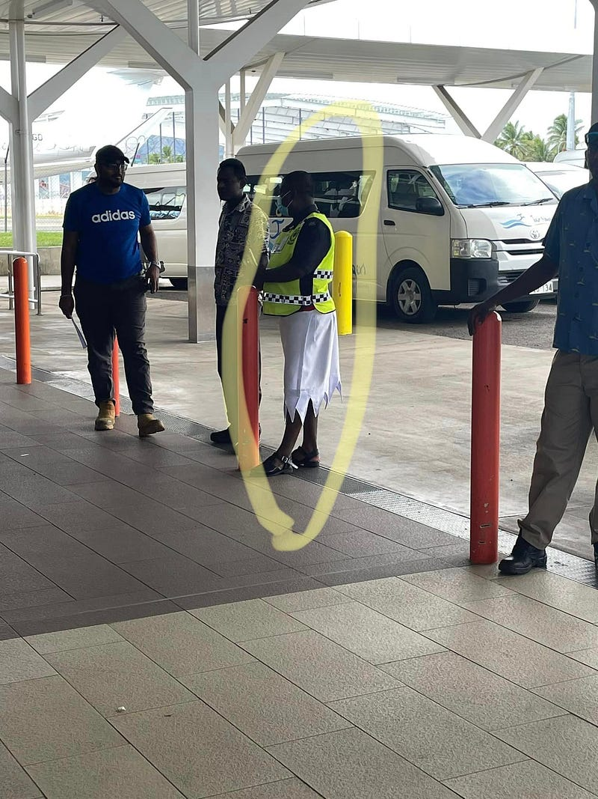

*這位杯杯是警察，穿著會不會太時髦*

我訂的 hotel 有免費的機場接駁車服務，上面寫說接駁車是 24 小時運行的，如果下飛機之後沒看到車，請耐心等候五分鐘。

於是我跟另外五個遊客就這樣等了半小時，等到機場人員跑過來說「你們有人有旅館電話嗎？」我立刻舉手表示「我有」，結果一打給旅館，他們說會立刻派車過來，然後五分鐘不到，車就來了⋯⋯傻眼貓咪，要打電話給你們，你們要說啊，讓我們幾個人在那邊空等lol

### TokaToka 旅館

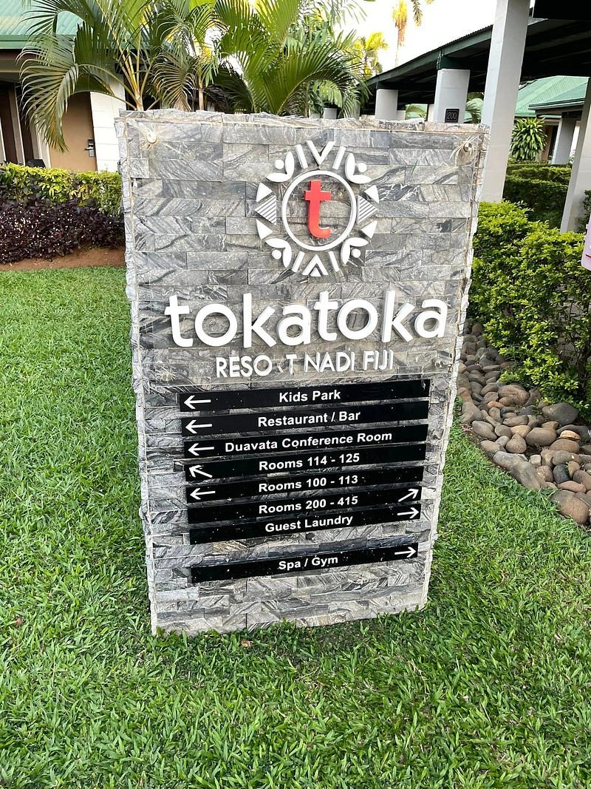

*Hotel Tokatoka*

在斐濟本島的住宿，我不小心訂了一個可以住四個人的 one bedroom villa lol  
我不知道訂房當下我在想什麼……這樣一晚要 $300，而且 villa 感覺好舊，好像我屏東阿嬤家XDD

### 巧遇斐濟國慶日

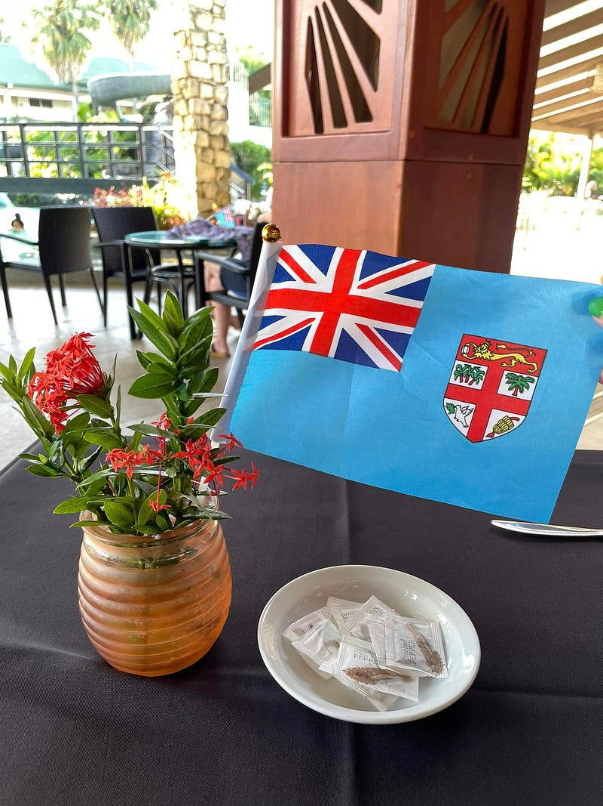

*可愛的斐濟國旗小裝飾*

去到旅館的餐廳之後我才知道 10/10 不僅是台灣國慶日，也還是斐濟國慶日！只可惜他們的慶祝活動到下午兩三點就結束了，來不及參加。

但我覺得還是值得點一杯調酒來慶祝這趟旅程的開始，於是我點了一杯 Blue Heaven，把傳照片給朋友看後立刻被吐槽說「這個顏色看起來一點都不像 heaven，為什麼 heaven 上面要有紅色？」我覺得她說得真是太有道理XDD

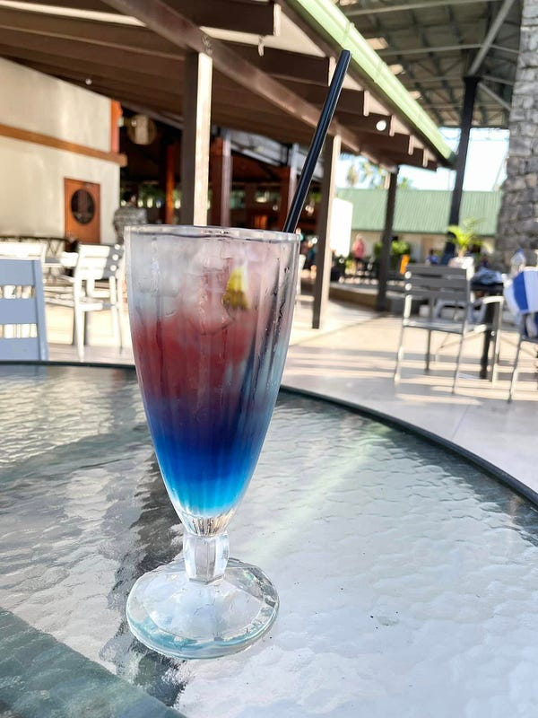

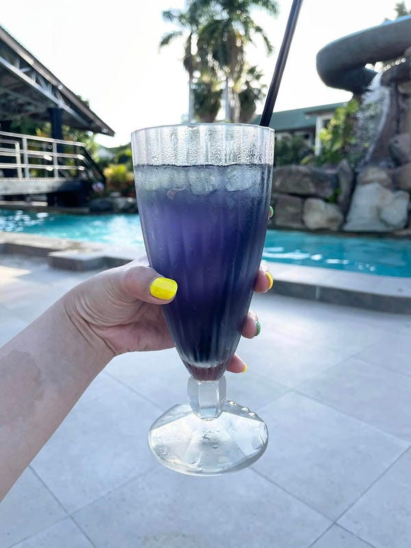

*Cocktail: Blue Heaven。攪拌完之後就更黑暗，更不 heaven 了XD*

在斐濟的第一餐我點了一個披薩，上菜的時候真是巨大無比，但是味道極其一般！看來網路謠言說斐濟的食物很難吃，是真的！連這種充滿起司與熱量的食物都只能做成這樣，感覺其他食物也是不用期待了？

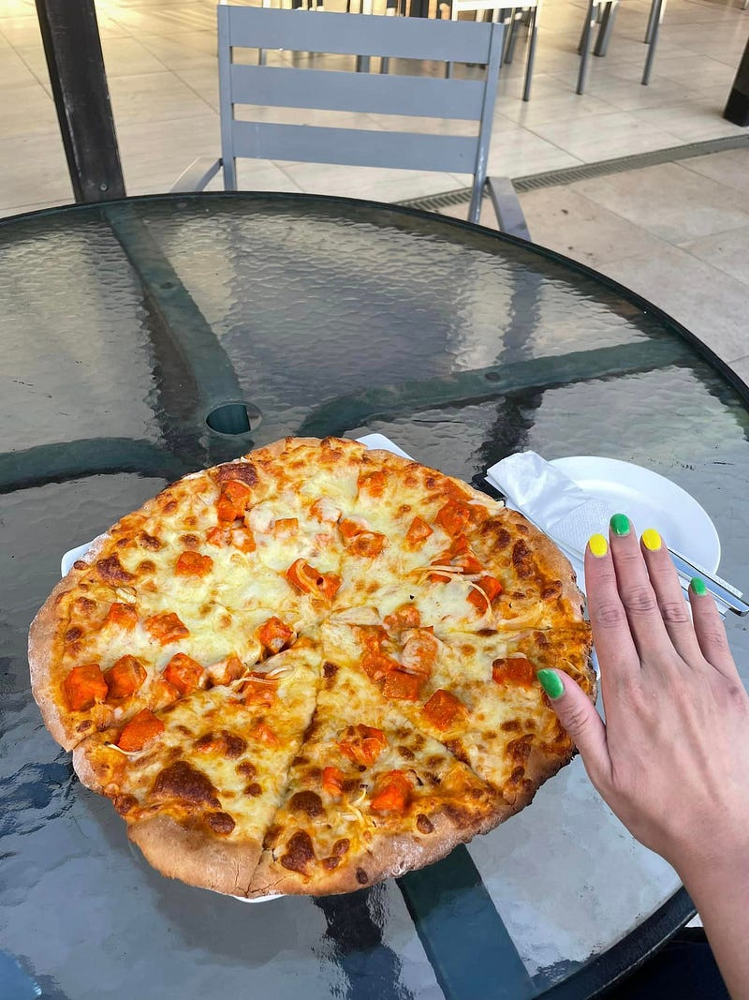

*這趟旅行我特地做了美甲，手指甲為綠色跟黃色交錯。腳指甲則是淺藍色，因為我覺得這三個顏色就是我內心對於熱帶島嶼的想像XD*

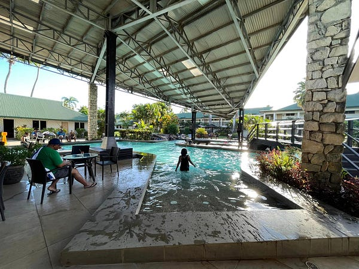

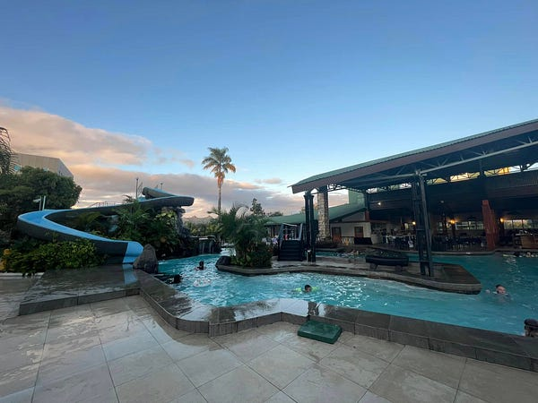旅館泳池

這是一個非常適合家庭旅遊的旅館，泳池裡還有划水道，超可愛！

吃飽喝足後我在斐濟旅館外繞了一圈，頓時覺得這裡就是屏東啊！

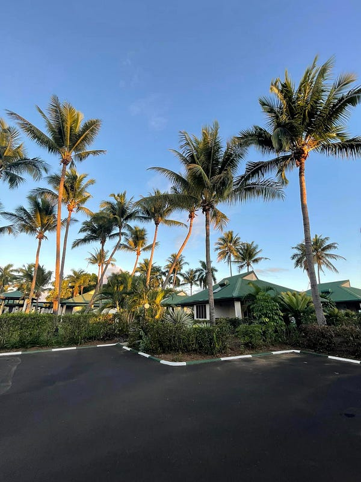

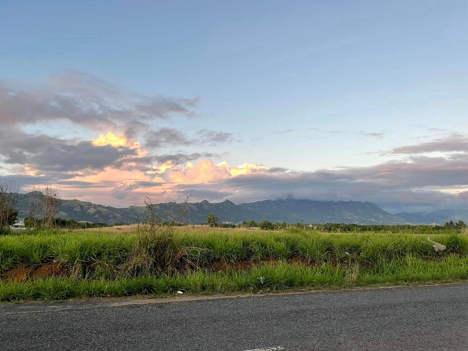Tokatoka Hotel 周遭

看看這椰子樹，難道不是屏東嗎？然後外面的道路也很像屏東鄉下，連山看起來都像是大武山哈哈哈哈

總之，這就是我的斐濟之行第一天，接下來也會繼續發表我的斐濟遊記，請大家多多支持XD
