---

title: "斐濟自助旅遊 2022.10.11 Day 2: 珊瑚海岸 (Coral Coast) 一日遊"
date: 2024-01-30
slug: "2024-01-30-fiji-day-2"
cover:
  image: "images/medium-1*oy2wFfSBokqmqWVICGWdLw.jpg"
  alt: "斐濟自助旅遊 2022.10.11 Day 2: 珊瑚海岸 (Coral Coast) 一日遊"
  credit:
    photographer: "Giorgia Doglioni"
    photographer_url: "https://unsplash.com/@gio_aroundtheworld"
    photo_url: "https://unsplash.com"
images: ['images/medium-1*oy2wFfSBokqmqWVICGWdLw.jpg', 'images/medium-1*lQQDZ9d75S-w1F47tWt-Zw.jpg', 'images/medium-1*pR_hCUL162C3Qx7wGHTGFw.jpg', 'images/medium-1*OaA-O_K5Enslu7bk6qFmvw.jpg', 'images/medium-1*R6vrFO3Lih5AYNxLKPGDkA.jpg', 'images/medium-1*68-6whc9cjMou1308Lj0JQ.jpg', 'images/medium-1*maKJl591iSb1XH8bd3q3Aw.jpg', 'images/medium-1*erAhDxsH19rd-y0Fk6-Jpg.jpg', 'images/medium-1*4Ar0XAYW7or1rjElNGF78g.jpg', 'images/medium-1*ME6HFCkpu4PTV4WcvrjqqA.jpg']
categories: ["旅行紀錄"]
tags: ["旅遊", "斐濟"]
episodeseries: ["斐濟旅記"]
---

1 斐濟幣 = 0.68 澳幣 = 14 TWD

這是 Tokatoka 飯店的早餐，很普通，這樣一人還要 20 斐濟幣，也就是 280 台幣 (好險我的房間是含早餐的，不用再額外付錢)。

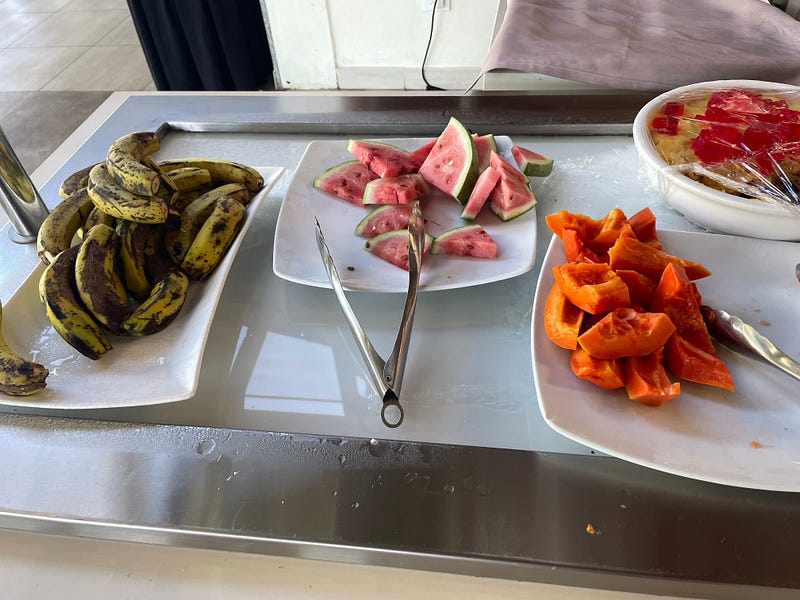

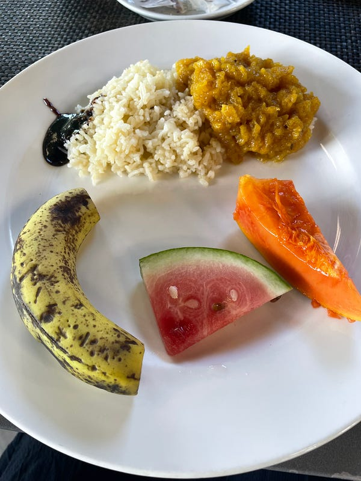

我今天的行程是去 Nadi 市區閒晃，然後回飯店按摩跟玩滑水道。出發前我稍微查了一下，大家對斐濟的治安好像還是有點疑慮，大眾交通工具不是太可靠，因此我這次完全沒有調查大眾交通方式，而是選擇搭乘計程車前往。

### 來自計程車司機的忠告

飯店幫我安排的計程車司機是個有趣的人，而且他的車，真心有夠破舊 (是卡帶機的那種類型，而且操作介面是全日文，我懷疑這可能是日本的報廢車)！

司機先生警告我說，在市區逛街的時間，任何主動打招呼邀請我進去的店家，我都不要進去 (因為這些人都是準備削觀光客一筆的)。我想逛街的話，直接走進去任何我想逛的店就好。我後來的確就是看當地人都去逛哪家店，我也就跟著走進去XD

司機還勸我不要吃斐濟食物 (Fijian food)，如果要吃東西的話，盡量吃一些美式漢堡、義大利麵之類的，我問說為什麼？他說「因為你吃了會拉肚子」XDDD 最後我午餐吃了感覺最安全的炸雞跟薯條 (我真的很聽話哈哈哈)。

後來發現美食街裡居然還有一間珍奶店，我立刻點了一杯斐濟珍奶！

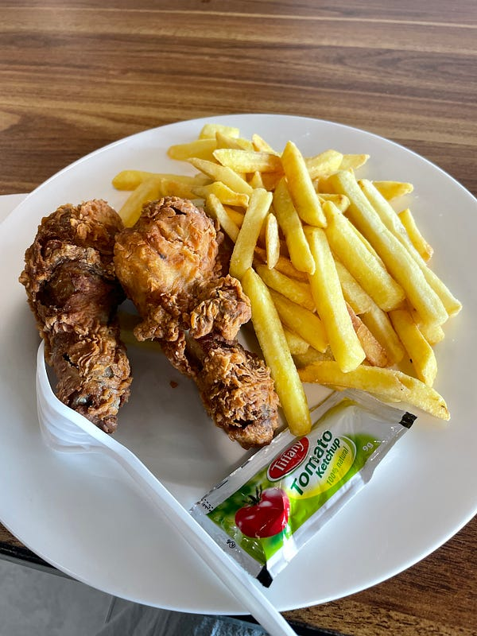

*炸雞與珍奶*

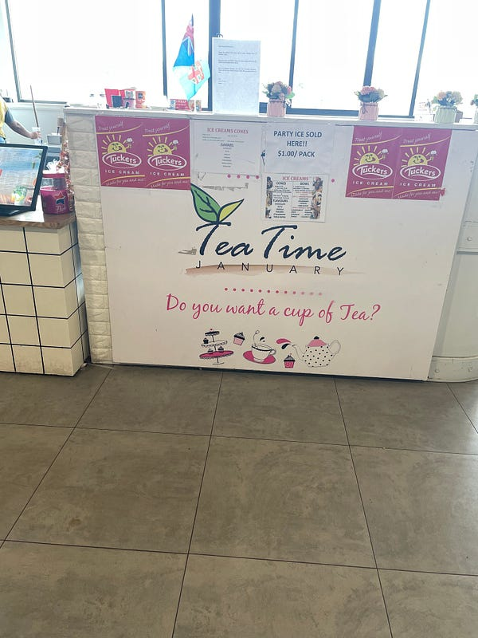

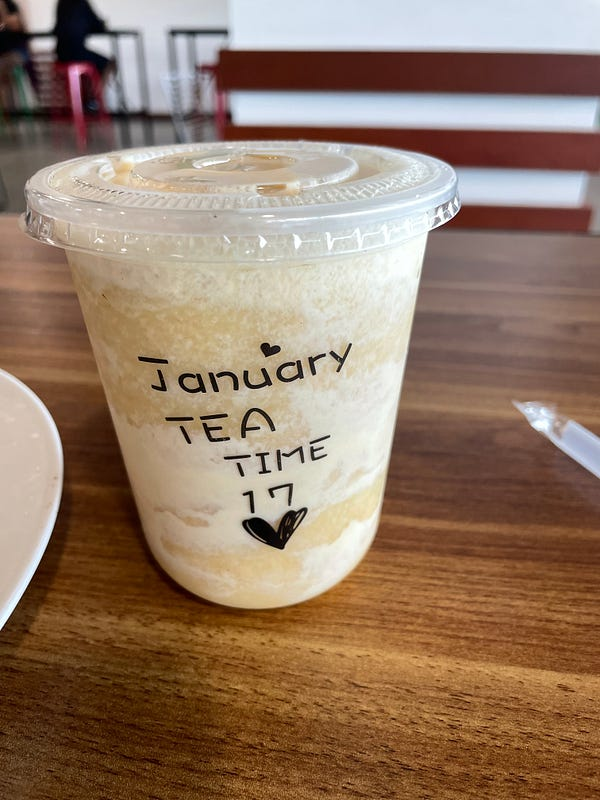

*事過境遷，我真的忘了我當初點什麼了，應該也沒有太好喝XD*

### 差點遭遇詐騙(?)

然後我也的確差點遇到詐騙(?)，好險我早上出門前剛好看到了這篇遊記<<[斐濟市區 Nadi 讓我好怕怕](https://flower32077.pixnet.net/blog/post/343213709?fbclid=IwAR249IxAKtUDcdOWbYHaEAYQSs4m9OlMEeVQvTKSc4LyitjCK0w3fPeLt2g)>> ，完全增加了我的警覺心！（這趟說走就走的旅行，我出發前真的沒有做太多功課XD）

事情是這樣的，我一個人走在路上到處走走，然後突然有一個人跟我打招呼並跟我說「來斐濟就是要逛當地的市集」(以下對話都是英文)，我說「喔喔好好謝謝」完全想要立刻結束對話XD

接著他說市集就在前面路口那邊，我指給你看，然後就把我引進了一家藝術品店，說他是個藝術家，然後問我說要不要體驗斐濟當地的歡迎儀式（喝泥土水 Kava），因為這個劇情實在跟那篇遊記太像了(也是被藝術品店老闆拐進店裡，然後問要不要喝 Kava 水)，我心中立刻警鈴大響，直接說「喔喔，謝謝你，但我趕時間，所以不用了，我朋友在 chicken express (我隨便說了一間我剛剛走在路上看到的速食店名稱) 等我，我先去找她，然後我們一會再回來逛」，然後我就順利脫身了XD

### 市區行程

我對斐濟市區的印象就是，其實還滿像 50 年前的台灣的 (感覺啦，我其實也不知道 50 年前的台灣長怎樣XD)，有一種很鄉下的都市感，不過因為觀光盛行的緣故，招牌大多都是寫英文，有一些在澳洲常見的銀行跟手機行在這邊也有開分店，所以有時候真的會覺得沒有出國感。

而且我覺得斐濟的物價感覺也沒有特別便宜，大概就是澳洲物價的 7 折吧，所以如果大家想要去一個便宜的海島國家度假，我可能會比較推薦泰國XD

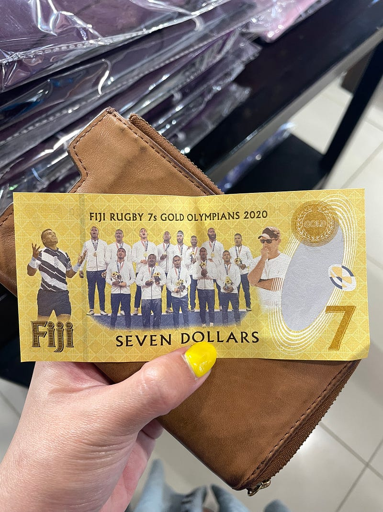

*斐濟居然有 $7 的紙鈔，超有趣！看描述應該是斐濟橄欖球隊的紀念版*

### 再度回到計程車司機

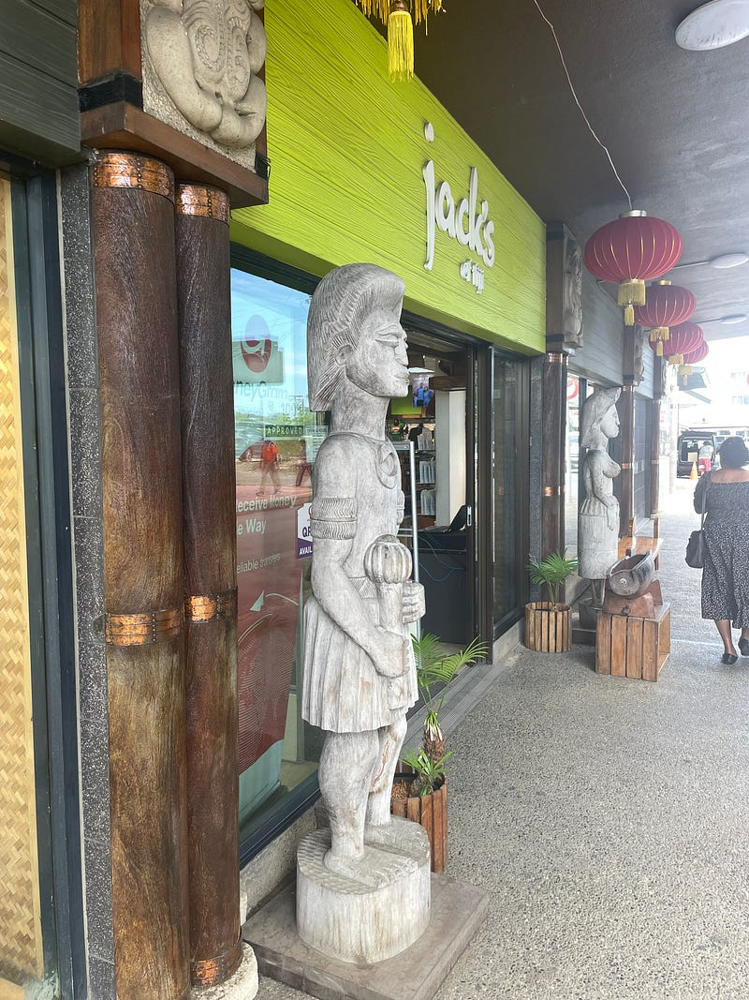

*市區的禮品店*

這裡要提一下，司機放我在市區的禮品店下車後，他居然連錢也不收，說他等一下回來接我的時候再一起付就好，司機真的不怕我回來不找他嗎? 而且我根本沒有斐濟的手機號碼，於是計程車司機把他的電話寫在一張紙上給我，然後跟我說「你想回飯店的時候再把紙條拿給紀念品店的店員，他們會幫你打電話給我」。我當下心中真的是充滿了滿滿的困惑XDDD

不過回程的時候我的確也就是走回那些禮品店，店員也很好心的幫我打電話給計程車司機，然後他真的也是秒速就出現來接我了。這一趟來回我付了 40 斐濟幣 (27 澳幣，$560NTD)，對於在澳洲生活的我來說，完全很便宜，但對於司機來說，是否已經賺了一大筆了呢? 感覺斐濟的人均 GDP 不是很高呢?

### 飯店行程

回到飯店之後，立刻來個按摩行程。

不得不說飯店的按摩小屋裝潢氣氛還不錯～

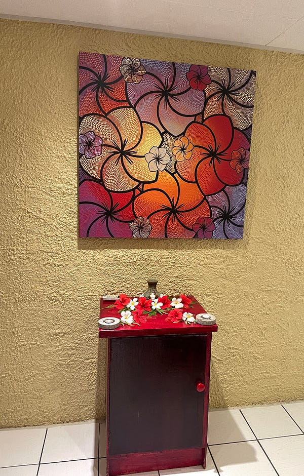

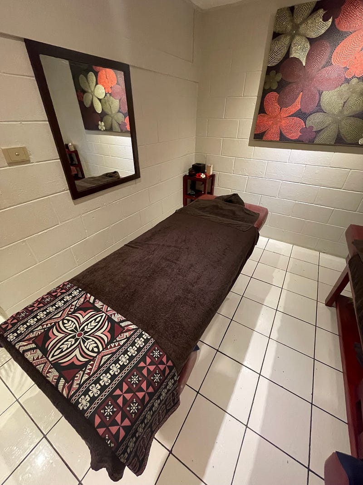

*飯店的按摩小屋*

飯店的泳池還有滑水道，小朋友們玩得超級開心的！我自己也上去滑了一次體驗一下～

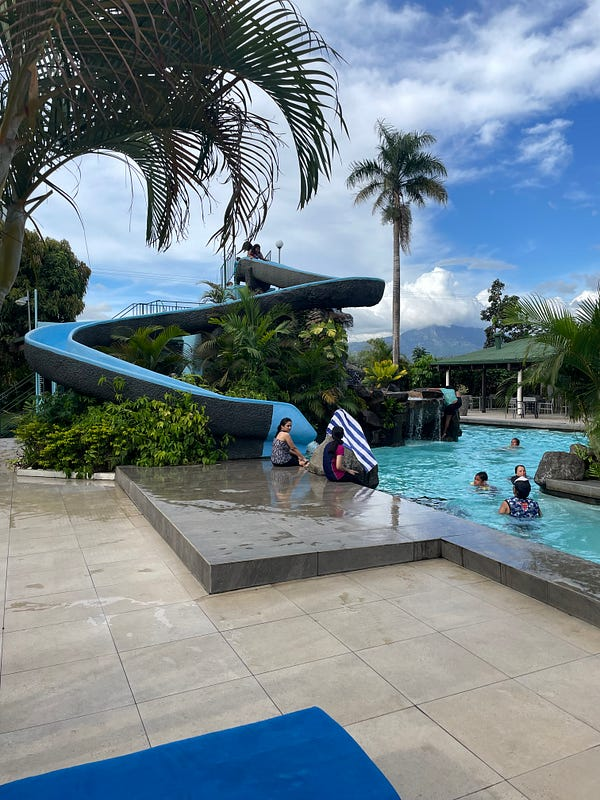

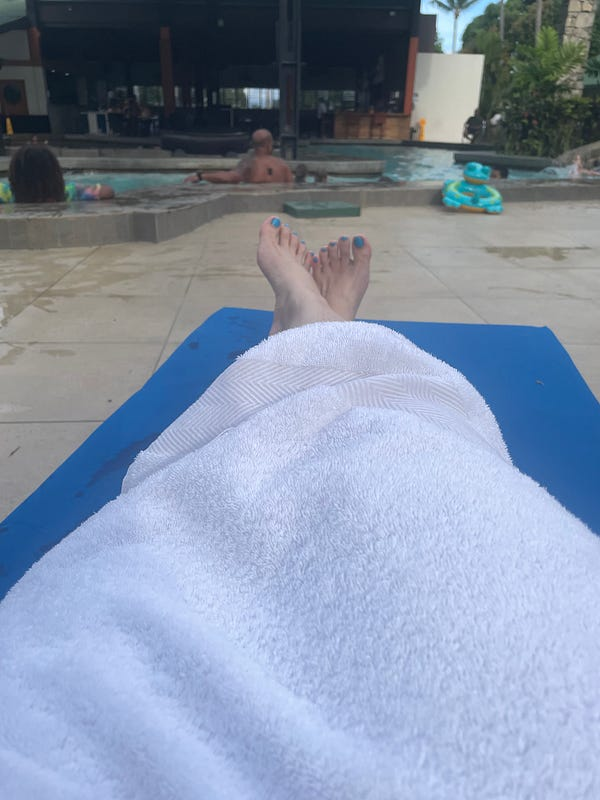

*Tokatoka Hotel 的泳池設施*
