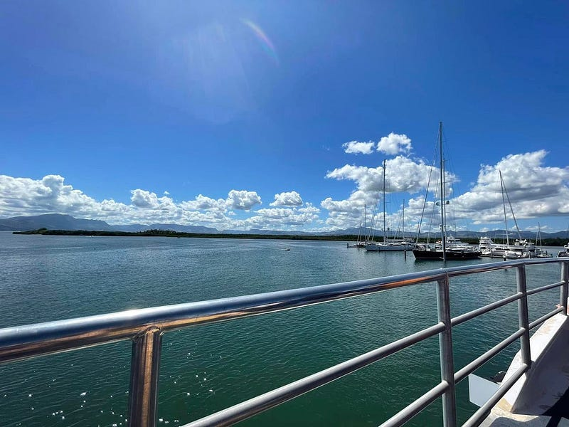
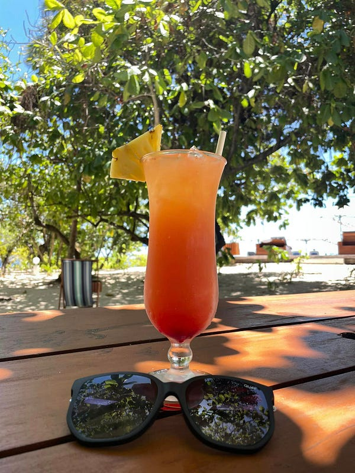

* * *

### 2022.10.12 斐濟自助旅遊 Day 3: Malamala Island

Photo by [jcob nasyr](https://unsplash.com/@j_cobnasyr1?utm_source=medium&utm_medium=referral) on [Unsplash](https://unsplash.com?utm_source=medium&utm_medium=referral)

* * *

我突然發現斐濟人講話喜歡講兩次XD 例如我的旅館叫 Tokatoka，這個島叫 Malamala Island～哈哈

準備登船前往 Malamala~

準備登船出海

途中必須再度炫耀一下我的美甲！Malamala 就是這個一個很圓的小島

美甲與排隊登島的遊客

我超級推薦這個小島的！因為這裡水超清澈無雜質，站在 jetty 上就可以看到底下的各種魚！

島上還有無邊際游泳池，跟各種免費的水上活動裝備租借，包含浮淺、獨木舟跟 SUP (stand up paddling)！我除了喝雞尾酒、按摩、玩水之外就是在各個角落睡午覺，太爽了！

食物無敵好吃、調酒無敵好喝！

這兩杯調酒的好喝程度都跟 Tokatoka 旅館不是同一個等級的

按摩區在海邊，可以一邊聽海浪聲一邊按摩。

服務人員的態度也超級無敵好，我甚至看到他們幫忙遊客夫婦帶小孩，讓遊客可以毫無牽掛地進行各種行程，我強力推薦大家一定要來！


