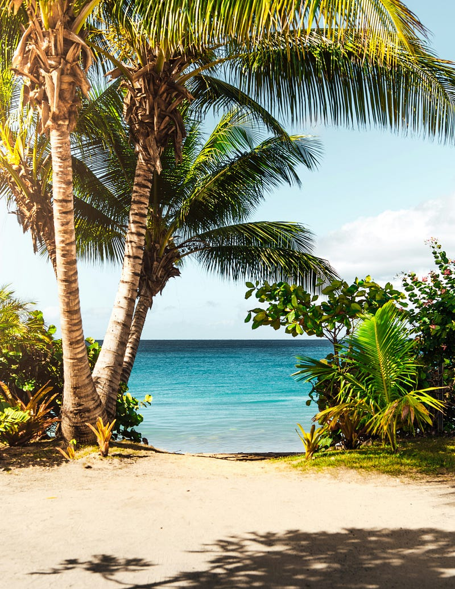
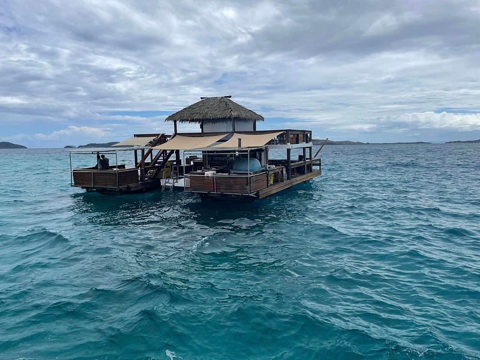
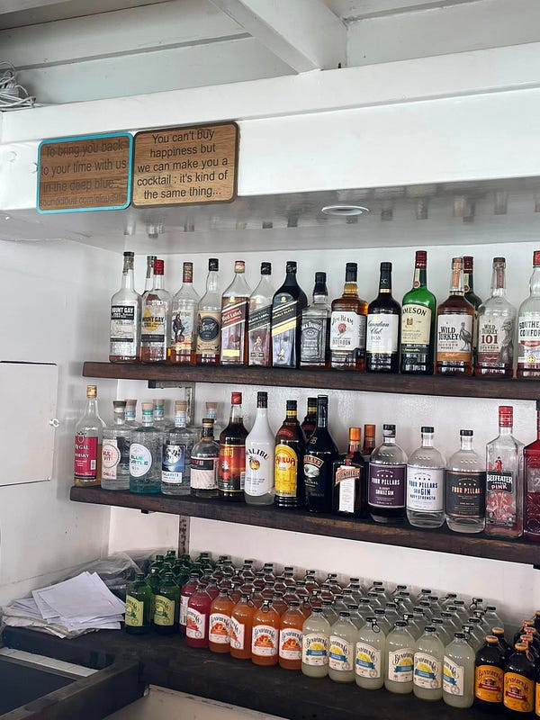
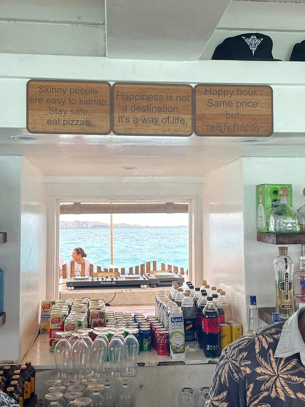
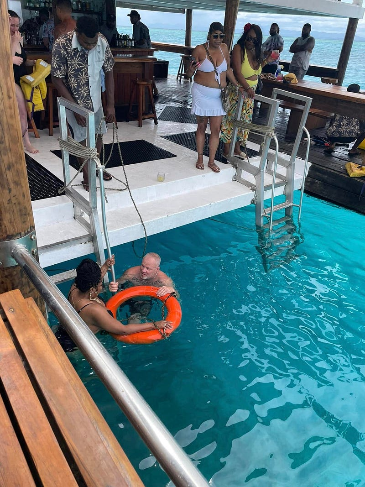
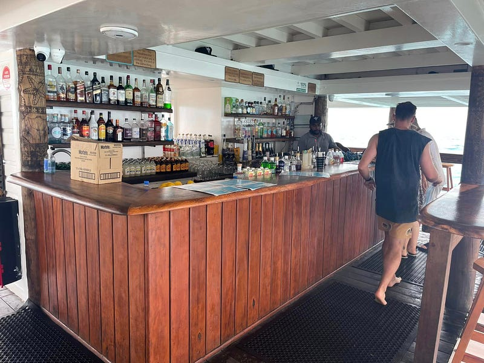
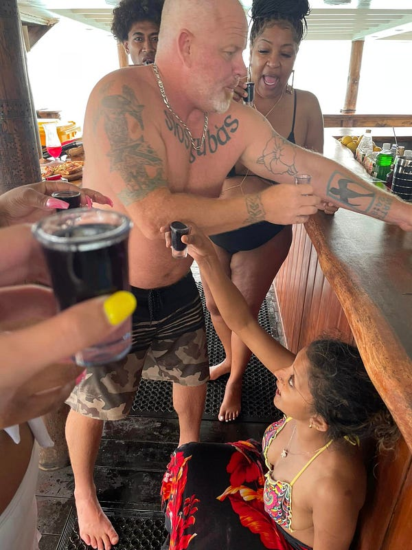
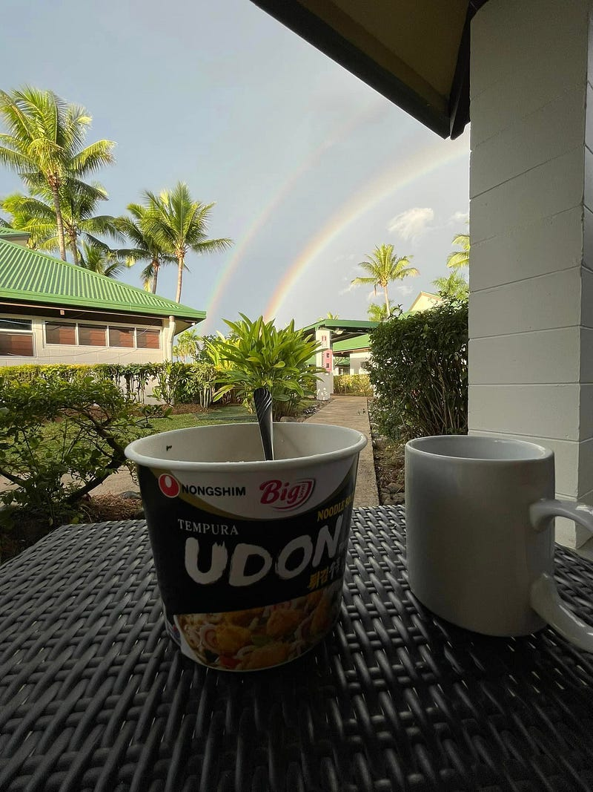

---

### 2022.10.13 斐濟自助旅遊 Day 4 — 斐濟最棒的海上酒吧 Cloud 9

Photo by [Matthew Brodeur](https://unsplash.com/@mrbrodeur?utm_source=medium&utm_medium=referral) on [Unsplash](https://unsplash.com?utm_source=medium&utm_medium=referral)

* * *

Cloud 9 這個酒吧在離本島搭船1小時的海上，它其實不是一個島，而是一個浮在海上的動力艇。

Cloud 9 號稱是斐濟必訪景點，不知道是不是因為今天陰天的關係，我完全覺得還好，同樣價錢真心不如去 Malamala Island (不過 Cloud 9 是派對動物的行程，小朋友是不能參加的，想要避開/丟掉小孩的人倒是可以考慮XD)

酒吧本人長這樣

Bar 裡面有很多有趣的標語XD

我覺得 Cloud 9 好玩的地方在於跟你一同前往的遊客！我遇到人超好的美國大叔 Travis、他的斐濟女友 Reshmi，還有我的斐濟小 gay 蜜 Kusitino。

Travis 人完全好到爆表，我們只是隨口閒聊到說我想要去「跳海」（從酒吧二樓跳進水裡，真的是跳海)，但我又沒有信心（底下真的就是海底)，他立刻說他可以游過去下面等我。

跳海大概長這樣：

[** _2022.10.13 Fiji Cloud 9 Bar - 1_**  
2022.10.13 Fiji Cloud 9 Bar - 1youtube.com](https://youtube.com/shorts/J33ff7368ZQ?feature=share)

還有集體跳水版

我跳下去之後全船鼓掌ＸＤ

然後 Travis 帶著救生衣讓我當浮板，最後我也沒有自己游回來，是他推我回來的哈哈哈！我要請他喝酒他也不要！除了我之外，他還教了其他幾個遊客游泳跟浮潛。有人溺水，他也第一個跑過去救（是真的有人穿救生衣溺水，how did that happen? lol)

Travis 教黑人媽媽游泳中

他女友 Reshmi 人也超好，知道我跟小gay蜜都是自己來後，立刻就叫我們跟著他們玩。然後這個女生也是很瘋，她後來狂叫shots 請大家喝，然後瘋狂招呼所有人。我嚴重懷疑他們該不會是酒吧老闆吧(誤~ 但酒吧老闆據說是印度人啦)

後來直接在酒吧狂喝 shots

船上還有一群 black mamas，最會帶氣氛就是他們，其中一個人還跟我說她帶著她的歌單去叫 DJ 播她的歌XD

總之大家人都很好，會互相幫忙，有個 Aussie 姐姐還跟我說她剛剛在海中尿尿（不是，這種事你為什麼要告訴我? 讓我當一個無知的人不好嗎XDD）

回程的船上大家簡直玩瘋了，狂跳舞！而且回程下大雨、海況超差，簡直是「乘風破浪」，浪大到你會整個人失重的那種

[** _2022.10.13 Fiji Cloud 9 Bar - dancing on the way back_**  
2022.10.13 Fiji Cloud 9 Bar - dancing on the way backyoutube.com](https://youtube.com/shorts/XjGFWvc8qCk?feature=share)

我覺得我今天最大的成就除了跳了水，就是在沒吃暈船藥又喝了一堆酒的情況下，成功回到旅館。最後還在旅館看到難得一見的雙彩虹，真的覺得自己很幸運！

在下雨天吃亞洲泡麵配雙彩虹，人生不能再更完美了！


