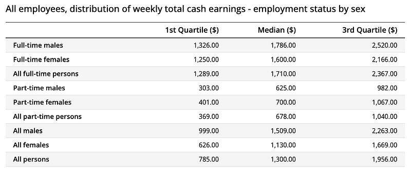
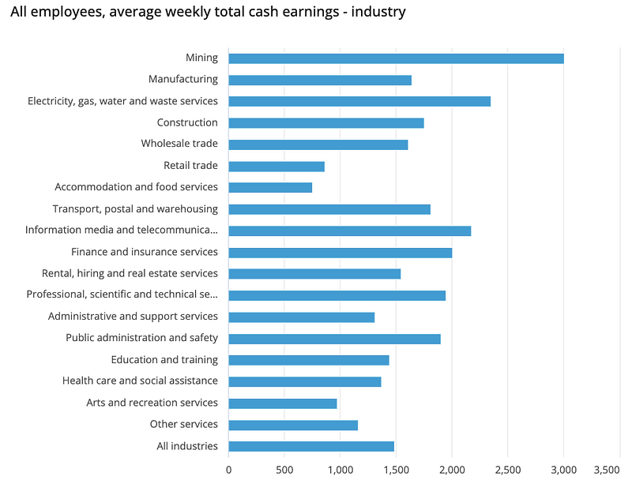
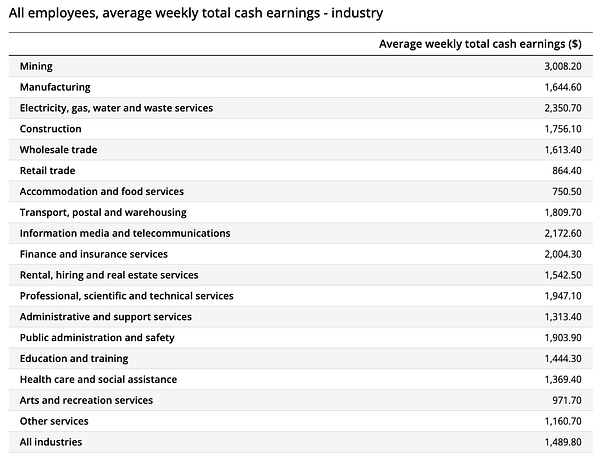
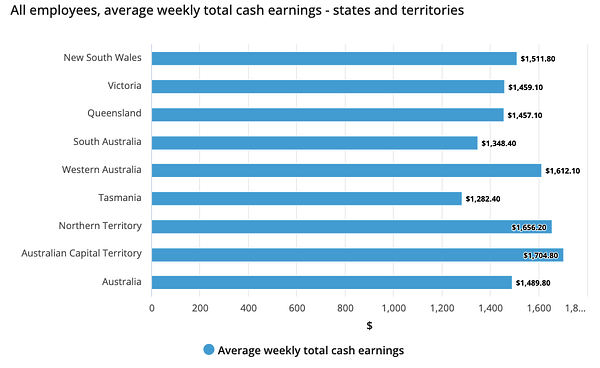
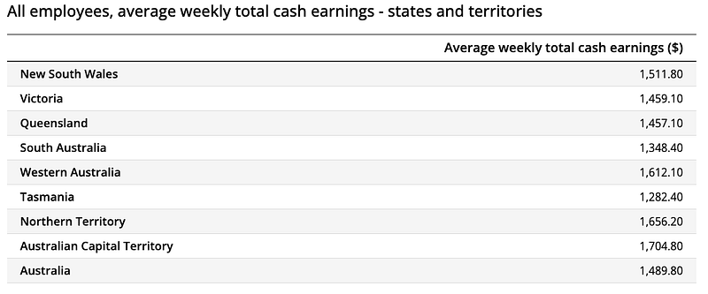

近期發現我跟友人對於澳洲工程師的薪資看法居然略有出入，於是我想與其使用個人經驗來判斷一個職位的薪資是否合理，不如我們就來參考一下澳洲統計局的數據吧！

以下是澳洲統計局 ABS (Australian Bureau of Statistics) 發表的全澳薪資統計數據，有興趣的人可以直接閱讀官方連結，下面我會挑一些我個人覺得特別具有代表性或是特別有趣的數字跟大家分享～

  * [**Employee Earnings and Hours, Australia, May 2023**](https://www.abs.gov.au/statistics/labour/earnings-and-working-conditions/employee-earnings-and-hours-australia/may-2023)
  * 資料來源： 澳洲統計局 ABS (Australian Bureau of Statistics)
  * 發表日期： 2024.01.24 (統計時間 2023.05)

### 薪資中位數

*澳洲薪資中位數*

澳洲人的薪資中位數(包含全職與兼職)為每週 1,300 澳幣(約 26748 台幣)，其中男性為 1,509 澳幣 (約 31058 台幣)，女性為 1,130 澳幣(約 23257 台幣)。 也就是說澳洲人的年薪中位數為約 67,600 澳幣(約 140 萬台幣)。

澳洲時薪最高的職業是經理（67.20 澳幣/小時，約 1,378 台幣/小時）和專業人士（60.60 澳幣/小時，約 1,243 台幣/小時），以每週工作 40 小時，每年工作 52 週，換算成年薪的話：

  * 經理：年薪約 140,160 澳幣（約 2,881,880 台幣）
  * 專業人士：年薪約 125,856 澳幣（約 2,584,380 台幣）

以台灣人最關心的全職薪資統計來說（男女合計）：

  * **PR 25：每週 1,289 澳幣，年薪約 $67,034 澳幣（約 $137 萬台幣）**
  * **中位數 (PR50)：每週 1,710 澳幣，年薪約 $88,830 澳幣（約 $182 萬台幣）**
  * **PR 75：每週 2,367 澳幣，年薪約 $123,096 澳幣（約 $250 萬台幣）**

### 產業薪資分布

澳洲產業薪資分布

接著讓我們來看一下澳洲各個產業的薪資表現，很明顯可以看到礦業以每週 $3008.2 澳幣獨佔鰲頭，第二名是水電瓦斯垃圾處理業每週 $2350.7 澳幣，第三名則是 IT 通信產業每週 $2172.6 澳幣。

  1. 礦業：年薪約 $156,665 澳幣 （約 $321 萬台幣）
  2. 水電瓦斯垃圾處理業：年薪約 $122,685 澳幣 （約 $251 萬台幣）
  3. IT 與通信產業：年薪約 $113,059 澳幣 （約 $231 萬台幣）

倒數三名則是：

  * 倒數第三：藝術與休閒服務年薪約 $50,587 澳幣 （約 $103 萬台幣）
  * 倒數第二：零售業年薪約 $44,972 澳幣 （約 $92 萬台幣）
  * 倒數第一：住宿與食品業年薪約 $39,022 澳幣（約 $80 萬台幣）

### 各州/領地的薪資分布

*澳洲各州/領地薪資分布*

全澳的每週薪資為 1,489.80 澳幣，其中以首領地 1,704.80 澳幣最高，西澳與北領地分別以每週 1,656.20 澳幣跟 1,612.10 澳幣緊追在後。

但其實除了南澳 1,348.40 澳幣和塔州 1,282.40 澳幣的薪資明顯較低之外，新州（雪梨）、維州（墨爾本）、昆州（布里斯本）都在每週 1,500 澳幣上下，並沒有太明顯的差距。

以下數字為澳幣年薪/台幣年薪：

  * 全澳平均：約 $77,427 澳幣（約 $159 萬台幣）
  * 首領地：約 $88,339 澳幣（約 $181 萬台幣）
  * 北領地：約 $86,073 澳幣（約 $176 萬台幣）
  * 西澳：約 $83,803 澳幣（約 $172 萬台幣）
  * 南澳：約 $70,008 澳幣（約 $144 萬台幣）
  * 塔州：約 $66,348 澳幣（約 $136 萬台幣）
  * **新州（雪梨）、維州（墨爾本）、昆州（布里斯本）：約 $78,000 澳幣（約 1,602,900 台幣）**

### 結論

這個調查結果算是符合我之前看過的很多新聞報導：澳洲人全職的年薪中位數大概是澳幣九萬(台幣 180 萬)，另外大家可以發現男性跟女性的年薪中位數大概差了兩萬澳幣，這個差距其實滿大的，但可能不排除跟職位還有職涯/家庭發展考量有關。

產業薪資的分配跟我預想的差不多，澳洲畢竟是礦業大國，所以礦業跟能源業的薪資最高並不意外。至於薪資最低的三個產業，我猜大概也在大家的意料之中 (沒錯，我們文組的就業薪資就是這麼可憐嗚嗚)

**如果想要看我怎麼從文組成功轉職科技大廠工程師，以下三篇是我的精選文章：**

  * [《文組轉職澳洲 IT 工程師，我靠 Coding Bootcamp 進了 Amazon 當工程師！》](/posts/2022-12-03-bootcamp-to-aws/)
  * [《轉職風險與規劃全解析：如何判斷你該換工作了？來自成功海外轉職者的建議 (台灣文組轉澳洲工程師)》](/posts/2022-12-10-career-transition-analysis/)
  * [《不是理工人也能寫程式：我從英文系轉職澳洲 Amazon 雲端架構師的 4 個關鍵思考》](/posts/2023-01-06-keys-to-transition/)

**最後來跟大家分析一下澳洲各州/領地的薪資：**

首先，ACT 會最高是因為首都坎培拉在此，這裡的居民大多都是高階政府公務員以及政府部門的 IT Contractors，所以薪水都特別高。

第二部隊：北領地跟西澳的薪資則跟礦業/能源脫不了關係。

南澳跟塔斯：一向薪資都偏低，所以有很嚴重的人口外移問題。這同時也是為什麼這兩個州的移民政策通常比較友善，因為他們真的非常需要人力，但同時這兩個州的產業發展潛力也比其他州低非常多，所以……

令我意外的是新州（雪梨）、維州（墨爾本）、昆州（布里斯本）居然差不多，我還以為雪梨的薪資會高一點？

不過雖然薪資沒差多少，但如果要論科技業工作機會的話：雪梨>>墨爾本>>>>>>>>布里斯本，所以這點很值得列入移民考量。與此同時澳洲房價也是：雪梨>>墨爾本>>>>>>>>布里斯本！

就我個人的經驗來說，如果有辦法在布里斯本找到一份不錯的工作的話，這裡其實是生活可負擔性最高的地方！因為薪資差不多，但你在雪梨買一棟房子的錢，大概可以在布里斯本買兩棟(誇飾法)。這同時也是我現在定居昆州的原因，因為在雪梨的話，我是絕對沒辦法負擔房產的，但我目前其實在坎培拉跟布里斯本各有一處投資房 (我住過雪梨、墨爾本郊區、布里斯本、坎培拉、柏斯、達爾文，我相信在澳洲城市/職場觀察這方面我還是有點話語權的XD)

好的～看完以上的澳洲薪資的產業分析跟地區分析，你有什麼想法呢？歡迎留言跟我分享喔！
