* * *

### **一個女生的歐洲獨旅: 2024.04.26 荷蘭 萊登 (Leiden) 荷蘭最古老的大學城**

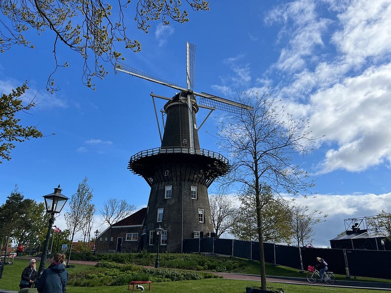 萊登風車

### 萊登大學

萊登 (Leiden) 是知名荷蘭畫家林布蘭的故鄉，也是歐洲知名的大學城。於16世紀成立的萊登大學是荷蘭最古老的大學，也是我 2009–2010來荷蘭交換的學校！

此次歐洲行的重點，就是要回訪萊登！

一下火車，驚覺火車站變得超級大。但除此之外，萊登這個小鎮跟我的印象中相差無幾XD

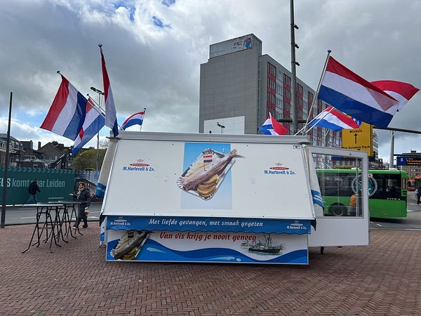

*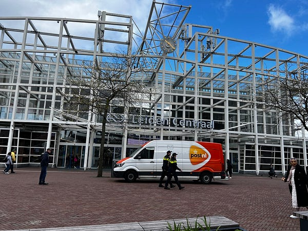萊登火車站*

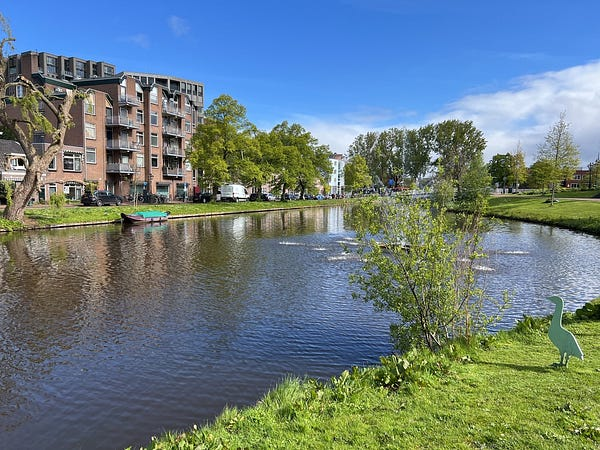

*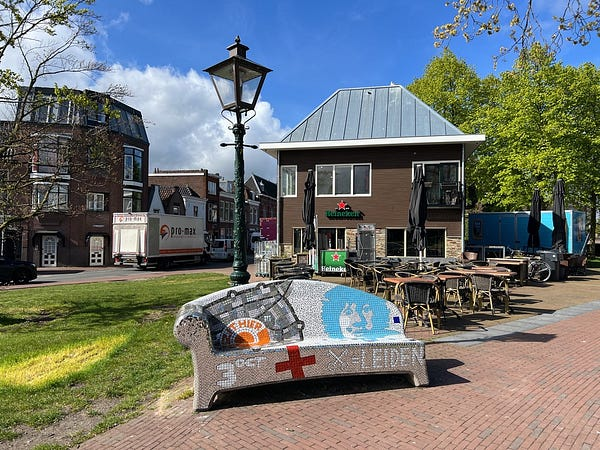萊登一角*

本來想買個萊登大學T來紀念一下，結果逛了一下他們的大學紀念品店，只有幾件零星(而且很醜的大學T），看起來根本就是個 thrift shop，簡直太讓人失望了QAQ

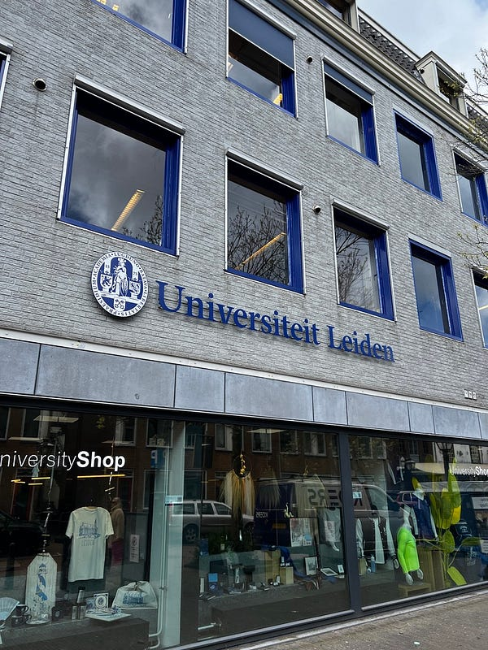

*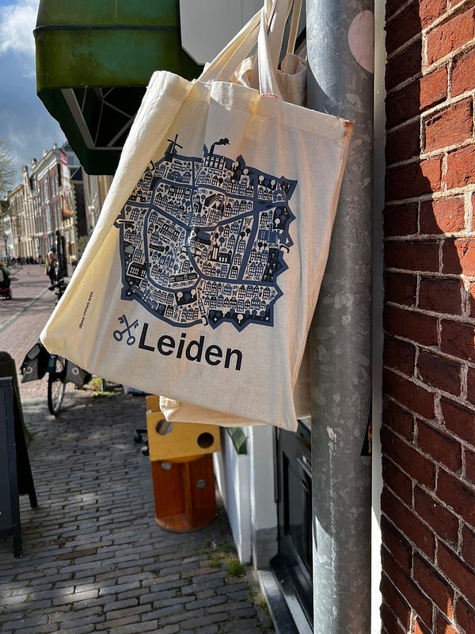右邊是路上小店賣的萊登帆布袋，超可愛！*

### 荷蘭煎餅

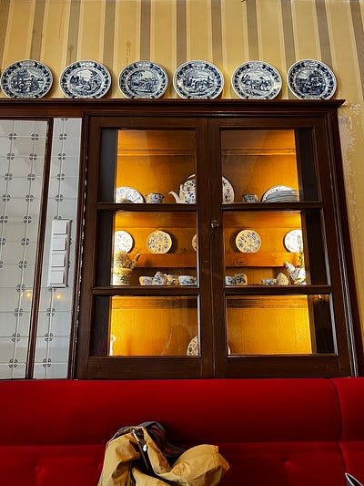

*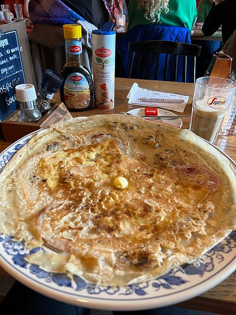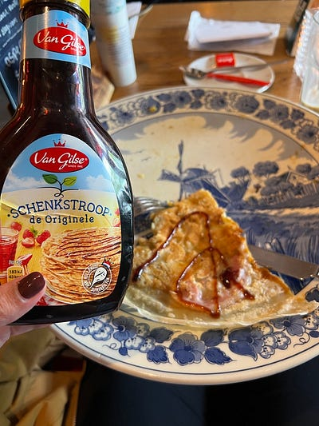*

在這裡吃了有名的荷蘭煎餅 [Oudt Leyden](https://search.app.goo.gl/9YP8LNT)

*，超級無敵大一份哈哈哈！我點的是鹹口的培根起司蘑菇口味，一開始還想說服務生為什麼要附上糖漿跟糖粉？沒想到她是對的！因為吃到一半真的好膩，推薦加糖漿食用因為跟培根比較合。*

萊登這個小鎮真的不大，超微逛了一下之後我就回到了海牙。從外面欣賞了國會大廈（Binnenhof）、騎士之館（Ridderzaal）跟旁邊的霍夫菲法湖（Hofvijver），天氣好時這裡真的很適合散步！

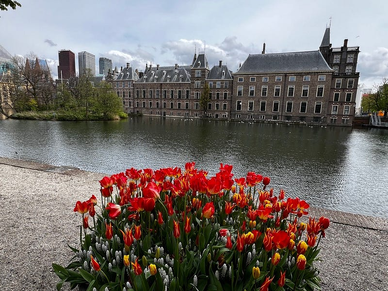

最後途經這個車站附近的遊樂園～

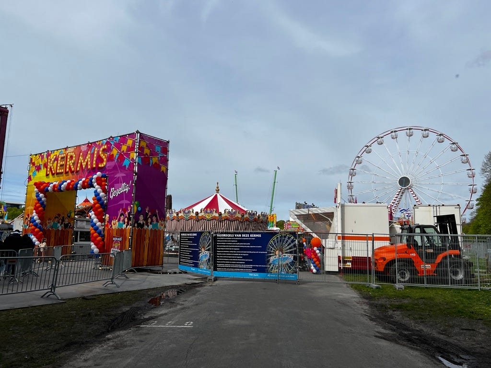

King’s Fair The Hague，這是個為了明天的國王節而轉化成的遊樂場。

歐洲跟澳洲有很多這種 fair 的形式，通常都是活動前再臨時搭建，其他時間都場地可以用做其他用途，跟台灣的遊樂園通常都是永久的固定設施很不一樣。


