* * *

### **一個女生的歐洲獨旅:** 2024.04.27 **荷蘭** 在藍瓷小鎮台夫特 (Delft) 慶祝國王節

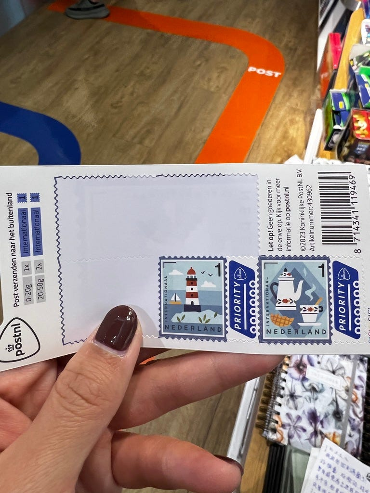荷蘭的郵票真心太可愛！

其實我一直到了荷蘭之後，才發現我剛好遇到了國王節 (Koningsdag)!

國王節是荷蘭人慶祝荷蘭國王威廉‧亞歷山大 (Willem Alexander) 生日的國定節日，同時也是荷蘭最大的國家慶典！

不知道大家是不是都知道荷蘭有自己的皇室？

一開始聽到這個節日時，我一直很困惑這個國王是哪一個，因為澳洲的女王節/國王節其實是慶祝英國皇室的女王/國王的生日XD

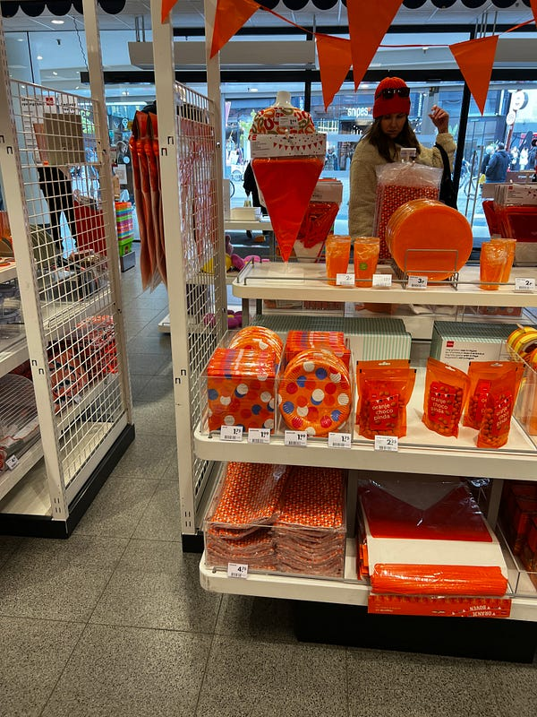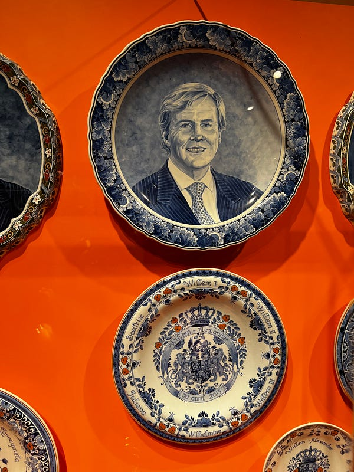商店擺滿國王節的慶祝商品(左) 國王畫像的藍瓷(右)

### 荷蘭國王節慶祝活動

國王節的主要慶祝活動有以下幾個：

1\. **開趴喝到爛醉**

通常國王節這天荷蘭人白天就會開喝 (澳洲人表示：這豈不就是就是我們的日常?XD)，幾個荷蘭大城市例如阿姆斯特丹跟海牙，則會從前一晚就開喝，稱為 King’s Night (一種跨年夜提前慶祝的概念XD)

**2\. 跳蚤市場**

一到國王節，許多城市的街道上都充斥著大大小小的跳蚤市場，據說這是荷蘭一年當中唯一可以免費擺攤還不用被扣稅的日子。個人覺得跳蚤市場的真締就是，把你家的垃圾拿出來擺攤賣，然後去逛別人家的攤子把別人家的垃圾買回家，然後明年再拿出來賣 lol

**3\. 橘色是你當天的顏色！**

在國王節這天，荷蘭人也會穿戴上他們的國家代表色橘色 (如果真的沒有橘色衣物/飾品，也可以考慮穿戴荷蘭國旗色: 藍紅白)。其實我覺得橘色並不是那麼常見的衣物顏色，我問了 AirBnB host，是不是每個荷蘭人都有橘色的衣服? 她很肯定地說「我覺得應該 99%都有，因為看球賽的時候也要穿橘色」。想想也是非常合理XDD

除此之外，國王節當天還要吃一個橘色拿破崙蛋糕 (orange tompoucenes)。這道甜點是個在上下兩層起酥片夾入香草奶油餡的長方型甜點！本來上方的糖霜是粉紅色的，但在國王節這天，大家會把糖霜染成荷蘭的代表色橘色。

身為一個澳洲人，我身上當然沒有橘色的東西XD 但畢竟來到當地就是志在參與，所以我在千挑萬選之下，買了這頂 4.99 歐的兩用帽，一面是全橘色（戴起來非常像櫻桃小丸子)、一面則是白底上面點綴著橘色拿破崙蛋糕，超可愛！而且它本身也是一個實用的遮陽帽 >///<

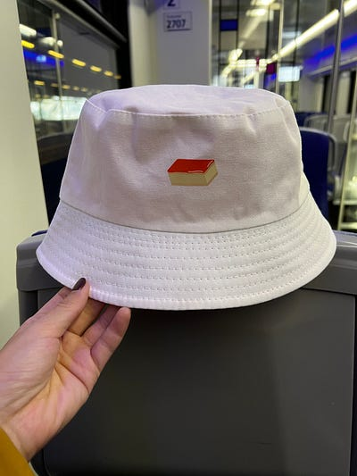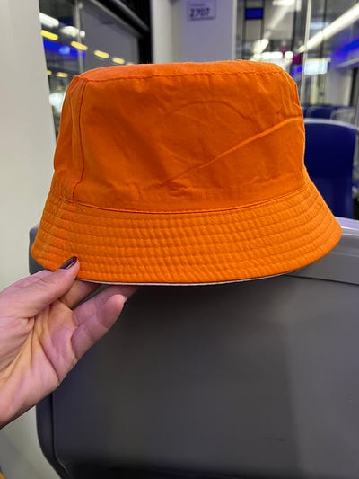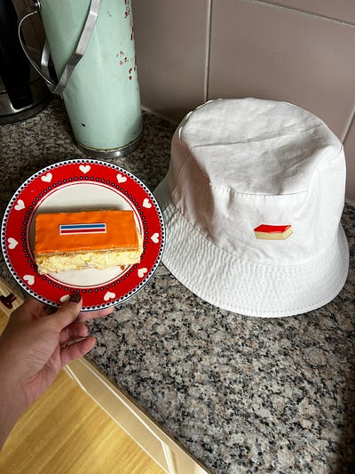這個帽子是不是實用又可愛！順便放一張跟蛋糕本人的合照XD

### 藍瓷小鎮台夫特

除了國王節之外，今天的重點是荷蘭藍瓷小鎮台夫特，距離海牙只要15分鐘火車！算是昨天在萊登吃完荷蘭煎餅之後，突然得到的旅行靈感。

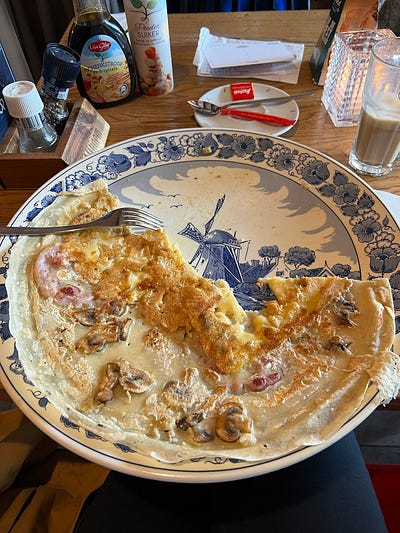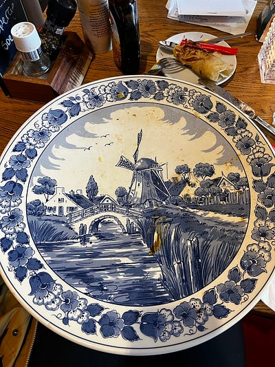藍瓷盤上的巨大荷蘭煎餅

關於萊登的遊記請看：

[**一個女生的歐洲獨旅: 2024.04.26 荷蘭 萊登 (Leiden) 荷蘭最古老的大學城**  
 _萊登 (Leiden) 是知名荷蘭畫家林布蘭的故鄉，也是歐洲知名的大學城。於16世紀成立的萊登大學是荷蘭最古老的大學，也是我 2009–2010來荷蘭交換的學校！_ medium.com](/posts/2024-04-26-leiden/)

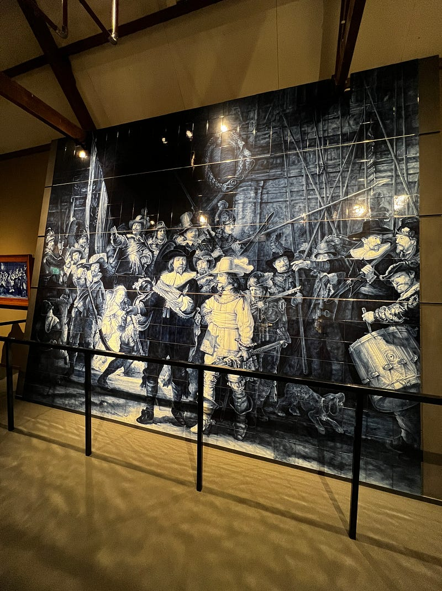藍瓷版林布蘭的名畫夜巡

如果你看了荷蘭藍瓷之後覺得，這不是中國青花瓷嗎？沒錯喔，因為這就是從青花瓷演變而來哈哈哈哈

相信大家都聽過荷蘭東印度公司，在他們開始海外貿易後，就開始進口中國青花瓷到荷蘭。當時荷蘭的瓷器就是我們一般看到的紅土色陶瓷，於是荷蘭人看到青花瓷覺得簡直美呆，於是開始大量購買！！！

後來因為明清時代戰爭的關係，沒辦法再進口，於是荷蘭人就決定自己的瓷器自己燒！

### Royal Delft 皇家藍瓷博物館

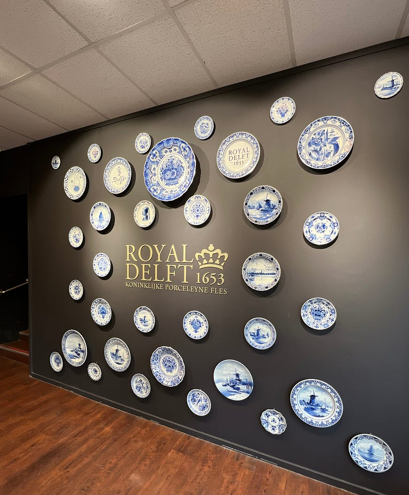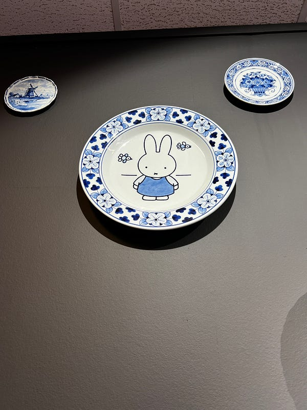Royal Delft 皇家藍瓷博物館

我去參觀的 Royal Delft 皇家藍瓷博物館的皇家之名可不是浪得虛名，他們的確是荷蘭皇室認證的，直到現在也持續在製造荷蘭藍瓷，荷蘭皇室也會在招待重要外賓的國宴上使用荷蘭藍瓷製作的碗盆。

皇家藍瓷博物館非常值得一來！而且我建議早上來，因為早上有很多旅行團，我完全就默默跟在他們後面聽英文導覽，導覽員奶奶講得非常好！聽完之後我自己再回去博物館逛了一圈，把之前沒看仔細看的說明補足，但我覺得自己看真的不如導覽精彩。

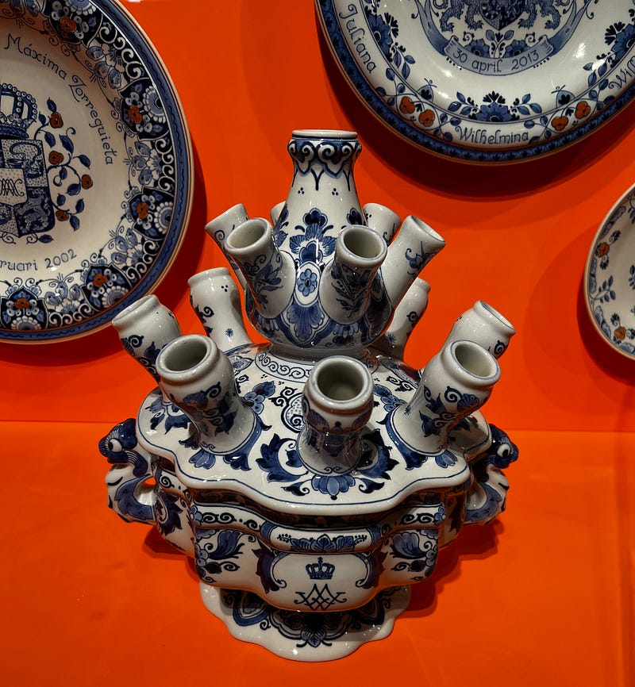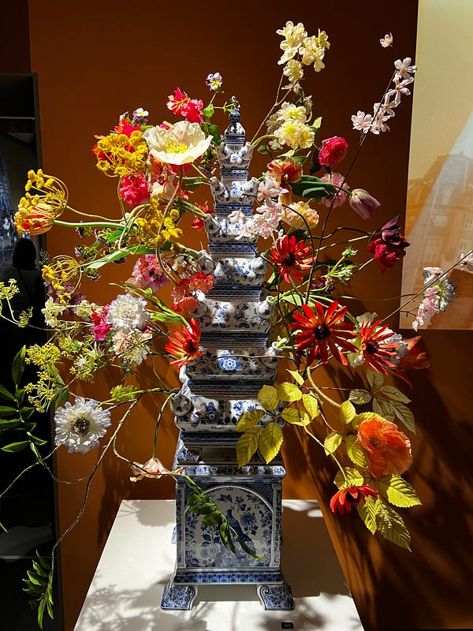藍瓷花瓶真的好酷！一朵花有自己的一個家XD

現在管區裡還有畢卡索特展！

你們知道畢卡索杯杯也做過瓷器藝術嗎？展覽館裡面放的是真品（是個有錢的私人收藏家借給博物館展覽的），還有畢卡索製作的影片，我整個驚呆，因為我一直以為畢杯杯是古人吧XDD 沒想到影片中他看起來好現代。

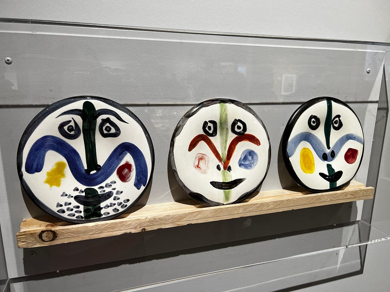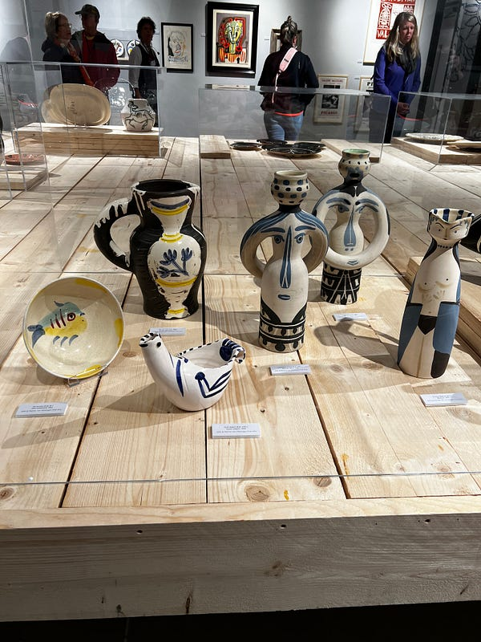畢卡索製作的瓷器

參觀完整個博物館後，會對荷蘭藍瓷有深入了解。皇家藍瓷博物館的藍瓷其實有兩種，一種是用貼紙轉印的 (好酷的技術)，一種是手工繪製的！背後的logo 不同，手工的藍瓷還會有畫家的簽名跟編號，每一個都是獨一無二的，真心是非常值得收藏！！！

我在裡面糾結了很久要不要入手，因為手工繪製的無敵貴，一個14公分的盤子要$167歐元 (澳幣272、台幣5800)。而且荷蘭畢竟是我旅行的起點，我覺得我真的沒有信心在之後三週的旅程帶著它，於是只好忍痛放手 QAQ

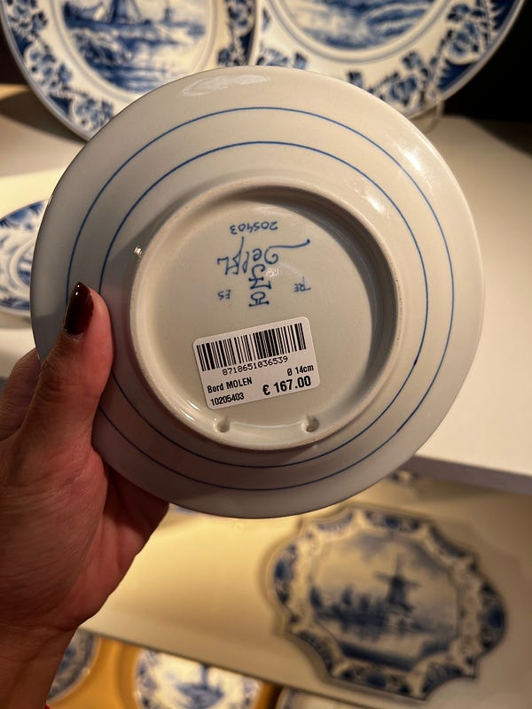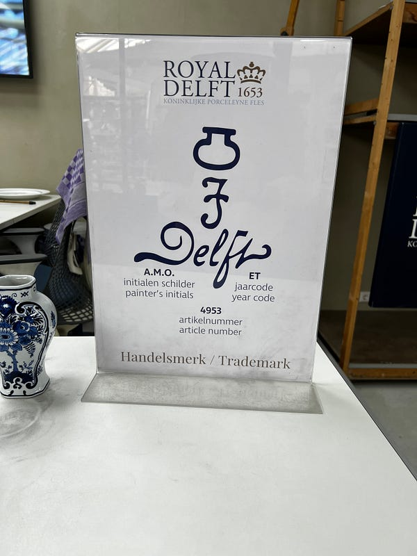手工繪製的藍瓷後面會有特殊商標跟畫家的簽名

祈願我以後可以成為荷蘭手工藍瓷餐具的擁有者，如果可以擺一套美美的在家多棒啊！！！

* * *

**為了服務廣大讀者，雲端架構師 EC 線上諮詢服務，正式上線囉！如果你想要跟 EC 進行 1:1 線上職涯諮詢，麻煩請填寫：**[**雲端架構師 EC 諮詢服務預約表單**](https://forms.gle/Zuro8YryCN5hH9Gk9)

**如果想要進一步支持我，歡迎透過以下連結請我喝一杯咖啡！你們的支持是我持續創作的動力，如有任何問題或是想要看的主題，歡迎留言與我互動 :)**

