* * *

### **一個女生的歐洲獨旅:** 2024.04.28 德國 法蘭克福 (Frankfurt) Day 1 — 最美跟最壞的風景都是人

今天要離開荷蘭了！

久別重逢，我對荷蘭的印象其實還是很不錯的，城市感覺很安全，風景優美，唯一的缺點是天氣比墨爾本還瘋狂，真心是一下熱得要死、一下冷，然後一下出太陽、一下又下雨。

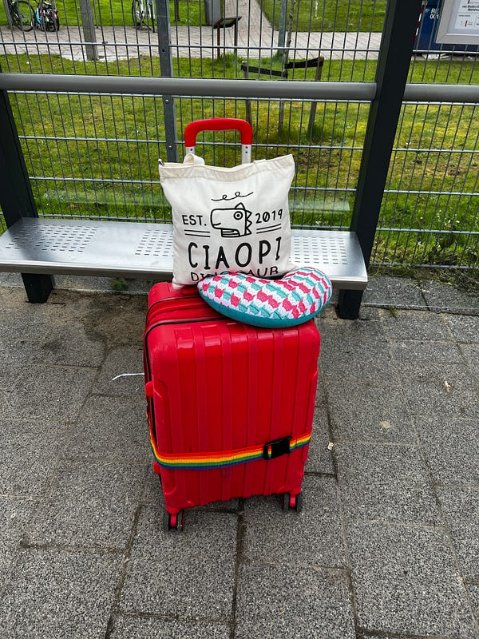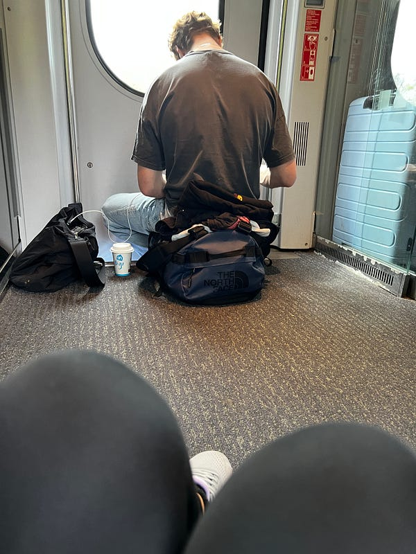我的隨身包是去年在台中買的俏皮 (CiaoPi) 恐龍包，我覺得很促咪XD 火車上人多到爆炸，沒訂位的我只好跟這個小哥一樣坐在車廂地板上lol

### 初見法蘭克福

坐了4.5小時的火車，我終於從荷蘭海牙抵達德國法蘭克福。

到了法蘭克福的火車站，第一印象就是，天啊，這是什麼危險的地方！

車站外面超多看起來有嗑藥跟很奇怪的人，我的警戒雷達狂響！（事後我跟當地人確認了一下，法蘭克福火車站附近真的是一個危險的地方，我非常不建議女生獨旅來這裡玩！真的要來也可以，但一定要保持警覺，我之後的影片裡也會提到我的獨旅小訣竅～）

我在 booking.com 上訂了一個含簡易廚房的 studio apartment： [numa I Blau Apartments](https://www.booking.com/hotel/de/star-apart-hauptbahnhof.en-gb.html?aid=318615&label=cc1_English_Australia_EN_AU_165353993714-K6erAAUeRswzA8JmA3n8TAS700403889243%3Apl%3Ata%3Ap1%3Ap2%3Aac%3Aap%3Aneg&sid=7cf2b62dbaaceb535d33ccf422821d70&dest_id=-1771148;dest_type=city;dist=0;group_adults=3;group_children=0;hapos=1;hpos=1;no_rooms=1;req_adults=3;req_children=0;room1=A%2CA%2CA;sb_price_type=total;srepoch=1717498986;srpvid=00bd4da3e23f00f7;type=total;ucfs=1&)，離車站非常近（走路約3分鐘)，於是我一路保持警覺速速前往旅館 check in。這個旅館的check in 過程完全電子化，房間如果提早準備好，他們會傳WhatsApp 訊息告知，超方便！

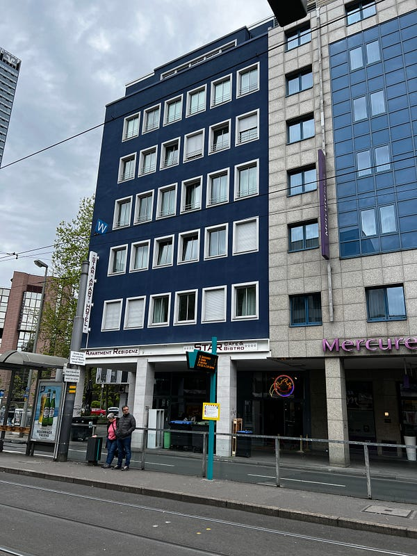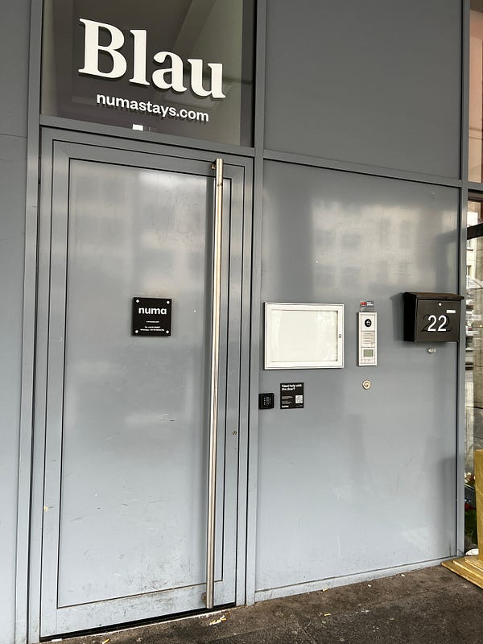法蘭克福的旅館

第一眼進到房間覺得裡面有點沒有很乾淨，所以感覺不是太好，而且浴室裡有一股潮味 (立刻把對外窗打開通風之後就好很多)，後來發現有污漬的地方大部分都是之前房客留下來的痕跡 (是擦不掉的)，所以逐漸適應後我覺得還算不錯XD

主要是因為這樣一晚才$110澳，空間非常大，廚房用品齊全，甚至有廚房紙巾跟洗碗精。浴室也是超級大，有雙蓮蓬頭，水勢強勁洗起來非常爽！有三個大窗戶觀察路人很有趣XD (但看出去真的就會看到路上有各種奇怪的人 LOL）

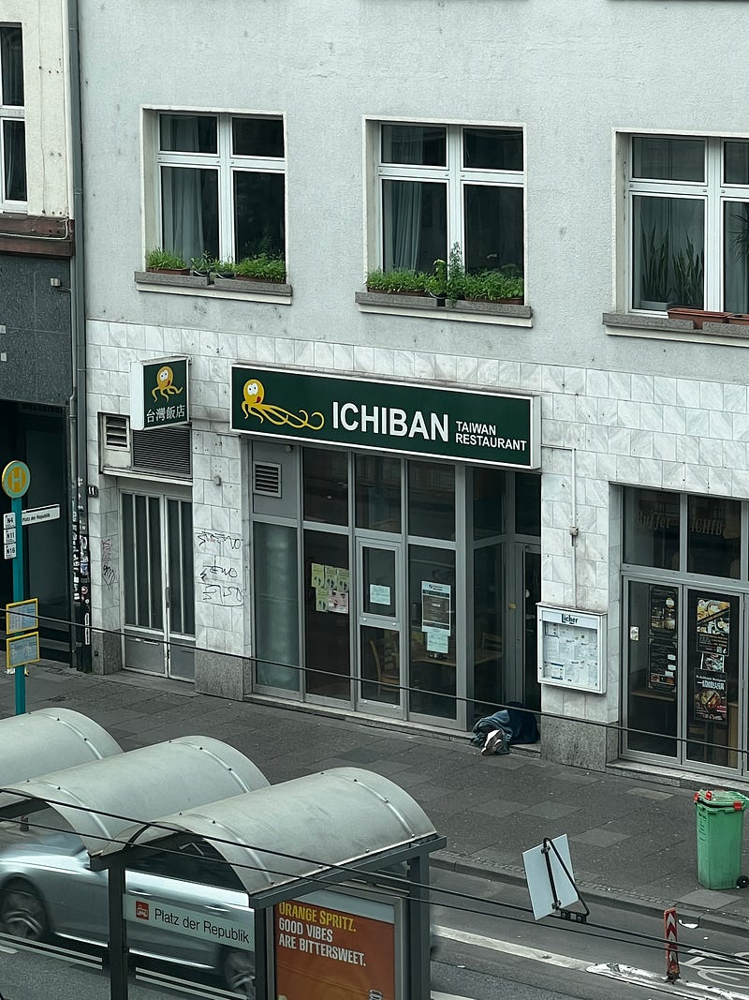其中一個窗戶看出去居然可以看到一家台灣餐廳！(當然你們也可以看到睡在餐廳門口的遊民冏)

### 法蘭克福老城區

在旅館稍微修整了一下，我立刻準備趁白天時出門觀光。

第一站來到羅馬人廣場 Romerberg 位於法蘭克福老城區中心。

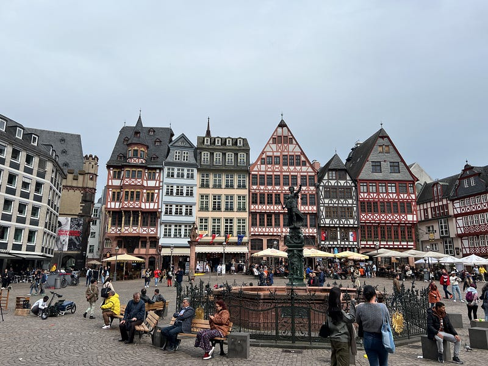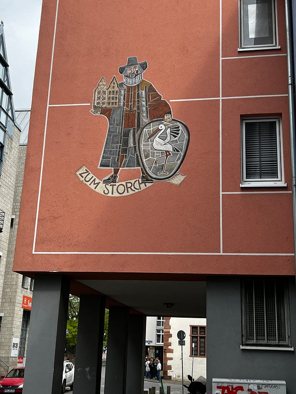羅馬人廣場跟可愛的壁畫

接著走到橫跨美茵河的法蘭克福鐵橋 Eiserner Steg，這是法蘭克福的熱門地標之一。離羅馬人廣場很近，橋上掛著滿滿的鎖頭。不知道從什麼時候開始，全世界就吹起了這股在橋上放愛情鎖的妖風，到底是為什麼？lol

但有趣的是有掛鎖的人就有拆鎖的人，我看到一個杯杯拿著工具在拆鎖，不知道他是政府派來的人？還是只是一個熱心公益的市民？我還有朋友猜說那個人是不是要把鎖拆掉之後再重新拿去賣XDD

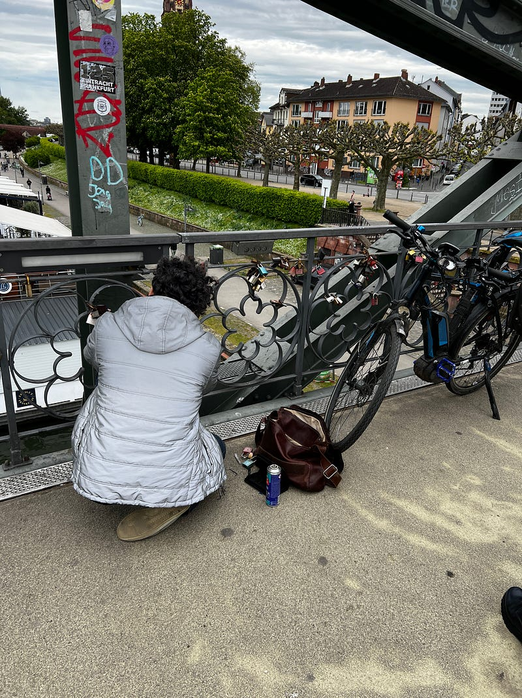拆🔒的大哥

法蘭克福是德國的第五大城，但就經濟來說，應該是他們的經濟重心，所有的大型金融機構都座落在此。

不知道是否因為德國在南邊的關係，這邊的天氣熱到爆炸，簡直一秒從冬天變夏天！我差點沒熱死在這裡。

### 旅行中的軼事

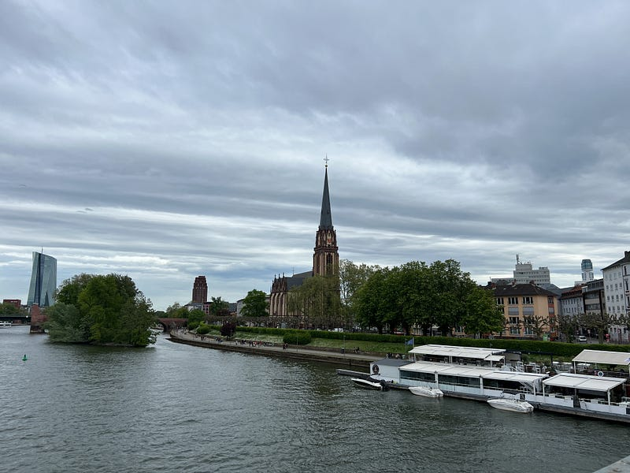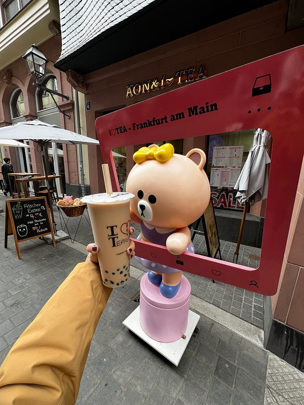我在法蘭克福買了我在歐洲的第一杯珍奶XD

當時，我正坐在法蘭克福的 Main River 河畔長椅上拍影片，拍一拍突然有一個男生坐在我旁邊，我還刻意調整了一下鏡頭角度，不要讓他入鏡。我眼角餘光有注意到他一直看我，但我想說他應該是看我拍片很有趣，反正我影片講中文他也不懂，我就繼續拍! 沒想到我拍完之後他就突然跟我搭訕要電話😱

好的，以下是大家想要知道的八卦細節，德國小哥今年25歲，小時後就跟爸媽移民德國，但他們家其實是俄國斯裔，我覺得算是長相中上吧XD

德國小哥表示他覺得我長得很漂亮，而且很 calm (我就問一個坐在公園長椅上的人能有多激動XDDD），然後他認真想要找個人訂下來結婚 (所以你就在河畔搭訕外國人?XD)，總之他的邏輯我不是很懂哈哈哈哈。我跟小哥聊了一下，最後交換了電話我就脫身了！(之後的影片中會有更多細節～沒錯，我就是要一直在部落格裡面埋梗，給自己製造一點上片的壓力😂)

最後我要大推 [Metropol Kebap Place](https://maps.app.goo.gl/ZeVuSKURxxGSPvHv8?g_st=ic) 這家餐廳，就在法蘭克福火車站附近，我的旅館對面！這是一家中東料理kebab 餐廳，店裡客人不少，本地人跟遊客大概一半一半，而且很多一個人來用餐的人，簡直是 I 人天堂!!!

老闆可以用簡單的英文溝通，他人超好幫我客製化餐點 (我想把薯條換成飯)。

上菜後老闆跟我講了一串德文，我以為他是問我菜上的對嗎？我就跟他示意，嗯嗯沒錯喔～

過了五分鐘，老闆突然送了一盤土耳其麵包到我桌上，我超級困惑？🤔 後來我回想起他剛剛跟我說的話，好像有提到 bread，抱著困惑的心，我一直到結帳時，沒被多收錢才確認麵包是老闆贈送的XD

而且這個份量我其實本來就吃不完了，加上麵包我就更無法了。老闆還最後還幫我打包，人超好！

我突然發現我好像是德國人喜歡的長相哈哈哈哈哈！因為我回憶了一下，全場客人只有我的桌上有被贈送麵包XDDD

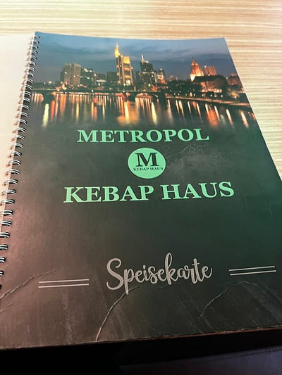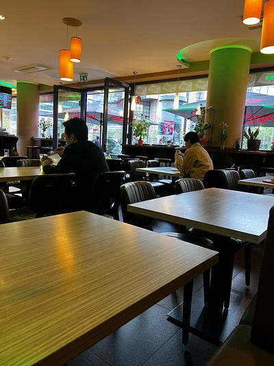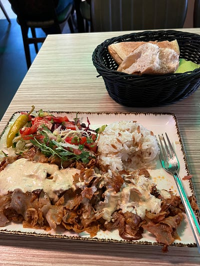右上就是老闆送的麵包


