* * *

### **一個女生的歐洲獨旅:** 2024.04.29 德國 法蘭克福 (Frankfurt) Day 2 — 不來也沒關係的城市

非 Medium 付費會員，[請點此免費閱讀這篇文章](https://medium.com/@cloudarchitectec/2dfaaa93e47c?source=friends_link&sk=f8445ad56e316a9459e398b05486b513)！當然如果你願意加入 Medium 付費會員來支持創作者，那就更棒囉～感謝你的閱讀！

* * *

### 歐元塔

今天早上先走去跟歐元塔合照，這是一個單純的拍照景點，附近其實沒什麼好逛的，但是拍起來真的也是滿好看的XD

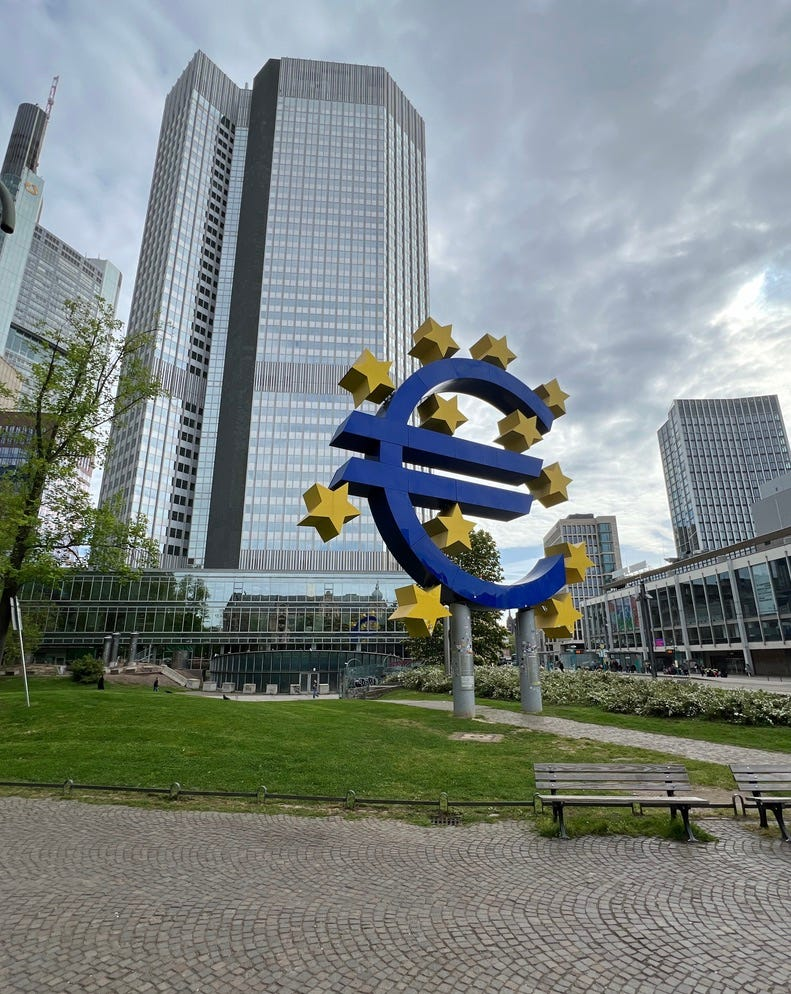歐元塔

### WHY! Coffee 喝咖啡

不過歐元塔附近剛好有一間台灣部落客 Leo 號稱歐洲「數一數二好喝的咖啡」咖啡，我立刻決定前往品嚐（Leo 的遊記請參考：[【法蘭克福舊城區漫遊】羅馬廣場、法蘭克福歷史博物館、歐元塔與美因塔之旅](https://www.leo-travel.idv.tw/45194/germany-frankfurt-old-town))

點了咖啡之後店員會讓你選豆子口味，奶泡還算綿密，不過整體而言就是澳洲咖啡店正常發揮的水平？我建議這位 Leo 必須要來一趟澳洲哈哈哈

這家咖啡廳很微妙，牆上有不少藝術品，但後面又放了很多要出售的電器（冰箱洗衣機等等），整體而言環境很舒服，是個讓人放鬆的咖啡廳，我還是滿推薦的～

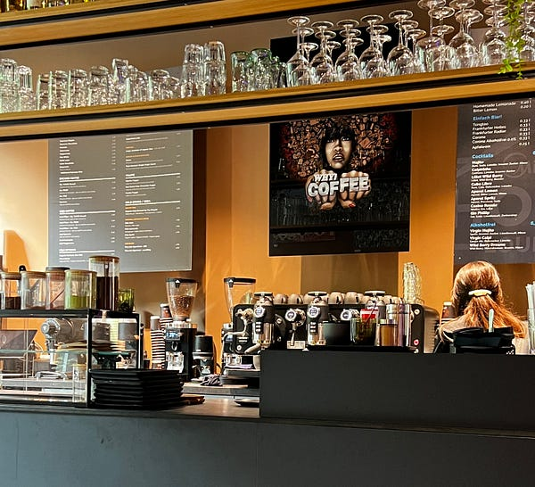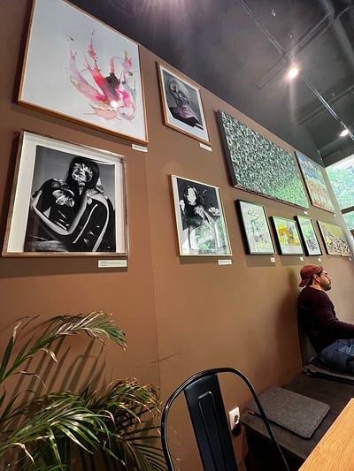WHY! Coffee

### 歌德故居 (frankfurter goethe-haus)

接著我去了歌德故居，歌德也就是寫浮士德跟少年維特的煩惱的那位。必須承認在昨天之前，我完全不知道他是法蘭克福人XDDD (虧我還是英文系出身的 😂)

不得不說18世紀的豪宅也是真的很豪（他們家應該是中產階級），四層樓的房子，每層約4個房間。家裏還有廚師跟女僕。而且每個房間都有不同的顏色主題，但又不會太俗氣。果然不管在哪個年代，當有錢人住豪宅都最爽了XDDD

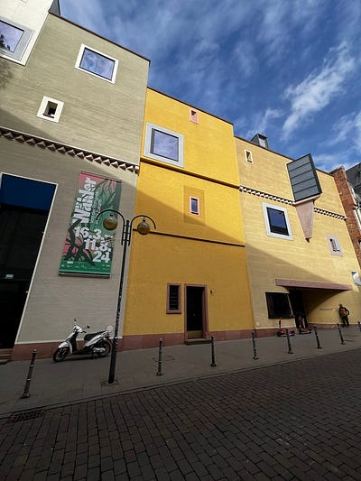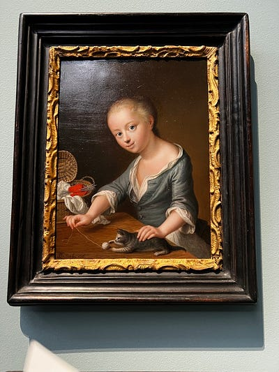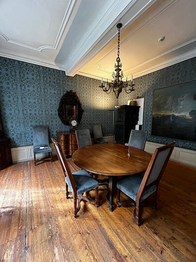歌德故居

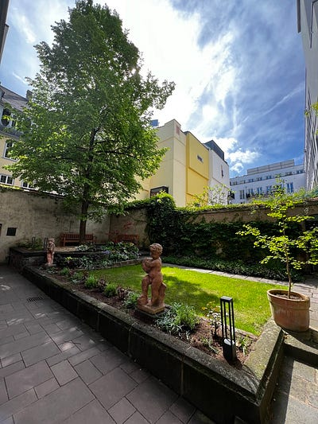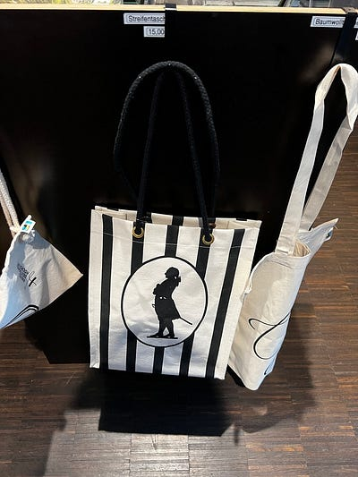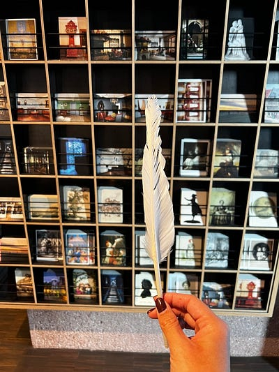花園跟紀念品店也很可愛

### Paulaner am Dom 午餐

Paulaner am Dom餐廳就在教堂另一側，既可以躲避擁擠的觀光客人潮，又一邊用餐一邊欣賞教堂風景。服務生阿姨會講英文，我請她推薦我最適合豬腳的啤酒，她推薦了這個 brown beer，真心好喝！！！

豬腳的準備時間需要30分鐘，所以千萬不要飢腸轆轆才來XD

店家有免費wifi 很貼心，可以一邊盡情玩手機一邊等待，而且也很適合獨旅的旅客，除了我之外還有另外兩個男生也是坐單人桌！

可能是阿姨看我等太久，先上了高麗菜沙拉，這是醃製過的高麗菜，非常有台式泡菜的感覺。

這裡豬腳的配菜是Klob/Knodel，菜單上的英文翻譯是Potato dumpling 。就某位台灣部落客說的一樣，是個不難吃，但是亞洲人很難喜歡的口感囧

我真的寧願他們給我薯條、薯泥或是整顆馬鈴薯都好XDD 我後來發現這個東西是德國常見配菜，所以我下一次去餐廳就直接問服務生說我可不可以不要把這個馬鈴薯團團換成麵包

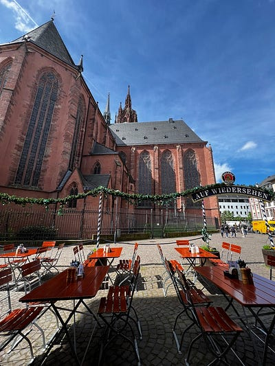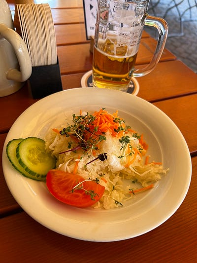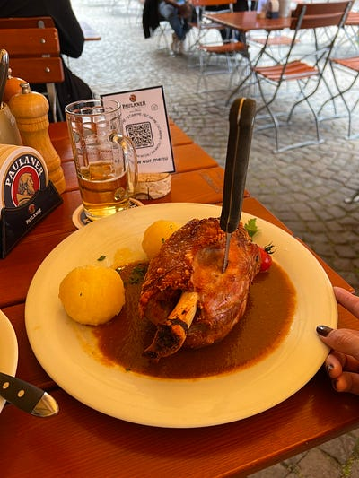Paulaner am Dom

### Der Backer Eifler

接著我走近這家很多人的麵包店，他們的草莓蛋糕超級好吃！因為已經喝過咖啡，所以這次我選了茶。基本上他們會到一杯熱開水給你，然後你可以自選茶包。我本來以為就是一般的茶，沒想到居然是認真的花草茶，而且超級好喝！但我後來去超市沒看到這個茶包，不然我還滿想買一盒的。

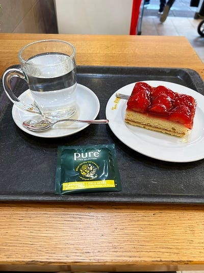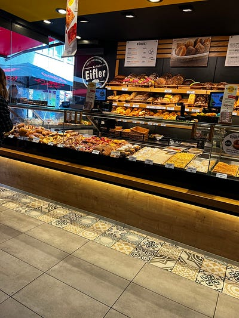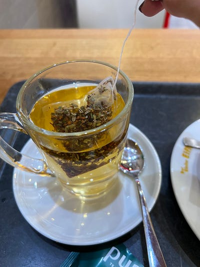Der Backer Eifler

### Main River Cruise

接著因為在法蘭克福實在是太無所事事了，所以我覺得去坐游船 Main cruise，他們有短程50分鐘$14.5跟長程100分鐘$18的行程。短程就是看時間走紅線會橘線，長程就是橘紅兩線 (上下游都有)。

看票價當然是坐長程划算，但我不想花這麼多時間在游船上，所以選的是短程。這裡提醒大家如果你跟我一樣是坐紅線的話，上船請坐右側 (我覺得我每次游船都坐錯邊😂) 整體而言算是個舒適的行程，但是真的也沒有太多景點或特殊的景緻，所以說真的不坐也沒關係XD

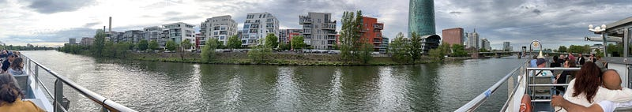Main River Cruise

### 晚餐

晚餐是我昨天剩下來的Kebab + 麵包，和我帶來的味增湯，太美味了！

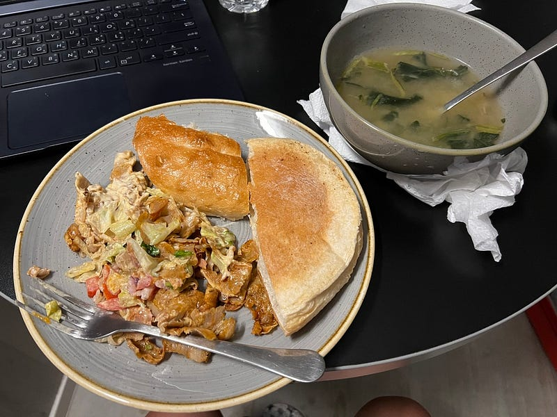晚餐

* * *

**如果你喜歡海外生活、澳洲職場、文組轉職工程師的相關文章，歡迎按下「拍手」給我鼓勵 (喜歡的話請多拍幾次！)。同時記得「**[**按此訂閱我的Medium部落格**](https://medium.com/@cloudarchitectec/subscribe)**」，這樣你就不會錯過我的更新囉～**

**為了服務廣大讀者，雲端架構師 EC 線上諮詢服務，正式上線囉！如果你想要跟 EC 進行 1:1 線上職涯諮詢，麻煩請填寫：**[**雲端架構師 EC 諮詢服務預約表單**](https://forms.gle/Zuro8YryCN5hH9Gk9)

**如果想要進一步支持我，歡迎透過以下連結請我喝一杯咖啡！你們的支持是我持續創作的動力，如有任何問題或是想要看的主題，歡迎留言與我互動 :)**

  * Email: [cloudarchitectec@gmail.com](mailto:cloudarchitectec@gmail.com)
  * 臉書粉絲頁(文章與中文部落格相同): <https://www.facebook.com/cloudarchitectec/>

