---

title: "一個女生的歐洲獨旅: 2024.04.30 德國 紐倫堡 (Nuremberg) Day 1 — 第一個讓我想移居的德國城市"
date: 2024-06-14
slug: "2024-06-14-nuremberg-day-1"
cover:
  image: "images/medium-1*zpoNAu8kyO4alGJokQcSAQ.jpg"
  alt: "紐倫堡地鐵站現代化設計"
  caption: "紐倫堡地鐵站"
images: ['images/medium-1*zpoNAu8kyO4alGJokQcSAQ.jpg', 'images/medium-1*cEf2YgS2isLvWN_SxTaeiA.jpg', 'images/medium-1*z76YqWPPyIezu93i43T3VQ.jpg', 'images/medium-1*-xGsBNUYj5WrqTdcyQsa8Q.jpg', 'images/medium-1*T1_b9XnnBlV1YMe3VU3wXw.jpg', 'images/medium-1*h4mvEITaKjkC0ryYdUvo8Q.jpg', 'images/medium-1*xzQs9md4GWKRHqltU3S5ww.jpg', 'images/medium-1*WRbOi_9nExtfYxyBRNBVKw.jpg', 'images/medium-1*ig6JggBYl-YWUZapayNv6w.jpg', 'images/medium-1*aMb7J9Cke4-wH2o9NCaY6g.jpg', 'images/medium-1*fT-2EQohU3kBIoQ_43jH7Q.jpg', 'images/medium-1*TTdrSj24MhyITTLeu0ruww.jpg', 'images/medium-1*zxmTKdj-LCTFIwdVjjtP-A.jpg', 'images/medium-1*QwnD2FI9fKNRJEBzzmUq8w.jpg', 'images/medium-1*GV4G5PVNDCrJMe1nJlmYEQ.jpg', 'images/medium-1*_3GMGPqdMhCe6rOGWy1vyg.jpg', 'images/medium-1*w3v2ZrjBh5MV70OGUFrjMg.jpg', 'images/medium-1*YdcpokwKtAYaZY4f-rYp-A.jpg', 'images/medium-1*p5ZoJIDZ-NOLHXShPUmcng.jpg', 'images/medium-0*7Abpr4b15mBmDLsK.png']
categories: ["旅行紀錄"]
tags: ["獨旅","旅遊", "歐洲", "德國"]
episodeseries: ["一個女生的歐洲獨旅"]
---

* * *

### 一個女生的歐洲獨旅: 2024.04.30 德國 紐倫堡 (Nuremberg) Day 1 — 第一個讓我想移居的德國城市

住在法蘭克福的這兩個晚上我真的是很喜歡透過大窗戶觀察外面的行人XD

覬覦了轉角那家麵包店兩天後，我在 check out 當天早上 6:35 下樓買了他們今天新鮮烤好的蝴蝶餅 (pretzel) ，外層鹹香香酥，內層有嚼勁又不會太硬！配上我的自製拿鐵，太好吃了~

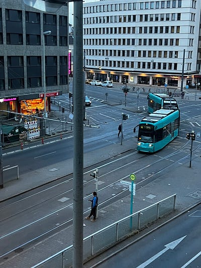

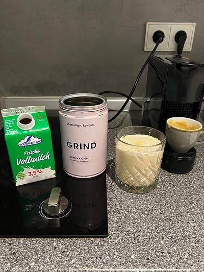

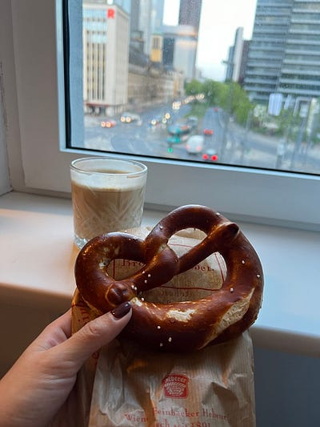

### 德國火車一等車廂初體驗

今天準備搭火車移動到紐倫堡 Nuremberg

德國火車票購票時不會包含座位(不像台鐵，如果沒有特別指定的話系統都會自動幫你安排座位)，如果要預訂座位 (seat reservation)，需額外加上幾歐的手續費。如果不訂位，大家就是上車後先坐先得。

上車後選好座位後，在德鐵 app 上輸入車廂及座位號碼即可完成 check in，就可以直接略過查票這個程序啦 (查票員可以從他們手上的機器看到你的 check in 狀態，查票時就會直接跳過你，我覺得滿方便的)

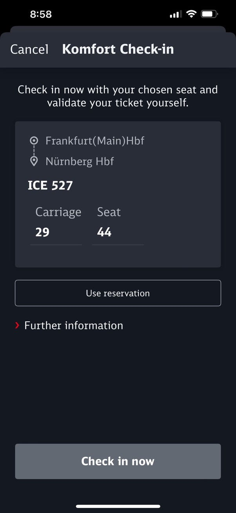

這趟火車行我特地加價了 4 歐想來看看一等車廂跟二等車廂的差別（根據距離跟行程，一等車廂跟二等車廂的加價價格不一定，以訂票時的價格為主）。

體驗過後我覺得其實兩種車廂差異不大，主要的差別在於一等車廂裡的乘客少很多(以價制量？😂)，腿部空間更寬一點。

但我覺得這位姊姊才是一等車廂的極致直接帶酒上來喝！後來我仔細一看姊姊的手拿包是全黑的 LV，果然是低調奢華XDD

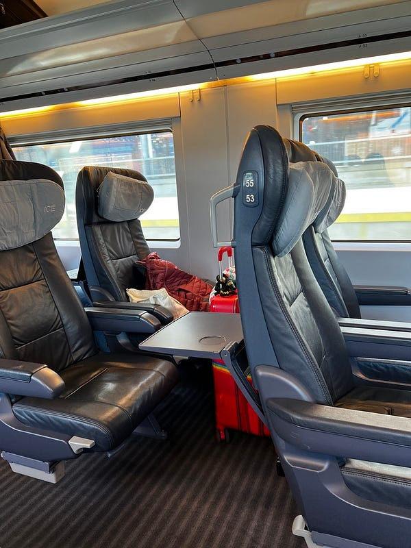

*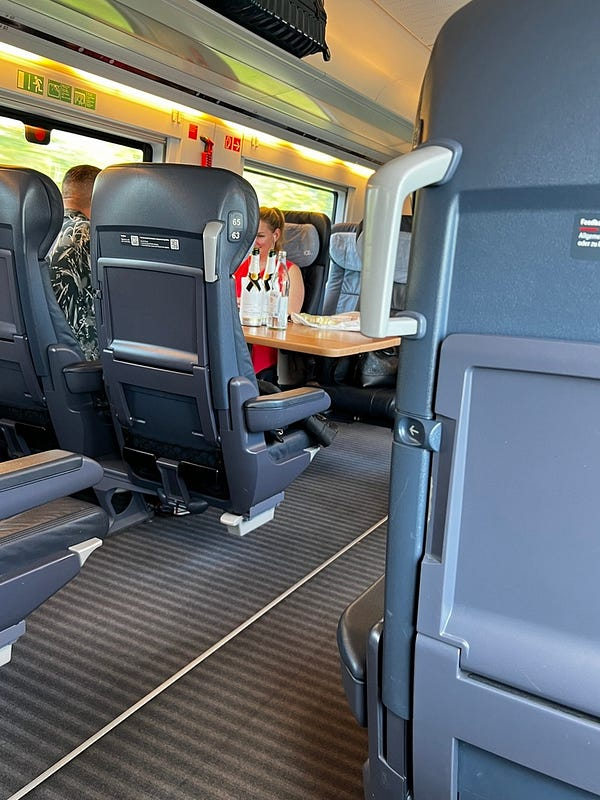德國火車一等車廂初體驗*

### 好喜歡紐倫堡

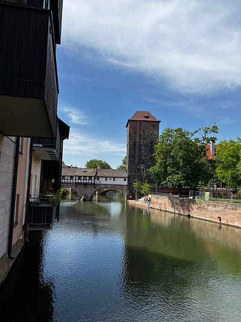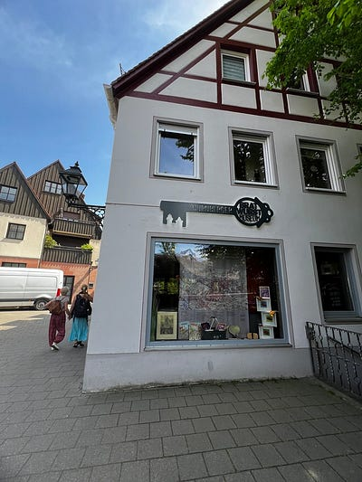

*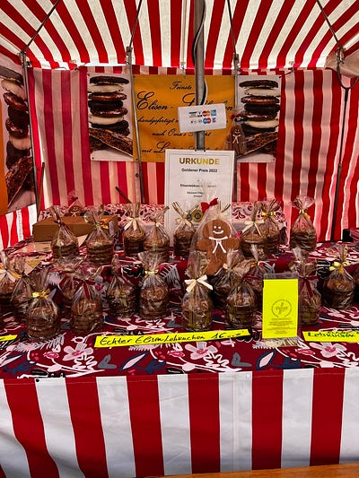紐倫堡的聖誕市集很有名，但非聖誕節期間來也是有個小小的市集。希望以後有機會再訪紐倫堡來逛這個歐洲最大的聖誕市集*

我其實滿建議在紐倫堡待個 2–3 晚，因為這個小鎮 (為什麼大家一直叫它小鎮，紐倫堡明明很大哈哈)，有非常多值得參觀的地方！

他們有超多博物館、有中世紀的歷史、藝術、交通發展史，有沈重的納粹發展史，而且非常安全、氣氛也很好，我這次住了兩個晚上，以後也會考慮再訪！

這裡推薦大家可以先上網買好[紐倫堡卡(Nürnberg CARD+Fürth)](https://tourismus.nuernberg.de/en/booking/nuernberg-card-city-card/?fbclid=IwZXh0bgNhZW0CMTAAAR0cNbhR7DTQX82gI294ylSOrtbjpZPBetqIJu5MtMwihbpbjSNVaP0vbrM_aem_ZmFrZWR1bW15MTZieXRlcw#/)

*，一下火車即可開始使用。這個卡可以免費去紐倫堡跟 Fürth 的 40 個景點，加搭乘所有的大眾運輸交通免費，一張卡要價 33€ (我算了一下，兩天內我的交通費 22.9 跟景點門票 51.5，加起來 74.4，等於省了一半的費用！*

如果你只在紐倫堡待一天的話，我另外還發現了另一個 [Nuremberg Municipal Museums 的博物館套票](https://museums.nuernberg.de/visitor-information/admission)

*，任何一個 Municipal Museum 的門票是 7.5EUR，但只要你在加上€3，就可以變成一個 €10.5 的一日票，適用於滿多個博物館的，我覺得如果只待一天的話其實可以考慮這個套票，更划算。*

### Bratwurst Röslein 午餐 (紐倫堡香腸)

午餐吃了「Bratwurst Röslein」餐廳，就在 Nürnberger Hauptmarkt 主集市廣場旁邊！紐倫堡的特色餐點是手指大小的紐倫堡香腸，腸衣是羊腸，可以自選你要幾根！我事前不知道香腸尺寸這麼小，所以我只點了六根，如果是一個正常食量的人你應該會覺得吃不飽😂

但我後來想想，沒吃飽也好啊，這樣飯後才可以吃更多小點XDDD

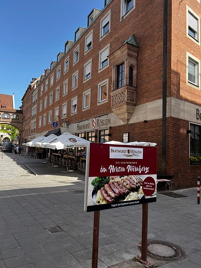

*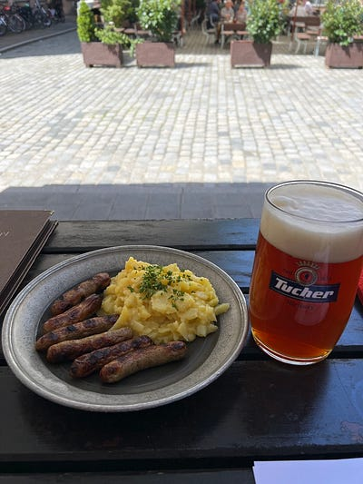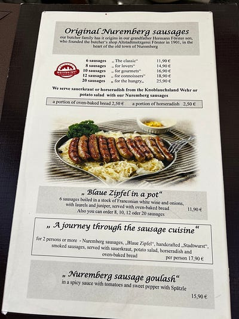紐倫堡香腸*

至於香腸的味道，嗯，是個好吃的香腸。但這種 bratwurst 我覺得吃起來都差不多，澳洲也有很多這種香腸，我覺得沒什麼特別的 (論香腸，當然還是台灣的練煙腸最好吃XDD)

### 紐倫堡城堡 Imperial Castle of Nuremberg

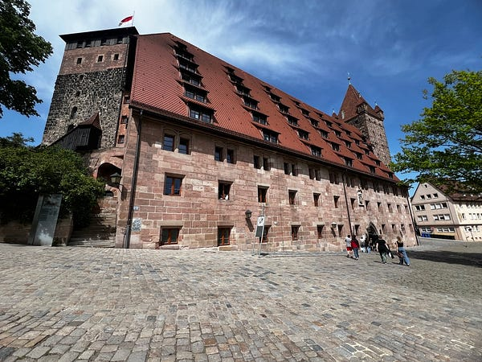

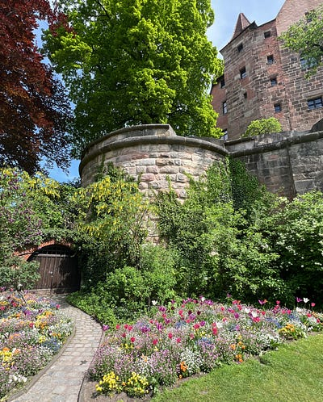

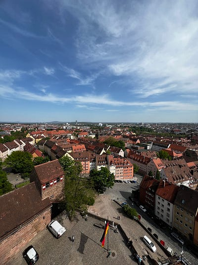

*紙倉堡城堡*

這裡是個免費看市景的好地方! 如果不想要付費參觀博物館的話，我覺得光是上來看城堡外面的風景都很值得！

我的紐倫堡卡可以換紐倫堡城堡的套票，其中包含 Deep well 展示很有趣！從上面看真的看不出這個中世紀水井有這麼深，所以導覽員會從倒水下去井裡，然後大概要過 5–10 秒你才會聽到水聲，很促咪。

Bell Tower 滿好爬的，約五分鐘，但不爬也可以。因為其實城堡外面就可以看到紐倫堡市景了，上去反而會被欄杆阻擋。

紐倫堡城堡的博物館本身也很值得一看，入城剪影實在太可愛。

### 紐倫堡市立博物館(City Museum in Fembo house)

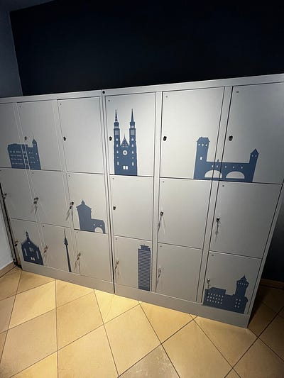

*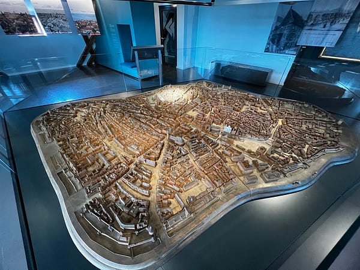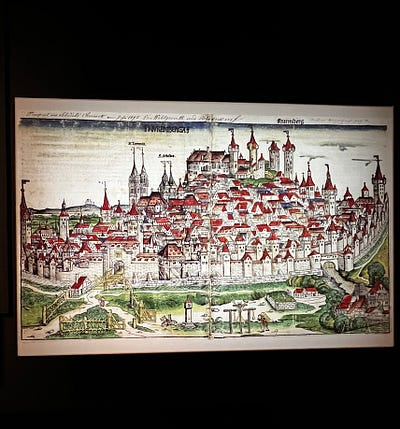紐倫堡市立博物館*

這是我整趟歐洲行程最喜歡的博物館，英文語音導覽做得很棒！！！

德國很多博物館都是全德文，只有語音導覽有英文，但這是我覺得展館設計跟語音導覽設計得最好的地方，請你們一定要來，可以以有趣的方式了解中世紀城市的發展史，還有紐倫堡為什麼在中世紀具有重大歷史意義。例如神聖羅馬帝國其實是沒有固定首都的，他們的皇帝會不斷在各個城市巡迴演出，紐倫堡就是其中一個重要的帝國據點。
