* * *

### **一個女生的歐洲獨旅:** 2024.05.01 德國 紐倫堡 (Nuremberg) Day 2 — 近代史中的紐倫堡

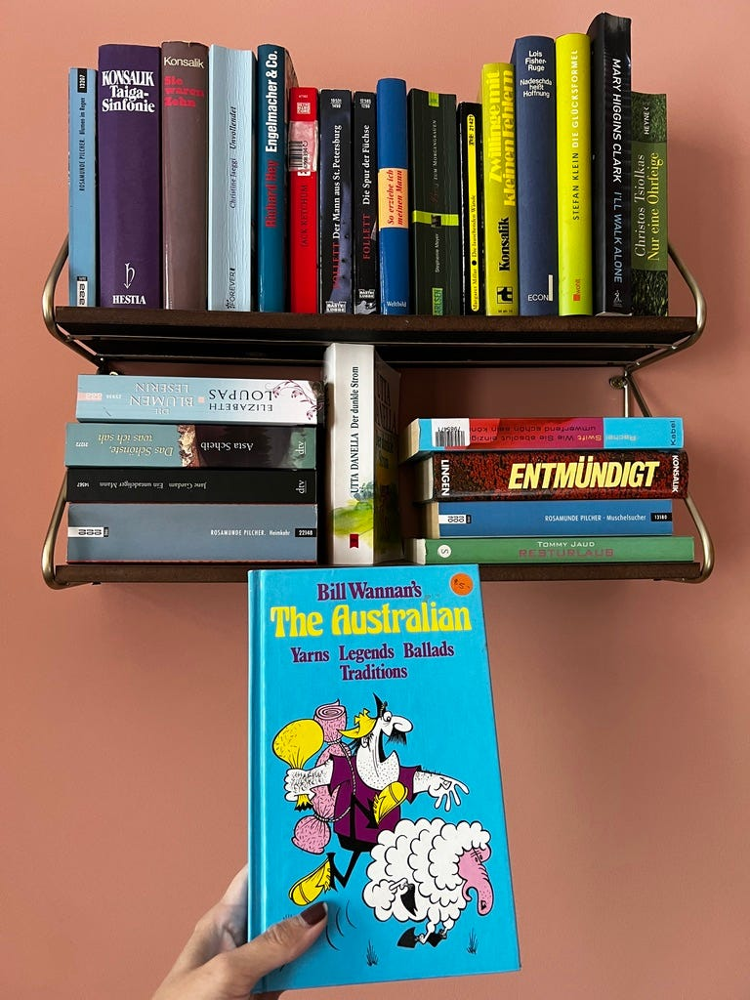在紐倫堡 airbnb 房間裡發現一本關於澳洲人的書，太有趣XD

非 Medium 付費會員，[請點此免費閱讀這篇文章](https://medium.com/@cloudarchitectec/ee0dffc37b65?source=friends_link&sk=44b71988a6d0a05b76a7ac4509c5f16d)！當然如果你願意加入 Medium 付費會員來支持創作者，那就更棒囉～感謝你的閱讀！

* * *

5 月 1 號 是德國的勞動節，絕大多數的商店/超市都不會營業，好險幾個主要景點還是會持續開放！

今天的主要行程是要來了解紐倫堡在近代史中的歷史意義！

紐倫堡是德國納粹非常重要的據點之一，在這邊舉辦過非常多大型納粹集會。

不管你對於歷史有沒有興趣，如果你有機會來德國，我都會建議你參觀這幾個納粹相關的博物館，了解納粹歷史的發展跟起落以及對近代歷史的影響。

### 納粹黨代會檔案中心 Documentation Center Nazi Party

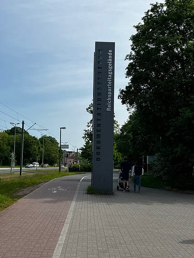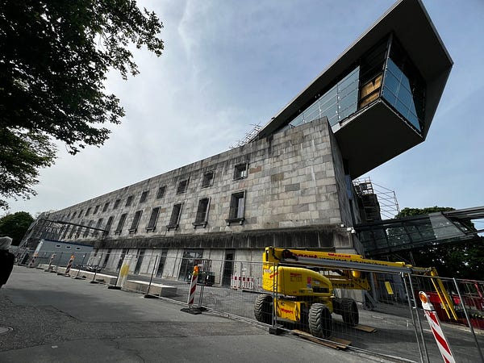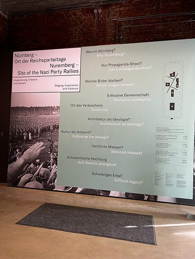納粹黨代會檔案中心

部落客莉莉嗯在[【紐倫堡景點】納粹黨集會場檔案中心門票、交通，走進納粹遺址博物館](https://lillian.tw/dokumentationszentrum-reichsparteitagsgelande/#google_vignette)裡，對於這個展館的介紹讓我對這個展館有很高的期待，她說：

 _「這是我覺得絕對要去的景點，尤其是對二戰歷史有興趣或是納粹黨歷史有興趣的人，這個博物館非常詳細的介紹納粹黨成立、成名、戰敗的過程，也有紀錄許多猶太人與種族屠殺的故事，非常有意義，我大概在裡頭待了3~4小時。隔壁就是有名的全國黨代會集會場。」_

不過我去參觀時展館大整修中，只開放臨時展，大概不到一個小時就可逛完。算是帶給我一個納粹發展史的初步認知吧，但臨時展不算太驚艷😂

展館旁邊有個很大的湖，很多人在慢跑、遛狗，非常平靜。讓人在看完展覽之後不免感受到一種難以言喻的衝突感，就好像歷史事件終究會沈浸下來，但對於當時的人來說我們認知的歷史就是他們當下的現實。

### 紐倫堡動物園

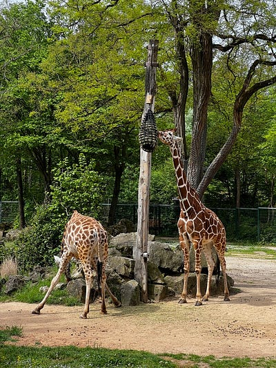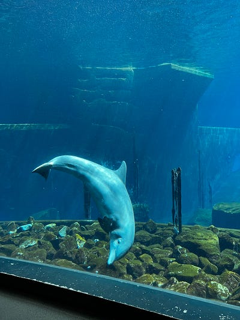爆米花真心超大包，逛完之後還剩 3/4 包

接著為了轉換心情，也為了充分利用我的紐倫堡卡，我來到了紐倫堡動物園，這裡號稱是歐洲最大也最美的動物園之一，非常值得一來（持紐倫堡咖入場免費）。

動物園的空間很大，我來的當天是德國勞動節，超級多人，但還是可以拍到好照片。我非常推薦家庭旅遊、一人獨旅或是跟三五好友一起來也可以。

入口處不遠有個爆米花攤，超有趣，這裡居然可以一邊逛動物園一邊吃爆米花，好有趣！賣爆米花的小弟還特地裝剛爆好的爆米花給我，其他遊客都是拿事先裝好的，讓我真的覺得我是德國人的菜XDDD

這裡的動物都不是關在玻璃窗裡或網子後，非常易於拍照，我也超怕我的爆米花不小心掉進去。其中海豚館絕對值得一去！近看海豚超大～

### 紐倫堡審判紀念館 Memoriam Nuremberg Trials

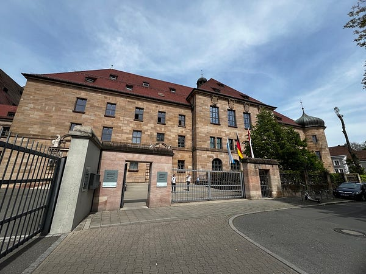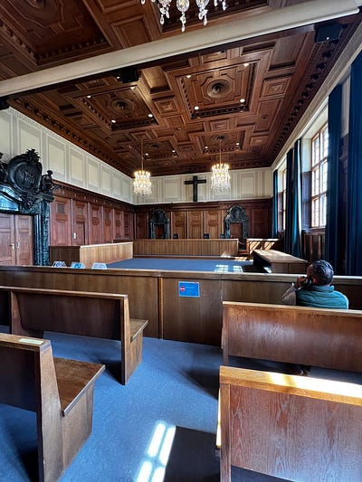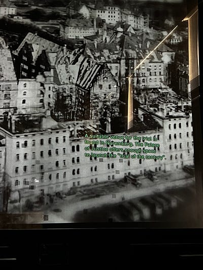紐倫堡審判紀念館

執行著名紐倫堡大審判的法院，詳細記載英法俄如何裁決懲處二戰時的主要官員，也有大幅記載如何懲處執行「大屠殺」的納粹重要官員。這是歷史上第一次除了國家需要為戰爭罪負責之外，個人也要經由軍事審判為 committing war crimes 負責，非常具有歷史意義！

超級震撼！一定要來，而且一定要看二樓的影片，這個影片利用高科技讓人體驗紐倫堡大審判的當下，看了這個展館也讓我由衷佩服德國人勇於面對歷史錯誤的精神！

### Restaurant Burgwächter 晚餐

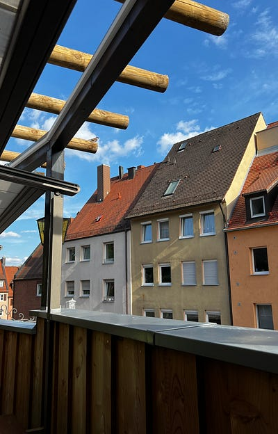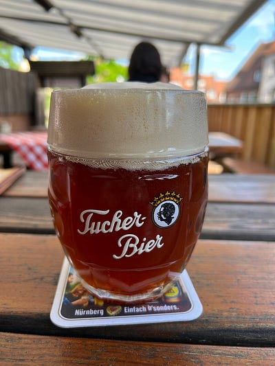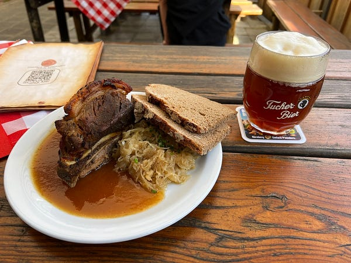Restaurant Burgwächter 晚餐

最後晚餐回到城堡附近Restaurant Burgwächter，吃德國巴伐利亞的餐點烤豬肩（因為我太討厭馬鈴薯團團了，所以就要求換成德國麵包），紐倫堡的特色是 red beer。

烤豬肩的脆皮吃起來很像港式脆皮豬肉，很好吃！但他們的豬肉明顯有豬味，是沒有澳洲那麼糟，但我可以想像應該很多台灣人受不了。我覺得，大家真心去吃港式脆皮豬肉就好了，比較便宜還比較好吃XDDDD

至於 red beer，很可惜我個人也沒有太喜歡（還是之前喝的 brown beer 比較好喝)

我這幾天在德國餐廳吃飯的感想就是，這些道地德式料理都沒有特別好吃，價位還不低(我真心覺得雪梨 The rocks 的德國豬腳餐廳 [Munich Brauhaus Sydney](https://search.app.goo.gl/JT3DEHH) 還比較好吃XDD)。除了體驗道地德國食物之外，我會建議大家不如吃 kebab 餐廳/餐車/小店，或是火車站裏面的麵包店跟餐廳，都更便宜且美味 (而且其實土耳其食物 doner 已經成為德國人生活的一部分了)。

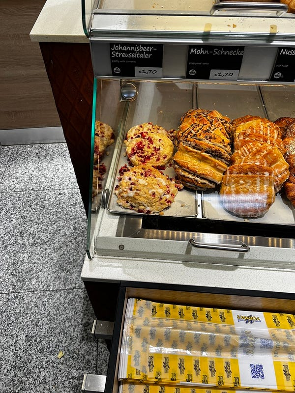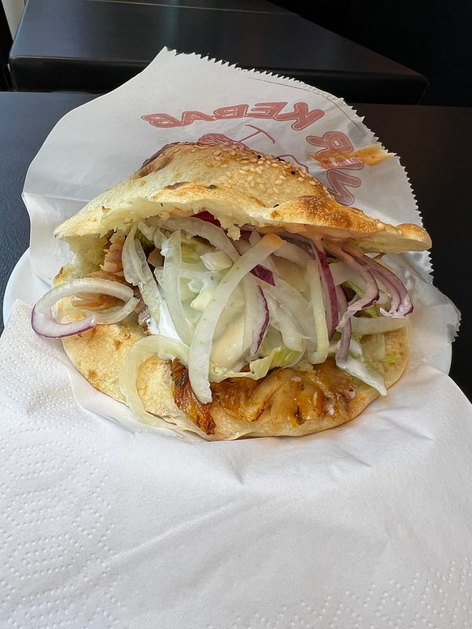德國的麵包店跟土耳其食物真的很好吃

* * *

**如果你喜歡海外生活、澳洲職場、文組轉職工程師的相關文章，歡迎按下「拍手」給我鼓勵 (喜歡的話請多拍幾次！)。同時記得「**[**按此訂閱我的Medium部落格**](https://medium.com/@cloudarchitectec/subscribe)**」，這樣你就不會錯過我的更新囉～**

**為了服務廣大讀者，雲端架構師 EC 線上諮詢服務，正式上線囉！如果你想要跟 EC 進行 1:1 線上職涯諮詢，麻煩請填寫：**[**雲端架構師 EC 諮詢服務預約表單**](https://forms.gle/Zuro8YryCN5hH9Gk9)

**如果想要進一步支持我，歡迎透過以下連結請我喝一杯咖啡！你們的支持是我持續創作的動力，如有任何問題或是想要看的主題，歡迎留言與我互動 :)**

  * Email: [cloudarchitectec@gmail.com](mailto:cloudarchitectec@gmail.com)
  * 臉書粉絲頁(文章與中文部落格相同): <https://www.facebook.com/cloudarchitectec/>

