* * *

### **一個女生的歐洲獨旅: 2024.05.02 德國 慕尼黑 (Munich)** Day 1- **達豪集中營**

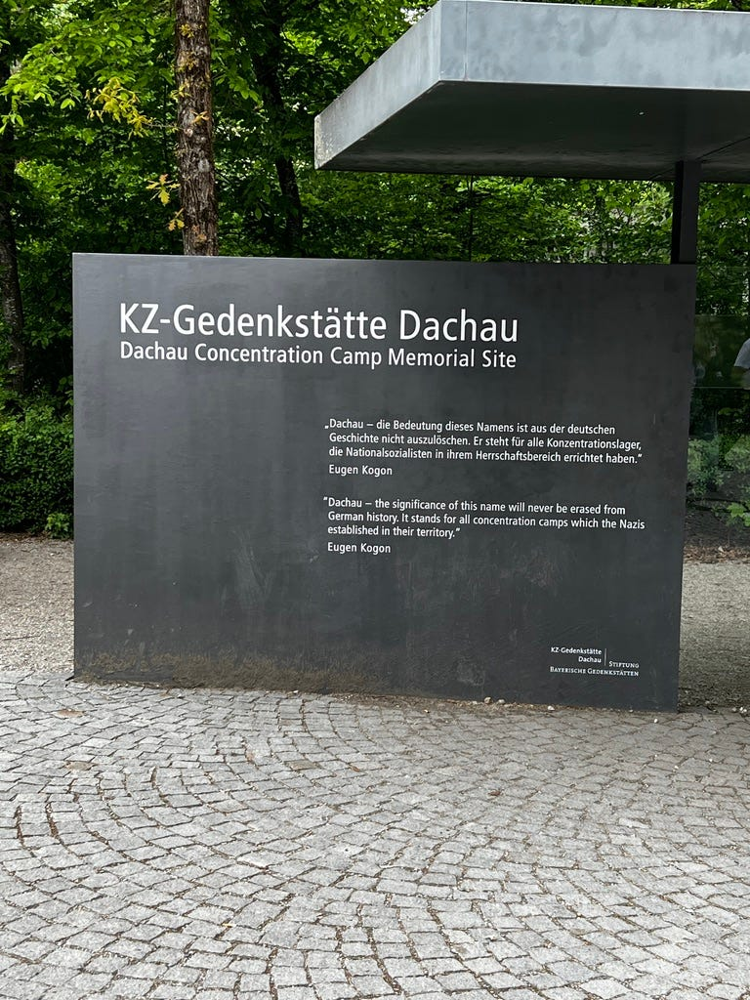 達豪集中營

今天從紐倫堡搭火車一小時前往慕尼黑，一下車就覺得這是一個還算安全的城市，很開心! (法蘭克福火車站/市區真的好糟，我建議大家可以跳過法蘭克福不去完全沒關係！畢竟那邊也沒有什麼觀光重點，而且旅遊體驗誠可貴，財務與人身安全價更高XD)

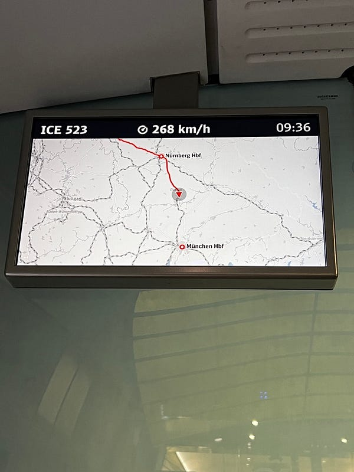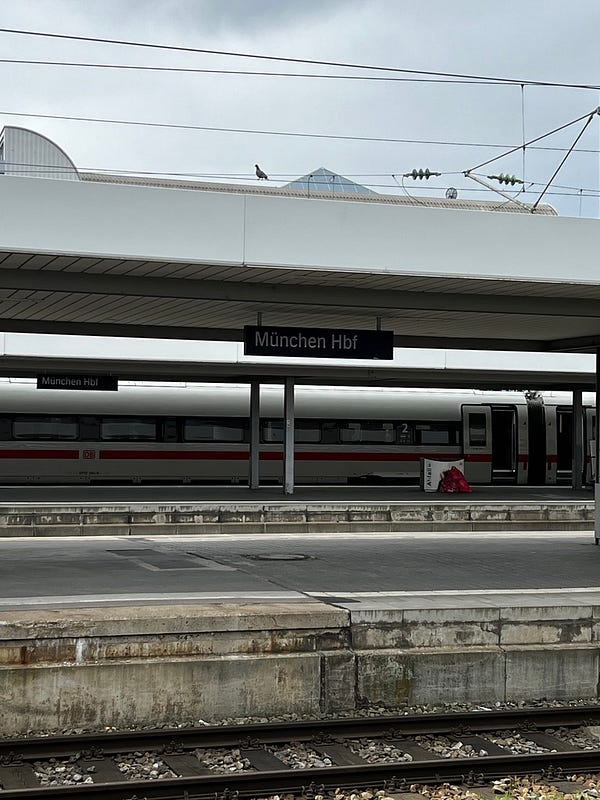火車：紐倫堡往慕尼黑

先去旅館先寄放行李後，我在地鐵站買了這個巧克力可頌。德國的 pastry 都好吃到一個爆炸！這個巧克力可頌外酥內軟中間的巧克力醬還不會太甜，太神了！他們都用什麼食譜，太好吃了吧！

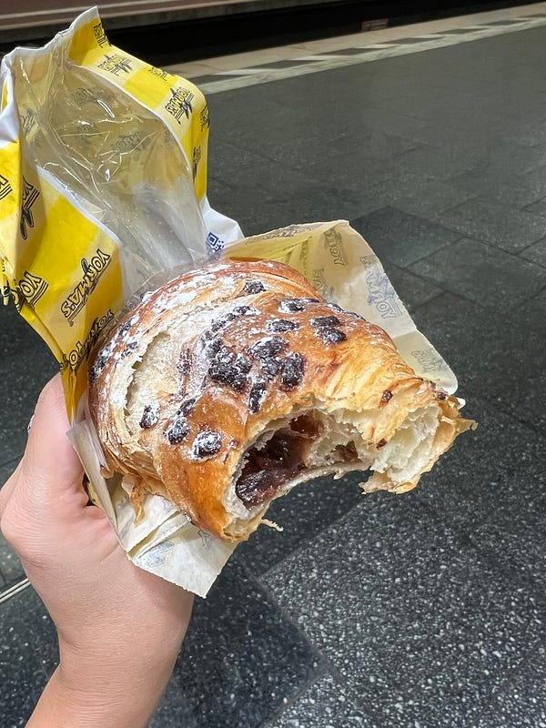Yorma’s 是我在德國最愛的麵包店！

### 達豪集中營 Dachau Concentration Camp Memorial Site

接下來就準備進行今天的主要行程：達豪集中營!

我先在火車站買了M區+1區一日票 10.5 歐(去一區的單程票價就要5.8歐，如果你跟我一樣會算數，請務必購買一日票XD）。但如果你沒有要來達豪的話，其實慕尼黑的主要景點都在 M 區，可以考慮買 M 區一日票即可。

到達豪集中營的交通方式很簡單，從中央車站搭 S2 捷運到達豪火車站 (車廂裡的標示明確，還有德英雙語廣播，真是太感人了！)，之後轉公車 726 即可。

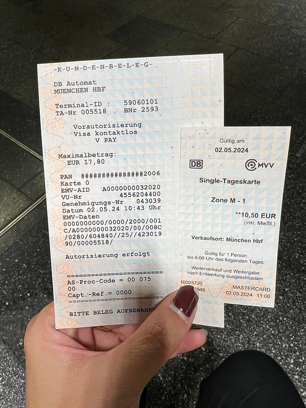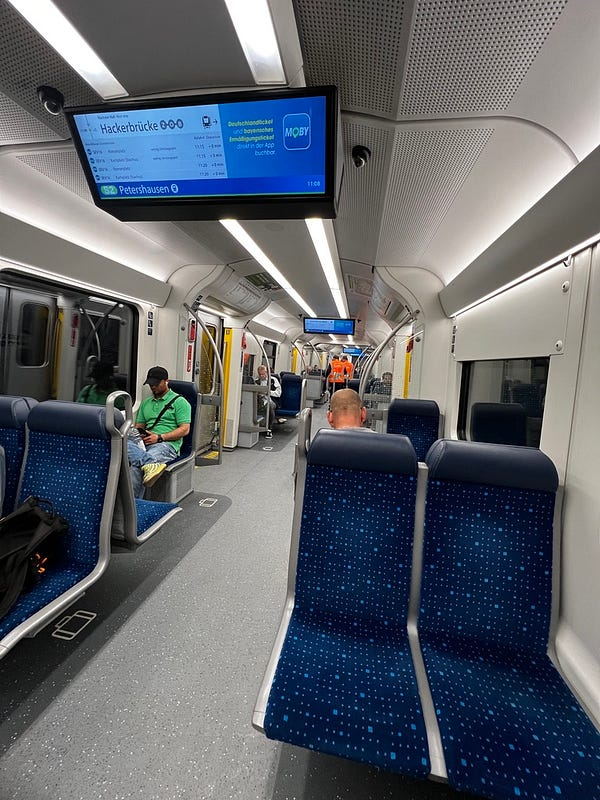

除了搭自行前往之外，也可以參加 KKday/Klook 的一日遊，但他們現在的一日遊也都改成帶著你一起坐上述交通工具(我看其他人的遊記之前都是搭遊覽車，我覺得跟團就是要省去交通上的麻煩，所以跟團對我來說的吸引力就大降)。

抵達之後可以花4.5歐租借語音導覽 (這是不會退費的)，然後需要押證件，但我拿護照給工作人員的時候她拒絕了 (大概是怕大家忘了回來拿😂），如果沒有其他類似學生證/駕照的證件可以押，也可以押 10 歐，之後歸還語音導覽時拿著收據退10歐押金。

不得不說語音導覽的設計有點不良，每個指示牌上並沒有標號碼，場地內也沒有路線指示，等於你要拿著地圖找說明牌，找到之後對牌上的名字確定你現在在哪一個說明點，然後在按照地圖上標示的號碼按數字，非常令人困惑！！！

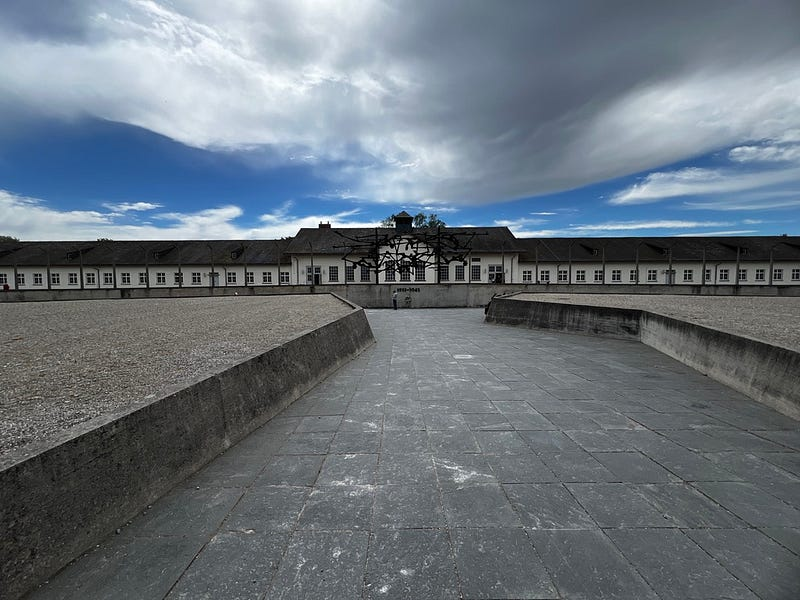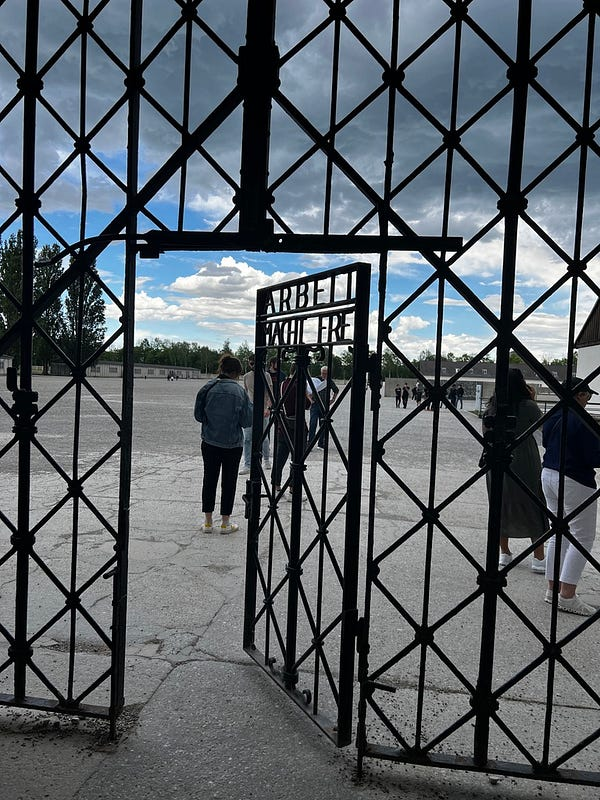集中營佔地超級廣！好可怕！

除此之外，這裡所有的說明都有英德雙語對照，所以英文能力還可以的人我覺得可以考慮不用租語音導覽 (語音導覽有中文選項)，因為裡面提供的資訊也夠多了。這次來德國我非常訝異的地方在於，很多知名觀光景點的文字說明都只有德文（連英文都沒有喔，達豪集中營之前我去的所有法蘭克福景點跟紐倫堡景點都是全德文。遊客只能聽英文語音導覽或看一張說明紙才能獲得英文說明，而其中語音導覽有提供中文選項的大概只有 10% (德國人真的這麼不想賺國外觀光客的觀光錢是嗎？😂)

阿不就好險我之前有好好學英文，不然就GG了！所有的導覽機我其實都是聽英文的)

我其實會建議跟一日團或是事先查好每天的英語導覽時間（真人導覽才4歐），可能可以獲得更佳的體驗，因為我自己是被不清楚的說明指示搞到有點煩躁😂

展館裡面每天固定時間有不同語言的影片(38分鐘）可以觀賞，建議先看好英文場次的時間（沒有中文選項)。影片好像是12歲以上就可以觀賞，但我建議大一點再看可能比較好！裡面有一些屍體的畫面，完全沒打馬賽克！看到時我其實非常吃驚，想說這個給小朋友們看可以嗎😂（是完全不血腥啦，但就是堆疊的屍體照 😂）

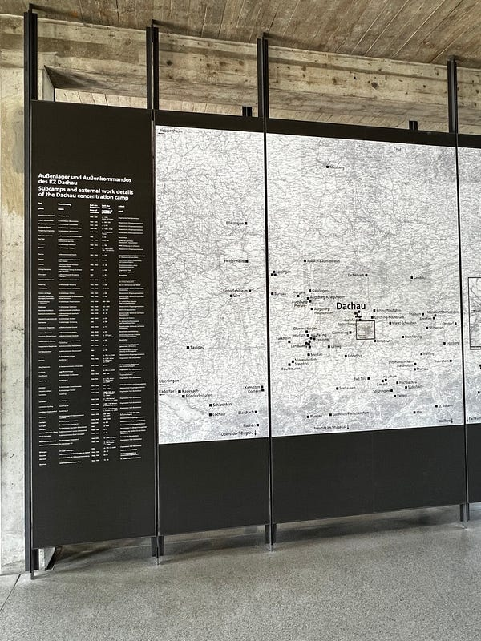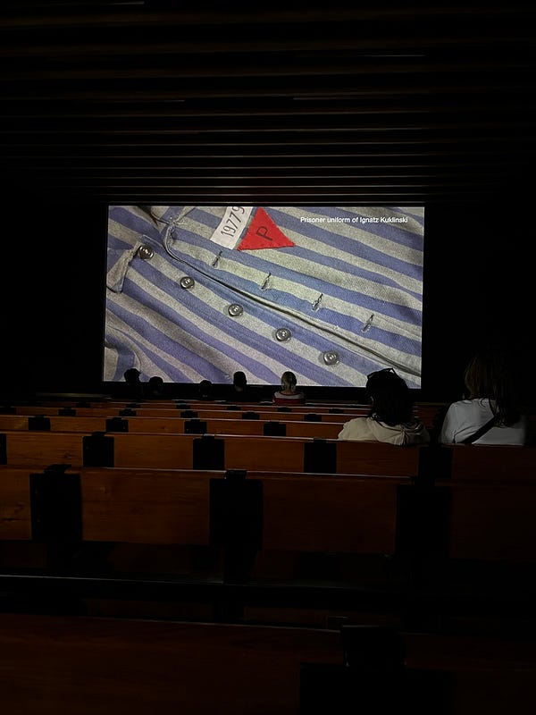

如果可以的話，建議先來慕尼黑的達豪集中營，再去紐倫堡的紐倫堡審判紀念館，這樣在時間軸順序來說比較順。但我其實也覺得達豪集中營對一般人真的太過沈重了，除非你對於歷史特別有興趣或是像我一樣覺得身為人類有義務親眼來看看集中營，不然其實也可以不要來，因為真的真的太沈重了！

看完之後我都覺得整個人心情很差，在紀念碑附近有一個寫著數種語言的銘文，英文版是 Never Again。希望人類能記取這段慘痛的教訓，不要再讓類似事情發生了！但是看看現在的烏俄戰爭跟以阿紛爭，人類根本沒有學到教訓啊，真的是讓人覺得憤怒又悲傷😭

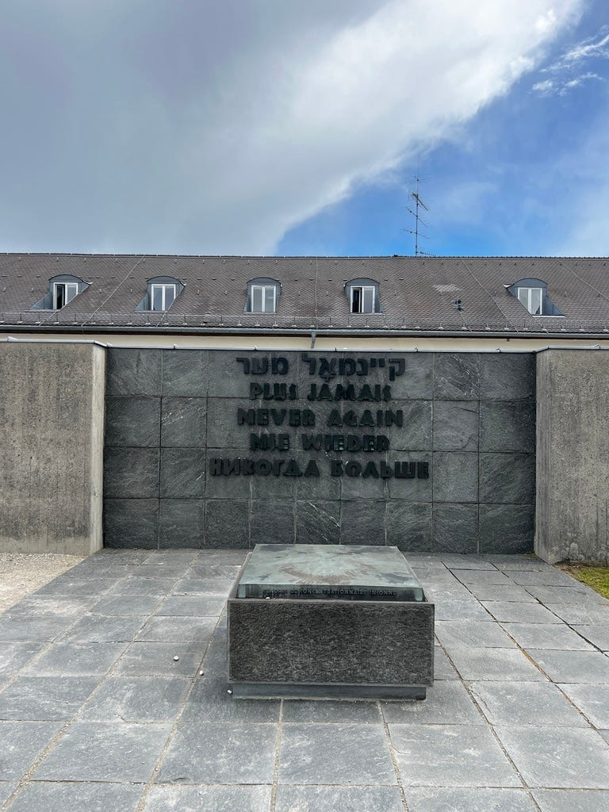Never Again 紀念碑


