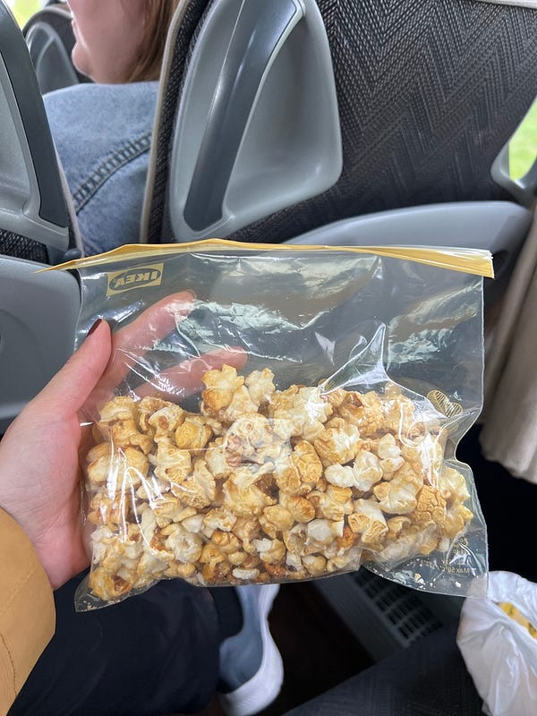
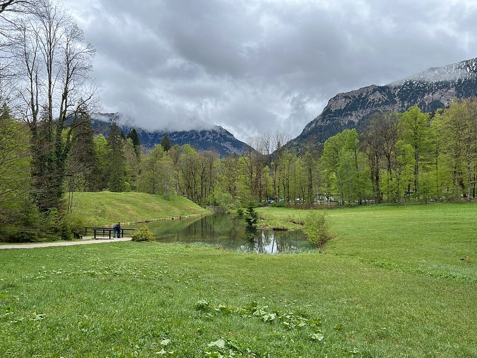
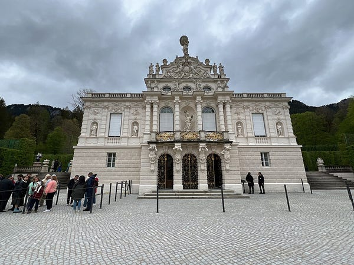
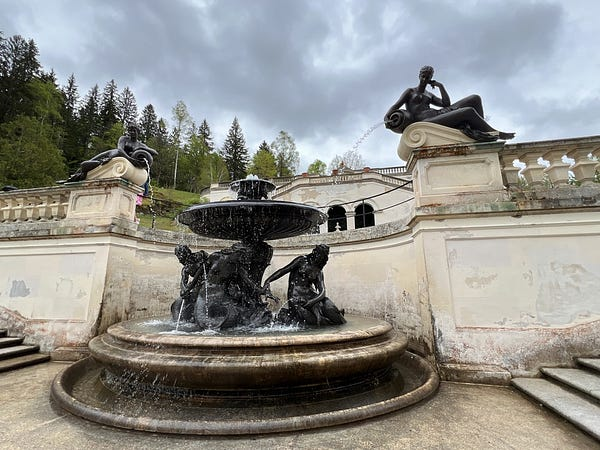
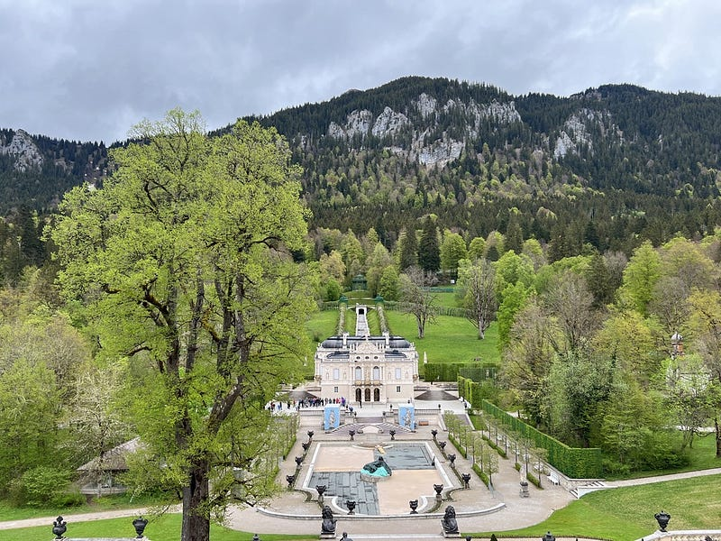
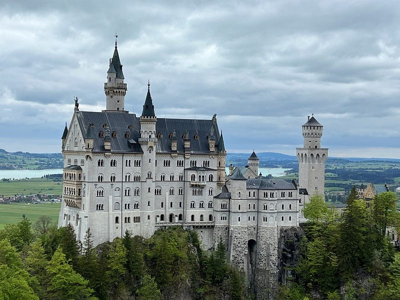
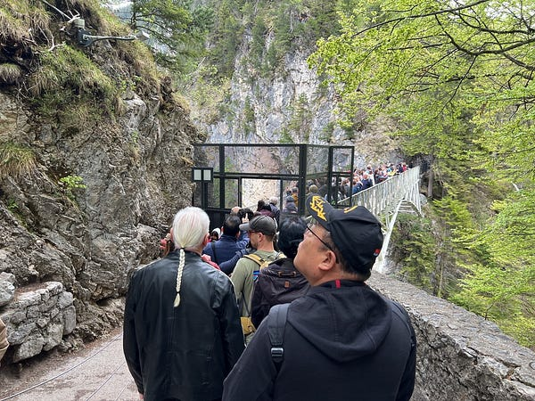
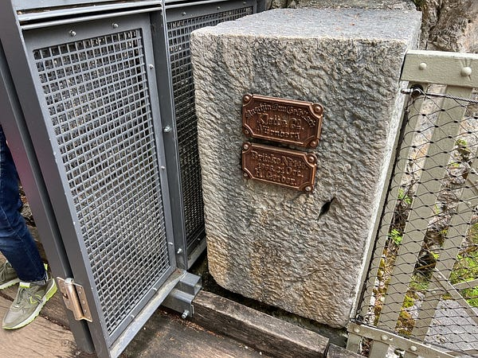

*從新天鵝堡遠眺舊天鵝堡*

今天我跟了 KKDay 的一日團，去參訪了林德霍夫宮跟新天鵝堡。

因為去新天鵝堡光交通就要兩個小時 (開車比較快)，而且新天鵝堡的門票一定要提前事先預約，所以我就決定直接跟團了事XD

新天鵝堡號稱是迪士尼城堡 logo 的原型，也是周杰倫拍婚紗的地方! (這件事我一直到今天才知道哈哈哈)

### 跟團心得

導覽小姐一路上講解超級認真，幾乎從頭到尾沒停過，還會順道分享一些德國小知識（例如大家都說德國的高速公路沒有速限，但事實上只有約 70%高速公路沒有速限)。我覺得她真的是很敬業！但服務態度我覺得80分吧，有時候還滿樂於回答的，但有時候態度也不是太好 lol)

強烈建議大家參加的時候一定要把厚重的衣服都帶上（反正都坐遊覽車了，東西放車上就好，也不會很重)。因為我們到林德霍夫宮之後就開始超爆冷的，已經可以看到山頂上的積雪了。然後零食也是盡量帶好帶滿，整路上食物準備最充足就是我XDD

我甚至還帶了我在紐倫堡買的爆米花（沒錯我還沒吃完)。

*林德霍夫宮的山景*

這個團只有包含遊覽車上的解說，如果要入內參觀兩個城堡，門票需要上車後另外用現金購買，兩個城堡一共是33歐。我上網查到的資訊是林德霍夫宮裡面其實滿小的，沒什麼好參觀的，外面的花園還比較漂亮，所以我就沒買這個門票，單買新天鵝堡的參觀門票是19歐。

### 林德霍夫宮 Schloss Linderhof

*林德霍夫宮*

林德霍夫宮從外觀看的確是滿小的，如果你看過其他歐洲城堡，我覺得看起來裝飾也不是特別精緻，難怪國王勵志要蓋一個超豪華新天鵝堡XDD

（PS: 這位花美男國王總共有四個城堡，林德霍夫宮其實是他住過最久的，新天鵝堡還沒蓋完之前，國王某天晚上出去散步然後就離奇死亡了囧。死因至今成迷！所以他其實沒住過他自己心中最完美的城堡：新天鵝堡）

至於林德霍夫宮外面的花園，因為我去的時候是四月底，一朵花我都沒看到XD

但我們在第一站停留的時間其實不是很長，所以我覺得拍一下城堡外觀，去花園登高望遠一下，接著跑回紀念品店的內咖啡廳喝咖啡對我來說是一個更有餘裕的行程~

### 新天鵝堡 Schloss Neuschwanstein

*瑪莉安橋才能拍到的最佳角度*

接下來第二個行程就是新天鵝堡了！雖然是跟團，但我覺得時間還滿充裕的，我們大約下午1:30抵達，5:30才離開。導覽小姐幫我們預約的導覽是下午4:10，參觀完內部之後走下來集合時間剛好差不多。

我因為自備了午餐（我在車上就吃完了XD），所以就不用花時間在餐廳用餐。稍微逛了一下山腳下之後，我就立刻搭接駁公車上山（需額外付錢）。

上山的方式有三種：

1\. 像我一樣搭接駁巴士：上山單程3歐，來回3.5歐，精打細算的人一定會覺得那就直接選來回？但導遊小姐強烈建議我們上山搭巴士省時間，下山用走的欣賞沿途風光，我的確就是按照她的建議。

2\. 用走的約30–40分鐘: 我看網路上很多人都說用走的非常輕鬆，但我建議大家最好不要XD

因為路雖然很平，但它是有坡度的，我下山走都覺得距離很長，上山真的不建議！畢竟我們有更重要的事要做：就是去瑪麗安橋搶位拍照

3\. 搭馬車，單程 8 歐: 網路上有部落客說她覺得馬很辛苦，建議大家不要去搭，我覺得這點就是見仁見智。但重點是馬走的路跟人走的路線是一樣的，要上瑪麗安橋還要再走15–20分鐘。我個人是覺得不如搭公車，一下車走5分鐘就可以到橋上了。

*瑪莉安橋*

瑪麗安橋的重要性在於，只有在這裡你才可以從最佳角度拍到新天鵝堡（就像在迪士尼logo 上的一樣)，當天遊客雖多，但是稍微等一下還是可以找到不錯的拍照角度。

通常會建議一到就先殺去瑪麗安橋拍照，然後再走去新天鵝堡，這樣你的打卡任務就完成一半了XD (像我拍完第一次之後覺得照片不滿意，我還跑回橋上再拍一次）。

據說這個橋平常是會有人數限制的，不能同時有太多人在橋上拍照。不過我當天去完全沒看到任何工作人員！上面的風非常大，而且很冷，重點是我覺得它是一個年久失修的木橋，有好幾塊木板踩下去都會發出快斷掉的聲音！超級驚恐！！！所以我真的覺得那座橋必須要有人數管制，然後懼高症的朋友我真心建議你也別去了，我走過很多高空木橋/鐵橋，這是我覺得最有安全疑慮的一個 (之後看瑞士遊記可以看到我走在3000多公尺高的冰山鐵橋上，證明我真的沒有懼高XD)

第二個任務就是參加內部導覽！

首先內部是不能拍照的，這點很特別。因為歐洲幾乎所有博物館跟宮殿，只要能參觀就能拍照。

我覺得內部其實很棒，很多可以看的地方。很多設計理念、很多很美的壁畫、裝飾！甚至當我往窗外一看，我立刻知道國王為什麼要把他的夢幻城堡蓋在這裡，因為窗外的景緻的太美了！難怪城堡都要蓋在懸崖上，除了易守難攻之外，景觀應該也是一大考量吧XD

但是他們的參觀規劃我不是很喜歡！每 10 分鐘會放約50–60人入場，每一個人給一台語音導覽機。同時還有一個導覽員，但這個人是控制進度用而已，每進到一個房間，導覽員按下按鈕後，你才會聽到那個房間的解說，不能自己想看什麼就看什麼。

而且每一批的人都過多，一開始我甚至都擠不進房間，當我還卡在走道動彈不得，我身後還有 10–20人，導覽員就按鈕了。所以當語音說明在說左邊這個是什麼什麼，右邊是什麼什麼的時候我完全看不到。然後講完之後，導覽員就前往下一個房間了，你只能快步跟上，完全不能自己之後再仔細看。

經過前兩個房間的失敗後，我立刻意識到我要趁機擠到前面緊跟導覽員，這樣才能聽到即時導覽。而且有時候我們明明還在走樓梯，他就按鈕了，這種不能自己控制的感覺真的有夠糟。你甚至也不能不管語音導覽就自己停下來看，因為下一批遊客跟導覽員都在你後面QAQ

其實是滿糟的一次參觀體驗，就像你去一家高級餐廳，所有的料理都是使用高級食材，結果廚師的料理方式很很差一樣。你明明知道這些材料可以表現出什麼樣的美味，但你現在只能囫圇吞棗 (哭)

參觀完之後，我還留在城堡裡看了一個簡短的城堡設計影片，3D城堡建模很酷！但一樣影片的設計可以再更加強，影片只有文字，甚至沒有配音，也沒有配樂，超乾的！新天鵝堡可以好好聘請新的展館設計團隊嗎？這個團隊真是太爛了，我建議你們可以去請紐倫堡的博物館設計團隊lol

然後我一路健走下山，也才剛好在5:30趕到遊覽車的集合點。那些跟我說什麼30–40分鐘輕鬆上山的人你們到底是誰？我好歹也是跑過兩次半馬跟隨便就可以健走3–5小時的人，你們的腿到底都是什麼做的？還是我年紀大了已經不復當年？XDD


