* * *

### **一個女生的歐洲獨旅:** 2024.05.04 奧地利 薩爾斯堡 (Salzburg) — 音樂神童莫札特的故鄉

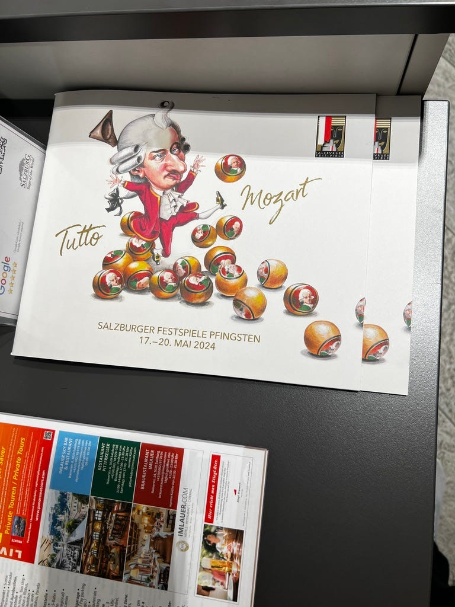薩爾斯堡遊客中心的莫札特小冊子

其實我的歐洲行程裡本來完全沒有規劃要去奧地利，只是到了慕尼黑後，我突然發現慕尼黑離奧地利的薩爾斯堡超近，只要 1.5–2 個小時的火車，再加上慕尼黑市區也沒有太多重要景點，唯一一個我特別想去的近郊景點達豪集中營，我也在抵達慕尼黑當天就成功跑完了，於是就決定把薩爾斯堡，也是莫札特的故鄉排進行程！

* * *

### 惡名昭彰的德鐵

今天早上出門前我在那邊東摸摸西摸摸差一點遲到，害我跑得要死！結果上車坐了 15 分鐘後，火車還是沒開。經過好幾次全德文廣播後，後方的乘客們突然開始大批移動，我當下完全搞不清楚發生了什麼事。直到途中有一個人用英文問了其中一個移動的乘客，我才知道他們要把火車分成兩段，只有前面那段會開，後面那段要留在原地，於是整個車廂的乘客就開始就非洲大遷徙一樣移動，真的很誇張！

移動過程中我還看到其他車廂有很多還不知道發生什麼事的乘客繼續坐在座位上。好險我今天是 day trip 沒帶行李，不然像其他扛著大行李箱坐跨國火車的其他遊客，豈不被德鐵搞死😭

最後總共等了半小時才開，開車時還有一桌乘客直接拍手慶祝XDD

### 薩爾斯堡

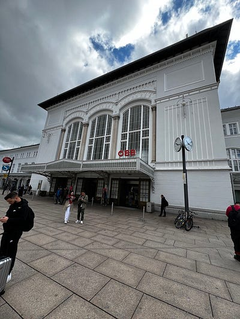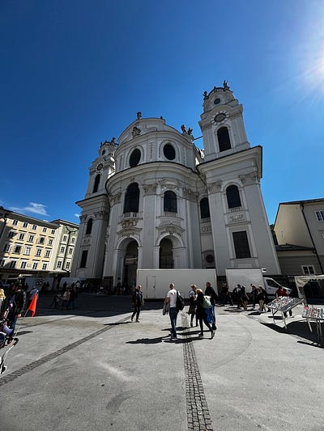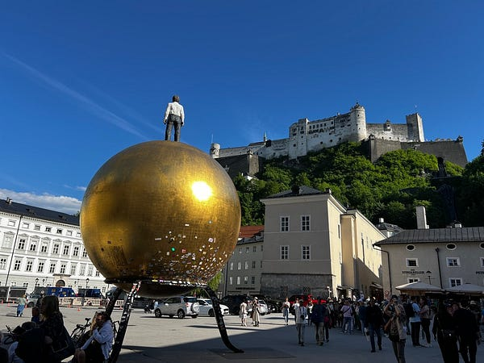薩爾斯堡火車站與街景

一到薩爾斯堡，其實沒有太多跨國的感覺，因為奧地利也是講德文XD (我真的覺得這就是住在歐洲有趣的地方，感覺火車坐一坐就有可能不小心出國!)

立刻去遊客中心買了24小時的薩爾斯堡卡，這張卡真的滿好用的，可以免費搭乘薩爾斯堡的各式交通工具、可以進多個博物館，甚至還可以搭40分鐘的游船，基本上只要去三個博物館就已經物超所值了！原價$31，出示歐洲鐵路通行證還可以再打9折，只要$27.9，就連我待不到12小時都覺得划算 (薩爾斯堡一個博物館的門票大概$13)！

### 莫札特的故鄉

既然來到莫札特的故鄉，就不能不參觀莫札特的相關景點！在薩爾斯堡，有兩個莫札特景點：

**莫扎特出生地 Mozart Birthplace**

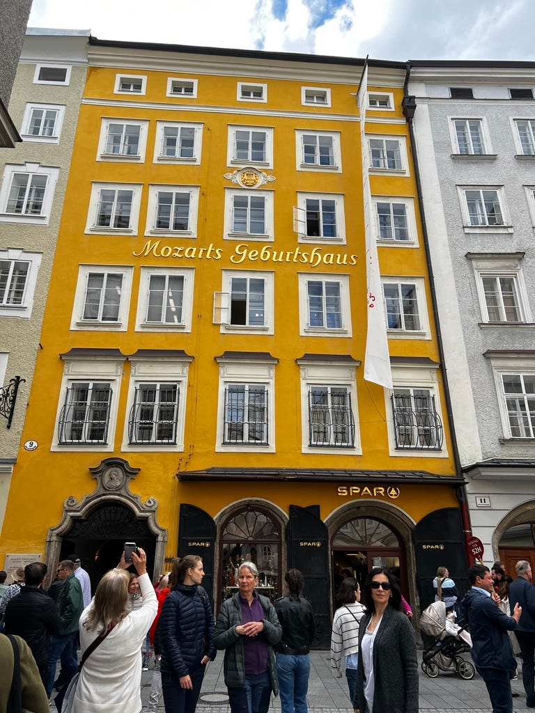 黃色那棟建築就是莫扎特出生地

這裡我非常驚訝的是莫札特他爸媽也租了26年的公寓，看來在薩爾斯堡買房也是不容易XDD

一進門就有一個莫札特Q版雕像，很可愛！而且這裡的說明都是德英對照好棒棒！

我覺得這個景點說真的沒有太令人驚豔，但還是可以勉強來參觀一下

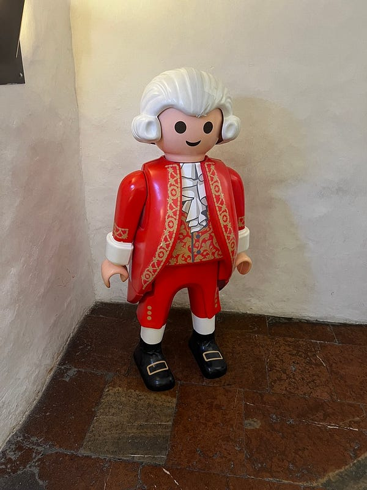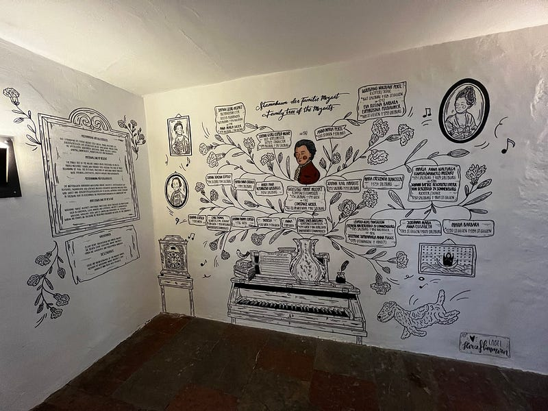莫札特雕像與壁畫

**莫扎特故居 Mozart Residence**

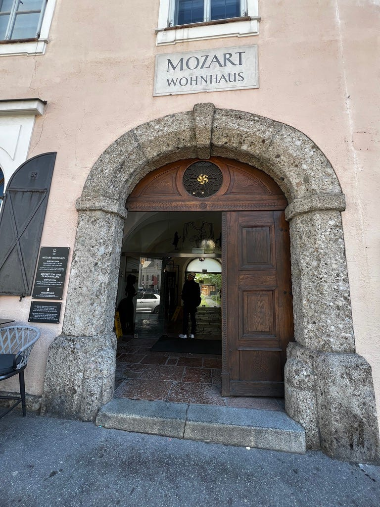 莫札特故居

另一個景點莫扎特故居，我建議大家千萬不要來，不僅浪費錢，還浪費時間！！！(除非你像我一樣已經買了薩爾斯堡卡，抱持著順便進來上免費廁所的心XDD)我覺得薩爾斯堡很大一部分就是瘋狂消費莫札特的城市lol

比起德國，奧地利是真的很想賺觀光客的錢哈哈

以下請聽我細細道來：

例如莫札特他家附近有一家莫札特咖啡廳，但咖啡廳其實跟莫札特一點關係都沒有，純粹就是老闆買下咖啡廳後，改名成莫札特咖啡廳而已

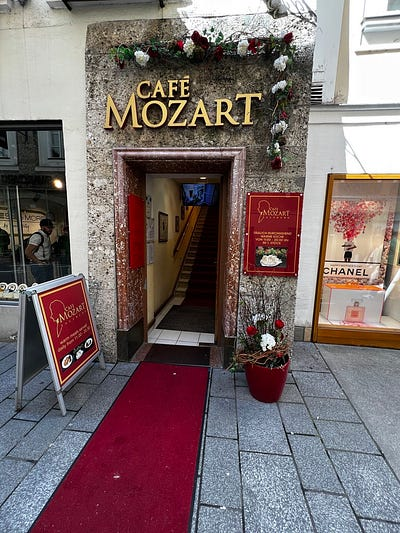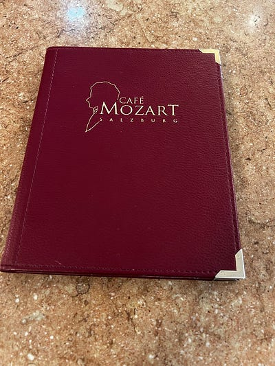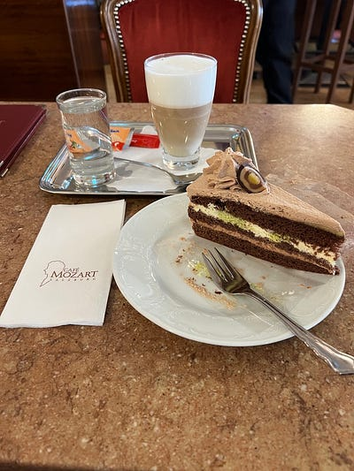莫札特咖啡廳

我在這裡吃了莫札特蛋糕，這個蛋糕也是以莫札特命名而已，跟他本人也是一點關係都沒有。總之成分就是巧克力蛋糕、奶油杏仁霜跟一層開心果。說實話，不怎樣，甚至都沒吃到開心果味lol

這就跟奧地利知名紀念品莫札特巧克力一樣，也是跟他本人一點關係都沒有喔！莫札特巧克力是在1890 年，由薩爾茲堡的糕點師 Paul Fürst 所研發的產品。外包裝印著大大的莫札特肖像，撥開包裝紙後，圓圓的本體最外層是黑巧克力，其中包裹著開心果、杏仁糖以及牛軋糖。你沒看錯，就是跟上述莫札特蛋糕類似的配方！

但我覺得大家要賺錢可不可以用點心？

你們隨便編一個莫札特超愛吃開心果的故事都好啊，這樣我掏錢會掏得更心甘情願一點??? 😂

而且這個莫札特巧克力，還有不同的版本，還有人專文分析教你買哪一種才是最正統的：[莫札特巧克力要買哪一種? 哪種莫札特巧克力才是真的? 奧地利必買伴手禮](https://inin.tw/mozartkugel/)

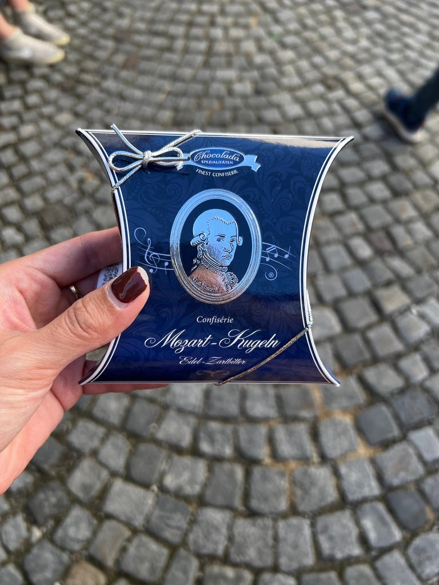只有在薩爾斯堡才能買到的版本

我剛好在路上看到這個據說只有在薩爾斯堡才能買到的正版手工巧克力，於是我就買了一個 6 顆的組合想說來體驗看看…… 我覺得真的好吃耶！

其實吃起來很像金莎的感覺，但比金莎更有層次，因為巧克力裡面還有牛軋糖跟開心果醬！但我覺得金莎在口感上又更勝一籌，因為金莎的外皮比較酥脆。值得嚐鮮跟送禮，但我覺得沒有大量購買的必要 (我買6顆要6.9歐，網誌說一顆通常要一歐以上，這個價錢是不是可以買三顆金莎？建議大家吃金莎就可以了XDD）

### **薩爾察赫河遊船 / Salzburg Stadt Schiff-Fahrt （€17)**

如果使用薩爾斯堡卡的話，只能兌換40分鐘的 Tour 1 行程，只有下午1–5點每個整點才有船班，建議可以先想好自己想搭哪個時段，早上先來換票，然後登船時間再回來。

不過呢，其實這個游船不坐也罷，因為簡直比法蘭克福的還要無聊，就算有薩爾斯堡卡其實也不建議你來坐(浪費我珍貴的時間)，如果要自己付17歐，那就更不值得了。

簡單心得：船長姊姊是個超瘦超正大正妹

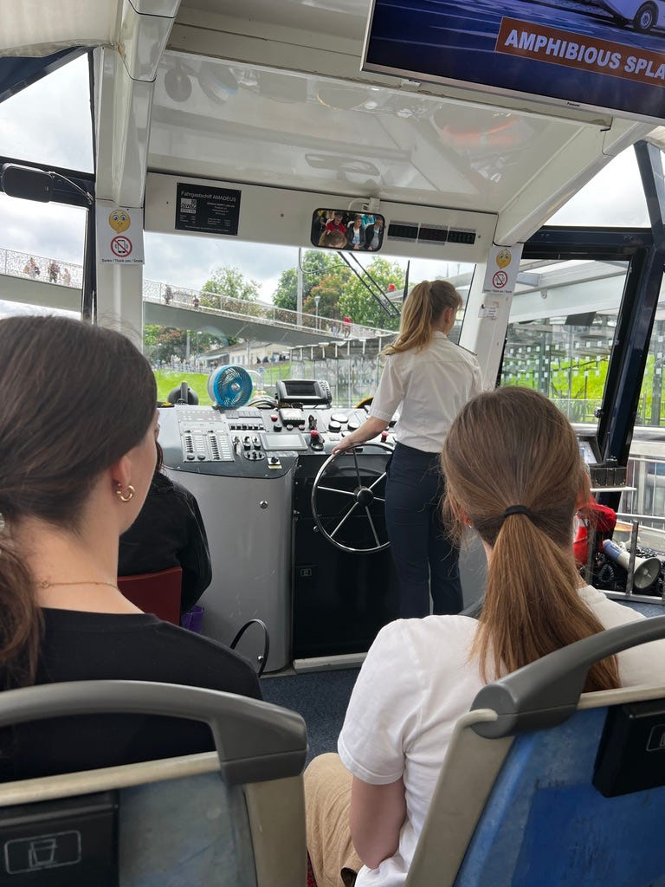船長姊姊的背影XD

### Stiegl-Brauwelt 啤酒廠

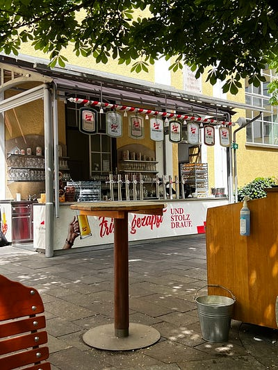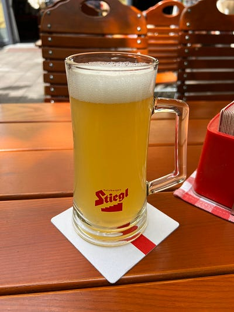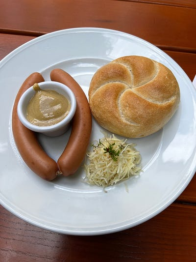酒廠午餐

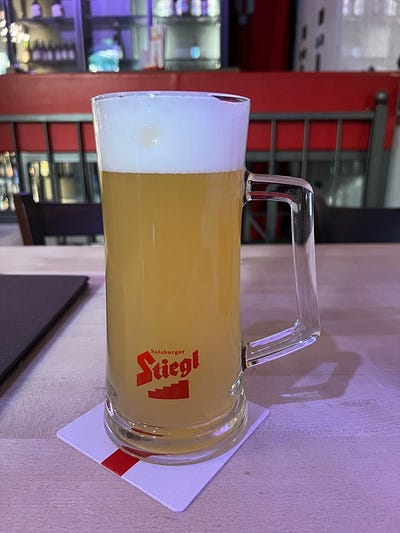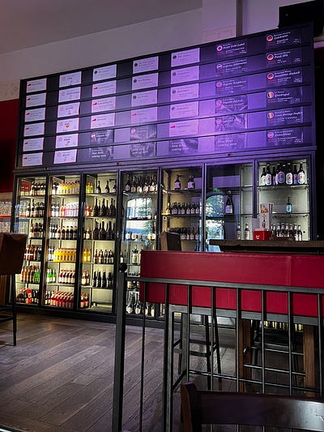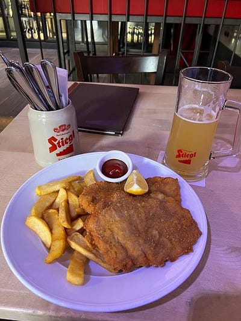酒廠晚餐

薩爾斯堡有個奧地利本土啤酒廠 Stiegl-Brauwelt 可以參觀（門票一樣是包在薩爾斯堡卡裡)，但我因為時間來不及所以沒辦法參觀他們的啤酒博物館。不過我的午餐跟晚餐都是在這裡吃的，我的媽啊！他們葡萄柚啤酒超級驚豔，檸檬啤酒也不錯！不知道澳洲能不能買到？

午餐我因為趕時間就點了一個簡單的法蘭克福香腸，香腸跟麵包都一般，但是那個他們自製的黃芥末醬，爆炸好吃！好吃到值得帶一罐回家，但我本人其實也沒有很常吃熱狗，所以作罷XD

### 薩爾斯堡要塞&要塞纜車Festung Hohensalzburg

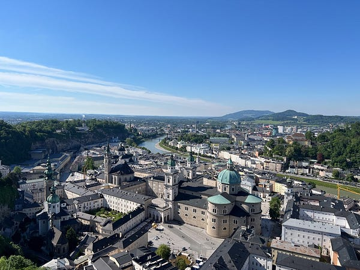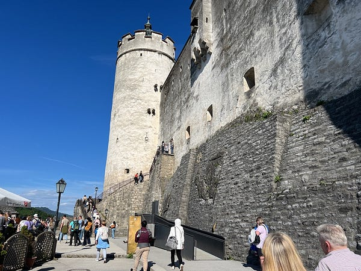薩爾斯堡要塞

門票跟上下纜車票也都包在薩爾斯堡卡裡！我個人建議時間有限的人上下山都直接坐纜車，因為山上超美，可以俯瞰薩爾斯堡的美景，會花很多時間拍風景照跟自拍照。

博物館本身我覺得還可以，有空可以去參觀一下，但略過的話也不可惜。

### Mönchsberg Elevator

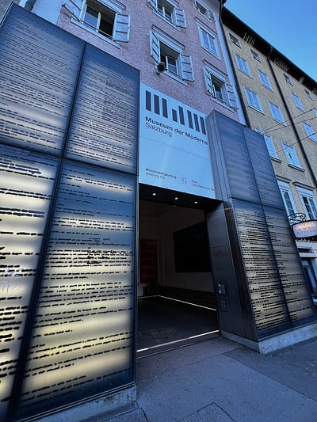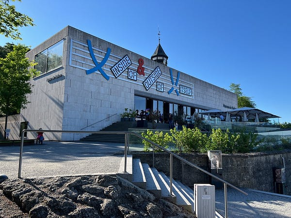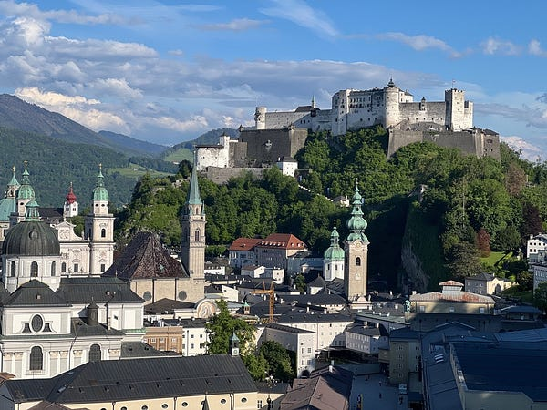Mönchsberg Elevator

最後一個景點是 Mönchsberg Elevator，這是位於現代美術館旁邊的電梯，搭上去之後有個觀景平台，我個人覺得很適合黃昏時去，如果可以待到晚上的話聽說夜景很棒！

你可能會說，等等，我們剛剛不是已經去過薩爾斯堡要塞看城市美景了嗎，為什麼現在要再看一次？

因為站在薩爾斯堡要塞上，你就看不到雄偉的薩爾斯堡要塞啊（是不是很有哲理？但仔細一想又覺得是廢話哈哈）

這兩個景點剛好在城市的兩邊，不過反正有薩爾斯堡卡的情況下，搭什麼交通工具都免費，建議兩個都去！

### 旅行紀念品

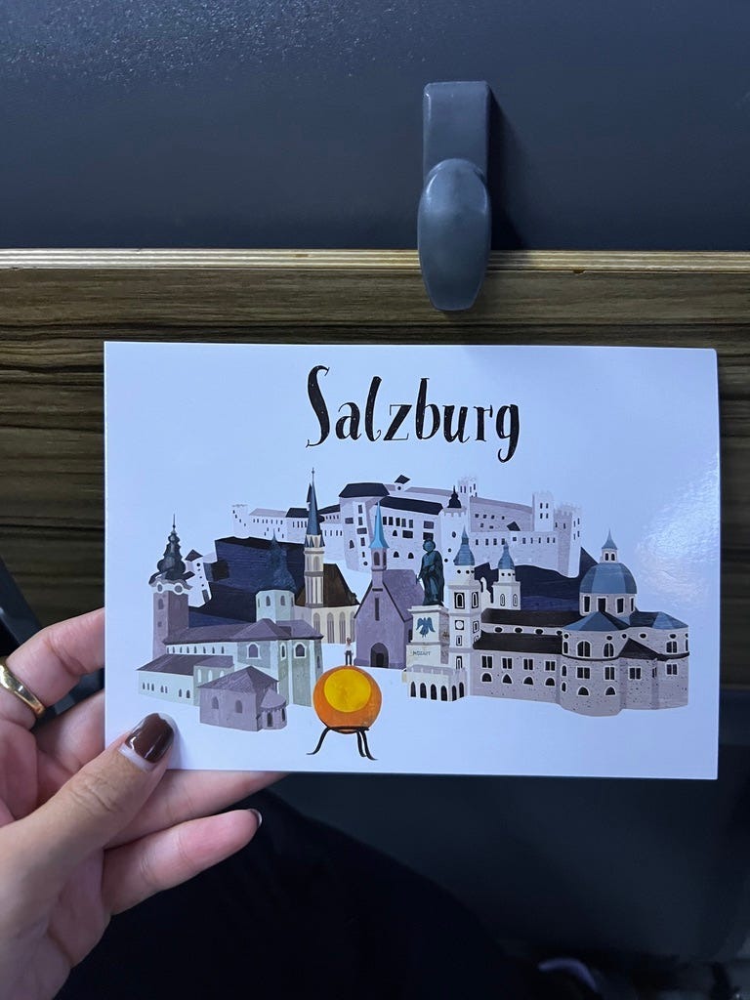超可愛的薩爾斯堡明信片

每次旅行其實我會買的紀念品都只有明信片而已XD

因為家人都在台灣，就算我買了什麼零食餅乾也只會胖死我自己而已！但今天我發現我最愛的明信片類型好像就是這種以插畫方式描繪一個城市的主要景點的風格，以後有機會跟你們展示一下我的收藏！

因為難得來一趟，而且我真的覺得薩爾斯堡很好玩，於是我一直待到晚上八點才準備坐火車準備回慕尼黑~ 我還滿推薦大家在薩爾斯堡停留個1–3晚的，可以去附近的景點國王湖 (國王湖雖然位於德國，但從薩爾斯堡過去其實比較近喔XD)

* * *

**為了服務廣大讀者，雲端架構師 EC 線上諮詢服務，正式上線囉！如果你想要跟 EC 進行 1:1 線上職涯諮詢，麻煩請填寫：**[**雲端架構師 EC 諮詢服務預約表單**](https://forms.gle/Zuro8YryCN5hH9Gk9)

**如果想要進一步支持我，歡迎透過**[**以下連結**](https://donate.stripe.com/8wM8xU44n5Ld9Q4bIJ)**請我喝一杯咖啡！你們的支持是我持續創作的動力，如有任何問題或是想要看的主題，歡迎留言與我互動 :)**

  * YouTube 頻道 (歐洲獨旅影片緩慢上線中)：<https://www.youtube.com/@CloudJourneyWithEC>

