---

title: "一個女生的歐洲獨旅: 2024.05.05 前往瑞士：茵特拉肯 (Interlaken) 韓劇愛的迫降拍攝地"
date: 2024-07-13
slug: "2024-07-13-interlaken-day-1"
cover:
  image: "images/medium-1*acW3_5doCStJ1vXN8J7LQw.jpg"
  alt: "茵特拉肯東站眺望阿爾卑斯山景"
  caption: "Interlaken Ost 火車站的超美山景"
images: ['images/medium-1*acW3_5doCStJ1vXN8J7LQw.jpg', 'images/medium-1*I7E1Oya3h_eOmuCjJcdw4A.jpg', 'images/medium-1*sEEzejIzrrAoFyfsr8thlg.jpg', 'images/medium-1*nIAj9UUiDoOzskR0fbMwyg.jpg', 'images/medium-1*1UtXOB1te4T0v3eiJDFUrg.jpg', 'images/medium-1*HjRHZhNwcQnIVg4jn_SvVw.jpg', 'images/medium-1*F5wtoaIyLJ9C40hKen797w.jpg', 'images/medium-1*cuzT-LeP31Ax8lmxX97qPw.jpg', 'images/medium-1*5U9PawSUHU3hNLZ_xRVdXg.jpg', 'images/medium-1*K9cT7oonbB1O7mHeCjXg3w.jpg', 'images/medium-1*FaBum1pCBGfzA7KV7ZlwWw.jpg', 'images/medium-1*9vUF5YroGUbqFNabuHPvBg.jpg', 'images/medium-1*UwkYbB2L6UalvkbI0zPInA.jpg', 'images/medium-1*U98n-QBq2e3aOJ1ac95aYA.jpg', 'images/medium-1*ka9cMlBKbsogGn32adamDQ.jpg', 'images/medium-1*qgMdlg4ZWAOru3ilkX8Lng.jpg', 'images/medium-1*dGETJcrQtBBjjDYgpAtYTw.jpg', 'images/medium-1*AhWPQJnVEl3vD-5VPwvyFA.jpg', 'images/medium-0*BPq3oedhBT5fxtFq.png']
categories: ["旅行紀錄"]
tags: ["獨旅","旅遊", "歐洲", "瑞士"]
episodeseries: ["一個女生的歐洲獨旅"]
---

* * *

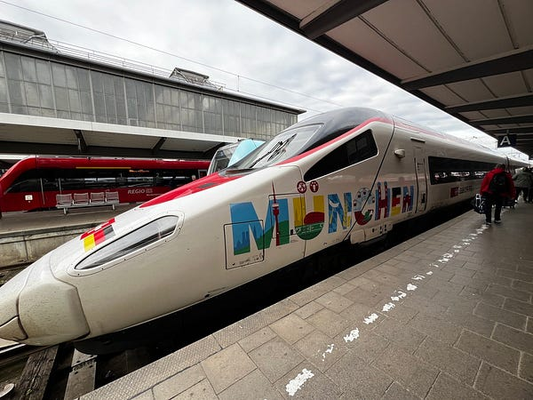

*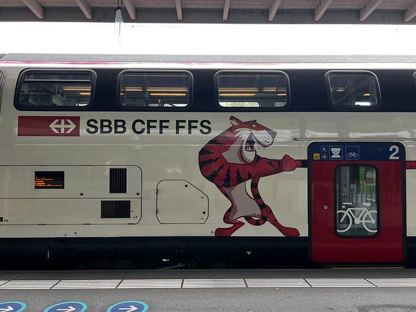後來才發現這班火車使用的是瑞鐵 SBB 的車廂*

今天直接從德國慕尼黑前往瑞士茵特拉肯 (Interlaken)，因為沒有直達車，所以必須要在瑞士蘇黎世轉車。前一天我還特地又確認了一次火車時刻表，沒想到我在開車前的一小時收到通知說這班火車現在不停蘇黎世了⋯⋯這麼大的站你們說不停就不停😂

### 德鐵我好怕

德鐵的 app 給了我幾個選項：

  * 選項一：從一次轉車變成兩次轉車。第一趟火車還是從慕尼黑出發，先坐到一個小鎮 (轉車時間 4 分鐘)，第二段從小鎮轉慢車到蘇黎世(轉車時間 11 分鐘)，然後第三段車再接回本來去瑞士的火車！除非月台就在對面，不然扛著大行李的我是不可能趕上的 😭
  * 選項二: 還是轉一次車，但走另一個路線，所以整體車程會從 6 小時拉到 7 小時，我覺得今天拉車 6 小時已經很長了，我實在不想再多花一個小時在火車上。
  * 選項三: 跟原版的選項 1 的行程一樣，只是晚兩個小時出發。這個我也不太想選，因為我已經被德鐵嚇怕了，誰知道如果我多等兩個小時，之後的火車會不會有問題呢？

所以我後來還是決定走選項一，且戰且走。上車後我發現這台車上還是寫著我預訂的座位是慕尼黑到蘇黎世，好莫名其妙❓

不過這班是德鐵跟瑞鐵共營，我交叉比對了兩個 app 上的資訊，發現瑞鐵 app 上有月台資訊，看月台號碼應該是對面月台轉車！

### 瑞鐵心得

我後來覺得瑞士高鐵真是太棒了，火車上都是德英雙語廣播 (德國火車就算跨國也都是純德語廣播😂)！後來才知道這台車因為技術問題的確不會到蘇黎世，查票員還一個一個跟大家提醒等一下一定要下車，超 nice! 而且我後來發現瑞士的火車班次都是設計過的，力求轉車最方便，我後來下車後發現第二班車果然就在對面月台，而且感覺列車長跟查票員都跟我們一起換到這台車，我快笑死XDD (因為上車後的查票員跟車長廣播都是同樣的聲音)

後來也順利搭上第三班車！不過我中間在車站整理行李整理得太過忘我，差點錯過這班車，好險最後在開車前兩分鐘上車，但也因此沒有辦法扛著行李箱走去我預訂的座位！於是我就誤打誤撞坐在餐車旁邊，後來看我旁邊的旅客也移進餐車，我覺得進去喝杯飲料也不錯，於是就開始了我的歐洲火車餐車初體驗！不得不說餐車的位子真的舒適很多，但進來一定要消費，不然會被請出去（我就看到不知情的旅客被請出去😂）。

我點了一杯熱巧，要價 5.1 瑞士法朗，不得不說瑞士果然是一個超級貴的地方！而且這裡的熱巧克力居然是給我一杯熱牛奶跟一包沖泡巧克力粉，太妙了XDD

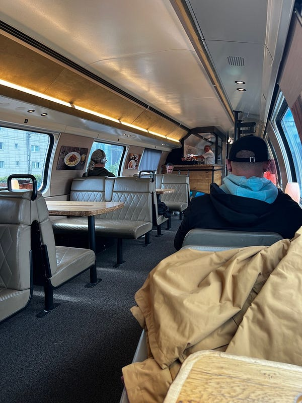

*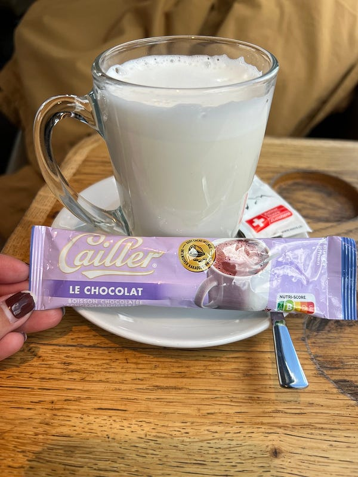餐車座位以及我點的熱巧克力*

### 愛的迫降拍攝點：布里恩茨湖 Brienzersee

在火車上研究後發現，我今晚住宿點 Interlaken 附近有一個湖，湖的游船費用也包含在我今天的歐洲鐵路通行證裡面！所以我決定等一下到了之後，先把行李寄放在車站，然後搭火車去渡輪點！也就是今天除了六個小時的火車之外，還要坐個一小時的渡輪，簡直就是交通工具之旅XDD

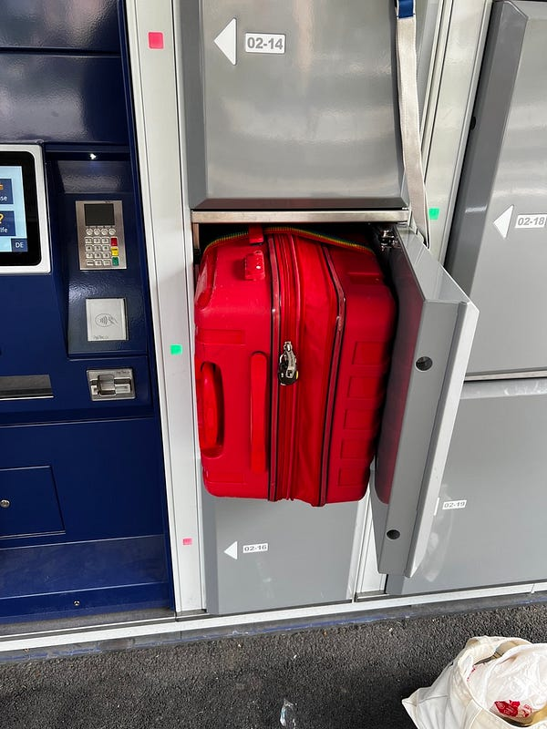

*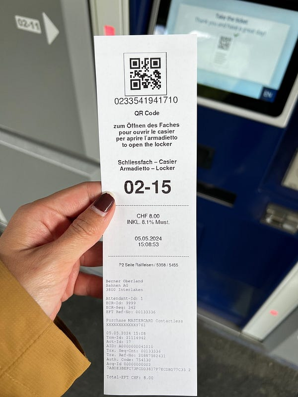Interlaken Ost 車站寄放行李*

好不容易到了 Interlaken Ost (Ost 就是東站的意思，基本上是這個小鎮的交通樞紐，所有去少女峰的交通都是由此出發)，我立刻去寄放行李！我的 23 寸行李箱加大後剛好可以塞進小的置物櫃，省了 2CHF (其實大的 10 元小的 8 元，並沒有差很多)，然後轉搭火車前往 Breinz 小鎮。有時間的話滿建議過來的，很適合拍照。

布里恩茨湖 Brienzersee 就是愛的迫降的拍攝地（但我其實沒看過，好像有人說淚之女王也是在這裡拍的？但我一樣沒看就是了XD)

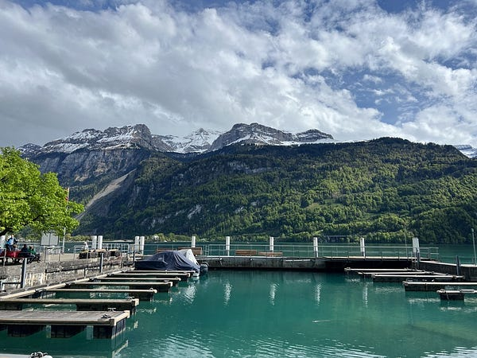

*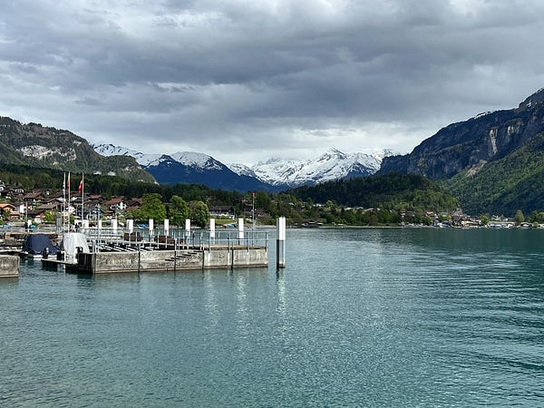*

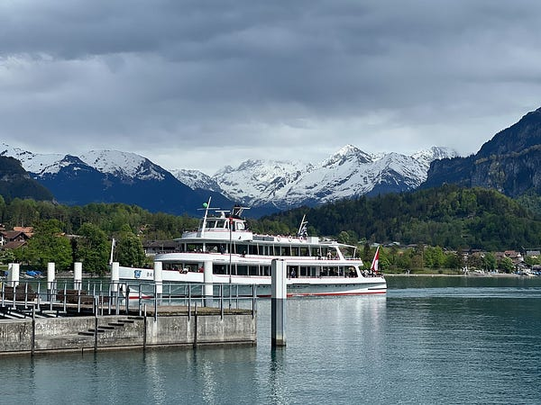

*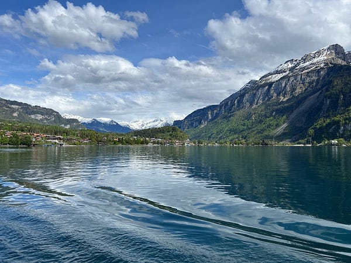布里恩茨湖真的超美！！！*

總之，不管你是不是韓劇迷，這裡我都很推薦來，因為真是太美啦!!!

拍完照之後剛好渡輪就來了! 渡輪本身的風光很棒，但是航程很長，所以也可以看到很多觀光客中途就下船改坐火車回去。我因為把行李寄在東站，所以覺得直接搭到終點也無所謂。

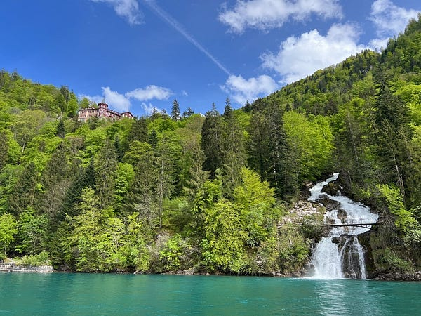

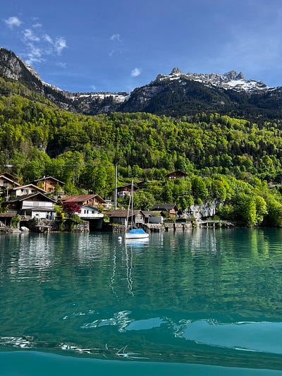

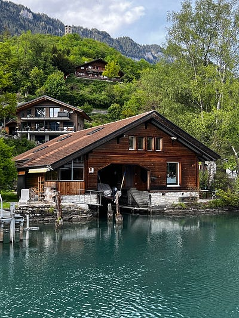

*遊湖渡輪上的風景*

### 瑞士 Interlaken 住宿

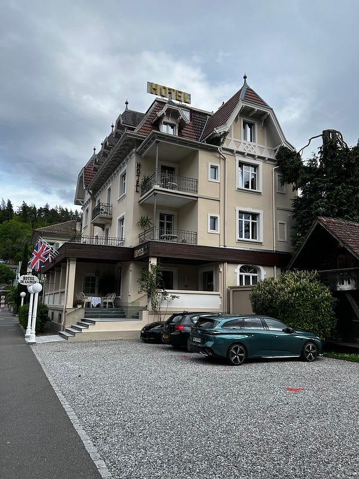

*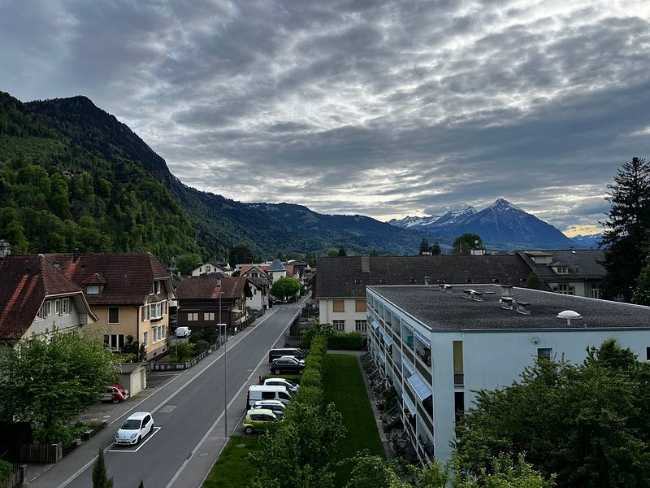三星旅館以及房間的窗景*

瑞士的旅館真心超級無敵貴！我訂了一個在西站的單人房（西站吃的東西比較多也比較繁榮)，只要入住 Interlaken 的飯店，他們好像都會送當地的交通卡，所以我覺得住哪的差別可能不是很大！

超迷你只有 8 平方公尺的單人房，也沒有廚房設備，一晚要 185 澳幣，不過他們有附早餐！這裡的住宿價格真的很貴，如果不想要住 hostel 或 shared bathroom，這已經是我能挑到最便宜的選項了

### 晚餐 Little Thai

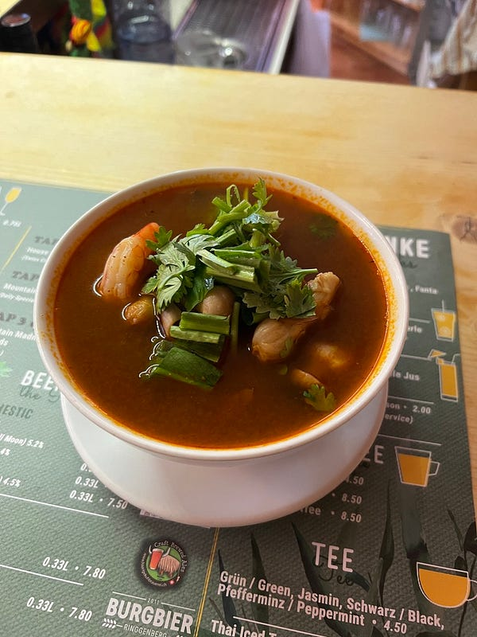

*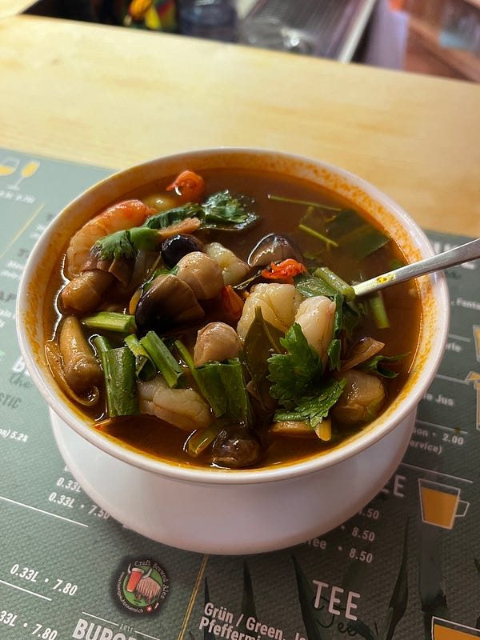料超多的 tom yum soup*

今天坐了 7 個小時火車加 75 分鐘的渡輪，我真的很需要一晚亞洲熱湯。於是我查到一家要走路 15 分鐘的泰式餐廳（我當下其實已經累爆了，但想說瑞士外食很貴，既然錢都要花了，我一定要吃到評價高且好吃的XDD）

小小一碗 tom yum 要價 $23.5 瑞士法郎（也就是 40 澳幣），超貴，但是料很豐富，而且泰國姊姊一直叫我 dear，服務態度超好！我覺得這個似乎在瑞士算是外食的正常價格範圍，所以覺得還 ok

吃完之後真的不飽，但看了一下菜單就算是 entree 炸春捲一個也要瑞士法郎 $4 (也就是一根手指大的炸春捲大概要 $6 澳幣)，三個 $11。於是我當機立斷，查了 google maps 立刻去隔壁買了便宜又巨大的好吃 Kebab 才 $12

我覺得這可能是我這一趟旅程最希望有旅伴的時刻哈哈哈～ 因為要是我們有兩個人，一個人點 tom yum soup ，另一個人點 pad thai 或是咖喱，這樣平分下來一個人還是出 $40 澳幣，但這樣我們就可以吃得心滿意足了
