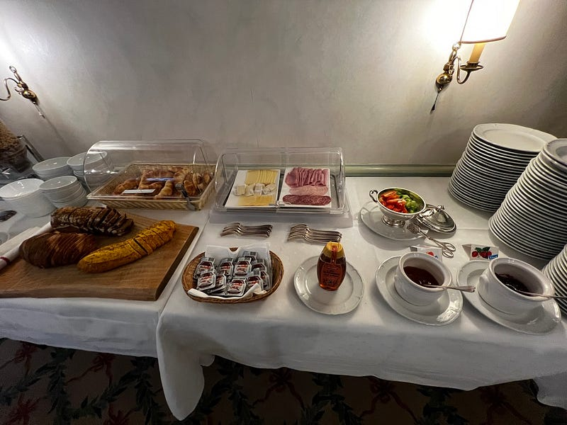
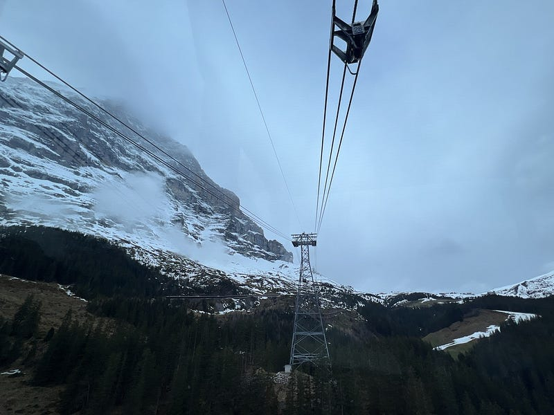
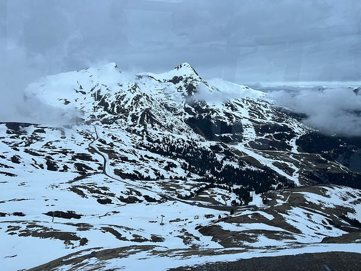
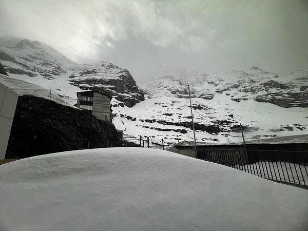
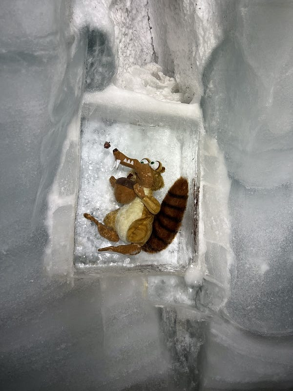
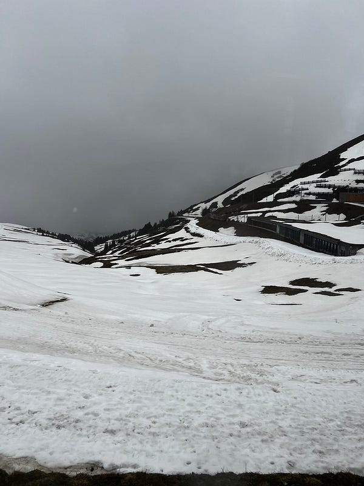

---

title: "一個女生的歐洲獨旅: 2024.05.06 瑞士茵特拉肯 (Interlaken) Day 2: 少女峰 (Jungfraujoch) 我來了"
date: 2024-07-13
slug: "2024-07-13-interlaken-day-2"
cover:
  image: "images/medium-1*FKFO1iIoEihVDTSUawOK7g.jpg"
  alt: "少女峰阿爾卑斯山全景"
  caption: "瑞士山景"
images: ['images/medium-1*FKFO1iIoEihVDTSUawOK7g.jpg', 'images/medium-1*4_ros_GnNM5a6f6KFkFBTA.jpg', 'images/medium-1*OUsYKhQqw4Iw0KiY1s1UcA.jpg', 'images/medium-1*YZdaYtKNuIgjeRCl1M8Oaw.jpg', 'images/medium-1*fDxKKDLF_1NncOV6OWOYEA.jpg', 'images/medium-1*wsPbfkR_gE7AqiYeF0fZjQ.jpg', 'images/medium-1*anhkWVoujSO9PUXyZhXylQ.jpg', 'images/medium-1*BqXkSsIzn7NKRdzQz4F14w.jpg', 'images/medium-1*V6yVfY5e-xc1meY5A611qA.jpg', 'images/medium-1*fTGsJSE0BOmbOzq7opfkCw.jpg', 'images/medium-1*m-SrPJ290vkMQhp8GokNtg.jpg', 'images/medium-1*0LHs1jw9rGp7t0TWAW88tg.jpg', 'images/medium-1*0gTDz3-Iz4_EYu_DZKGzLw.jpg', 'images/medium-0*oIRZcoDMy4YKZ_O8.png']
categories: ["旅行紀錄"]
tags: ["獨旅","旅遊", "歐洲", "瑞士"]
episodeseries: ["一個女生的歐洲獨旅"]
---

*此行唯一有附早餐的飯店住宿，吃得超開心！*

因為瑞士山區的天氣變化多端，大家都說等到了當地之後，再視天氣決定是否要買上少女峰的車票 (Top of Europe)，因為一張票要價約 6500 台幣。

其實我覺得瑞士的觀光真的做得不錯，他們在各大景點的山上都有設置 web cam，所以可以當天早上看一下 web cam 再決定是否上山，因為如果天氣不佳，上千就是白茫茫一片什麼也看不到。請參考：[少女峰 live web cam](https://www.jungfrau.ch/en-gb/live/webcams/)

但我後來發現這個理論其實不太成立，例如我在 Interlaken 就只待兩個整天，而這兩天的天氣預報都不妙，但我都千里迢迢來這了，我要因此放棄上山的機會嗎？😂 所以明知 web cams 看了的確是一片霧茫茫，我還是買了票XD

*左：瑞士火車窗邊會附上各景點的路徑簡圖。右：上山的過程真是霧茫茫一片*

另外建議買票自己上網站買就可以了(官網購票連結：[Jungfraujoch — Top of Europe](https://www.jungfrau.ch/en-gb/)

*)，使用歐洲火車通行證打 75 折，而且還可以免費升級一等車廂跟預約座位。我是在遊客中心買的票，阿姨什麼也沒跟我說，甚至連怎麼上山都沒說，地圖還是我要了才給，所以我給遊客中心的阿姨 0 分😂*

不過我一直以為出示歐洲火車通行證就可以獲得 75 折折扣，結果居然要使用 travel day 才可以（我在火車上被查票時才知道!查票員說不用的話要補差價 $76，所以我還是用了)⋯⋯早知如此，我不如直接買打 8 折的早鳥票哈哈哈，請參考 [Morning Pass](https://www.jungfrau.ch/en-gb/jungfraujoch-top-of-europe/good-morning-ticket/) (只能搭特定班次)。

*第一站*

少女峰上有個特殊的 top of Europe coffee，裡面是咖啡加焦糖加鮮奶，其實感覺更接近甜點！一杯 9.9 瑞士法朗(約 350），我點完之後才發現馬克杯可以帶走 (我當初是覺得一杯普通拿鐵是 $7.4，不如點這個拍照好看 台幣)。而且服務生姐姐好聰明，裡面先用紙杯裝！德國的新天鵝堡也有類似的買咖啡含咖啡杯的飲料，但那邊的咖啡店就是直接把咖啡到盡馬克杯，我看到好幾個拿著髒馬克杯繼續行程的遊客XDD

*超可愛的 Top of Europe Coffee*

參觀過程中我跟一個印度家庭聊起來，裡面有個印度妹妹(大概 20 出頭吧)，不僅主動幫我拍照，還要求要跟我合照(我也不明白為什麼XD)，然後我跟他們說我是個已經住在澳洲 10 幾年的台灣人，結果他們一家人完全嚇一大跳，因為他們還以為我 20 出頭XDDD

當天天氣真的不是很好，絕大部分時間山上都是霧茫茫一片，完全看不到風景，不過其實少女峰上還是有滿多室內景點可供拍照與參觀，我個人對於上山這個決定還是沒有感到後悔 (但之後在琉森的鐵力士山我很幸運在山上遇到大晴天，風景真的是美翻，請大家敬請期待囉～)

**

*少女峰*
