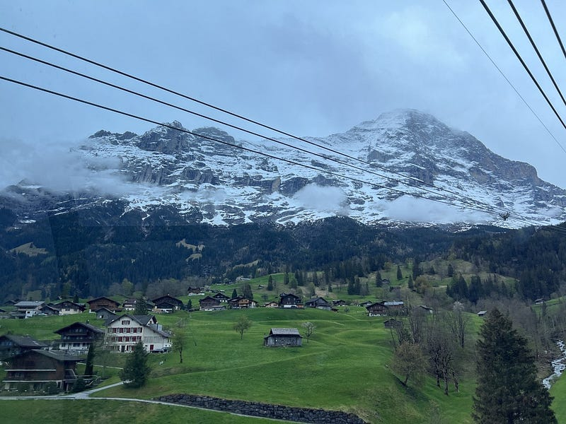
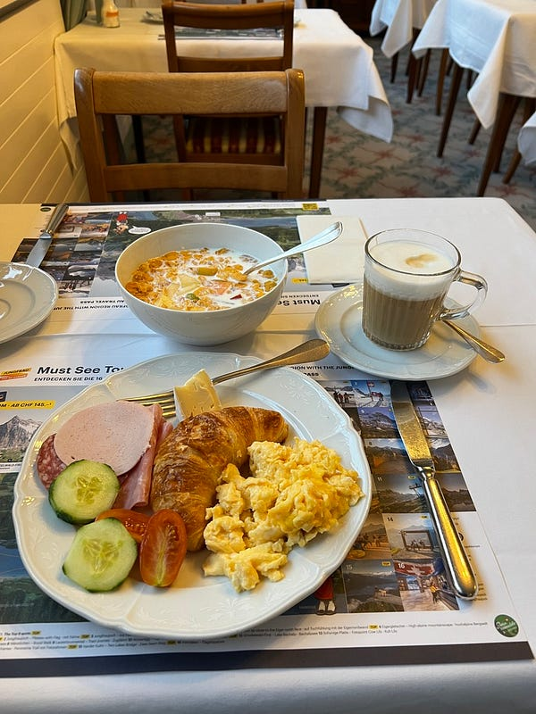
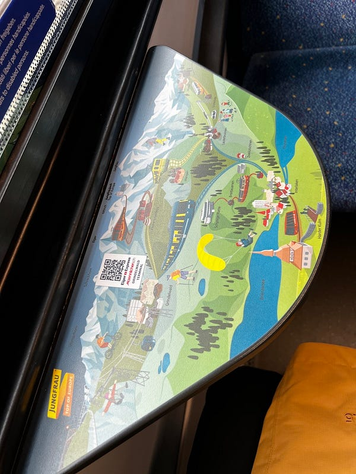
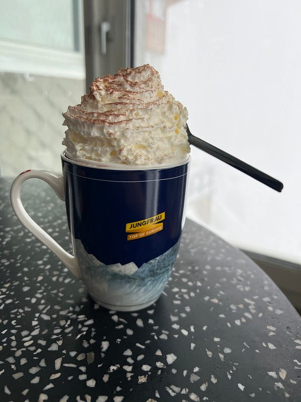
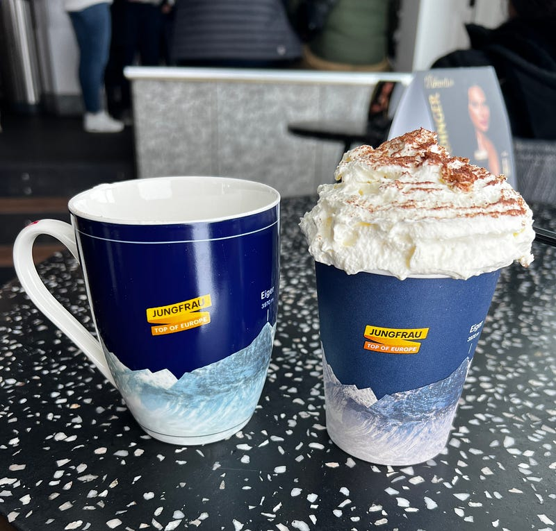
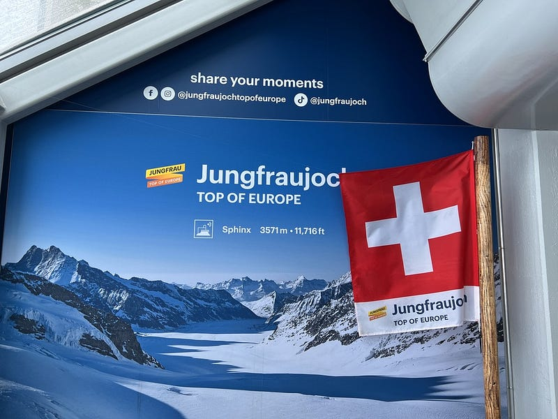
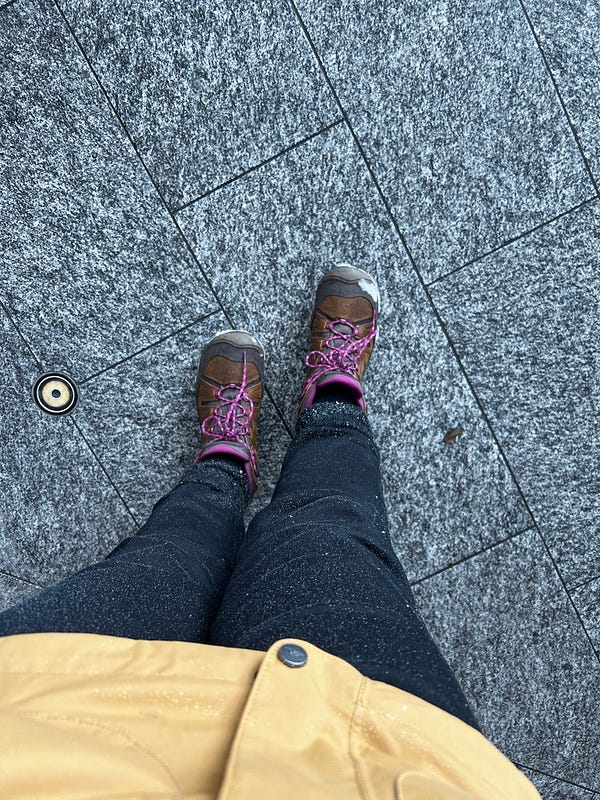

* * *

### **一個女生的歐洲獨旅:** 2024.05.06 瑞士茵特拉肯 (Interlaken) Day 2: 少女峰 (Jungfraujoch) 我來了

瑞士山景

非 Medium 付費會員，[請點此免費閱讀這篇文章](https://medium.com/@cloudarchitectec/6a76934a623c?source=friends_link&sk=9abf63a04bd87fd3ec8e9e5cc2a70a8f)！當然如果你願意加入 Medium 付費會員來支持創作者，那就更棒囉～感謝你的閱讀！

* * *

此行唯一有附早餐的飯店住宿，吃得超開心！

因為瑞士山區的天氣變化多端，大家都說等到了當地之後，再視天氣決定是否要買上少女峰的車票 (Top of Europe)，因為一張票要價約台幣$6500。

其實我覺得瑞士的觀光真的做得不錯，他們在各大景點的山上都有設置 web cam，所以可以當天早上看一下 web cam 再決定是否上山，因為如果天氣不佳，上千就是白茫茫一片什麼也看不到。請參考：[少女峰 live web cam](https://www.jungfrau.ch/en-gb/live/webcams/)

但我後來發現這個理論其實不太成立，例如我在 Interlaken 就只待兩個整天，而這兩天的天氣預報都不妙，但我都千里迢迢來這了，我要因此放棄上山的機會嗎？😂 所以明知 web cams 看了的確是一片霧茫茫，我還是買了票XD

左：瑞士火車窗邊會附上各景點的路徑簡圖。右：上山的過程真是霧茫茫一片

另外建議買票自己上網站買就可以了(官網購票連結：[Jungfraujoch — Top of Europe](https://www.jungfrau.ch/en-gb/))，使用歐洲火車通行證打 75 折，而且還可以免費升級一等車廂跟預約座位。我是在遊客中心買的票，阿姨什麼也沒跟我說，甚至連怎麼上山都沒說，地圖還是我要了才給，所以我給遊客中心的阿姨 0 分😂

不過我一直以為出示歐洲火車通行證就可以獲得75折折扣，結果居然要使用 travel day 才可以（我在火車上被查票時才知道!查票員說不用的話要補差價$76，所以我還是用了)⋯⋯早知如此，我不如直接買打 8 折的早鳥票哈哈哈，請參考 [Morning Pass](https://www.jungfrau.ch/en-gb/jungfraujoch-top-of-europe/good-morning-ticket/) (只能搭特定班次)。

第一站

少女峰上有個特殊的 top of Europe coffee，裡面是咖啡加焦糖加鮮奶，其實感覺更接近甜點！一杯9.9瑞士法朗(約台幣350），我點完之後才發現馬克杯可以帶走 (我當初是覺得一杯普通拿鐵是$7.4，不如點這個拍照好看)。而且服務生姐姐好聰明，裡面先用紙杯裝！德國的新天鵝堡也有類似的買咖啡含咖啡杯的飲料，但那邊的咖啡店就是直接把咖啡到盡馬克杯，我看到好幾個拿著髒馬克杯繼續行程的遊客XDD

超可愛的 Top of Europe Coffee

參觀過程中我跟一個印度家庭聊起來，裡面有個印度妹妹(大概20出頭吧)，不僅主動幫我拍照，還要求要跟我合照(我也不明白為什麼XD)，然後我跟他們說我是個已經住在澳洲 10 幾年的台灣人，結果他們一家人完全嚇一大跳，因為他們還以為我 20 出頭XDDD

當天天氣真的不是很好，絕大部分時間山上都是霧茫茫一片，完全看不到風景，不過其實少女峰上還是有滿多室內景點可供拍照與參觀，我個人對於上山這個決定還是沒有感到後悔 (但之後在琉森的鐵力士山我很幸運在山上遇到大晴天，風景真的是美翻，請大家敬請期待囉～)

少女峰

* * *

**如果你喜歡海外生活、澳洲職場、文組轉職工程師的相關文章，歡迎按下「拍手」給我鼓勵 (喜歡的話請多拍幾次！)。同時記得「**[**按此訂閱我的Medium部落格**](https://medium.com/@cloudarchitectec/subscribe)**」，這樣你就不會錯過我的更新囉～**

**為了服務廣大讀者，雲端架構師 EC 線上諮詢服務，正式上線囉！如果你想要跟 EC 進行 1:1 線上職涯諮詢，麻煩請填寫：**[**雲端架構師 EC 諮詢服務預約表單**](https://forms.gle/Zuro8YryCN5hH9Gk9)

**如果想要進一步支持我，歡迎透過**[**以下連結**](https://donate.stripe.com/8wM8xU44n5Ld9Q4bIJ)**請我喝一杯咖啡！你們的支持是我持續創作的動力，如有任何問題或是想要看的主題，歡迎留言與我互動 :)**

  * 想看 EC 的更多文章，請參考：[[目錄] 雲端架構師 EC — Medium 文章列表](https://medium.com/@cloudarchitectec/目錄-雲端架構師-ec-medium-文章列表-2023-06-03-更新-76c1ed3b871d)
  * 想跟 EC 互動，請前往：[臉書粉絲頁雲端架構師 EC](https://www.facebook.com/cloudarchitectec/) 或是 Email: [cloudarchitectec@gmail.com](mailto:cloudarchitectec@gmail.com)
  * [YouTube 頻道 Cloud Journey with EC (歐洲獨旅影片緩慢上線中)](https://www.youtube.com/@CloudJourneyWithEC)

