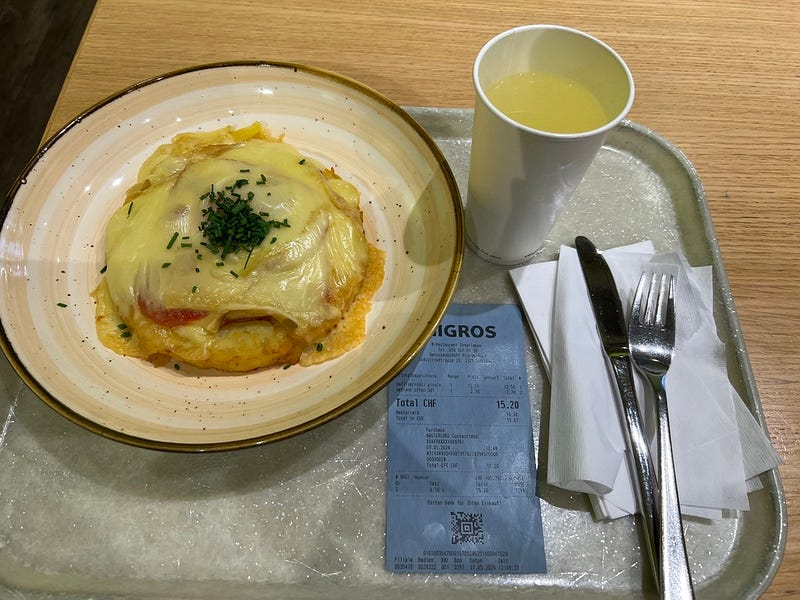
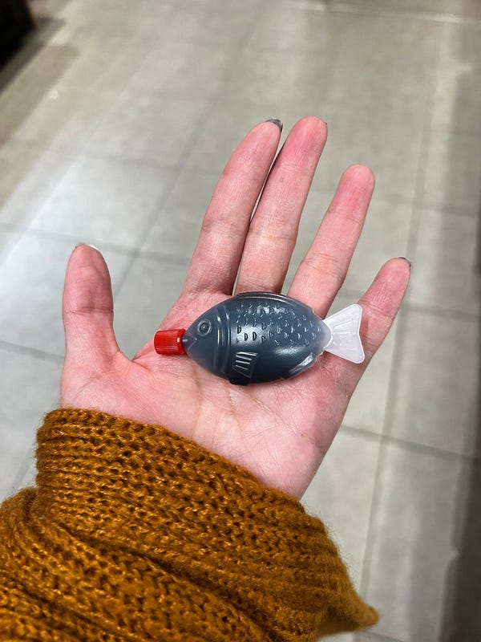
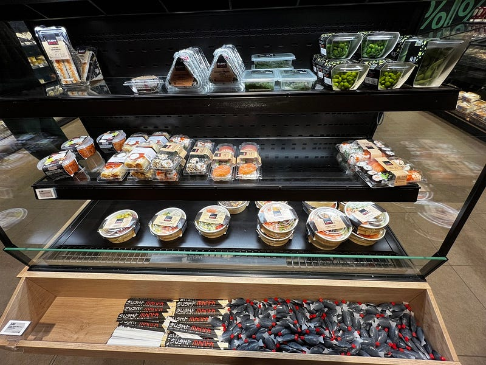
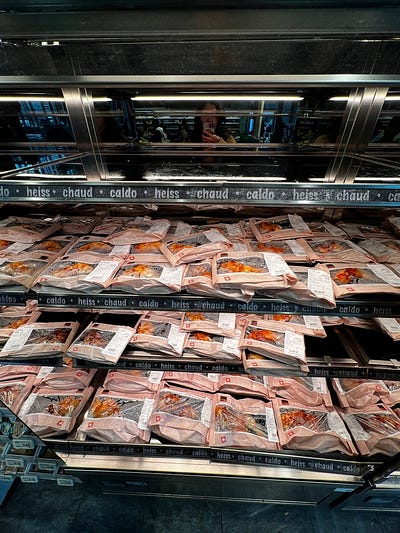
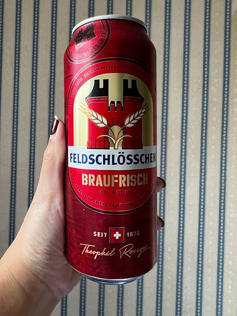
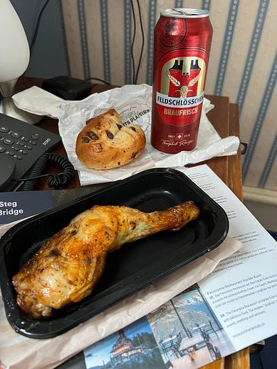

---

title: "一個女生的歐洲獨旅: 2024.05.07 瑞士茵特拉肯 (Interlaken) Day 3: 好險我昨天上了少女峰"
date: 2024-07-13
slug: "2024-07-13-interlaken-day-3"
cover:
  image: "images/medium-1*kAztuhou_5maw331hvUdXw.jpg"
  alt: "瑞士連鎖超市Migros外觀"
  caption: "瑞士超市龍頭之一 Migros"
images: ['images/medium-1*kAztuhou_5maw331hvUdXw.jpg', 'images/medium-1*KzPeX-mkySD8oBv38-KZCg.jpg', 'images/medium-1*khEc7eb4lgXXar6qXtfXxQ.jpg', 'images/medium-1*EaAvP0YQfDVZeeOS20hSkQ.jpg', 'images/medium-1*dpF3Q-Xh-VeKKJzznYZB4Q.jpg', 'images/medium-1*-YDjgc09vwAK7QLHLP-XBA.jpg', 'images/medium-1*DIJd_kmV2lBKihwMxRjw-Q.jpg', 'images/medium-0*oIRZcoDMy4YKZ_O8.png']
categories: ["旅行紀錄"]
tags: ["獨旅","旅遊", "歐洲", "瑞士"]
episodeseries: ["一個女生的歐洲獨旅"]
---

非 Medium 付費會員，[請長按此處免費閱讀這篇文章](/posts/2024-07-13-interlaken-day-3/?source=friends_link&sk=eca18977cf659cd726abe3e8ceb7e7ae)

*。當然如果你願意加入 Medium 付費會員來支持創作者，那就更棒囉～感謝你的閱讀！*

* * *

如果說昨天天氣不好，山下陰天，山上下雪、白茫茫一片，那今天的天氣就更糟了，因為連山下都下雨😭

因為雨勢頗大，所以也沒辦法跑觀光行程，於是我就開始進行一些室內活動：吃吃喝喝逛超市XDD

*瑞士特色餐點 Rosti*

首先是我的第一道瑞士餐點，巨無霸薯餅 Rosti (是說我之前一直看成印度的那個 Roti 😂)！這個傳統瑞士料理是用刨絲的馬鈴薯做成的大薯餅，上面再加上其他食材。我點的這個上面放了培根跟起司。我只能說⋯⋯瑞士人吃很鹹捏😂

Rosti 是由馬鈴薯刨絲之後浸泡過鹽水再拿去煎（薯餅已經有鹹了），再配上培根（本身也有鹹味），再配上起司（本身也是鹹的），我覺得天天吃這個可能很快就會需要洗腎XDD 好奇的人，可以參考 rosti 的食譜：[https://shise.com.tw/rosti/](https://shise.com.tw/rosti/)

接著我去逛了超市，看到這個壽司附的「大魚」醬油，每一隻都是澳洲小魚醬油的三倍大，超可愛！(但我後來跟沒來過澳洲的朋友們分享這件事，他們完全不懂我的點在哪，看來壽司的小魚醬油真的是澳洲特色XD)

*瑞士超市的『大魚』醬油*

順便在超市買了瑞士啤酒 Feldschlösschen （費爾德城堡），大概有 4–5 種口味（我根本看不懂），剛好旁邊有個店員姐姐，我就問她黃色跟棕色是什麼意思？她說棕色是 dark beer，黃色是一般的，然後我就問她哪個好喝？姐姐說她都喝紅色，但架上沒有了，如果兩個選一個，她覺得黃色比較好。結果我晃了一圈，意外在冷藏區發現紅色！果然在地人的推薦就是棒，紅色啤酒很好喝喔～

搭配上觀光客必吃的超市 Coop 烤雞 (他們的烤雞腿還是秤重的，每隻價錢還不一樣)，是我在瑞士吃過最美味的一餐 (因為瑞士物價高，所以最省錢的方式就是去超市熟食區買食物XD)

*瑞士超市烤雞腿與啤酒*
