* * *

### 一個女生的歐洲獨旅: 2024.05.08 瑞士首都伯恩 (Bern) 說走就走之旅

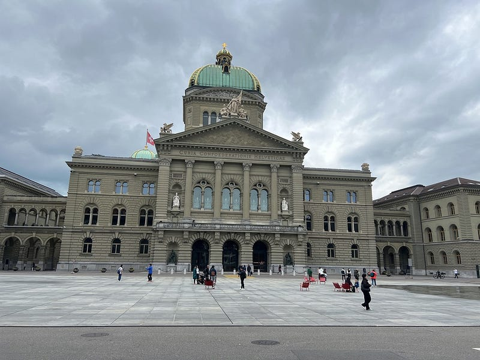瑞士 國會大廈

### 火車上結識瑞士杯杯

今天要離開茵特拉肯 (Interlaken)，前往歐洲行的最後一個城市琉森 (Luzern) ！

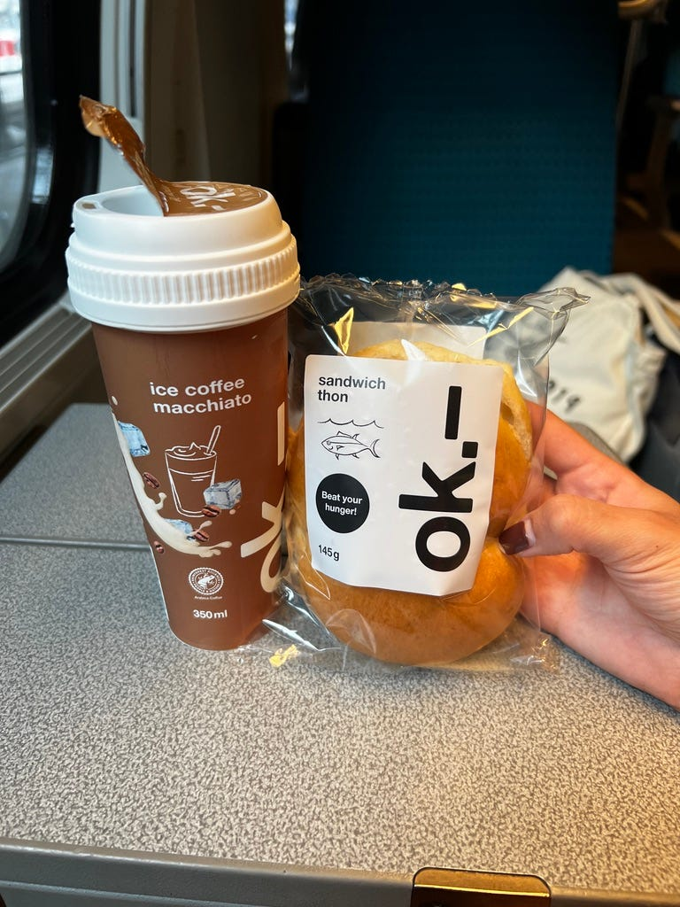我最愛的瑞士便利商店餐點組合：鮪魚三明治與冰拿鐵

本來預訂的行程是，到了琉森之後先去海拔 2000公尺的皮拉圖斯山，然後明天再去海拔 3000 公尺的鐵力士山 (真是一山還有一山高XD)，但因為天公不作美，後來我的行程就來了一個大轉彎😂

在前往琉森的火車上，我遇到一個人超好的瑞士杯杯！他不僅把景觀比較好的座位讓給我拍照，沿途幫我介紹經過的四個湖泊，杯杯還給了我他身為當地人的旅遊建議 (杯杯不建議我今天上皮拉圖斯山，因為今天的天氣看起來很糟，就算上山可能也只會看到霧茫茫的一片，但他說我可以到了旅館之後再跟旅館櫃檯確認一下情況，最喜歡這種給意見但是又不武斷的人了！）

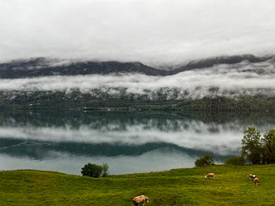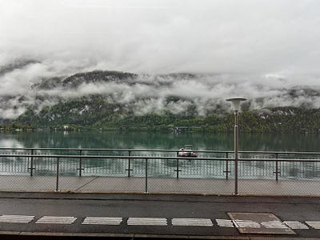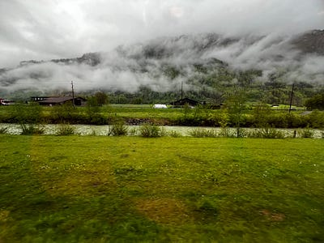火車沿途的湖景超美

杯杯跟我提到，他其中一個兒子環遊世界時的其中一站是臺灣，他兒子跟他說臺灣的食物好吃（我心想那當然囉XD）、風景漂亮、人也很nice!

### 熊公園

等我抵達後，果然計畫趕不上變化，琉森完全暴雨上不不了山 (我看即時web cam 山上整個白成一片，比少女峰還糟😂）。所以我突發奇想，打算坐一個小時的火車去瑞士首都伯恩！是說我之前一直以為瑞士的首都是 Zurich (蘇黎世)…… 看來瑞士跟澳洲一樣，都有一個不太知名的首都哈哈哈

瑞士的首都伯恩其名稱來自德文的熊「Bär」。因為公爵 Zähringen 在 1191 年建城時，捕捉的第一隻動物就是熊。

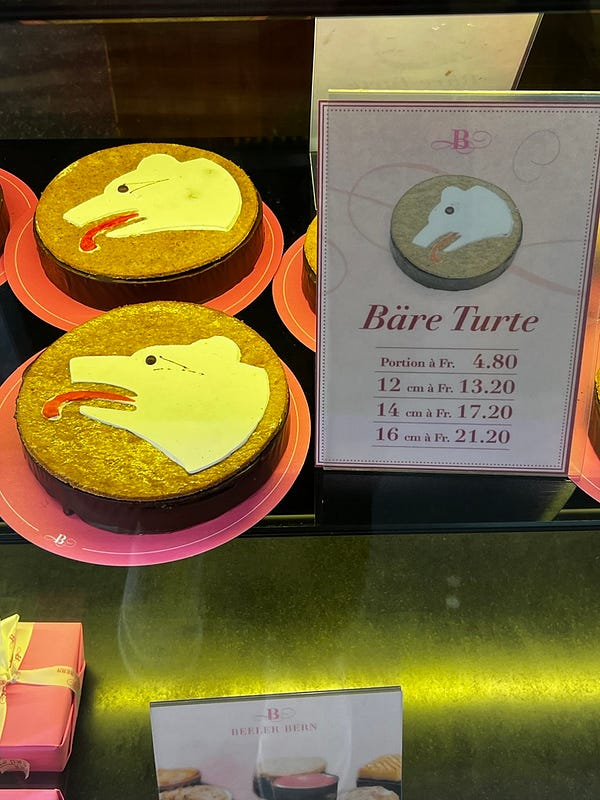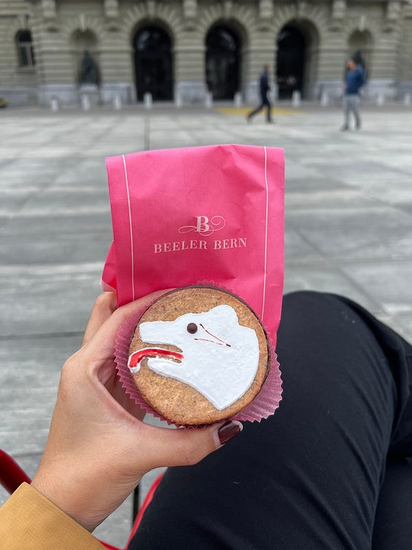伯恩麵包店裡面賣的熊塔，超可愛

現在的瑞士政府還特地為熊建了巨大的熊公園，但裡面只住了三隻熊！

因為熊會移動，而且他們住的地方有夠大，我看其他人的遊記也不一定有看到熊。結果我超幸運一抵達就看到兩隻！一隻不停走來走去覓食，一隻表情非常厭世，把頭靠在樹枝上我整個要笑死XDD

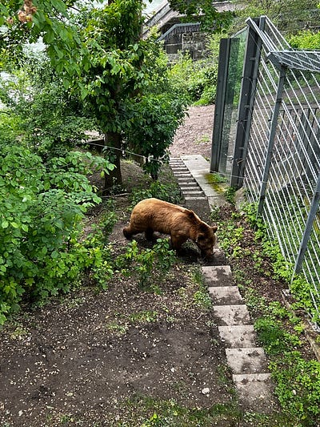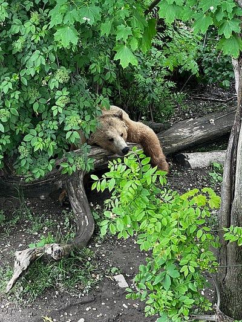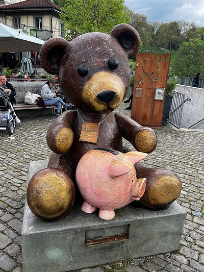熊公園

### 愛因斯坦居所與愛因斯塔咖啡

除了熊公園之外，這裡還有一個愛因斯坦相關的景點，雖然愛因斯坦是德國人，但他曾在伯恩住過七年，並在伯恩專利局工作。這段期間也是愛因斯坦在研究中取得豐碩成果的時期，著名的相對論便是在 1905 年發表的喔！

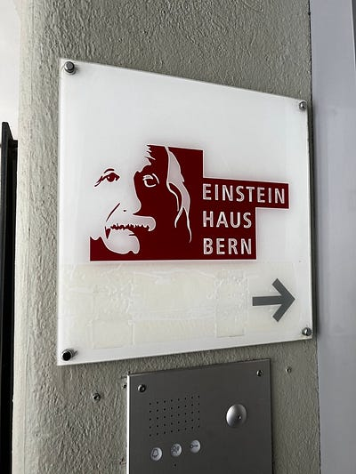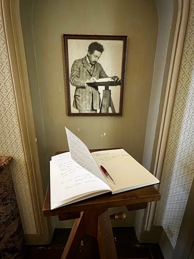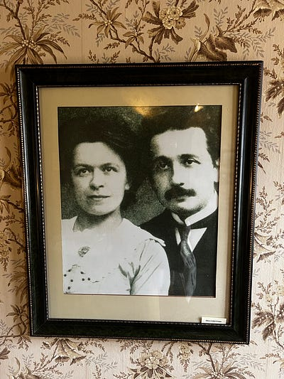愛因斯坦在伯恩的故居

當時愛因斯坦居住的故居，現在一樓是咖啡館、二三樓則以博物館的形式對外開放。愛因斯坦故居的參觀門票要$7瑞士法朗，我看了 Google 評價，毀譽參半，但因為我覺得票價也不是很貴，所以我還是入內參觀了。

結論是，真的可以不用去XDDD

因為真的沒什麼展覽品，就像其中一個評論說的一樣，感覺他們就是把維基百科列印出來放在牆上給你讀而已 😂

但樓下的愛因斯坦咖啡店我個人覺得還不錯，是一個很舒服的環境（而且有廁所XD）。他們的招牌是愛因斯坦咖啡，特別之處在於將杏仁甜酒(Amaretto)、白蘭地與濃縮咖啡三者調和，上面再加上打發的鮮奶油，是款帶有濃濃酒味的咖啡！（總結了我這幾天在瑞士喝咖啡的經驗，我發現瑞士的咖啡特色就是上面都會有厚厚一層鮮奶油）

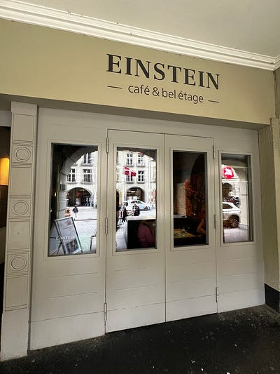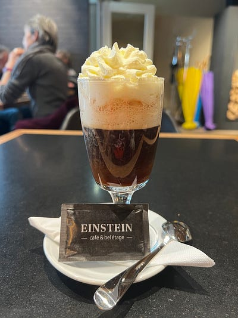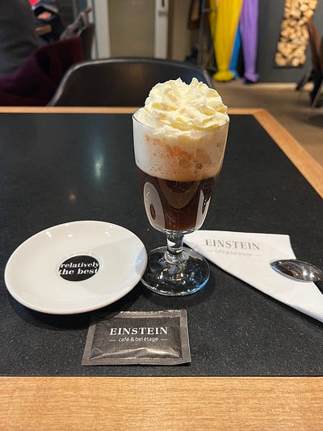愛因斯坦咖啡

品嚐之後發現這杯咖啡酒非常烈，一入喉有烈酒的擊喉感，喝一口之後整個人就已經熱了起來！雖然它大概是一般咖啡的兩倍價格，但感覺很值回票價？因為白蘭地加很多XDDD

喝完我瞬間進入一種很玄妙的狀態，一邊很清醒（畢竟裡面有expresso shot)，但同時又很想睡覺，難道這就是變聰明的感覺？😂

托盤上那個 「relatively the best 」(梗取自於相對論），讓我覺得好可愛！但論口感，我本人其實不喜歡白蘭地，也不喜歡杏仁甜酒，所以其實不是我喜歡的味道XD

事實證明臨時改行程到伯恩是個非常正確的決定！可以看到熊好酷！而且伯恩不愧是被列為世界遺產的城市，簡直美翻天！

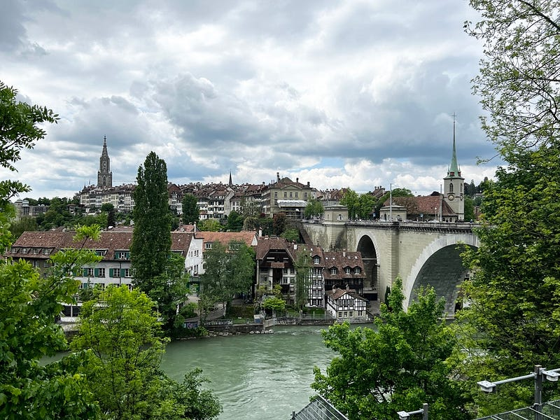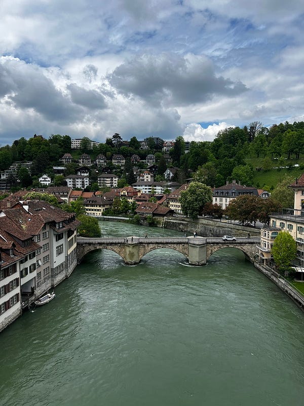

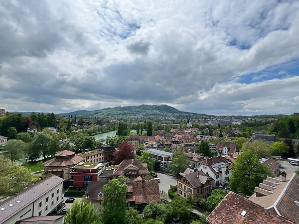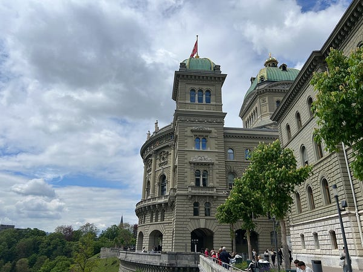伯恩街景

最重要的是，我到伯恩後天氣立刻從多雲轉大晴天，完全沒下雨（證明我不是雨女 😂）。好天氣旅遊真的方便很多！

### 入住琉森的膠囊旅館

本來回到琉森之後還有一點時間，想說還可以去幾個市區景點走走(因為春夏期間的歐洲大概晚上8:30才天黑)。沒想到一下火車迎接我的是滂沱大雨！我離開的時候才小雨而已XD

只好瞬間放棄，去超市買了晚餐之後，回旅館休息。在琉森的住宿是一個今年才剛開始開幕的膠囊旅館，一晚約83澳幣(因為其他旅館至少一晚都超過300澳幣以上，爆炸貴，而且看起來也不是特別高級）。其實我覺得這個膠囊旅館還不錯，內部空間非常寬敞，而且可愛！但是那個昏黃的燈光真的是讓我連自己的櫃子都看不到XDDD 猜測可能是因為膠囊旅館隨時有人入住，為了讓旅客艘時有個可休息的環境，所以才把燈光調整成這樣？

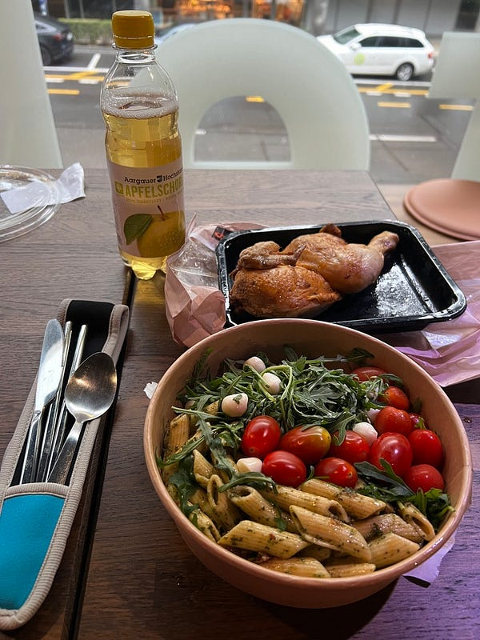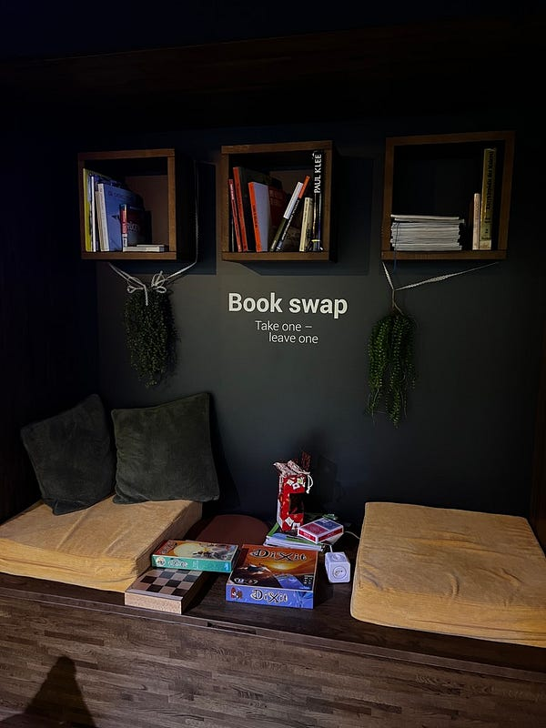晚餐與膠囊旅館的換書區

* * *

👉 **需要職涯導師嗎？澳洲雲端架構師 EC 提供轉職工程師、澳洲求職、移民生活等全方位諮詢服務。想進一步了解諮詢細節，請點擊** [**<<澳洲雲端架師 EC：專為轉職者量身打造的職涯諮詢｜海外職場×履歷優化 × 面試攻略 × DevOps /雲端職涯>>**](/posts/2018-01-03-ec-consultation/)**，開啟你的職涯新篇章!**

☕️ **如果想要進一步支持 EC，歡迎請我喝杯咖啡！**

**📱 想追蹤更多？**

  * 📘 [Facebook 粉專：澳洲雲端架構師 EC](https://www.facebook.com/cloudarchitectec)
  * 🧵 [Threads：Cloud Architect EC](https://www.threads.com/@cloud_architect_ec)
  * 📩 合作信箱：[cloudarchitectec@gmail.com](mailto:cloudarchitectec@gmail.com)

