* * *

### 一個女生的歐洲獨旅: 2024.05.09 歐洲獨旅的尾聲：瑞士琉森鐵力士山，終見晴天的雪山美景！

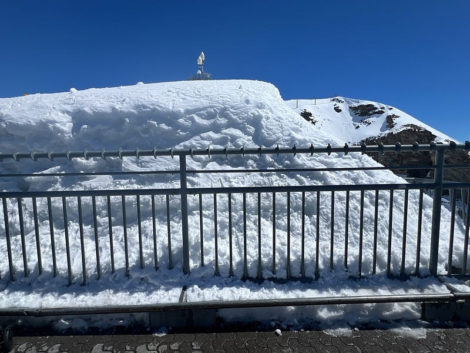給大家看一下積雪有多厚

### 鐵力士山 (Titlis Mountain)

鐵力士山海拔 3020 公尺，是瑞士中部的第一高峰！

因為前幾天去少女峰意外用掉了一天歐洲火車通行證，所以今天的行程只能原價買票了。

沒想到我昨天晚上在用手機查票價時發現，居然還有今天的特價票！原價來回的火車票是 36.4 瑞士法郎，我買到的特價去程票只要6.2，便宜到我懷疑自己是不是看錯票價（瑞士的火車票價很複雜，系統會默認你有火車半價卡，顯示的票價為半價價格。但如果不小心買到半價卡的票價，但沒有半價卡，在火車上也是視同逃票，會被罰款 😂）。

我再三檢查後覺得自己應該是沒買錯，也後來心驚膽顫地通過查票員的檢驗XD

鐵力士山總共要坐三段纜車：

1、第一段纜車，英格堡 → 特呂布湖 Trubsee，海拔1000→1800m。

2、第二段纜車，特呂布湖→史坦德 Stand 中間站，海拔1800→2450m。

3、第三段360度世界首創紅色旋轉纜車，中間站 Stand→山頂站，海拔2450→3020m。

### 特呂布湖 Trubsee

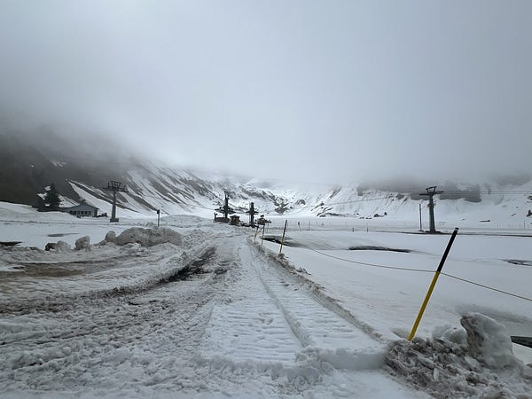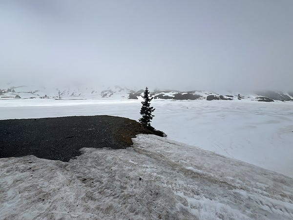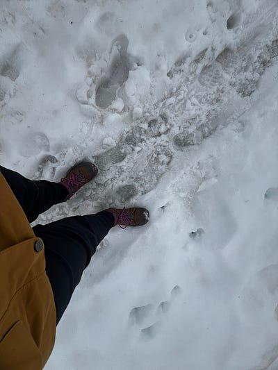特呂布湖 Trubsee 雪中健行

到了 Trubsee 湖時，其實天氣不算太好，但至少不像在少女峰時遇到眼睛都睜不開的大風雪，所以我還是很興奮地進行了半小時的雪地健行。

地上的積雪厚到我完全看不出湖在哪，後來才意識到中間那片地勢較低又超級平坦的雪地可能就是那座湖XD

這裡的遊客超級少，我只見到其他兩位健行者。除了沒有人聲，靜到連風聲也沒有，就是一片無聲無息的雪景，我覺得是個非常特別的體驗 ❤️

健行完畢後我繞道纜車站的另一邊，才發現這裡有個雪地樂園，所有人都擠在這一側，難怪另一邊都沒人XD

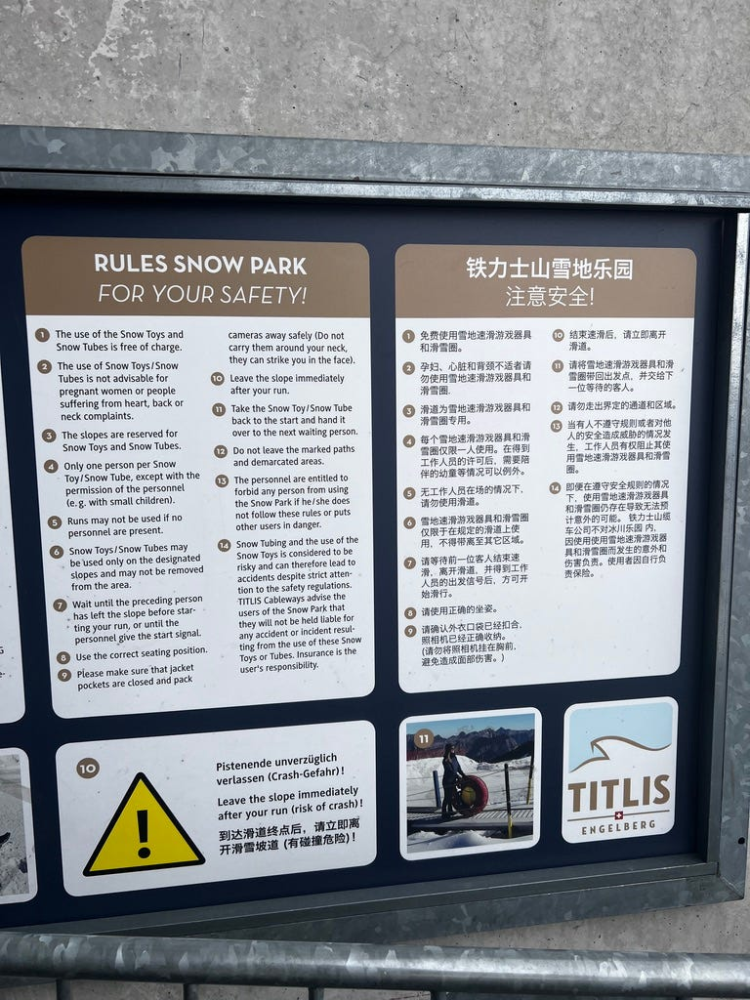除了英文之外，居然有全中文說明，感覺這邊應該是有很多華文遊客

我必須說這個雪地樂園實在太好玩了，我大大推薦！！！

這裡所有的雪具都是免費的，總共有四種不同雪具，滑下山的時候有不同的樂趣 (甜甜圈狀的那個會旋轉)，好玩到我滑了四次!!!

滑下去之後也有輸送帶可以把你跟雪據傳送上來，完全不用自己爬！

有趣的是在場的大人比小朋友多，但是每個大人都玩瘋了，非常推薦大家來鐵力士山。

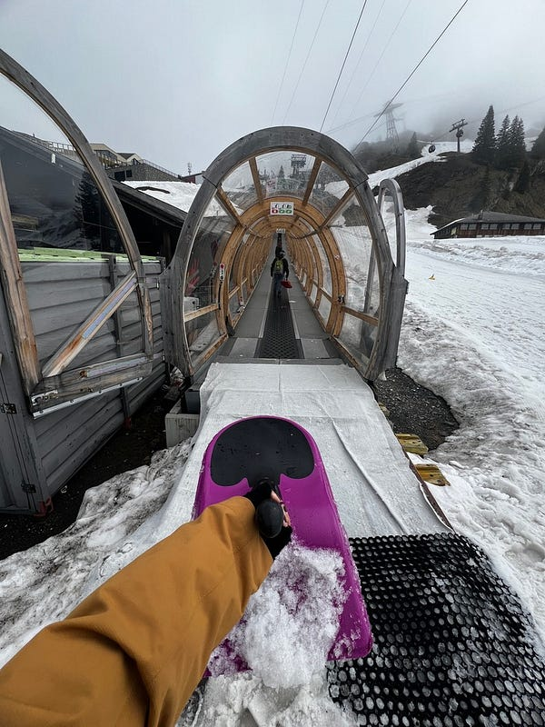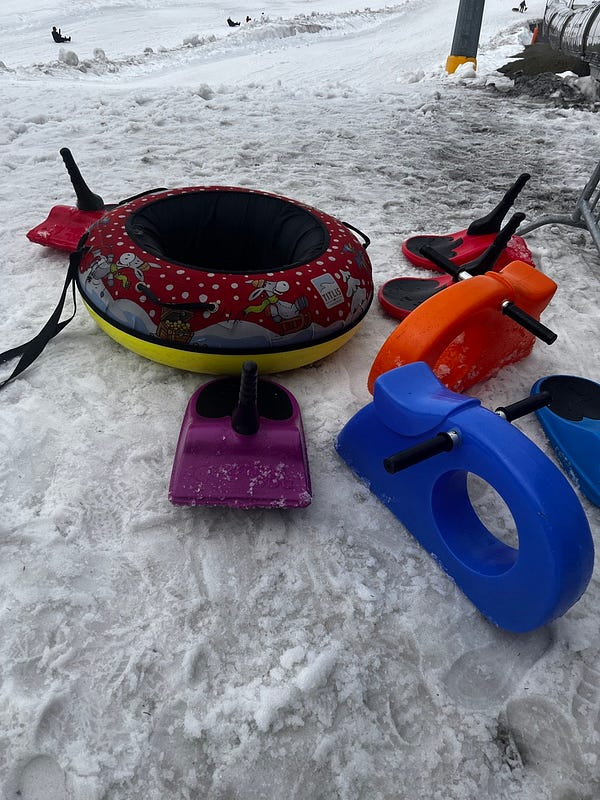

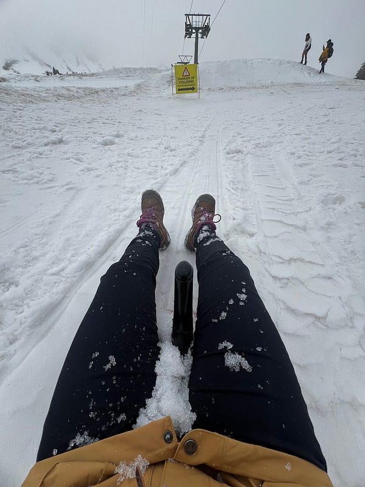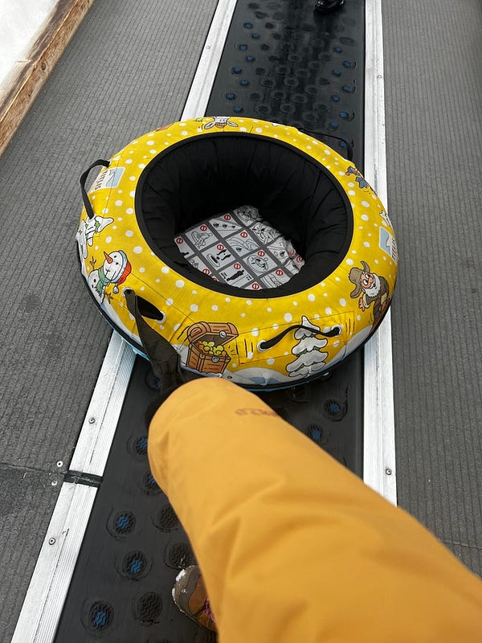

### 山頂站

今天我終於體驗到天氣好時上雪山是怎麼樣的景緻，跟一片白茫茫的少女峰不同，晴天的鐵力士山美到發瘋，還以為自己在拍 discovery 頻道 ❤️

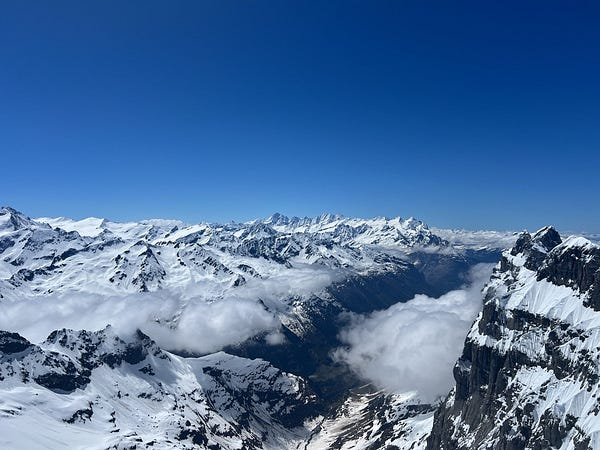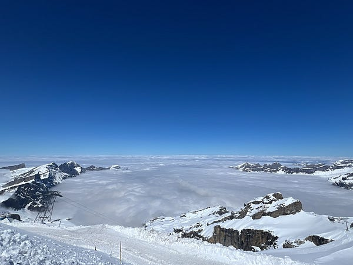晴天的雪山真的是太美了！！！

除了室外的設施之外，山上也有一些室內設施。

首先是少女峰也有的冰河山洞。裡面同樣也冰了一隻冰原歷險記的花栗鼠在裡面，但我不得不說冰河山洞還是少女峰那邊的大勝，有趣的東西比較多，對我來說這是一個時間不夠可以略過的設施。

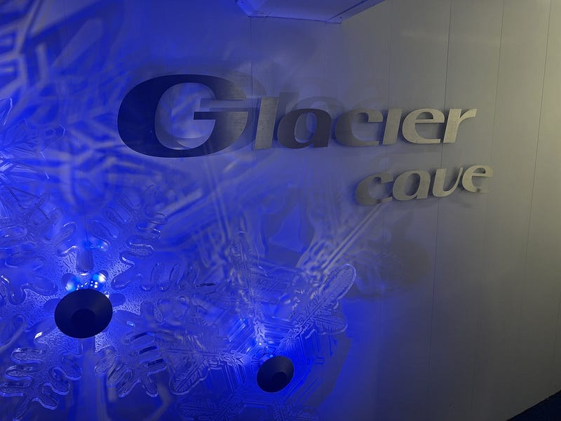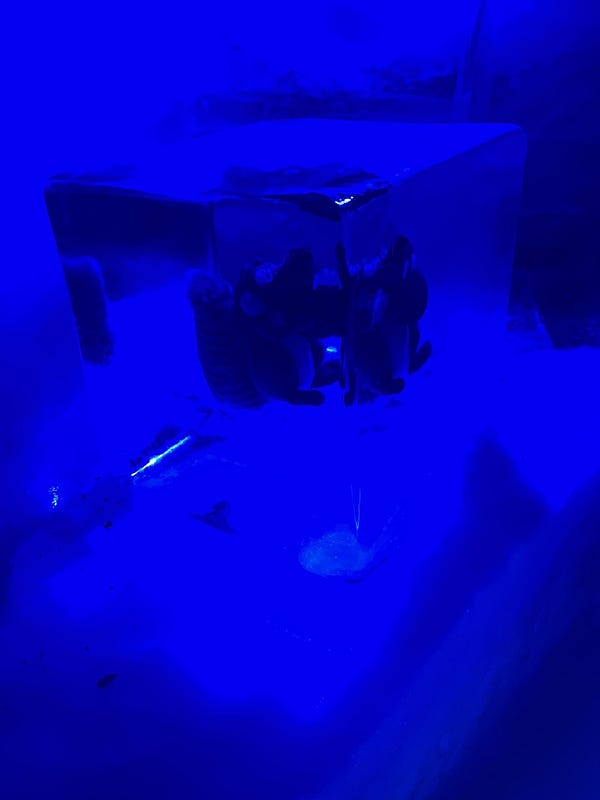

最後在高山上走了腳底下完全簍空的冰河吊橋，真的好酷！照片我只拍了這張，具體體驗只能請大家期待我根本不知道什麼時候會上的影片XD

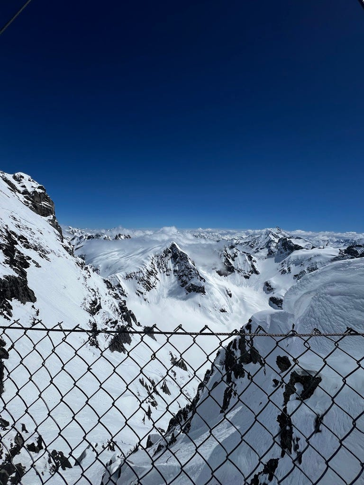冰河吊橋一景

### 琉森市區

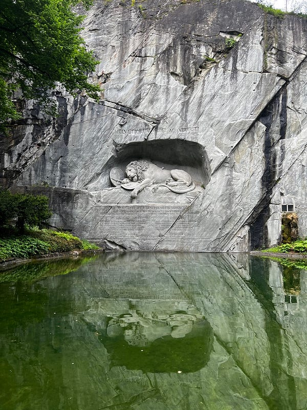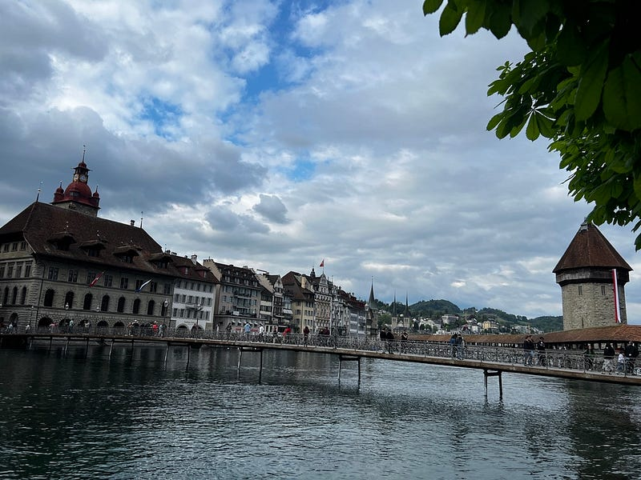

回到琉森後，趁著還有一點時間跑完了市區的景點，明天就要準備返程了，真的有點捨不得。

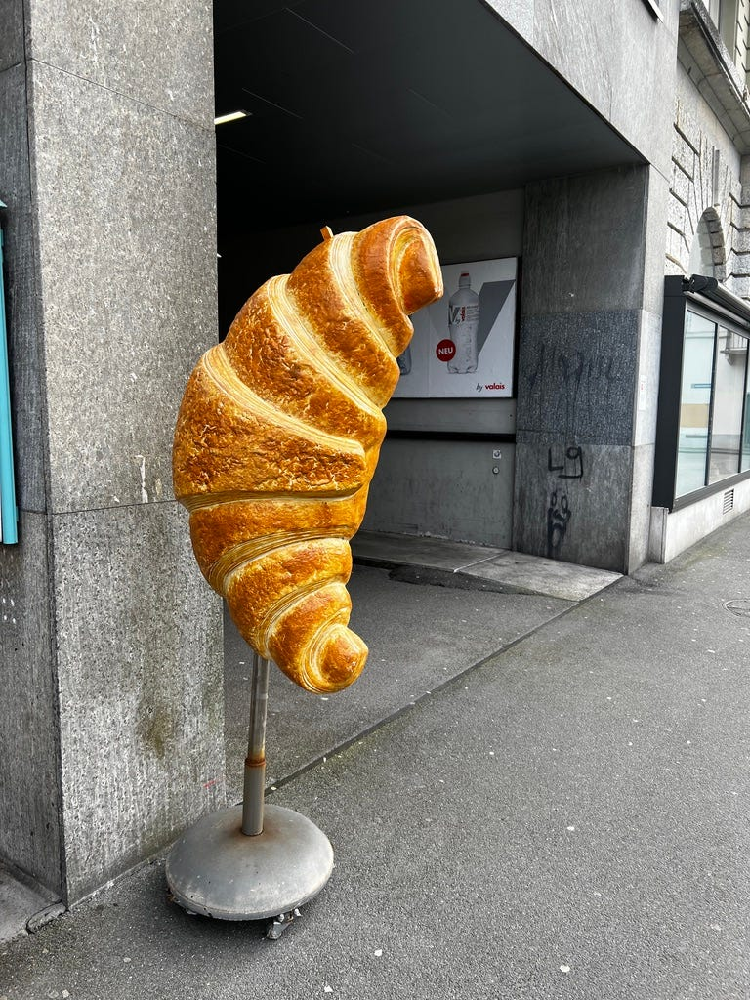市區某麵包店外有個巨大可頌，超可愛！

歐洲獨旅最後的晚餐，我買了買了一個巧克力店的巧克力慕斯。店員還用紙盒裝，很有儀式感！不會太甜，而且很有層次，上層的巧克力很香！好吃😋

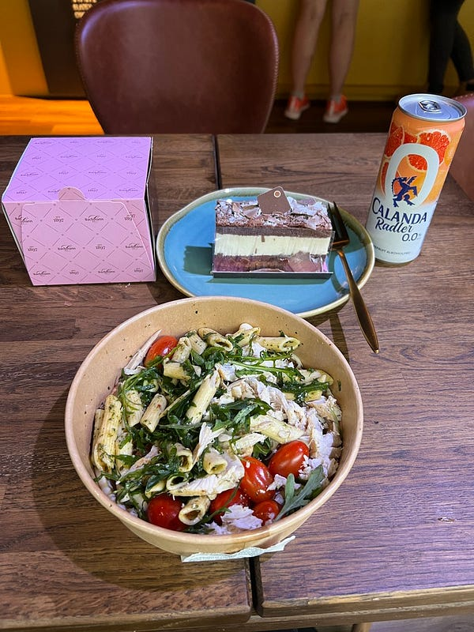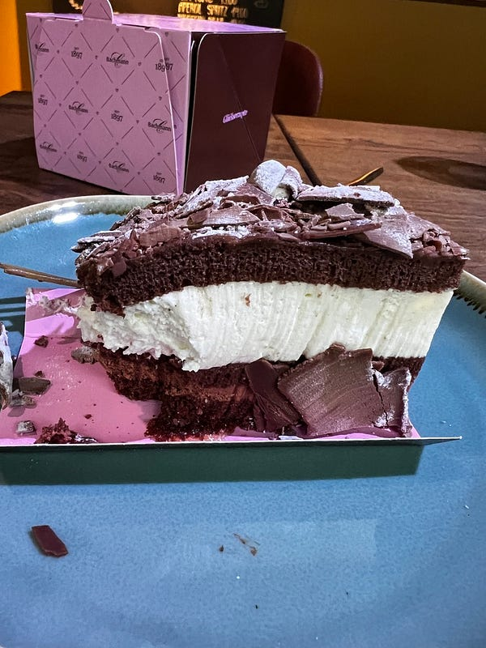

### 結語

拖稿拖了好久的歐洲遊記終於更新完畢了！

天啊，就連這種我早在旅行中就已經寫好的草稿的遊記，要發表在 Medium 上都花了近我三個月的時間😭

雖然說潤稿跟配上照片其實不會太久 (一篇可能約一小時吧)，但堅持發表真的覺得很難！每個週末都覺得自己好累，提不太起勁來做這件事…… 如果你追到了現在，歡迎留言跟我分享你最喜歡的歐洲國家，如果是你去過的國家，歡迎跟我分享你的旅行經歷，如果是你還沒去過的國家，歡迎跟我分享為什麼你想去那裡旅行?


