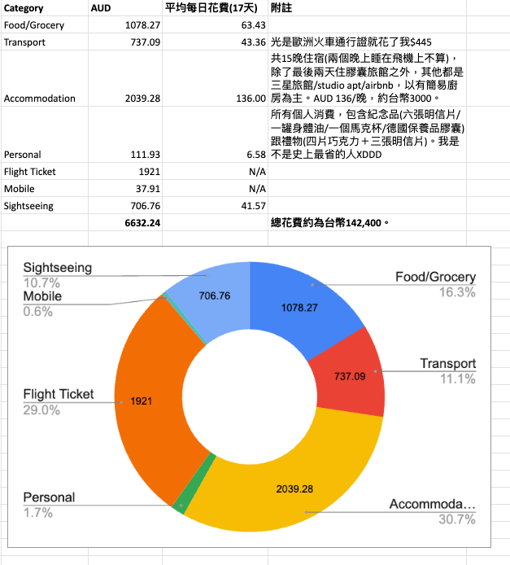
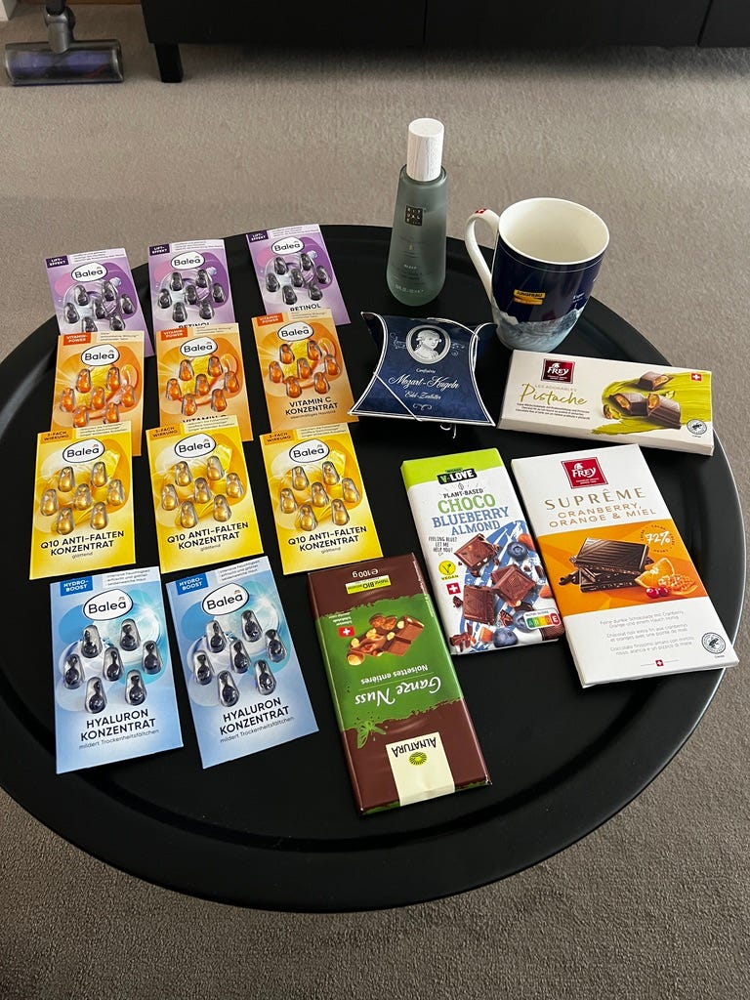

---

title: "一個女生的歐洲獨旅: 荷德瑞奧 17 天自助總花費以及心得"
date: 2024-08-10
slug: "2024-08-10-2025-europe-summary"
cover:
  image: "images/medium-1*pMJSHzZJX9thwjQS9n7lkQ.jpg"
  alt: "歐洲獨旅回程國泰航空機艙"
images: ['images/medium-1*pMJSHzZJX9thwjQS9n7lkQ.jpg', 'images/medium-1*VSBL1Ga01lA0h_ugMTmCvA.png', 'images/medium-1*737C75lS7B1NQxbjQqlVQw.jpg', 'images/medium-0*6QLsmelpga0ynQ4B.png']
categories: ["旅行紀錄"]
tags: ["獨旅","旅遊", "歐洲", "荷蘭", "德國", "瑞士", "奧地利"]
episodeseries: ["一個女生的歐洲獨旅"]
---

回程的國泰航班

17 天歐洲之旅的遊記就這樣結束啦！

為了替這個長達三個月的連載劃下一個句點，這篇文章就是要跟大家來分享我的歐洲獨旅心得總結！最後也會附上一些常見的 Q & A，希望可以幫助到有興趣獨自去歐洲自助旅行的冒險者XD

### 地點

我總共去了香港(昂坪纜車/大佛)、荷蘭(阿姆斯特丹、海牙、萊登、台夫特)、德國(法蘭克福、紐倫堡、慕尼黑、新天鵝堡)、奧地利(薩爾斯堡)、瑞士 (茵特拉肯、少女峰、伯恩、琉森)。

會去**香港** 是因為來回都在香港轉機，去程時我出境玩了一天，回程時因為我真的累爆了，所以就只待在香港機場裡。

**荷蘭** 待了三天：我之前曾經在荷蘭交換學生半年，大多數的景點我都去過了，所以這次就沒有安排太多時間在荷蘭，主要就是想要回去重溫一下荷蘭的生活。我覺得荷蘭算是歐洲自助新手友善的國家，因為荷蘭其實滿小的，各個城市之間的交通非常方便，居民的英文程度高，而且特有的運河美景相當有特色。

**德國** 待了六天：因為德國真的超級大、歷史悠久，而且東南西北德的景觀跟食物都不太一樣，算是一個國家就可以玩很久的類型。我覺得滿可惜的是我去的大部分景點都沒有太多英文說明，對不懂德文的觀光客不太友善。德國非常適合對於歷史感興趣的旅人，其中我最推薦的城市是紐倫堡！

**奧地利** (一日遊)：完全是旅途中意外的插曲，前一天晚上我才決定要從慕尼黑搭乘火車前往一日遊。我還滿喜歡薩爾斯堡這個城市，山城的風景很美，城市裡也有很多各式景點。期待之後有機會探索奧地利其他城市～

**瑞士** 待了五天：瑞士真的是一個美到發瘋的國家！充滿了令人驚嘆的湖光山色，而且每個湖的湖水都清澈到發瘋，各大雪山也都各有千秋，如果自然景觀是你旅行的著重點，那你先萬不能錯過瑞士！人民友善，英文程度高，交通規劃超級嚴謹，我覺得是我這次歐洲獨旅最喜歡國家！

### 花費

*旅費分析*

這趟旅行共花費 $6632 澳幣(約14萬台幣)，其中機票 $1920 澳幣 (澳洲布里斯本出發，去程飛荷蘭阿姆斯特丹，由瑞士蘇黎世機場返回) 跟住宿 $2039 澳幣各占1/3，景點門票跟交通各占10%、吃喝占16%。個人消費包含紀念品跟禮物也才花了$112出頭，其實真的是滿厲害的。

*整趟旅行的紀念品，包含伴手禮*

個人紀念品的部分就是一罐 Rituals 的保養油、少女峰上獲得的馬克杯跟幾張不在照片裡的明信片。瑞士的巧克力是送公司同事跟朋友的伴手禮，德國的膠囊保養品則為一半自用一半送禮用。

我反思了一下，覺得花費可以再精簡的地方好像也不多，最多就是如果有旅伴的話，住宿費用平攤後會降低一半，但我覺得同時吃喝部份可能也會拉高(因為一個人旅行真的吃不了太多，也懶得去高級餐廳，但如果有旅伴的話，勢必得會進行更多美食體驗XD)。

### 行李

行李的話我只帶了一個23吋行李箱+後背包，但我的後背包完全可以塞進行李箱 (因為在香港 day trip ，溫差太大了，必須帶個後背包裝衣服，不然的話我覺得後背包其實可以不帶)。我覺得我打包得不錯，25–30度的香港、熱到爆炸的德國、天氣瘋狂的荷蘭跟瑞士的雪山裝備都顧到了。

唯一想改善的地方可能只有與其帶一大顆萬國轉接頭，我應該直接單買一顆澳洲轉歐洲的轉接頭就好(反正這次也沒去英國，荷蘭/德國/瑞士的插座都一樣)。

### 女生歐洲獨旅常見問題

  * **歐洲哪個國家最適合單獨女性旅遊？**

我總共自助旅行過 17 個國家，歐洲自助過荷蘭、比利時、盧森堡、德國、法國、英國、挪威、愛爾蘭、奧地利、瑞士，除了法國巴黎跟德國法蘭克福這兩個城市之外 (sorry 純就個人經驗來說) 我覺得都算滿安全的。

當然一個人出門在外，還是要隨時注意安全！

就我個人的旅行體驗來說，我最推薦女生獨旅去荷蘭跟瑞士，因為居民英文程度高，交通規劃良善，風景漂亮。

  * **在歐洲自助旅行時，如何確保安全？**

這題感覺可以寫成一篇大長文XD

簡單來說：該做好的準備要做好，並隨時保持警戒。

相信自己的直覺，如果有些人或是地方讓你覺得有點危險或是不太對勁，請保持冷靜的態度並且立即遠離。針對治安特別危險的城市，一定要避免一個人走在人煙稀少的巷弄中，請盡量走人潮多的地方，或是寧願多花一點錢搭uber (有司機資訊) 或坐大眾交通工具。

財不露白，我個人只會攜帶少量現金 (我有國外 ATM 領當地貨幣免手續費的銀行卡，所以通常都是需要現金的時候才會直接提款)，不然主要都是用信用卡電子支付。

這次去歐洲前我有買防盜腰包，但我必須說我都沒怎麼用到。因為春天天氣還是滿冷的，所以護照跟信用卡我就直接放在外套內層有拉鍊的口袋。

  * **單獨旅行時，如何應對語言障礙？**

我個人長年在澳洲生活，所以英文能力算是不錯。我比較常遇到的問題是，我講英文但對方聽不懂XDDD 這時候比起使用完整且有禮貌的英文句子，其實更適合用簡單的單字表達自己的目的就好。

語言障礙不太會是我出國旅遊擔心的事，因為只要使用簡單的單字或比手畫腳，通常都可以達到目的。而且旅行需要用到的句式通常只有：多少錢？廁所在哪裡？怎麼去 xxx 地方？現在科技發達，手機上就有 Google Translate 可以即時翻譯照片或文字，如果擔心的話，可以事先做好功課。

不過如果可以的話，我覺得可以事先學幾句簡單的當地語言，跟當地人互動的時候他們可能會覺得很驚喜XD

  * **在歐洲是否需要購買旅行保險？**
  * **在歐洲旅行時，如何避免被騙或被偷？**

這兩題感覺可以合併回答，我自己是沒有買，因為我身上沒有什麼值錢的東西囧

唯一比較值錢的可能就是我的手機，所以我有買一個手機掛繩，把手機掛在脖子上。走路時我會把手機掛繩塞進外套裡，防止有人突然把手機拽走。除非是在我覺得安全的大眾交通上(例如長程固定座位的火車)，否則我不會把手機拿出來玩 (例如坐短程地鐵或捷運，我會隨時保持警戒)。

如果必須要用手機查地圖的時候，我會觀察一下附近的環境是否安全才把手機拿出來。另外就是我會刻意站在轉角或是背靠牆壁的地方使用手機，避免有人突然出現從後方把手機抽走。

但我覺得如果如果行有餘力的話，買旅行保險還是不錯的。因為旅行保險可能還包含了意外、醫療、旅行不便險等等不同項目，可以衡量自己的情況中選擇。

  * **如何選擇和搭配旅遊服裝？**

大原則就是根據旅行的天數跟當地的氣候來搭配服裝，要是旅遊目的地氣候一致，那基本上就不會太難，例如炎熱的熱帶島嶼 (去斐濟是我打包最容易的一次，而且夏天的衣服又薄，也不需要特別壓縮衣服。)

以下是幾點技巧：

  1. 如果是熱帶島嶼，可以多帶幾件色彩鮮豔的衣服，因為拍照會比較好看。泳衣會建議至少要帶 2 套，避免需要連續幾天下水的時候泳衣還沒乾。
  2. 如果是比較寒冷的國家，一定要帶防風防水的外套。另外毛帽、圍巾、手套絕對必備。
  3. 如果是氣候變化較大的地方 (像我這次要去 30 度的香港跟零下的歐洲雪山)，那就建議多層次穿搭。可以帶 1-2 件夏天的衣服搭內搭，3件冬天的衣物套外面，最後加穿上防風防水的外套。
  4. 訂住宿的時候可以考慮訂有洗衣機跟烘衣機的住宿，這樣就可以不需要帶這麼多件衣物。

  * **如何找到當地的美食和餐廳推薦？**

事先做旅遊規劃時可能會看到一些美食推薦 (我通常都是看部落格文章)，如果特別有興趣嘗試的我就會記錄下來。

但我的習慣通常都是到了當地之後再開 Google Maps 找我喜歡的，不會事先訂好餐廳，非常隨性XD

  * **單獨旅行時，如何結識新朋友或參加團體活動？**

我以前在澳洲當背包客時，真的因為獨自旅行認識了不少朋友，有些甚至一直到現在還保持著聯絡，後來我們也有去彼此的國家拜訪彼此。不過我一直以來都不是那種會主動跟別人搭話的人XD 通常都是因為對方跟我搭話，才會開始交談，例如我跟某個香港女生都是一個人去紐西蘭旅行，然後我們不斷在各個景點碰到彼此 (可能觀光客走的行程都差不多XD)，之後就因緣際會成為朋友。

總之我會覺得順其自然就好！但同時防人之心不可無，那種看到你一個人旅行就刻意走過來搭話或是說他可以推薦你去當地人才有的景點的人，我覺得很多都是詐騙XD

如果想認識新朋友的話，我會建議住背包客棧或是青年旅館這種有交誼廳跟公共廚房的地方，很容易就自然而然跟其他旅客產生對話。這類住宿場所通床也會提供很多社交活動例，如 Pub crawling, pizza night, trivia night 等等，我覺得都算是很安全又可以認識新朋友的地方。

如果背包客棧或是青年旅館不是你偏好的住宿選項（例如我現在喜歡住有品質的三星旅館或是有廚房跟洗衣機的 airbnb），但又想要認識新朋友的話，我會建議你參加當地的各式一日遊，尤其是品嚐當地美食跟美酒的行程，會特別容易遇到有同樣興趣的朋友。

以上兩個方式我是我比較推薦的方式，我覺得比在路上或是在 bar 裡被人搭話更安全 (當然也不是說路上跟你搭話的都是壞人，但出門在外真的是安全第一，所以我會隨時保持警戒)！

### 結語

希望今天的歐洲獨旅花費分享跟心得會對你有所幫助，如果有什麼你感興趣但我沒有回答到的部分，都歡迎留言告訴我！

如果你對於我的歐洲遊記有興趣，歡迎閱讀以下文章：

  * [一個女生的歐洲獨旅: 荷德瑞奧 17 天自助 行前規劃](/posts/2024-08-10-2025-europe-summary/)
  * [一個女生的歐洲獨旅: 2024.04.25 荷蘭 阿姆斯特丹 (Amsterdam) 回憶中的運河屋](/posts/2024-04-25-amsterdam/)
  * [一個女生的歐洲獨旅: 2024.04.26 荷蘭 萊登 (Leiden) 荷蘭最古老的大學城](/posts/2024-04-26-leiden/)
  * [一個女生的歐洲獨旅: 2024.04.27 荷蘭 在藍瓷小鎮台夫特 (Delft) 慶祝國王節](/posts/2024-04-27-delft/)
  * [一個女生的歐洲獨旅: 2024.04.28 德國 法蘭克福 (Frankfurt) Day 1 — 最美跟最壞的風景都是人](/posts/2024-06-06-frankfurt-day-1/)
  * [一個女生的歐洲獨旅: 2024.04.29 德國 法蘭克福 (Frankfurt) Day 2 — 不來也沒關係的城市](/posts/2024-06-06-frankfurt-day-2/)
  * [一個女生的歐洲獨旅: 2024.04.30 德國 紐倫堡 (Nuremberg) Day 1 — 第一個讓我想移居的德國城市](/posts/2024-06-14-nuremberg-day-1/)
  * [一個女生的歐洲獨旅: 2024.05.01 德國 紐倫堡 (Nuremberg) Day 2 — 近代史中的紐倫堡](/posts/2024-06-14-nuremberg-day-2/)
  * [一個女生的歐洲獨旅: 2024.05.02 德國 慕尼黑 (Munich) Day 1- 達豪集中營](/posts/2024-06-21-munich-day-1/)
  * [一個女生的歐洲獨旅: 2024.05.03 德國 慕尼黑 (Munich) Day 2 — 兩個城堡一次擁有：林德霍夫宮與新天鵝堡](/posts/2024-06-21-munich-day-2/)
  * [一個女生的歐洲獨旅: 2024.05.04 奧地利 薩爾斯堡 (Salzburg) — 音樂神童莫札特的故鄉](/posts/2024-07-07-salzburg/)
  * [一個女生的歐洲獨旅: 2024.05.05 前往瑞士：茵特拉肯 (Interlaken) 韓劇愛的迫降拍攝地](/posts/2024-07-13-interlaken-day-1/)
  * [一個女生的歐洲獨旅: 2024.05.06 瑞士茵特拉肯 (Interlaken) Day 2: 少女峰 (Jungfraujoch) 我來了](/posts/2024-07-13-interlaken-day-2/)
  * [一個女生的歐洲獨旅: 2024.05.07 瑞士茵特拉肯 (Interlaken) Day 3: 好險我昨天上了少女峰](/posts/2024-07-13-interlaken-day-3/)
  * [一個女生的歐洲獨旅: 2024.05.08 瑞士首都伯恩 (Bern) 說走就走之旅](/posts/2024-07-22-bern/)
  * [一個女生的歐洲獨旅: 2024.05.09 歐洲獨旅的尾聲：瑞士琉森鐵力士山，終見晴天的雪山美景！](/posts/2024-08-04-lucern/)
