* * *

### **兩個女生的紐西蘭自駕滑雪行** 🇳🇿**:** 2024.08.31 奧克蘭租車初體驗、漢密爾頓花園與超萌民宿貓咪

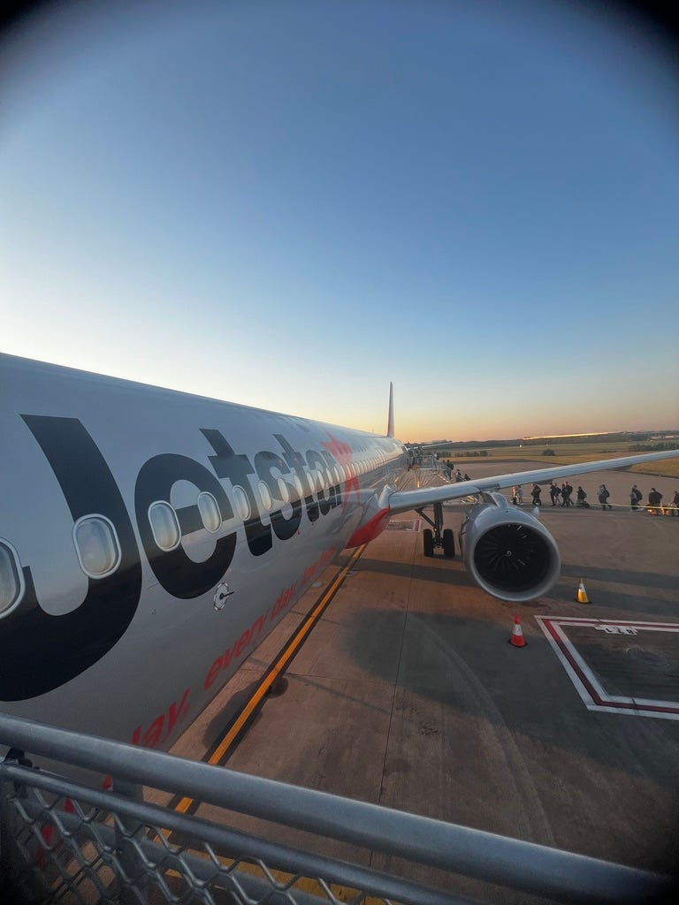

紐西蘭行程的第一天，為了搭6:45的飛機，我們3:30就起床了！果然早起不是問題，早起做什麼才是問題🤣

因為飛機時間太早了，我們沒有辦法搭布里斯本的機場快捷去機場 (這點也好想吐槽！身為機場線，居然沒有配合飛機起降時間營運囧)，於是我們上網找了私人送機。

我們住在布里斯本的西區，開車到機場約 40 分鐘。兩個人共用一個28寸行李箱＋兩個7公斤的隨身行李。我們在臉書上徵求機場接送，收到了澳幣 $60–200 (台幣 $1200–4000) 的報價，想當然是選最便宜的XD

而且我們很幸運搭到特斯拉！這還是我人生的第一次搭乘特斯拉，覺得真的很安靜，而且螢幕超大看起來超爽～

### 捷星航空趣事

一上飛機就必須要批評一下捷星飛機座椅的超智障背袋設計，左右跟下方都有洞，設計這個的人腦袋是不是也有洞？🤣

想像你放了一瓶水後，想把手機也放進去，那手機就會從水瓶撐開的空間掉下去。單純放手機也不行，因為現代手機都滿重的，放了也是直接掉到地板，我真是台灣人問號？？？

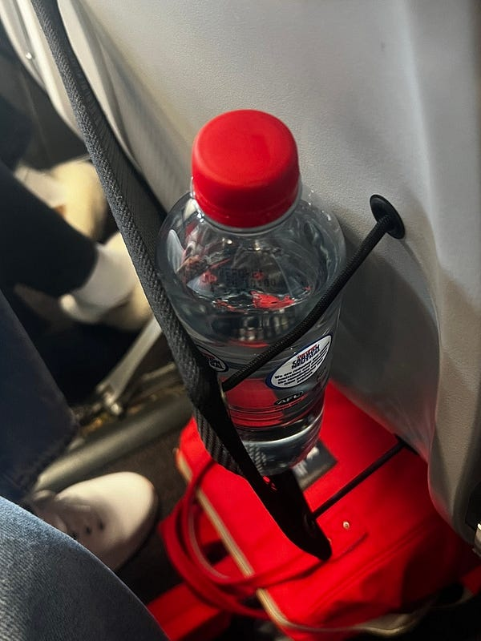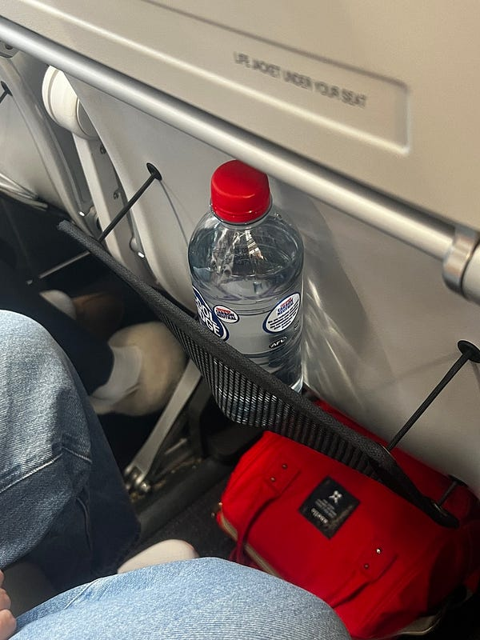這背袋設計….

廉價航空如捷星通常都不附餐，坐在我前方的夫婦一上機就花錢點了食物。沒想到吃完後空服員又回來說「你們的機票包含了各自 $15 的food credit，可以再點一些機上餐飲喔」，所以夫婦又再點了餐（要是我就不開心了，如果有food credit，為什麼一開始花錢點餐時不說? 🤣）

接著我在飛機上昏睡到一半，又聽到空服員拿著兩個大三明治過來給那對夫婦，並說「我們剛剛在廚房發現其實你們的機票還包含了兩個三明治(餐點標籤上有他們的名字」。

夫婦仍再度人很好的收下，還開玩笑說「這下子我們的午餐有著落了，等一下下機留著當午餐吃」，空服笑著附和了幾句。但是⋯⋯紐西蘭是禁止攜帶食物入境的，於是後來夫婦倆又緊急在飛機降落前把三明治吃了🤣

我這輩子，從來沒有看過搭捷星被空服員餵到這麼飽的乘客😆😆😆(我真心想問他們，拜託告訴我你們的機票是怎麼訂的，怎麼這麼多好康！)

### 首次紐西蘭自駕

下了飛機後我們立刻搭接駁車跑去租車處領車(感謝機場好心工作人員指點明燈，租車公司的指示有夠難懂)，不過接駁車司機大哥人很好👍

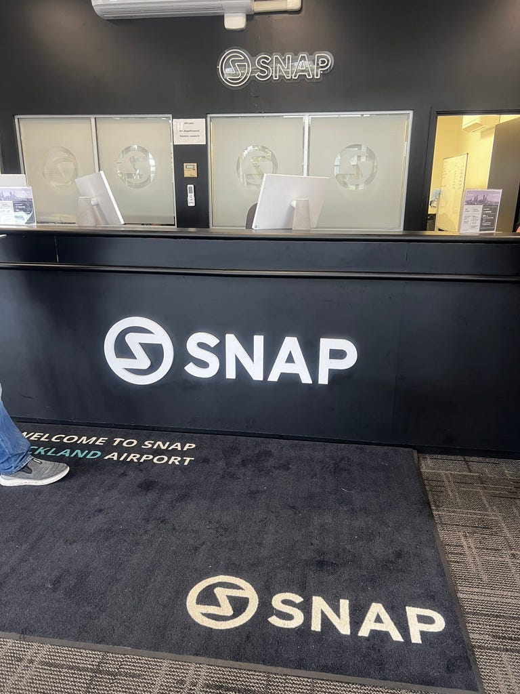租車公司 SNAP：價格便宜而且服務好，推薦！

我們拿到一台 2018 年的省油小車 Corolla，我必須說「我愛我的i30 😆😆😆」。雖然 Corolla 是一代神車，但不才我這輩子真心只開過新車 (我的 i30 是 2022 年出廠的，是我人生第一台車)，對於舊車型操作起來非常不習慣😂

第一次在紐西蘭上路，就開了100多公里、還開上高速公路，真心也是人生新體驗😆

但必須要說，紐西蘭的路，真心是很難開！就連機場附近的速限都只有50公里，開得超級卡。而且紐西蘭人超愛逼車，大家能不能給我們一些空間？😂

### 漢密爾頓花園 (Hamilton Gardens)

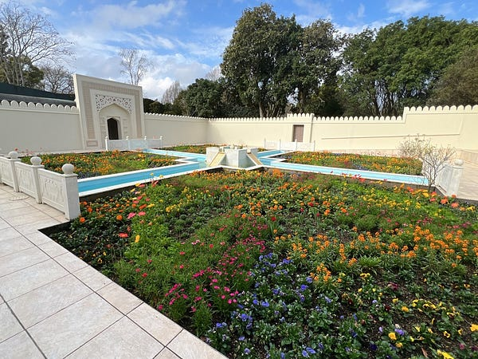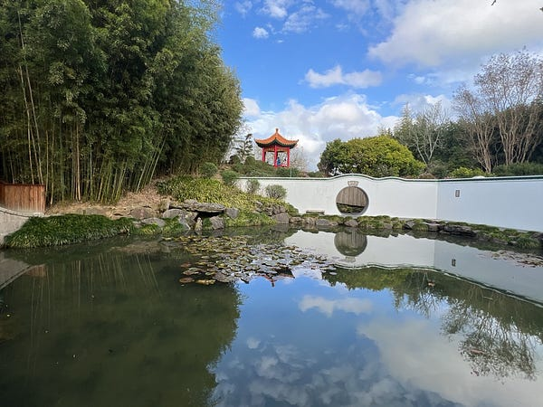

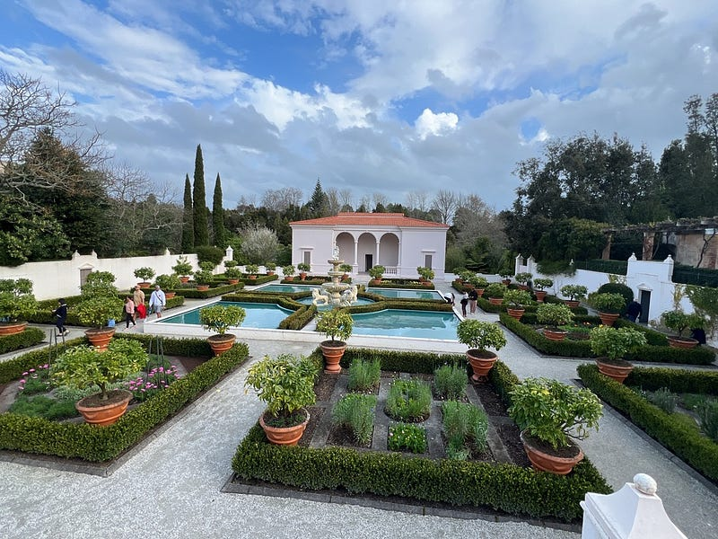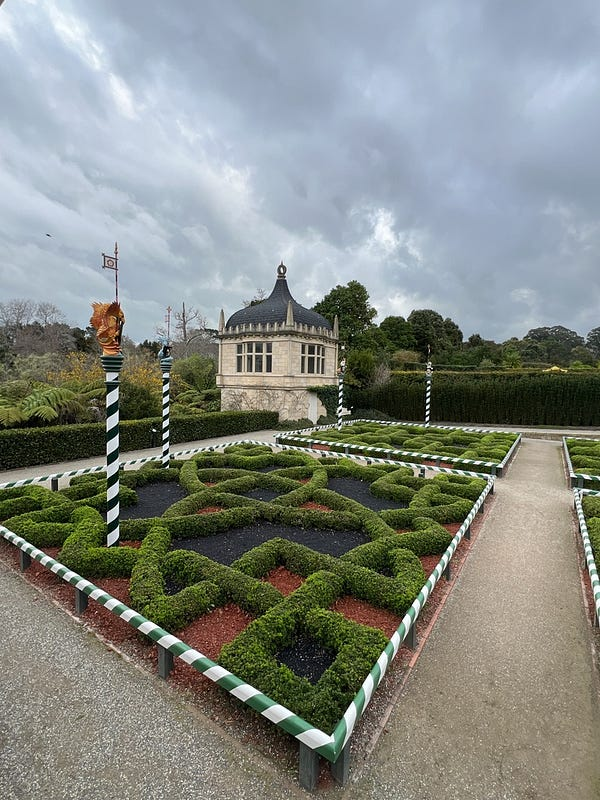漢密爾頓花園 (Hamilton Gardens)

第一站是漢密爾頓花園，我們去的時候花園還是免費入場，不過 2024/09/18 之後就開始要收 $20 紐幣的門票了。

不得不說我去之前真心完全是不期不待，但去了之後我真心是大推這個景點，就算要收$20的門票費也值得，裡面大概有 10–20 個主題花園，多數都佈置得非常用心！除了植物之外，還有許多符合主題的擺設👍👍👍

### 第一餐：越南料理

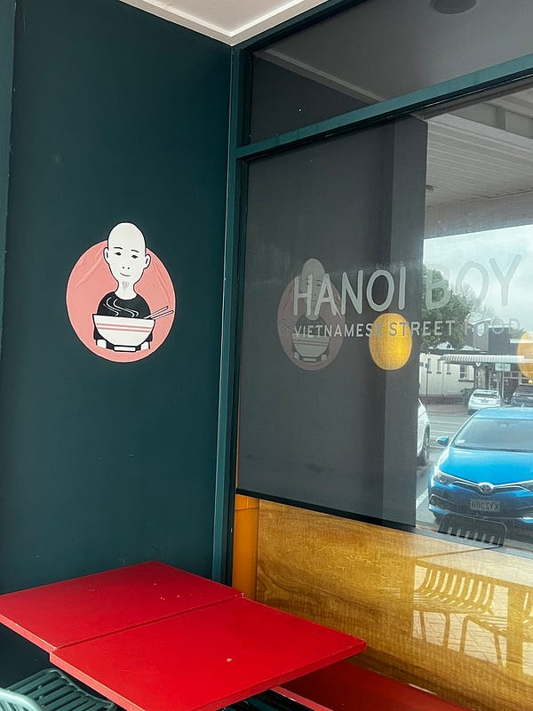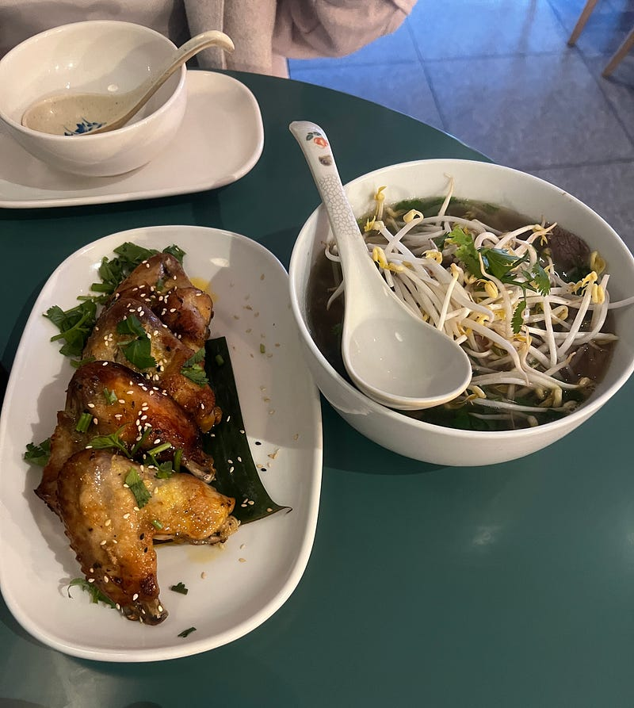Hanoi Boy

紐西蘭的第一餐，我們吃了一家很有氣氛的越南餐廳。裝潢完全是咖啡廳/文青酒館風，服務態度也很好，大推！

雞翅超好吃，pho 的口味有點特殊，他們居然是加香菜而不是九層塔，但還是不錯吃～

### AirBnB: 被貓貓三訪的我們

到了Airbnb 時已經晚上了，暴雨加上沒有路燈，讓我第一次就直接開過頭🤣 加上指示不明，我們兩個花了好一段時間才確認我們沒走錯！

不過 Airbnb 的佈置相當溫馨，空間也超級寬敞!

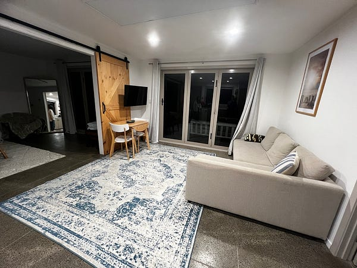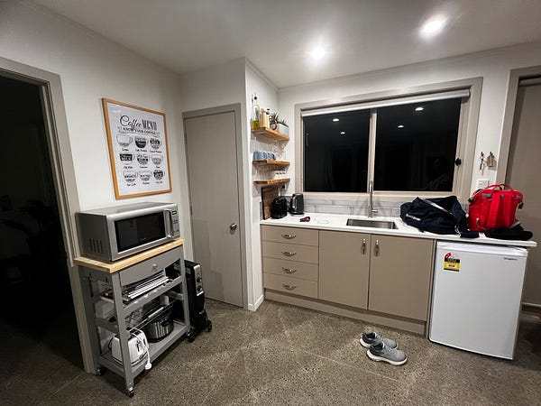

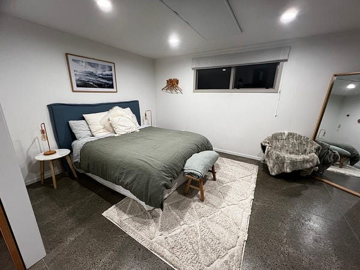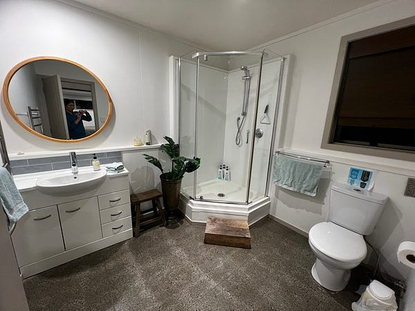Airbnb

最重要的是有一隻超親人超愛討摸的貓貓，真是太可愛了😆 他一個晚上完全三訪我們，最後還跟室友 C 一起睡，太可愛了😍😍😍

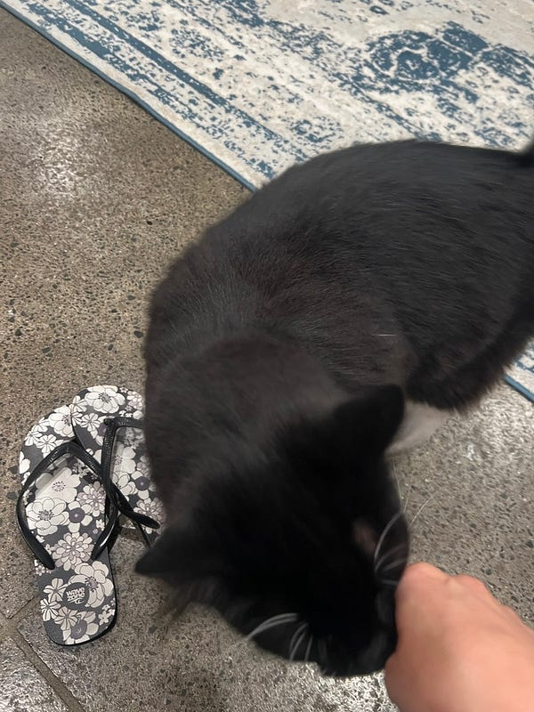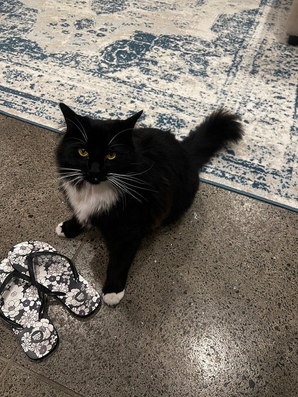

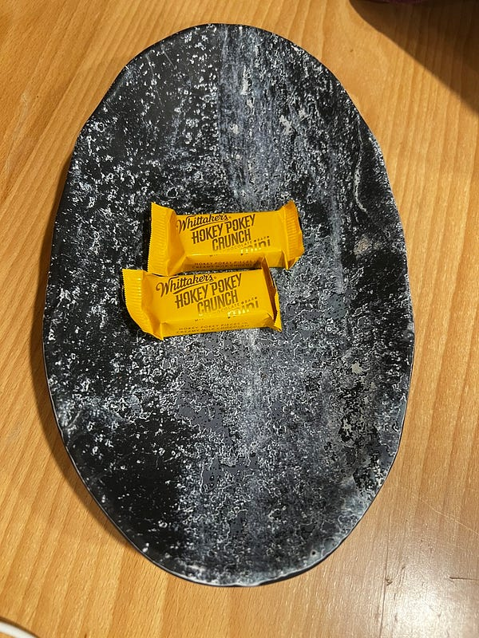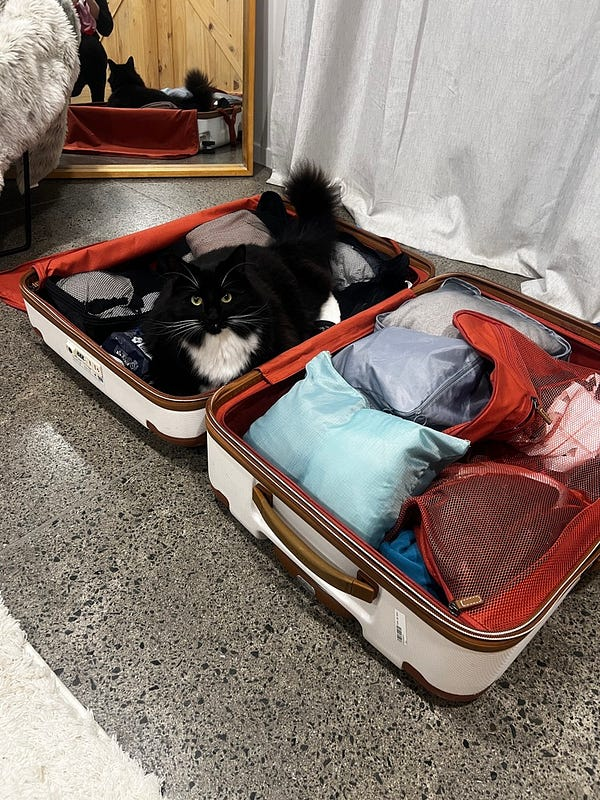民宿主人還送了我們紐西蘭特色巧克力


