今天開車前往魔戒與哈比人的拍攝景點，哈比村！

官方網站請見：<https://www.hobbitontours.com/>

哈比村基本上就是個拍照景點，絕大部分的房屋都只能在外面拍照，只有兩個小屋開放內部參觀。

* * *

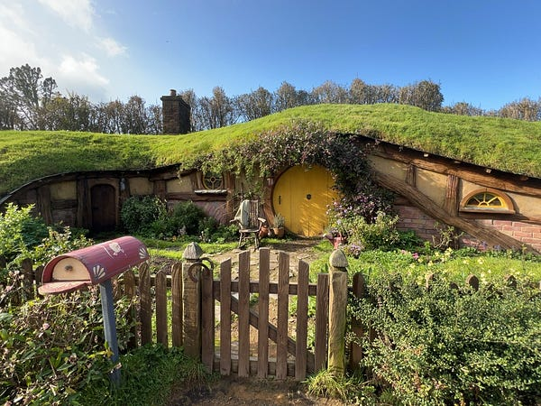

*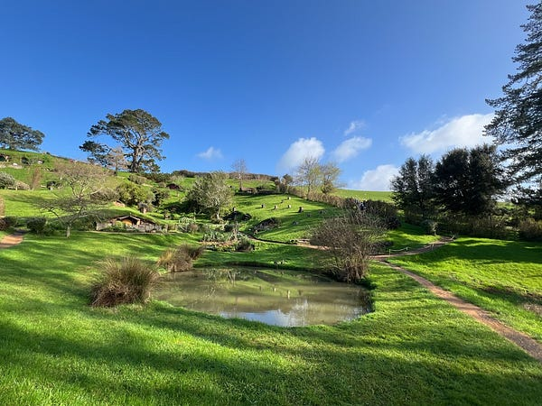*

我們為了躲開人潮，選的是最早的 8:50 中文團 (英文團最早是9:00，每十分鐘一團）。這個決定是明智的，因為我們這一團只有11人，通常一團滿額是40人。每團會分開進兩個小屋參觀，所以我們一個小屋才5–6人，參觀品質算是很不錯，拍照不會滿滿都是人頭。不過參觀時間只有15分鐘，覺得有點太短🥲

這個哈比村的導覽全程都只能跟著導遊行動，一開始會先從接待處坐大型遊覽車前往拍攝景點，一上車司機就會開始播放魔戒的電影配樂，真心是滿有fu 的！室友 C 説她光是聽到主題曲就已經有泛淚的衝動XD

中文導覽員講解得很用心，跟我們分享了很多電影拍攝的趣事。在魔戒跟哈比人系列中，這個哈比村總共出境七分鐘，所以平均一部電影大概出境一分鐘，而且由於拍攝手法，很多景跟電影中看起來其實不太一樣，連導覽自己都說她很難看得出來XD

哈比人小屋的佈置真的很棒，超多細節，而且小屋裡面的所有裝飾都可以觸碰！

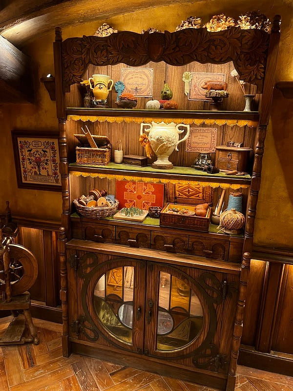

*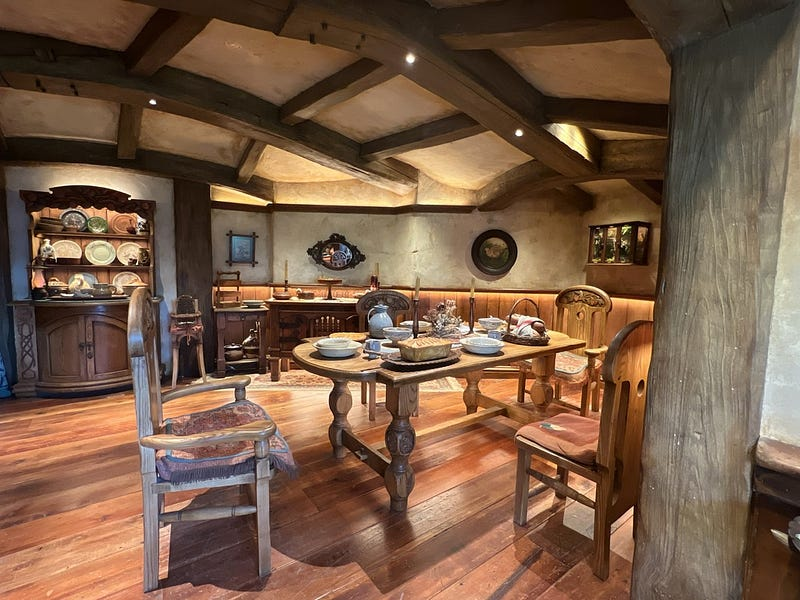*

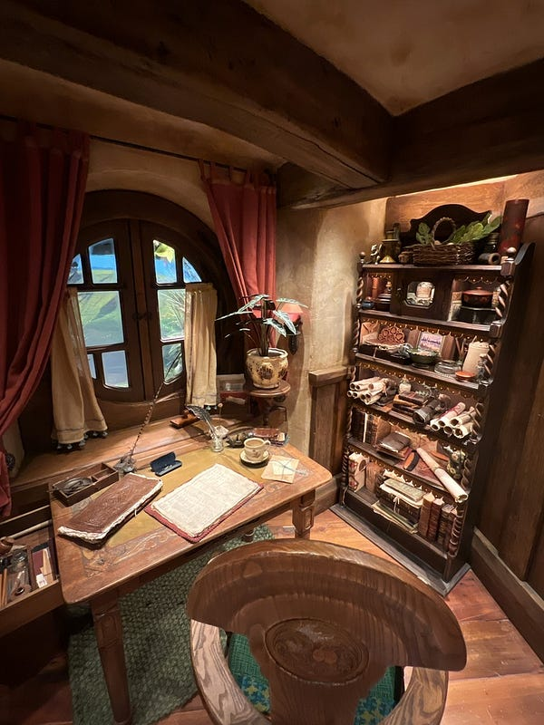

*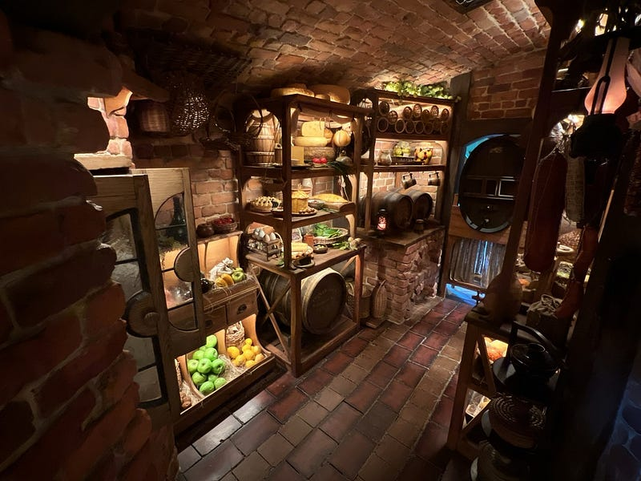為二可入內參觀的哈比人小屋*

裡面最特別的可能是其中一顆橡樹，所有的葉子都是從臺灣運送來的，並且手工擺放到樹上 (簡介中有特別標註)。

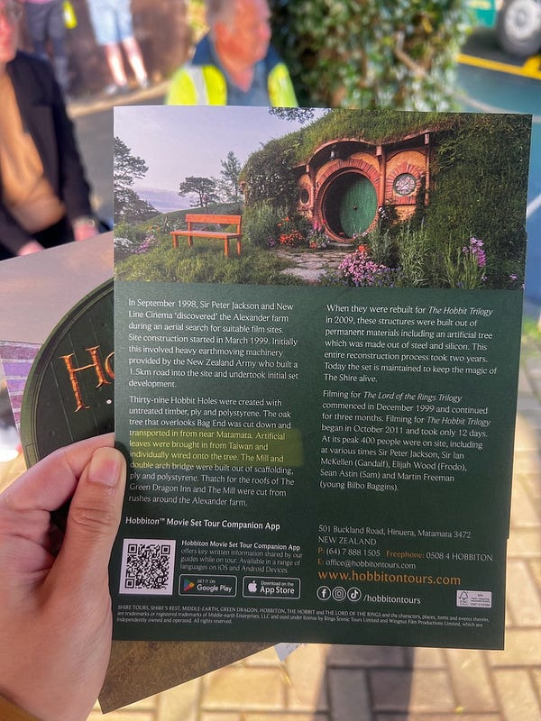

*特別的樹*

但我個人覺得，哈比村值不值得紐幣$120 的門票(兩個小時的導覽)可能見仁見智：

  * 如果你是魔戒/哈比人狂粉，那你可能沒理由不來？
  * 如果你可以負擔紐幣$120 的門票(大概台幣$2400)，那你可以考慮來，因為$120其實也可以做很多其他事😆。這個景點主要就是拍照跟參觀哈比人小屋(限時15分鐘)，總共導覽行程是兩小時，團進團出，多待一分鐘都不可以XD 我個人是覺得可來可不來，不管來不來應該都不會後悔XD

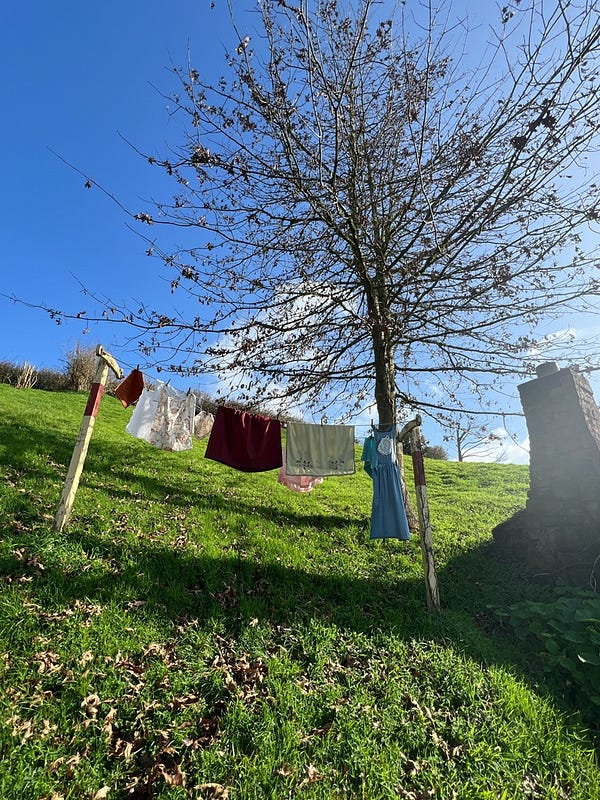

*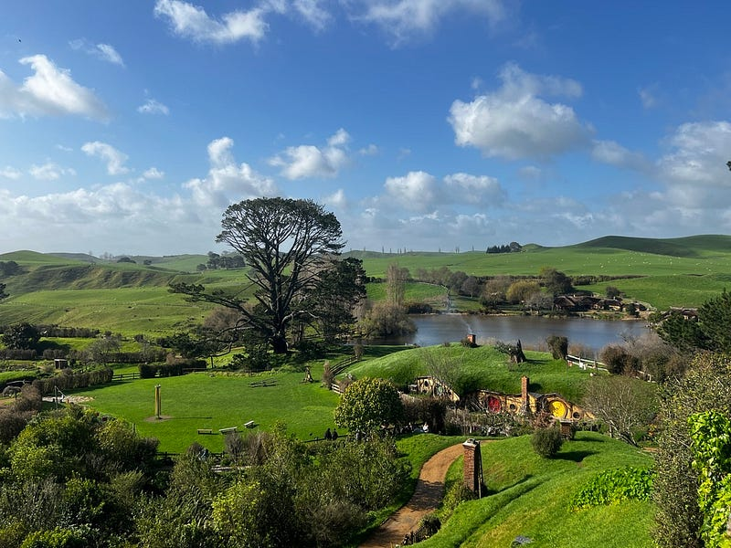*

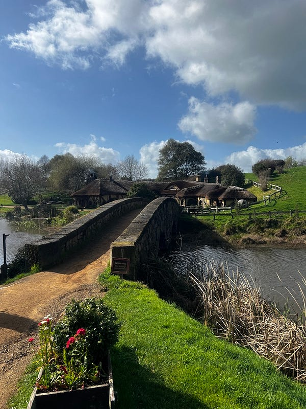

*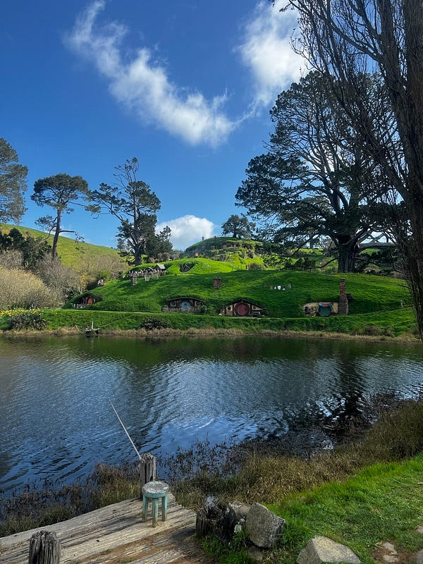*


