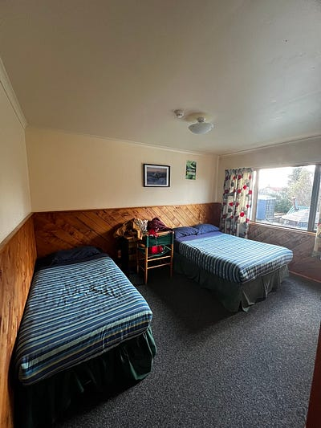
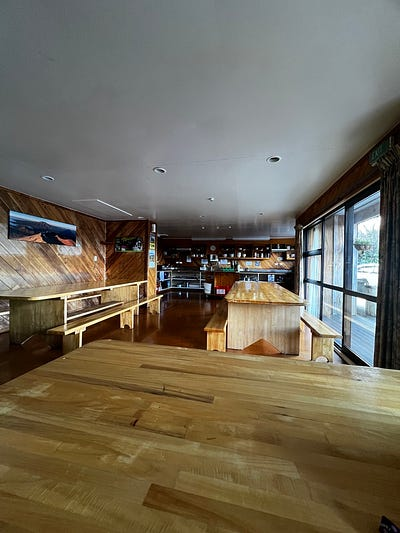
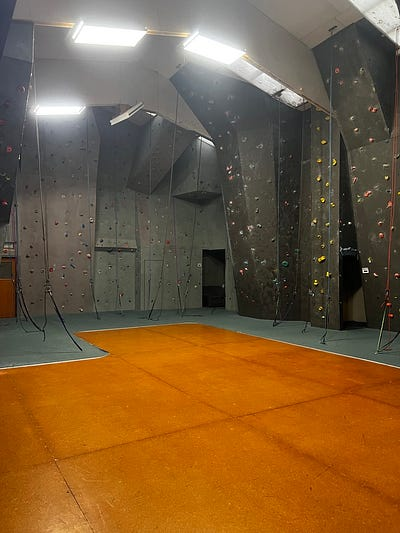
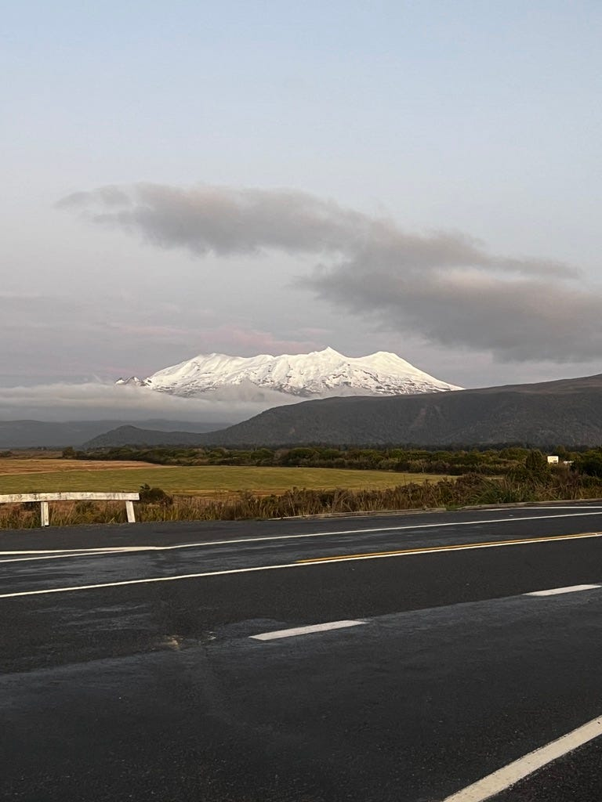
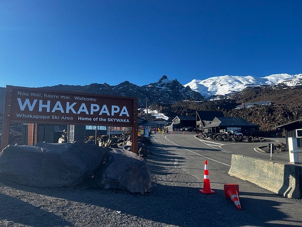
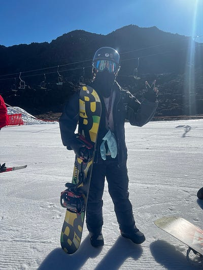
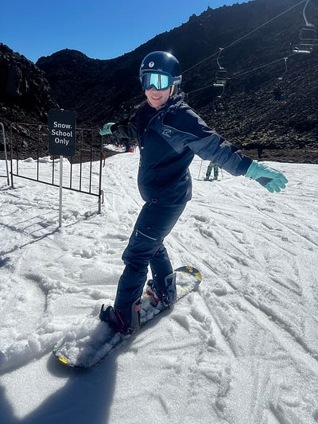
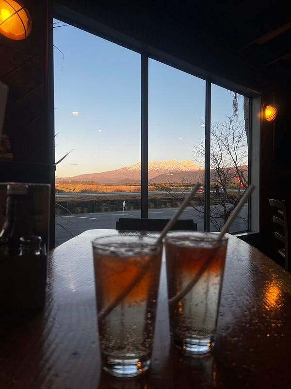
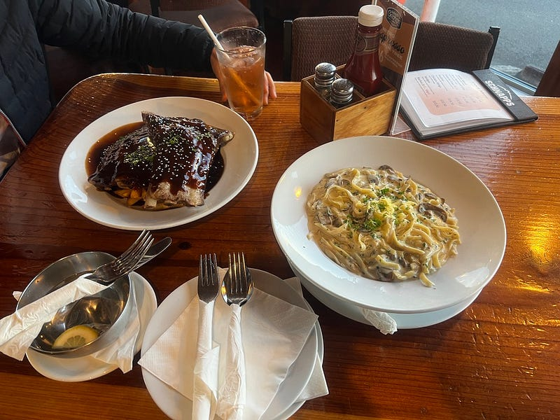

* * *

### **兩個女生的紐西蘭自駕滑雪行** 🇳🇿**: 2024.09.02–09.03** Whakapapa 雪場自駕+裝備+課程體驗總整理

終於迎來這次紐西蘭北島的重點行程：滑雪！

我們入住的是 National Park Backpackers 的雙人房，有自己的衛浴，三晚約$250 澳幣，平均一人一晚$40澳，超便宜！

這個背包客棧有超大的共用廚房跟室內攀岩場 (攀岩需額外付費)，算是我個人住過品質非常不錯的backpacker，房間很乾淨而且沒有異味😆

National Park Backpackers

Whakapapa 據說是紐西蘭北島最大的雪場，我們訂了整天的滑雪課(5個小時上課、1小時午休)。但不得不說雪場的配套措施滿爛的(或是說根本沒有配套措施，大家自生自滅吧😂)

這裡所有的雪場接駁巴士都是私營的，就算網站上有時刻表，也不一定會開，我們事先預訂的接駁巴士一直到前一天才通知我們取消。我們的滑雪課9:30 開始，但我們根本訂不到時間適合的接駁車。

後來我們在上網跟打電話訂車都無果後，完全焦頭爛額，跟 backpacker 經理討論了一下，她說最近天氣都不錯，就算是不用雪鍊也可以自行開車上山。於是我們早上起床後確定路況沒有問題就出發了。

後來發現在晴天且沒有積雪時 開車上下山很容易，因為全程都是柏油路！

自駕上山

我非常推薦整天的課程，因為六小時的課才能稍微涵蓋基本技巧。我個人只有學到後刃落葉飄 (heelside falling leaf) 有信心的地步，前刃(toeside）我不知道為什麼一直抓不到重心😂

Whakapapa 雪場

但是我覺得單板的確是個很有趣的運動，也建議大家一定要訂時間長一點的課程。我多年前在墨爾本學過1–2小時的 ski 課程，真的是沒什麼感覺就結束了🤣

第二天雖然是陰天，但上山前的路況報告感覺還算ok，所以我們就繼續開車上山。這裡建議上山前直接買好票。因為山上訊號不好，在山上用手機操作有點困難🤣 我們為了避開人潮超早就上山了，比雪場員工還早，所以人工售票處還沒開(整個雪場除了雪具租借處8點開之外，其他設施包含售票處、咖啡廳跟滑雪場都是9點開)。

另外如果當天天氣不好，可以買lower mountain 的票即可，因為上山也看不到什麼風景，只會一片霧茫茫。Whakapapa 山頂有個北島最高的咖啡廳，據說風景很好。但我們上山時完全暴雨，什麼都看不到，還被困在山上一個小時(因為風太大的，下到半山腰的纜車直接停開🤣)。

下午之後天氣糟到完全沒辦法繼續滑(大暴雨)，所以我們就提早下山了。但在暴雨中開車下山也是滿驚險的，視線超級差！我就一路開超慢當路隊長下山😆

第二天驚險下山後決定去附近餐廳吃飯犒賞自己

以下是我的滑雪裝備心得總結：

  * **滑雪襪：必買(就算只滑一天也建議買，或是如果你有一雙將近膝下的長襪也可以，但我真心還是建議買)** 。因為羊毛滑雪襪不貴，而且很實穿，登山健行或是冬天很冷都可以穿😆 可以買一雙就好，羊毛材質隔天就會乾。
  * **滑雪手套：必買(就算只滑一天也必買)** ，我買了一雙超便宜的防水滑雪手套$15，但大概滑個半天就濕了，經濟許可建議上 grotex 手套。滑雪手套真的滿影響體驗的，因為手又濕又冰之後，真的很難繼續滑下去。或是建議便宜的滑雪手套買兩雙，一雙上午戴一雙下午戴，因為初學者就是手會一直觸地，可能就算是高級滑雪手套也撐不了一整天🤣
  * **雪鏡：如果只滑一兩天，可買可不買。** 初學者其實用太陽眼鏡就可以了。但想帥的人，必須買😆 (我們的教練也只帶太陽眼鏡)
  * **雪衣、雪褲、安全帽：新手建議直接雪場租就好，省下搬來搬去的麻煩。** 有預算的人可以考慮買安全帽，有些租借的品質不一定很好(我個人這次在紐西蘭北島 Whakapapa 租借的還可以，但安全帽畢竟比較有衛生疑慮，所以我自己戴了一個頭巾隔絕)，而且安全帽還算好攜帶。如果真的預算有限，你又有自己的防風防水外套，我覺得也可以穿自己的。不過滑完一天之後會很濕，所以你就要繼續穿著那件濕外套下山，所以我後來還是決定用租的。雪褲必租，這個有兩層設計而且可以包覆雪鞋，才能確保你的下半身真的不會濕。
  * **雪板、雪鞋：新手建議租就好。** 熟練之後可以考慮買自己的雪鞋，但雪板還是要三思。因為搭飛機的行李會很麻煩，而且一般人旅遊通常不會只有滑雪這個行程。試想你想去北海道滑雪一週加觀光一週，那第二週你得不段扛著雪板移動，值得三思。
  * 穿著：我們這次來紐西蘭滑雪滿熱的，最低溫大概有3–5度。下半身我們都是穿一件運動 leggings + 租來的雪褲，我覺得很夠用。上半身我們都是單穿一件衣服，加上雪衣都還會滑到流汗。上衣的材質真的很重要，一定至少要買會吸濕排汗的運動上衣。我第一天穿一件短袖的uniqlo 發熱衣，上午滑完之後整件衣服直接又濕又冰又黏。我第二天單穿一件羊毛上衣，雖然還是熱，但至少羊毛比較吸濕排汗。

另外大家都說紐西蘭滑雪比澳洲便宜，很多澳洲人寧可搭飛機來紐西蘭滑。

我好奇查了一下，以澳洲最知名的雪山 Perisher 為例，一天的滑雪 pass 加裝備大概是 200紐幣 (約台幣4000) 跟500澳幣 (約台幣10,000) 的差別，的確價差是滿大的😆

以下是 2024 年的簡單比價供大家參考

Day pass: $120 NZD vs $239 AUD (Perisher)

Rentals

  * Snowboard + showboats $49NZD vs 112AUD (Perisher)
  * snow jacket + pants: $20NZD vs $117AUD (Perisher)
  * Helmet $10 NZD vs 40AUD (Perisher)


