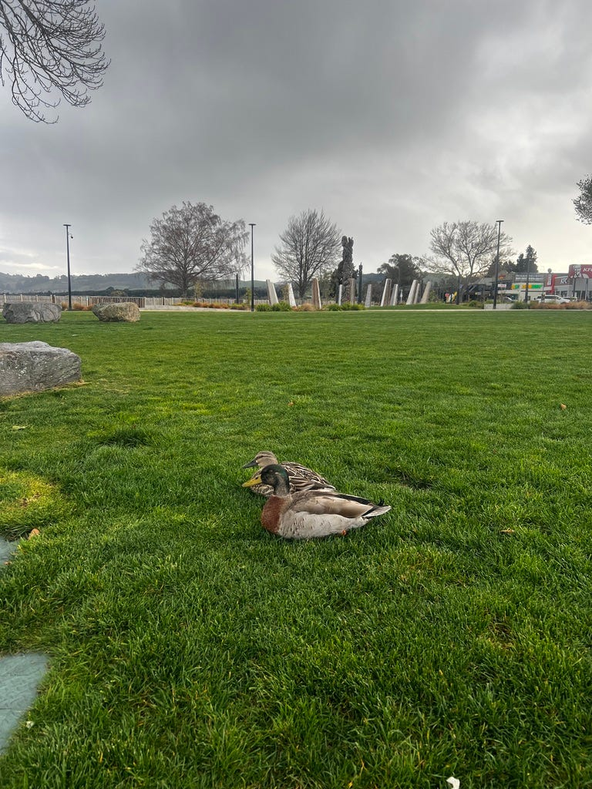
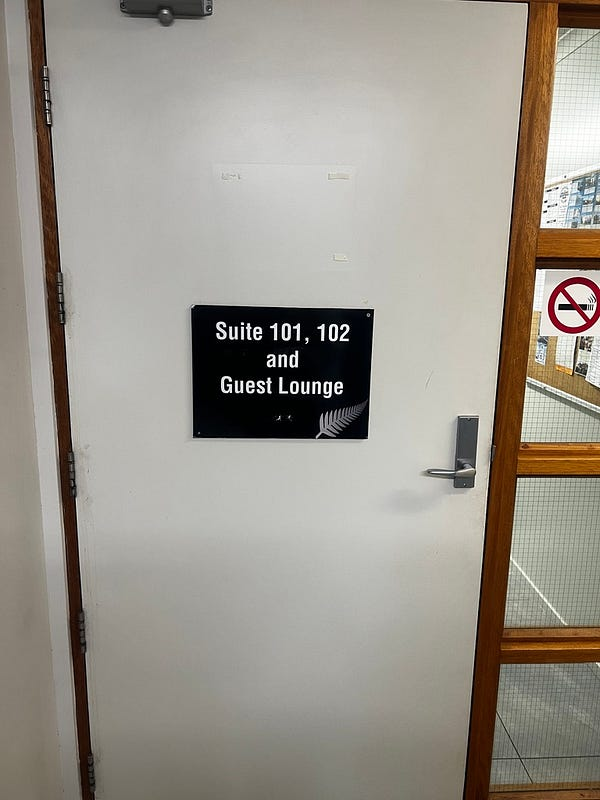
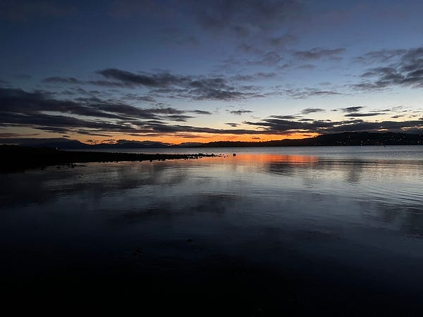
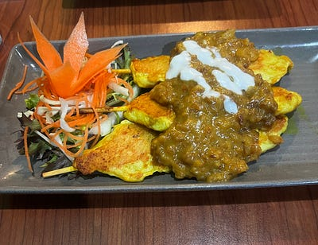

* * *

### 兩個女生的紐西蘭自駕滑雪行 🇳🇿: 2024.09.04 紐西蘭飛機麥當勞+神秘超值旅館！陶波隱藏版玩法推薦

好閒適的鴨鴨

滑完雪之後，我們驅車前往陶波湖！

### Huka Falls (胡卡瀑布)

第一站是 Huka Falls (胡卡瀑布)！

正當我站在橋上自拍時，一位路過的紐西蘭妹妹跑過來跟我合照。她拍完之後，她的一群朋友也都跑過來入鏡合照，我真心是要被他們笑死😆😆😆

瀑布很壯觀，還可以在瀑布下玩噴射汽艇。

接著我們沿著瀑布一路健行到另一個據說有天然溫泉的地方，沒想到那個溫泉極小，而且水溫也不熱🤣 不過沿途風景很美，也算是值得走一遭。

紐西蘭的風景真的美得很誇張

### 飛機麥當勞

飛機麥當勞

接著我們的好天氣就到此為止了！只好回到市區參觀世界上最酷的飛機麥當勞，接著回 Airbnb check in。

### 比起飛機麥當勞，我覺得這間旅館更酷

我們後來才發現這個 Airbnb 其實是一間旅館 Sliver Fern Lodge，而我們訂的兩房一衛的房型，居然還有自己的走廊跟大門，真是太有趣了😆😆😆 而且房間超級無敵大！這樣一個晚上只要120澳幣，等於一個人只要$60就可以擁有自己的房間+洗手台+檢疫廚房，真是太物超所值了！

### 免費的熱水海灘

陶波湖

傍晚時我們不甘心今天的行程被雨中斷，於是開車前往一個湖邊的熱水海灘 (hot water beach)。我必須說這個免費的景點真是太棒了，夕陽超美，而且那個地熱冒出來的泉水，真心.有夠燙😆😆😆😆 必須要踩對地方，不然腳底可能會燙傷🤣 也算是一解我們上午沒有成功泡到溫泉的遺憾！

不過，當下的氣溫其實很低，剛泡完腳是熱的，但擦乾腳之後穿上鞋子腳又冰了……感覺是不是直接在浴室沖熱水比較實際？🤣🤣🤣

晚餐吃泰式料理

* * *

**如果你喜歡海外生活、澳洲職場、文組轉職工程師的相關文章，記得「**[**按此訂閱我的Medium部落格**](https://medium.com/@cloudarchitectec/subscribe)**」，這樣你就不會錯過我的更新囉～**

**需要職涯導師嗎？澳洲雲端架構師 EC 提供轉職工程師、澳洲求職、移民生活等全方位諮詢服務。想進一步了解諮詢細節，請點擊**[**< <澳洲雲端架師 EC：專為轉職者量身打造的職涯諮詢｜海外職場×履歷優化 × 面試攻略 × DevOps /雲端職涯>>**](./2018-01-03-ec-consultation/index.md)**，開啟你的職涯新篇章!**

**如果想要進一步支持 EC，歡迎透過以下連結請我喝杯咖啡！你們的支持是我持續創作的動力，如有任何問題或是想要看的主題，歡迎留言與我互動 :)**

  * **歡迎追蹤 Facebook**[**澳洲雲端架構師 EC 臉書粉專**](https://www.facebook.com/cloudarchitectec)
  * **歡迎追蹤 Threads**[**Cloud Architect EC**](https://www.threads.net/@cloud_architect_ec)
  * **合作請聯繫:**[**cloudarchitectec@gmail.com**](mailto:cloudarchitectec@gmail.com)

