* * *

### 兩個女生的紐西蘭自駕滑雪行 🇳🇿: 2024.09.05–09.06 滑完雪就是要泡湯！療癒的 Rotorua 行程

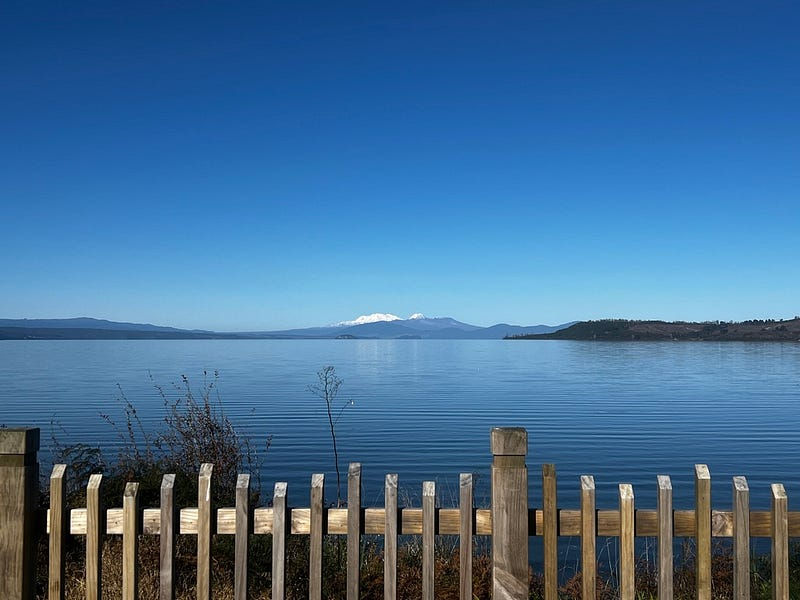

離開 Taupo 之前，我們特地來這個紐西蘭北島第一大湖的湖畔吃早餐，一補昨天抵達時下雨的遺憾。天晴時還可以遠眺雪山喔🏔️～非常美

### 火山口地熱公園 Craters of the Moon

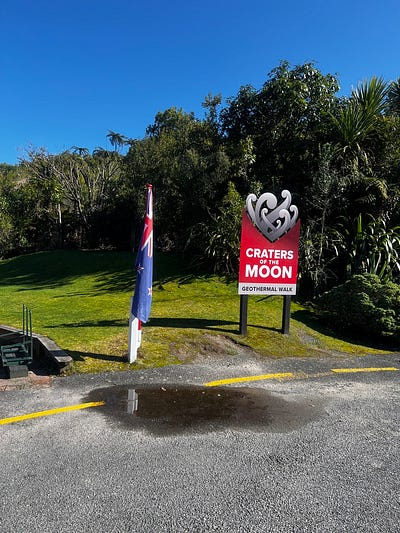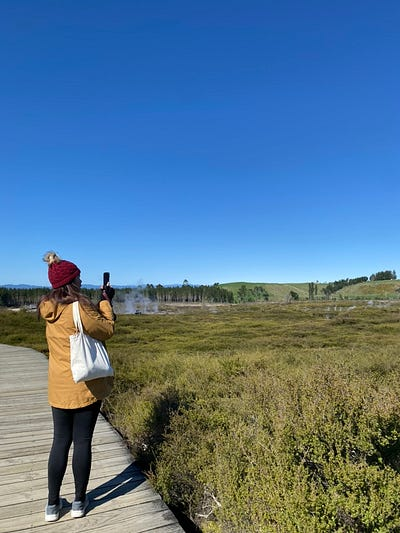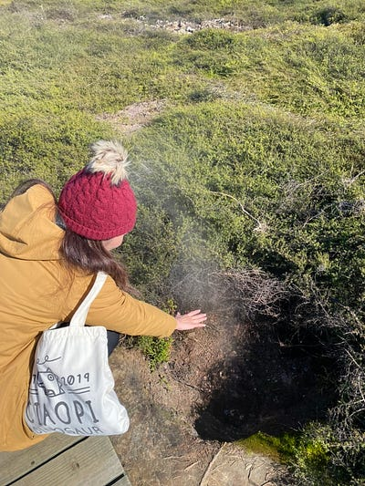

第一站是火山口地熱公園，我把它稱為紐西蘭的月世界。看到一片綠油油卻冒煙的地表真的好妙😆

### Wairakei Terrace & Thermal Health Spa

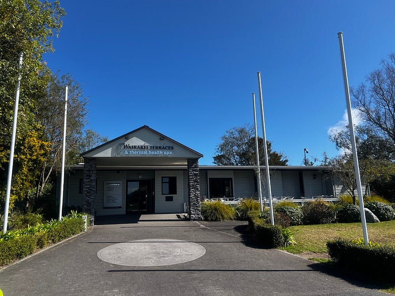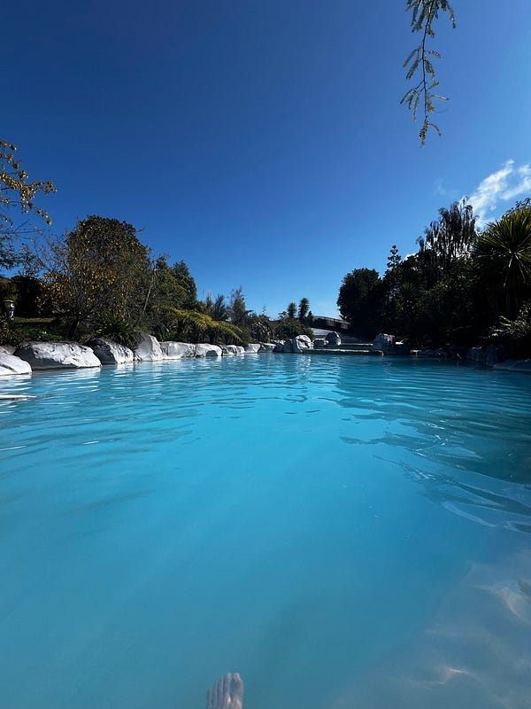

接著我們就去泡了溫泉 spa，總共有四個池可以泡，一個人入場費才$27紐幣，覺得好超值！而且我們是平日去的，人潮不多，超級享受！一解前幾天滑雪的痠痛😊

接著我們就驅車前往下一個城市Rotorua! 非常幸運剛好碰到他們每週四一次的夜市！吃了超多亞洲街頭小吃，非常開心😋

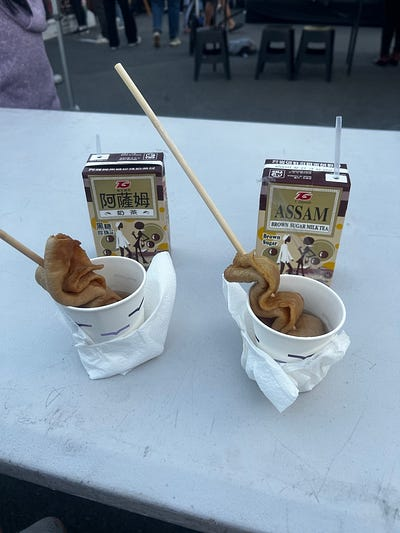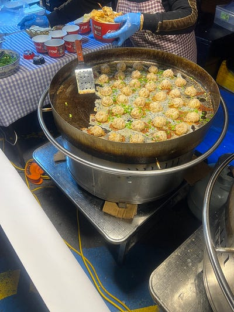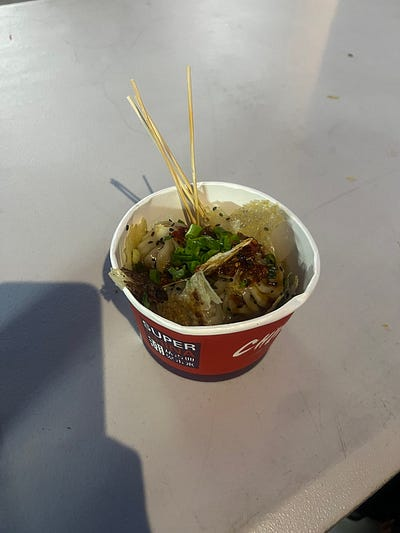夜市小吃

不得不說我們這趟去紐西蘭真的覺得紐西蘭人口好少，走在路上或是商店裡都沒有人（紐西蘭國土是台灣七倍，但人口只有七百萬)。感覺經濟活動有相對蕭條，難怪很多紐西蘭人都跑來澳洲工作🤣

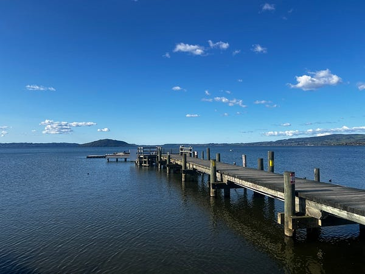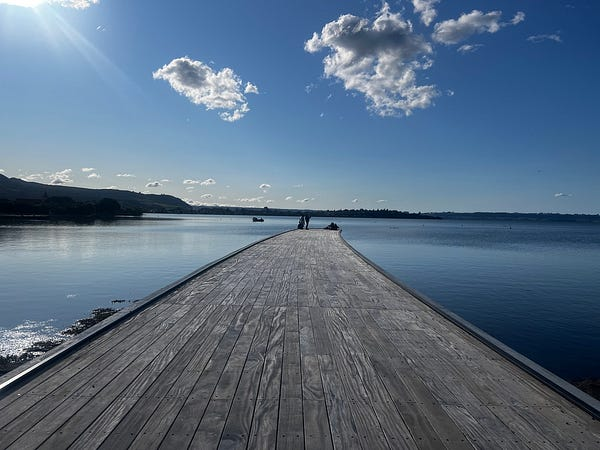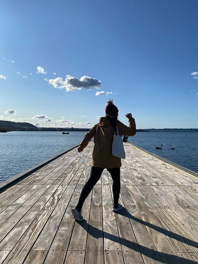Rotorua 也有一個會大的湖～

### Ciabatta Bakery

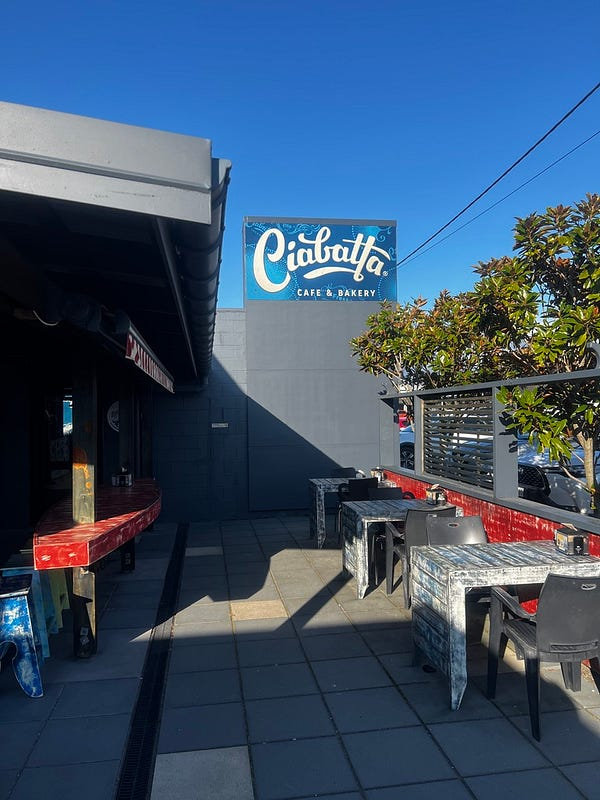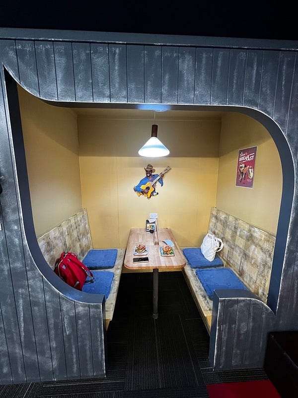

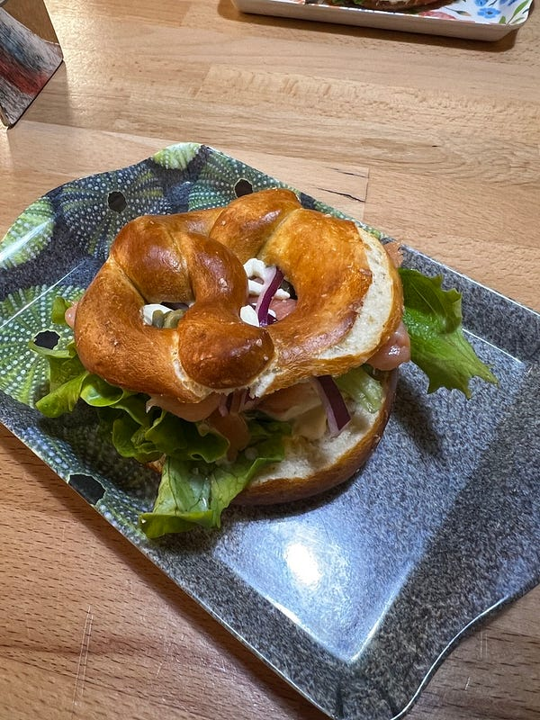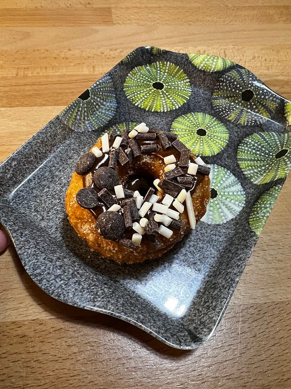

隔天早上去吃了我昨天隨手一查的 Ciabatta Bakery，他家的pretzels簡直驚人得好吃，好吃到我們吃完之後欲罷不能，又跑去加點甜甜圈🍩，結果甜甜圈很普通🤣

### Skyline 溜溜車

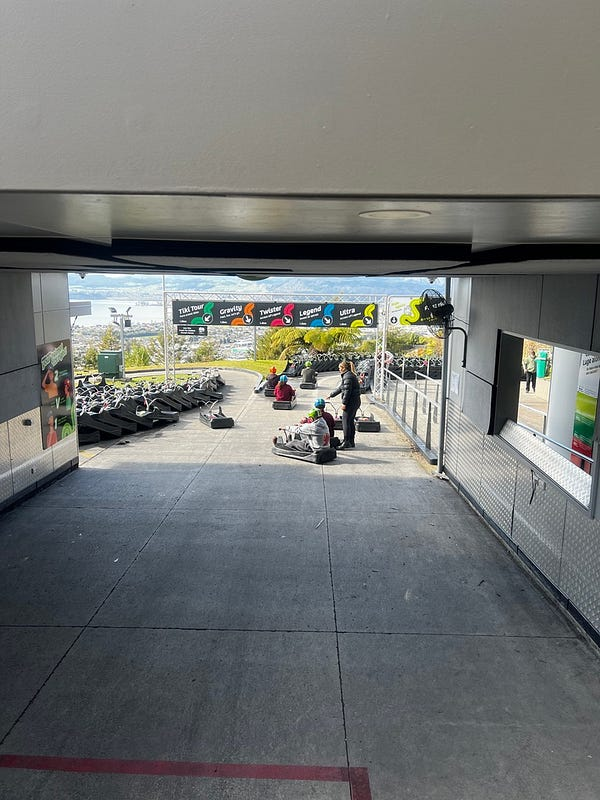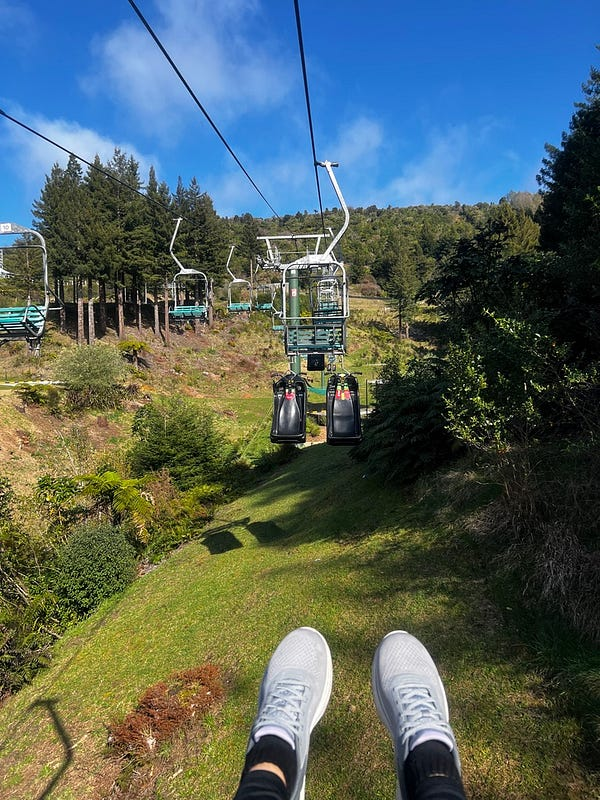Skyline

接著跑去 Skyline，本來還在糾結溜溜車要玩幾次，後來心一橫想說來都來了，那就玩好玩滿，於是買了五次溜溜車加一次溜索的終極套裝行程😆

不得不說溜溜車真的很好玩，但溜索感覺有點太短了，還不如在 treetop challenges 玩的緊張刺激🤣

### Redwood 紅木森林健行

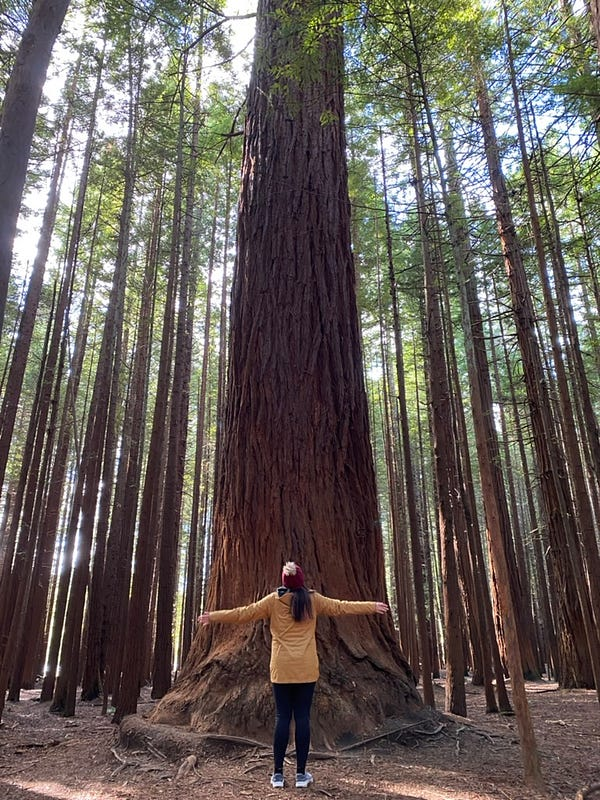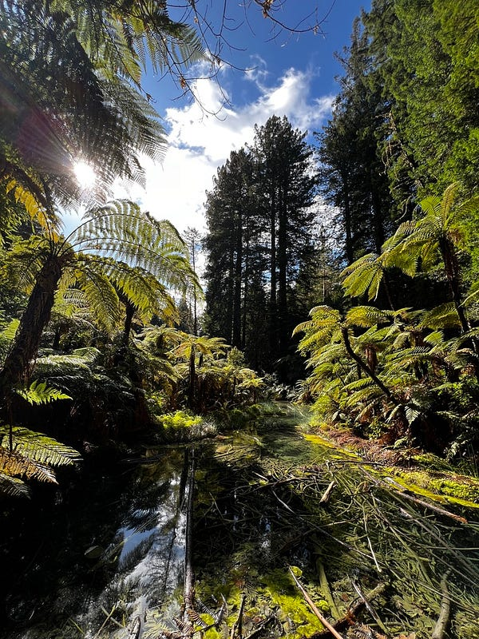Redwood

結束 Skyline 的行程，我們前往 Redwood 紅木森林健行。真的是滿漂亮的，但路線設計有點莫名奇妙，感覺就是為了達到想要達到的長度，所以左邊繞一圈，右邊讓一圈🤣

行程結束後，我們特地去逛了紀念品店跟超市，但是真的找不到什麼想買的東西，因為紐西蘭跟澳洲真的太像了🤣

最後只買了兩張明信片、一包薯片、一包 honey pocket 巧克力和一個 Cookie Time 的餅乾，就結束了我們的購物行程。

這也是我們在紐西蘭的最後一天！

Until next time 🏔️

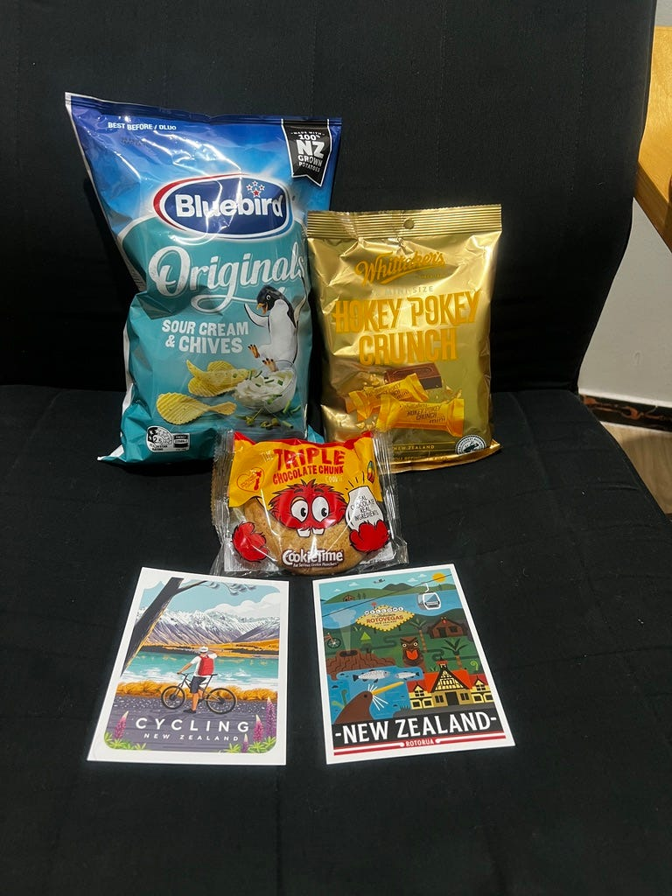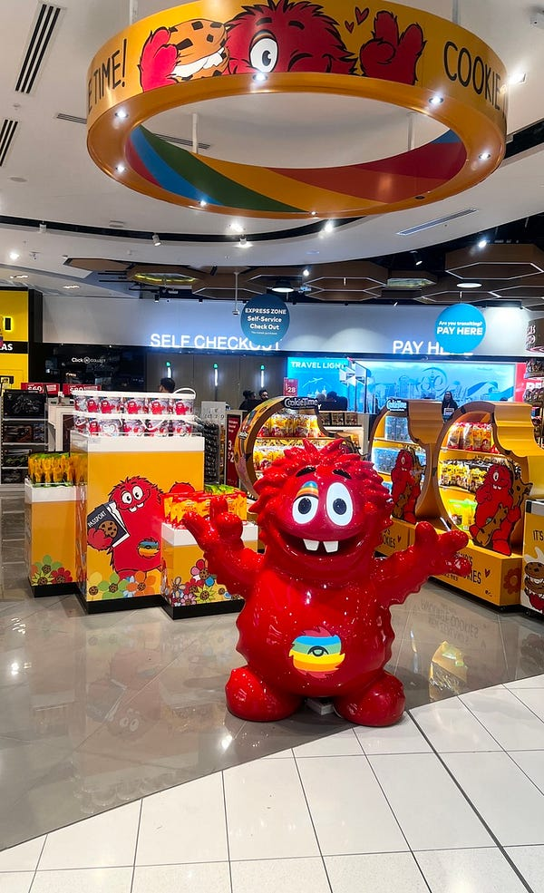紐西蘭伴手禮


