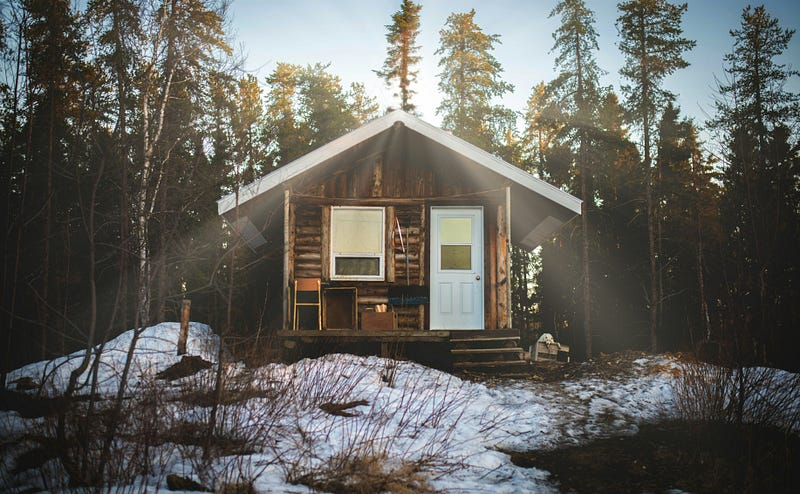
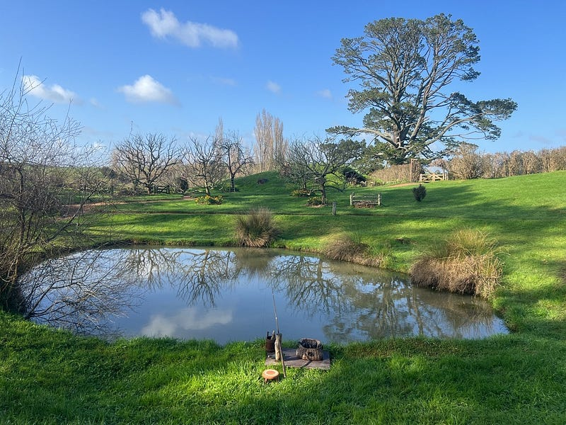
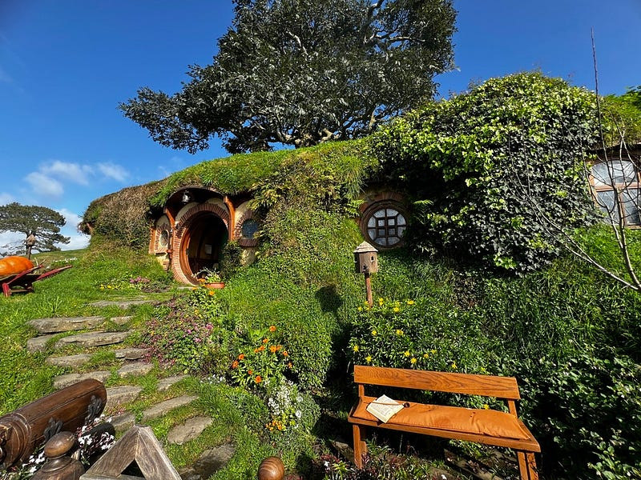
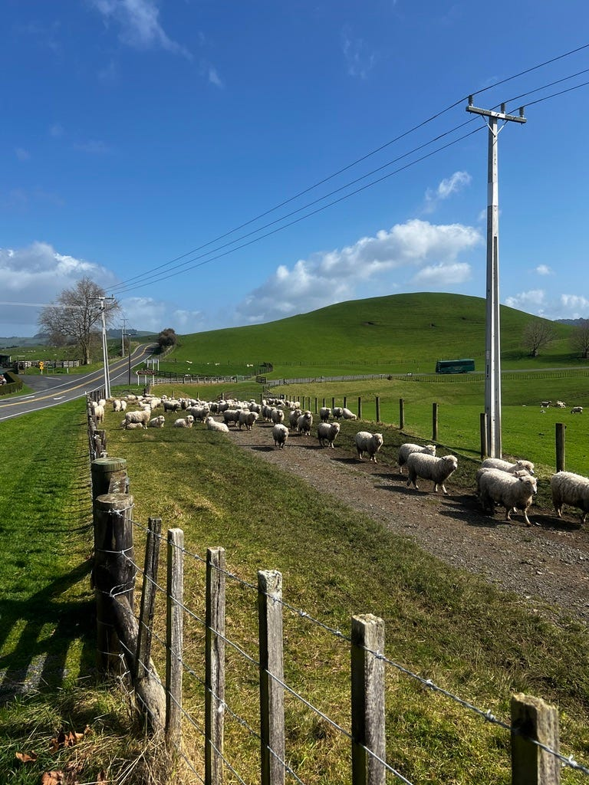
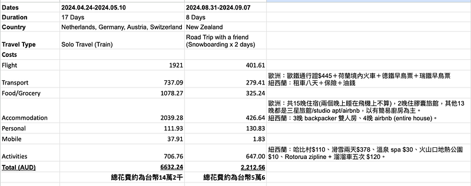

* * *

### 兩個女生的紐西蘭自駕滑雪行: 行程與花費分享

Photo by [Hugo Villegas](https://unsplash.com/@gohu?utm_source=medium&utm_medium=referral) on [Unsplash](https://unsplash.com?utm_source=medium&utm_medium=referral)

應讀者要求，決定要來開展一個新系列「兩個女生的紐西蘭自駕滑雪行 🇳🇿」分享我的紐西蘭遊記～ 大家如果有其他想看的主題，記得留言給我說！只要有許願的話，願望通常都會實現喔XD

  * 日期：2024.08.31–2024.09.07 (澳洲：布里斯本<->紐西蘭：奧克蘭)
  * 地點：紐西蘭北島 (Hamilton、National Park/Whakapapa、Taupo、Rotorua)
  * 旅行方式：租車自駕

### **緣起**

這一陣子 EC 都頗為厭世，非常想找個深山躲起來，所以就開始搜尋布里斯本附近的 weekend getaway (週末小旅遊) 的可能選項。會選擇山區是因為 EC 已經多次去過黃金海岸三天兩夜，去年聖誕節時也去了新州跟昆州交界的著名海灘景點 Byron Bay。

不過看了一些山區 airbnbs 之後，頓時又陷入了糾結！

假設我們選了車程近的 airbnb (例如車程 1.5 小時以內)，在澳洲人的日常來說完全是可以當天開車來回的距離，好像也沒有必要花 $200 澳幣以上去住一晚 airbnb。要是我們選了車程比較遠的地方 (例如車程 3 小時)，兩天一夜的行程除了一晚住宿之外，每天都要花三個小時在路上，感覺時間好像也不是特別充裕。

於是我們開始查看其他澳洲境內的選項，從布里斯本飛去墨爾本來回也是要 $300-400 澳幣 ($6000–8000 台幣)。海外的便宜機票選項例如越南或是巴厘島則要約($500 澳幣 ($10,000台幣)，也不是太吸引我們。其中最適合的選項，可能就是去日本，從布里斯本出發搭捷星的話其實也只要$500 澳幣上下，但去日本的話，感覺一週的時間不夠玩啊 (畢竟日本那麼好玩XD)

百般糾結之下，我們意外發現了飛奧克蘭的機票只要 $400 澳幣($8,000台幣)，九月初算是雪季末但還是可以滑雪，而且滑完雪北島還有溫泉可以泡，那就決定是你啦！(澳洲的雪山不像日本，通常都沒有溫泉的選項。)

紐西蘭深山XD

* * *

### **事前準備**

  * **簽證**

EC 在 2012 年時一個人去過紐西蘭南島，我記得當年拿台灣護照免簽，好像也不需要特別申請，帶著台灣護照就直接入境了。

這次我是持澳洲護照入境紐西蘭，也不需要申請簽證，但是入境前要記得先上網填[紐西蘭入境卡 NZTD](https://www.travellerdeclaration.govt.nz/) (我自己是用手機 app 填寫的，也很方便)。相較之下澳洲真的很落後，我們還在發紙本的入境卡😿

室友 C 是持台灣護照的澳洲 PR，沒想到現在澳洲 PR 去紐西蘭觀光也要申請電子簽證 New Zealand Electronic Travel Authority (NZeTA)了。雖然說費用也不貴，只要 NZD $17 (約台幣$340)，但我完全還停留在澳洲 PR 可以隨時自由出入紐西蘭的印象 😂

澳洲人要去紐西蘭可參考澳洲政府的 smart traveller 網站：<https://www.smartraveller.gov.au/destinations/pacific/new-zealand>

紐西蘭移民局的簽證申請規定：<https://www.immigration.govt.nz/about-us/policy-and-law/how-the-immigration-system-operates/visa-application-process/how-much-visa-applications-cost-and-when-to-pay>

  * **交通方式**

因為我們兩個人都有澳洲駕照，也習慣在澳洲右駕，於是就選擇租車自駕作為交通選項～

我們的租車是在 booking.com 上直接訂的，總共八天的租車費用出乎我意料的便宜，才 NZD$162 (約台幣$3200)。我們的租車公司是 Snap，租的車型是經典的省油小車 Toyota Corolla。不過我們額外加保了全險要 $172(約台幣$3400)，保險費完全比租車費還貴XD

如果不習慣右價或紐澳交通規則的人（尤其圓環的規則必學），記得要先做好功課。之前有新聞報導一對台灣情侶在紐西蘭租車，但因為不熟悉紐西蘭交通規則而頻繁違規，最後直接被紐西蘭警察攔下來，不准他們再繼續在紐西蘭開車 囧

### **行程**

 哈比村

08/31

  * 我們的飛機時間為 6.45am — 11.55am，抵達時已經中午了 (澳洲跟紐西蘭有2小時的時差XD)。租車後我們沒有在奧克蘭多做停留，立刻驅車前往漢密爾頓花園 (Hamilton Gardens)。當天只跑了一個行程就結束了XD

09/01

  * Matamata: Hobbiton 哈比村 (電影魔戒三部曲與哈比人三部曲的拍攝地點)，接著就驅車前往 National Park 準備迎接本次的重點行程：滑雪。

09/02

  * National Park/Whakapapa 滑雪

09/03

  * National Park/Whakapapa 滑雪

09/04

  * Taupo: Huka Falls (胡卡瀑布)、Lake Taupo (陶波湖)、世界上最酷的飛機麥當勞

09/05

  * Taupo：Craters of the Moon (火山口地熱公園)、Wairakei terraces and thermal healthy spa (溫泉 spa)
  * Rotorua：夜市

09/06

  * Rotorua: Ciabatta Bakery 、Skyline (溜索＋溜溜車)、Redwood (紅木森林公園)

09/07

  * 回程的飛機是 1:05pm — 2:55pm，所以最後一天的行程就是直接從Rotorua 開車殺回奧克蘭機場還車。

### 花費總結

紐西蘭特產羊咩咩

這次八天七夜的紐西蘭滑雪行，我個人的花費約台幣 5 萬 6。今年剛好出國兩趟，所以我還做了一個歐洲旅費跟紐西蘭旅費的對照表XD

雖然這兩趟旅行其實沒什麼可比性 (畢竟時間長度跟旅行方式都很不同)，但我個人最有感的兩點是：

  * **滑雪真的好貴:** 兩天的雪票＋兩天雪具裝備租借＋一整天 6 小時的單板課程，居然就跟我去歐洲三週的活動費用差不多XD
  * **兩個人分擔住宿真的好便宜** ：我覺得獨旅最大的缺點真的就是高昂的住宿費用！以前年輕時我都住青年旅館的多人房，所以可能差距不會太大，但現在我偏好三星旅館或是 airbnb 的話，沒有另一個人可以分擔費用就真的差滿多的。

### 結語

以上就是我這次紐西蘭自駕滑雪行的旅行心得，必須說單板 (snowboarding) 真的很好玩！！！希望以後還有更多機會可以繼續精進我的單板技巧～

如果你對於我這次的紐西蘭之旅有任何問題，都歡迎留言。接下來我還會繼續分享每一天的紐西蘭遊記，請大家敬請期待囉！


