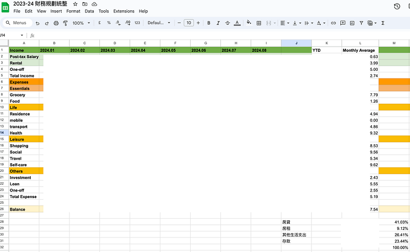
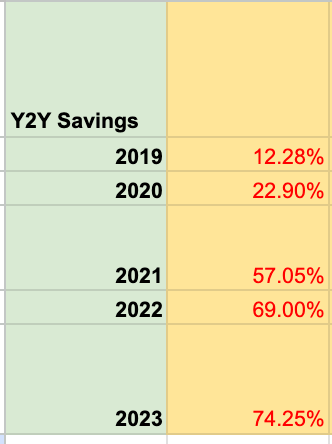
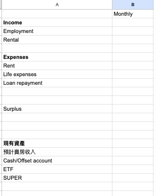

* * *

### 好想要退休！我與退休之間的距離：澳洲工程師是否比台灣人更容易達成財務自由 (FIRE)？

Photo by [Towfiqu barbhuiya](https://unsplash.com/@towfiqu999999?utm_source=medium&utm_medium=referral) on [Unsplash](https://unsplash.com?utm_source=medium&utm_medium=referral)

過去幾年 EC 總是三不五時嚷嚷著要退休，有一陣子也很熱衷於吸收有關 FIRE ([Financial Independence, Retire Early](https://zh.wikipedia.org/zh-tw/FIRE%E8%BF%90%E5%8A%A8)) 運動的資訊，也投資了一些 ETFs ([指數基金](https://zh.wikipedia.org/zh-tw/%E6%8C%87%E6%95%B0%E5%9F%BA%E9%87%91))。

* * *

2022 年搬離坎培拉後，我把坎培拉自住的一房公寓轉為投資房，2023年在布里斯本的 Logan 地區買了一間四房兩衛雙車庫的 house 作為投資房 (沒有自住打算，純投資)。 然後……就沒有然後了XD

### 房貸利率太誇張

Covid 後，澳洲的房貸利率一路從 2% 攀升到現在的 6.6%，EC 身為一個工程師，靠著自己一個人在澳洲當工程師的薪水扛了接近澳幣 100 萬的貸款 (沒有父母資助、沒有接收祖產、還沒有中樂透XD)。

身為轉職者，我當工程師的時間其實也沒有太長。從 2020 年 9 月到現在，滿打滿算也才 4 年。雖然這些年來貸款的壓力沈重，但我其實沒有壓縮到自己的生活品質與旅行愛好，扣掉 Covid 期間無法出國，從 2022 年開始我去過以下海外旅行 (+好幾次澳洲境內的小旅行)：

  * 2022: 返台 long stay 42 天
  * 2022: 7 天新加坡 Amazon 出差行
  * 2022: 10天南太平洋游輪

[**[旅遊] Carnival Splendor 澳洲南太平洋郵輪 — 事前準備及須知 (2023.05出發)**  
_Carnival Splendor 澳洲南太平洋郵輪事前準備分享_ medium.com](/posts/2023-05-08-carnival-splendor-intro/)

  * 2023: 10天斐濟

[**2022.10.10 斐濟自助旅遊 Day 1: 初來乍到之這裡真的不是屏東嗎?**  
_2022 年九月我決定從 Amazon 離職。在開始我在微軟的新工作前，我幫自己安排了一趟斐濟行。當初會挑選斐濟作為目的地，是因為我年紀大了(?)，想挑選一個離澳洲飛行時間五個小時以內，又能提供放鬆形成的國家，於是斐濟就雀屏中選了。_ medium.com](/posts/2024-01-30-fiji-day-1/)

  * 2022: 返台 long stay 36天
  * 2024: 17天歐洲行

[**一個女生的歐洲獨旅: 荷德瑞奧 17 天自助 行前規劃**  
 _此篇文章是「一個女生的歐洲獨旅」系列的第一篇文章，講述了 EC 為什麼選擇去歐洲，安排了哪些行程，如何挑選交通方式與住宿地點，還有春天去歐洲旅遊的打包訣竅。如果你對 EC 的歐洲行有興趣，那請千萬不要錯過這個系列！_ medium.com](/posts/2024-08-10-2025-europe-summary/)

  * 2024: 8天紐西蘭

[**兩個女生的紐西蘭自駕滑雪行 🇳🇿: 行程與花費分享**  
 _這一陣子 EC 都頗為厭世，本來只是想在布里斯本想找個深山躲起來，沒想到旅遊資訊查來查去，我就突然決定要跟室友 C 一起去紐西蘭滑雪啦～ 這篇是「兩個女生的紐西蘭自駕滑雪行…_ medium.com](/posts/2024-09-02-2024-nz-summary/)

### 反思投資策略

雖然說生活型態沒有因為投資以及旅遊而受到太多影響，但是澳洲利率遲遲不降、坎培拉一房公寓的房價增值有限，讓我開始反思自己每個月花在貸款上的費用是否值得？

考慮了許久我決定出售坎培拉的公寓並調整自己的投資策略，公寓預計在 2024 年 10 月底過戶。

坎培拉公寓雖然租金收入高 (rental yield 約 6.82%)，但受限於房型與地區，所以售出後我並不會獲得太多收益 囧 (不過我一開始買這套公寓的心態，其實也不是為了投資，當時的我真心以為自己會久居坎培拉XDD)

[**[生活] 澳洲坎培拉首次購房流程分享**  
 _分享我 2021 年在澳洲首都坎培拉的買房經驗。當年買房時我利用了澳洲政府的首次置業計劃之一 First Home Loan Deposit Scheme，所以我也會分想這個計畫的相關規定。_ medium.com](/posts/2021-05-07-2021-life/)

我後來真心是覺得房產投資是一個勞心勞力的過程 (從看房、買房議價、貸款、出租房產、租客管理到賣房)，收益也不一定會如預期。

畢竟買房的成本太高了，一般人說真的也沒有辦法重複執行太多次。因為個人薪資的漲幅是有限的，到一定程度之後，就算你有辦法存到頭期款或是投資房升值後把貸款額度套現出來 (refinance equity)，你的借貸能力 (borrowing capacity) 也差不多到頭了，很難不斷通過銀行的貸款評估。

還不如定期定額投資指數型 ETF 容易！所以我在思考是否接下來把投資重心再度轉回 ETF? 如果你對於投資也略有研究，歡迎跟我一起交流！總覺得身邊的朋友不太會聊到這個話題，我身邊有相關經驗的朋友也不多XD

但投資 ETF 的缺點在於，真的需要非常長期才能看出效果 (其實房產也是，但是房產投資至少有個實體可以看、可以觸摸，要自己搬進去住也可以XD)。這也就導致了很少人能長期堅持投資 ETF，像我大概持續投資了一年之後就停止了，開始轉到房產投資，畢竟一個普通人的資金真的有限，就算自學了很多知識，說真的也沒有源源不絕的資金可以運用或是測試各種投資策略的成效 😭

### 說好的聊退休呢

不小心扯遠了，上面只是跟大家分享一下我個人一路走過來的投資心路歷程跟煩惱XD

總之呢，投資的目的是為了擁有更好的生活! 如果可以靠著投資產生的被動收入生活，提前退休，那不是很棒嗎？生活不用再被工作時間綁住，而是可以花時間去學習自己想要學的技能、做自己想要做的事。

於是我決定來算一下自己與退休的距離，答案是根據我的個人資產現況，我還需要 18 年才能退休😂

### 18年！！！

其實我也不知道這個數字代表了什麼意思XD 我查了一下澳洲的法定退休年齡是 67 歲，台灣是 65 歲。這麼一想如果我可以在 54 歲退休，其實也可以算是 early retirement (提早退休)? 只是可能跟一般人對於「提早」的定義不同而已？😂

跟身邊的朋友分享這個發現之後，大家都很好奇我是怎麼計算的，於是我就決定來跟大家分享一下我簡單粗暴的算式！

### FIRE 運動的 4 % 法則

首先在 FIRE 運動裡有一個公式： 4% 法則。簡單來說，這個經驗法則代表我們在投入一筆資金後，想從中取出源源不絕的現金流，卻不會讓本金歸零的魔術數字。透過這個現金流，我們可以評估自己退休所需的資產規模，來設定退休目標。

舉例來說，假設你每年的消費是 4 萬澳幣 (80萬台幣)，那就代表你要有一筆 100 萬澳幣 (2000萬台幣) 的資金 (4萬/0.04，或是你也可以直接乘於 25 倍)，這樣就可以提供你每年源源不絕的生活資金。

  * 使用這個公式的前提是，你必須要有記帳習慣，確切紀錄自己的生活消費，千萬不要用單純用感覺判斷！很多人總「感覺」自己每年支出了多少費用，但如果要求他們認真記帳之後，他們一定會發現很多大大小小的支出就在他們不經意中花掉了XD

曾經我以爲大部分的人都有記帳的習慣，但有次跟朋友聊天我才發現原來我是少數人? (有認真在記帳的朋友請站出來聲援我XDDD)

我自己是每一筆，真的是每一筆消費都會記帳 (因為幣別是澳幣所以會算到小數後兩位)，每兩個月會把支出跟收入分類統計，然後進行全年平均跟 month-to-month 的比較分析，觀察自己的消費趨勢。

其中最重要的數字就是存款率，這裡我算的是稅後收入(澳洲領薪水的都是稅後，報稅其實再多退少補) 減掉支出之後，存下來的金額比例。大家可以看到今年因為我的貸款支出真的太高了，佔了41%，所以目前的平均存款率只有 23.44%，少得可憐😭

以下是我過去幾年的存款率 (排除一次性大型支出，例如買車、買房、一次繳清兩萬多澳幣的澳洲學貸，因為這些支出可能一輩子都不會出現幾次XD)，可以看出我平常大概可以存下 60–70% 的稅後薪水。

你們可能會說，可是你 2019 跟 2020年也都只存 12–22％，感覺跟現在差不多啊？嗯，那個時候我還沒有轉職工程師，薪水大概是現在的1/3–1/2。所以這些年其實我個人消費沒有增長很多，但因為轉職後薪水翻倍了，所以存款比例就變高了XDDD

  * 除了年消費這個數字，這個 4% 法則其實還有一些假設的前提，這也是為什麼如果你上網搜一下，就會發現其實有不少批評與質疑。

例如這個公式假設你每年的消費都相同 (或是說你每年的消費都會跟歷年的通膨指數一樣等比例成長)，但這個假設其實一點都不合理。因為大家可以簡單想像一下，你覺得你20歲時的年消費，會跟你 30、40、50、60、70 歲的時候一樣嗎？應該不會吧XD

又或者很多 FIRE 到極致的人，他們會選擇以最大程度減低自己的生活消費，例如屏除一切不必要的支出，以便早日達成所需數字。延續上面的例子，假設一個人本來的年消費是澳幣四萬，但這個人決定排除所有娛樂支出、搬回父母家省房租、拒絕所有朋友邀約、再也不旅遊、再也不喝手搖只喝水，所以他的年消費可以降到澳幣兩萬，這就代表他只要存到澳幣 50 萬就可以退休了。沒錯，這的確代表他達成退休的時間縮點了一半以上。讓我們假設他 30 歲退休了好棒棒，但這就代表他 30–80 歲都要維持一樣的生活型態，那筆錢才夠他可以生活無虞 (這樣的生活要過50年，我可能也是辦不到哈哈)

再來是這個假設也沒有考慮到重大人生改變。這裡就簡單舉個我之前在 FIRE 論堂上看到的例子，這個人也是 FIRE 有成，32歲就退休了，好開心～～～ 然後 35歲遇到他的靈魂伴侶 (太棒了)，36 歲結婚、37歲生小孩…… 40歲發現自己必須重新回到職場找工作😭，因為他當年 FIRE 時，並沒有成家養小孩的規劃，所以後來發現他當初存的錢根本不夠 囧

### EC 簡單粗暴的算式

好的，上面解釋了4% 法則的原理，並舉出了幾個這個原理沒有考慮到的地方(其實還有其他缺陷)，但我覺得大家也不用太在意，因為這就只是一個簡單的推算公式而已，本來就不可能涵蓋所有個人情況或是特殊情況。

以下就來說明一下我的 18 年是怎麼簡單粗暴算出來的 (首先我還是簡單做了一個表格XD)：

  1. **總收入(年)** ：稅後薪資+租金收入
  2. **總支出(年)** ：房租＋生活支出＋房貸 (上面提過我的 Logan 房子是純投資房，所以我現在是 rentvesting，也就是買投資房投資並選擇租屋，所以我的生活支出同時有房貸跟房租。)
  3. **每年總盈餘 (Surplus)** : 年收入 — 年支出
  4. **現有資產 Ｘ** : 單純算現金價值，不考慮房價、車價等等，也就是把現在手上的現金＋坎培拉公寓的預計賣房收入＋ETF 市值＋super (澳洲退休金帳戶的金額)，都加起來。
  5. **計算退休所需要的金額Ｙ** ：根據我的消費紀錄，我每年的消費(含出國旅行喔)是 ？萬澳幣，保守起見我以一年的支出是 (？+ 1) 萬來計算，乘以 25 之後就是我需要的退休金額。
  6. **每年會增加的資產Ｚ** ：根據 3 可以推算出我一年可以存多少錢 + 每年退休金帳戶的入帳 (除了 base salary 之外，澳洲雇主需要提撥薪資 11% 的金額進你的退休金帳戶)，就是每年會增加的資產Ｚ。
  7. **終於要算年限了** ：然後把 (退休所需的金額 Y — 現有的資產 X) /每年的盈餘金額 Z，就得到 18 年這個數字了XD 真的是非常簡單粗暴，完全不考慮複利、通膨、加薪等等其他因素。

(更新：我發現不舉例的話概念好像有點難懂! 以下就讓我們用一些數字來進行模擬吧)

  1. **總收入(年)** ：2024 年澳洲家庭的平均收入約為 12 萬澳幣。
  2. **總支出(年)** ：2024年澳洲家庭的平均支出是 $8000/月，也就是 $96,000/年。
  3. **每年總盈餘 (Surplus)** : 年收入 — 年支出，也就是 $24,000/年。
  4. **現有資產Ｘ** : 2024 年澳洲家庭的平均資產為 $300,000 澳幣，
  5. **計算退休所需要的金額Ｙ** ：上面假設了年支出是$96,000，我們就算作 10 萬好了。也就是說想要安穩退休，需要 10 萬 x 25，也就是 $2,500,000。
  6. **每年會增加的資產Ｚ** ：根據 3 可以推算出一年可以存 $24,000澳幣，加上每年的退休金入帳 $13,800 (以1的年薪澳幣12萬，現有的 super rate 11%來來計算)，所以金額 Z 就是 $37,800。
  7. **終於要算年限了** ：然後把 (退休所需的金額 Y —現有的資產 X) /每年的盈餘金額 Z，就會得到 58 年這個數字 LOL (我應該沒有算錯吧？一般澳洲家庭的退休日是否遙遙無期？)

歡迎大家留言跟我分享你們與退休的距離XDDD 我真的很好奇！

如果你們對於這個計算方式有什麼想法 (或是你有更好/更準確的算法)，或是有什麼更好的投資建議，都歡迎與我分享！讓我們一起來更快速獲得更多金錢，達成我們的理想生活！！！

> 其實每次算完都會覺得，算了我還是 YOLO (you only live once) 吧～ 該花花該玩玩該吃吃該睡睡，期待自己突然有一天中樂透嗚嗚嗚嗚 (但我也只有偶爾想到才買XD)

* * *

**需要職涯導師嗎？澳洲雲端架構師 EC 提供轉職工程師、澳洲求職、移民生活等全方位諮詢服務。想進一步了解諮詢細節，請點擊**[**< <澳洲雲端架師 EC：專為轉職者量身打造的職涯諮詢｜海外職場×履歷優化 × 面試攻略 × DevOps /雲端職涯>>**](./2018-01-03-ec-consultation/index.md)**，開啟你的職涯新篇章!**

**如果想要進一步支持 EC，歡迎透過以下連結請我喝杯咖啡！你們的支持是我持續創作的動力，如有任何問題或是想要看的主題，歡迎留言與我互動 :)**

  * **歡迎追蹤 Facebook**[**澳洲雲端架構師 EC 臉書粉專**](https://www.facebook.com/cloudarchitectec)
  * **歡迎追蹤 Threads**[**Cloud Architect EC**](https://www.threads.net/@cloud_architect_ec)
  * **合作請聯繫:**[**cloudarchitectec@gmail.com**](mailto:cloudarchitectec@gmail.com)

