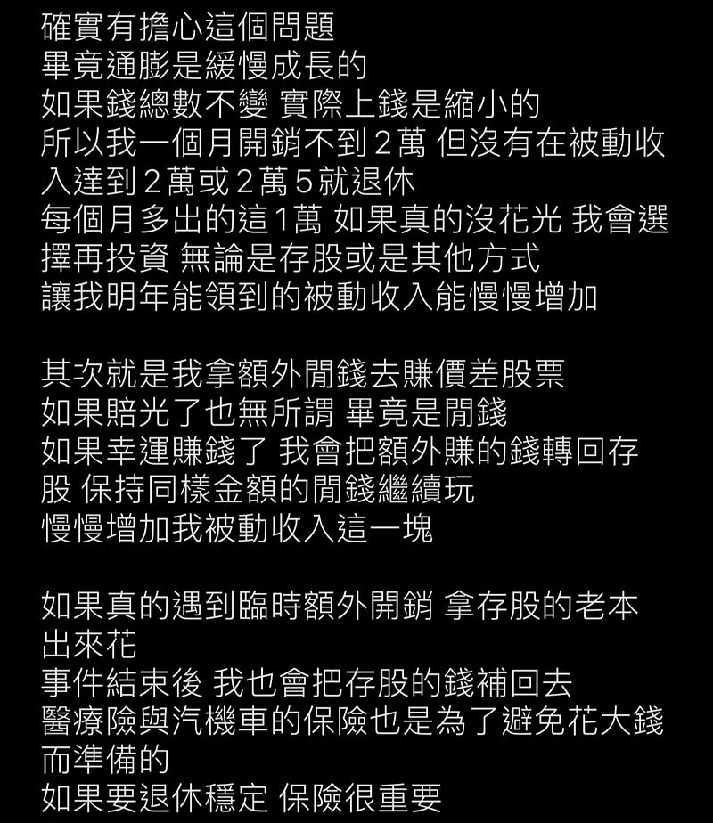
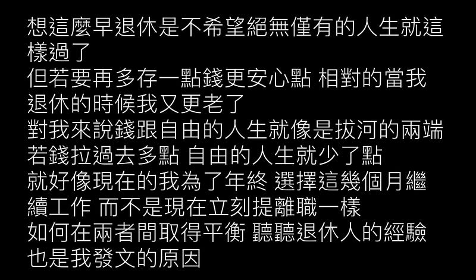

* * *

### 好想要退休！案例分析：33 歲宅男實現財務自由 (FIRE) 成功提早退休，難道退休比我想的簡單？

Photo by [Kelly Sikkema](https://unsplash.com/@kellysikkema?utm_source=medium&utm_medium=referral) on [Unsplash](https://unsplash.com?utm_source=medium&utm_medium=referral)

> 這裡的宅其實沒有貶義，作者本人在批踢踢上的連載標題就是「宅男的退休生活閒聊」，而且 EC 其實也很宅XD

如果你還沒有看過上一篇「**我與退休之間的距離** 」，好奇 EC 怎麼算出我離退休還有 18 年的距離，請閱讀：

* * *

[**好想要退休！我與退休之間的距離：澳洲工程師是否比台灣更容易達成財務自由 (FIRE)？**  
 _本文分享了澳洲工程師在投資與退休計畫中的心路歷程，包括轉職後的投資策略、房產投資的挑戰。探討 FIRE (Financial Independence, Retire Early)…_ medium.com](/posts/2024-09-27-how-long-tofire/)

* * *

這篇文章我想要來分享一下我最近研究的一個成功案例。

雖然現代的年輕人應該已經不看批踢踢了，但沒有關係，EC 不是年輕人XD我一開始是在批踢踢的**生涯規劃板** 上看到這位 **D 板友 (dreamff)** 分享的退休生活「**宅男的退休生活閒聊** 」：<https://www.ptt.cc/bbs/CareerPlan/M.1594356017.A.477.html>

因為是實際案例，他也有持續分享2020年退休後到2024年的花費與生活型態(目前持續連載中)，我覺得還是滿值得參考的。

網路上甚至有相關新聞報導：[33歲財務自由提早退休 陳韋廷拿回人生自主權 | 雜誌 | 聯合新聞網](https://udn.com/news/story/6843/7088027)

### 案例分享

在我看完該 D 板友的連載文後，他的資產配置如下：

  * **總資產約 1000 萬台幣**
  * **其中有 700萬投資在股市**
  * **自住房 200 多萬** ：是一棟位於桃園大溪兩房一廳的老房子 (20幾坪)，地點很偏僻。不過因為是退休後的住所，沒有通勤考量，所以交通便利性也不是重點。

以上的資產配置可以為他帶來:

  * **每個月被動收入 3 萬** ：如果光算股息的話，他的投資報酬率大概是5.14%。他的投資配置是「普通股+ETF ：特別股 ETF ：美債 ETF：REITS ETF」 = 4:4:1:1
  * **每個月支出2萬** ：包含了各種稅與保險、忽然心血來潮買的相機、汽機車的保養
  * **也就是說他每個月扣掉支出，還會有一萬塊的盈餘：** 這一萬塊他有時候會拿去進行一些其他投資(會挑一些跟他本來的投資組合不同的投資標的物，例如報酬率跟風險更高的投資項目)，或是幫汽車添購裝備。

以下是該網友的關於通膨跟為什麼要這麼早退休的回覆：

* * *

### 心得

  1. **只要一千萬** ：看到網友分享他只需要台幣一千萬就可以財富自由，我其實是相當震驚的，根據我的估算 (4% 法則加上一點點 buffer)，我大概需要澳幣 125萬，也就是台幣 2500萬才能退休 (這是在持有無貸款房產的前提下)。如果加上購入未來自住房的資金(我估計可能需要花 40–60萬才能買到我心中理想的住所)，所以總共需要澳幣 185萬，也就是台幣 4000 萬 😭
  2. **房子房子房子 (重要的事情說三遍)** ：我覺得對一般人來說提早退休最大的困難可能就是擁有貸款還清的自住房，所以他光是用 200 萬就可以買到適合的自住房，真的是一個很驚人的金額！
  3. **購房考量：** 雖然房子是一個問題，但是如果不需要上班，其實完全可以住在便宜又偏遠的地方。不需要離 CBD 近，也不需要通勤方便，只要附近有一定的生活機能即可。出門採買一週最多也只要 1–2 次。所以說不定根本不需要買到澳幣 40 -60 萬的房子？
  4. **反思生活型態：** 在 D 板友的系列分享文中他對於自己的生活有更多描述，基本上就是每天睡到自然醒、以外食居多，主要的娛樂活動就是上網跟開車出去露營之類的，可以看出他的生活成本真的不高，這也可能是為什麼他能夠在 33 歲就退休的原因。他也有提到他自己對於出國旅遊完全不感興趣。對我來說，除了生活必須支出之外，出國旅遊的確就是我最大的支出來源，這也是為什麼我估計我需要 2500 萬才能以繼續維持現有生活型態的方式退休😂

### 結語

這個案例分享其實為我帶來很大的衝擊，感覺對我來說很遙遠、很難達成的目標，居然有人已經達成了，並且親身實踐中。很好奇大家對於這個案例的看法，請大家多多留言跟我分享XD

但轉念一想，我覺得我不可能買到台幣 200 萬的自住房 (澳幣10萬)，如果要我完全放棄出國旅行這件事也很可惜（我真的覺得親身體驗異國文化這件事對我這個人帶來很多心靈養分跟思想上的刺激）。所以對我來說這就好像是一個很困難的問題有別人找到了解法，但我也知道我不可能照著這個解題思路去做😂

看來我離退休之路，還是遙遙有期（18 年）……

* * *

**需要職涯導師嗎？澳洲雲端架構師 EC 提供轉職工程師、澳洲求職、移民生活等全方位諮詢服務。想進一步了解諮詢細節，請點擊**[**< <澳洲雲端架師 EC：專為轉職者量身打造的職涯諮詢｜海外職場×履歷優化 × 面試攻略 × DevOps /雲端職涯>>**](./2018-01-03-ec-consultation/index.md)**，開啟你的職涯新篇章!**

**如果想要進一步支持 EC，歡迎透過以下連結請我喝杯咖啡！你們的支持是我持續創作的動力，如有任何問題或是想要看的主題，歡迎留言與我互動 :)**

  * **歡迎追蹤 Facebook**[**澳洲雲端架構師 EC 臉書粉專**](https://www.facebook.com/cloudarchitectec)
  * **歡迎追蹤 Threads**[**Cloud Architect EC**](https://www.threads.net/@cloud_architect_ec)
  * **合作請聯繫:**[**cloudarchitectec@gmail.com**](mailto:cloudarchitectec@gmail.com)

