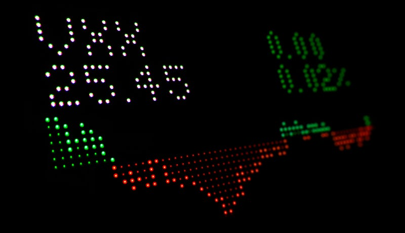
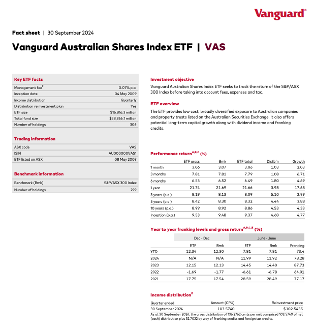
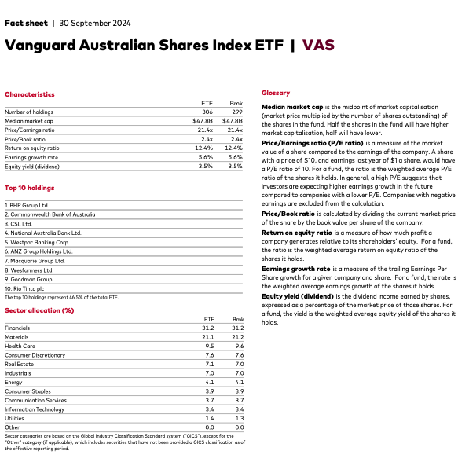
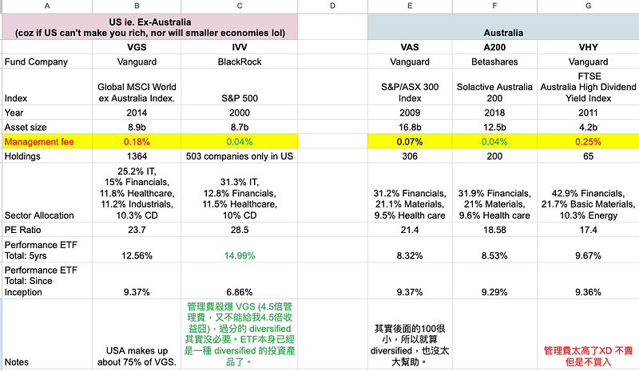

> 以下純屬我個人的研究分享，不代表任何理財建議。EC 是有個澳洲會計學位啦，但我只是個工程師，不是專業財經人士。以下分享，你們要是覺得有道理就聽一聽。要是覺得沒道理，歡迎留言跟我討論你的想法，我們互相學習，共同成長 :)

網路上分享指數基金 ETFs 的資訊其實不少，但澳洲因為市場較小 ，而且主要的語言也不是中文，所以相關資訊比較少一點。我最近剛好想要調整一下自己的 ETF 投資策略，想說就順便來跟大家分享一下我整理好的資料吧～

* * *

首先來個趣味問答，身為全球霸主，美國市場大概佔全球經濟的 25%，大家知道澳洲經濟體占世界的比重有多少嗎？答案是1.6%！！！哈哈哈哈哈哈，有夠迷你啦！！！

台灣市場則大約是 0.8%。雖然台灣的經濟規模相對較小，但在全球供應鏈中特別是科技產業（如半導體）中扮演著極其重要的角色，例如台積電（TSMC）在全球技術和製造領域的影響力非常顯著。雖然台灣佔全球經濟總量的比例不大，但在高科技產業中有著極大的戰略性影響喔～

Photo by [Tyler Prahm](https://unsplash.com/@tprahm?utm_source=medium&utm_medium=referral) on [Unsplash](https://unsplash.com?utm_source=medium&utm_medium=referral)

### 最常見的澳洲 ETF 投資組合

澳洲人最常見的 ETF 投資組合，就是 Vanguard 基金公司的 VAS 和 VGS。

**Vanguard Australian Shares Index ETF（VAS）**

由 Vanguard 發行的指數ETF，於2009年成立。旨在追蹤 **S &P/ASX 300 指數**的表現，該指數涵蓋了澳大利亞市值最大的 300 家公司。VAS 適合尋求澳洲市場長期投資的投資者，既能享受資本增值，也能獲得穩定的股息收益。

**Vanguard MSCI Index International Shares ETF（VGS）**

由 Vanguard 發行的指數ETF，成立於 2014 年，旨在追蹤 **MSCI World ex-Australia Index** 的表現，該指數涵蓋全球已開發市場的大型和中型公司，並排除了澳州的公司（所以跟上述的 VAS 沒有重疊）。VGS 適合希望將投資多樣化至澳洲以外市場的投資者，通過參與全球經濟增長來獲取長期資本增值，並享有國際企業的穩定股息收益。

網路上常見的投資建議是 「**60% VGS + 40% VAS」** ，但是看過第一段的大家，應該會發現事情並不單純XD

澳洲市場這麼小，這個比重其實不太合理，所以我個人的比重是 「**80% 美國市場 + 20%澳洲市場」**(請注意，我這裡的關鍵字是市場，因為我覺得就我來說 VGS + VAS 不是我個人偏好的選項。如果你感興趣我選擇的哪些 ETF 作為投資組合，那就請繼續看下去囉～)。

> 其實這個投資現象有個專有名詞叫「本國主義 (home bias)」，指的是投資者在選擇投資時，傾向於購買本國公司的股票，而不是外國公司的股票，這種現象在全球許多市場中普遍存在。本國主義通常源於對本國市場的熟悉感、信任度以及對當地經濟和公司情況的了解。

### 如何挑選適合你的 ETF

不知道大家都怎麼挑選 ETF? 是股市專家推薦什麼就買什麼？看現在流行什麼就買什麼？還是你會仔細研究過後才購買呢？

  1. **挑 ETF 的第一點其實是：想清楚你的財務目標是什麼？確定之後，我們才能考慮該建立怎樣的 ETF 投資組合才能達成想要的目標？**

這裡要注意的是財務目標真的是因人而異！

常見的考量因素包括年紀 (你的投資組合年限是多久)、你對於風險的偏好（保守型還是富貴險中求型）、你的其他投資組合 (例如說你的投資主力是房地產，但你又專攻 REITs ETF，這樣就代表你的資產會過度集中於房市) 等等。

> **REITs ETF（不動產投資信託基金交易所交易基金）** 是一種專門投資於不動產投資信託的交易所交易基金。REITs 是一種公司結構，通過擁有、運營或融資不動產來產生收入，並且通常要求將大部分收益以股息形式分配給股東。REITs ETF 使投資者能夠以低成本和高流動性參與不動產市場，並通過單一的交易所交易基金獲得多樣化的投資組合。

就算對於同一個人來說，財務目標其實也是會變動的，所以建議你最好每一到五年重新檢閱一下自己的財務目標。

2\. **投資是一筆錢! 我覺得花錢之前你不一定要是一個專家，但至少要做好基本功課XD**

如果你想要投資 ETFs，網路上有很多學習的資源，但最簡單也最系統化的一個方式就是看基金公司官方發表的 ETF fact sheets。

ETF fact sheet 是一份提供 ETF 關鍵資訊的文件，通常包括基金的基本資料、投資目標、投資組合、費用結構和報酬率等。好處是這個 fact sheet 通常只有兩頁，但卻包含了所有你需要知道的重要基本資訊，夠簡單了吧！

裡面你需要知道的有：

  * **基金基本資訊** ：發行公司、基金成立日期、基金規模。

有些人對發行公司有所偏好，我個人是還好，基本上只要有一定的規模跟發展歷史我就 OK。澳洲最受歡迎的基金公司是 Vanguard (上述 VAS & VGS 都是 Vanguard) 發行的，其他比較大的基金公司還有 BlackRock、BetaShare 等等。

成立日期主要是看過去表現，我個人會建議購買成立至少五年以上的基金產品，至少有一些過去的數據可以分析。

基本上基金規模不要太小 (我覺得至少要數十億澳幣以上)，規模太小的話代表交易人數也比較少，流動性較低。

  * **投資目標＆指數資訊** ：投資目標與策略，描述基金的主要投資範圍和方法。既然都要投指數基金了，你應該至少要知道該基金的追蹤指數是什麼吧？我覺得投資指數基金最重要的一點就是你是否認同這個指數，跟這個指數涵蓋的投資組合 (主要持股、產業組合及地區分佈)。
  * **回報率與績效** ：過去的年回報率、年初至今回報率及其他績效指標。
  * **管理費：** 很多產品性質相近的基金其實是有著不同的追蹤指數，但說真的，長遠來看表現其實大同小異，這時候管理費就是關鍵！身為長期投資者來說，成本越低，其實投資績效就越好。而且說真的，你都要投資指數基金了，過多的基金公司人為主動操作(因而產生更高的管理費) 豈不是跟你的投資理念背道而馳嗎？XD
  * 股息**資訊** ：股息收益率、股息頻率等，提供有關收入的詳細信息。
  * **風險評估** ：風險等級、波動性等指標，幫助投資者理解潛在風險。

### 手把手教你看 ETF Fact Sheet

好的，簡單的理論講完了，讓我們來實戰演練一下！

首先要找到 ETF Fact Sheet 非常簡單，只要搜尋你想要的 ETF code + fact sheet 即可，例如搜尋 VAS fact sheet 我們就會得到以下的兩頁 PDF: [VAS Fact Sheet](https://fund-docs.vanguard.com/ETF-Vanguard_Australian_Shares_Index_ETF_8205_FS_VAS.pdf) (fact sheet 通常會每季更新，所以大家到時候要記得去看最新的資料喔)

第一頁裡我們主要關注的是以下資訊：

  * **Fact sheet ｜30 September 2024** ：fact sheet 的公告時間，這裡我們看的是當下的最新數據 2024 Q3。
  * **管理費 Management fee — 0.07% p.a.** ：就指數型 ETF 來說 **0.07% p.a.** 算是合理且偏低的價位。如果管理費超過 0.15% p.a.，我會好好審視是否有其必要性。
  * **股息 Income distribution — quarterly** : 這個其實也算重要，但我上面沒有特別提。澳洲的 ETFs 通常都會給不錯的股息 (dividends)，這點跟美國的 ETFs 其實很不一樣。VAS 是每季都發股息。股息雖然很棒，但如果你們了解股息的原理，其實股息跟升值有時候是背道而馳的XD (這裡先不細談，不然我這篇要寫成一篇論文了XD) 所以我覺得就把它當作日常小確幸吧，對於長期投資者來說，我覺得在我們退休之前，升值遠比股息重要。
  * **基金規模 ETF size — 16 billons:** 基金規模是 160 億澳幣，像我上面提過的，我個人覺得超過 10 億就已經算是不錯的規模，我個人沒有追求基金規模越大越好，但如果該基金只有數百萬澳幣的規模，我是不會投資的，因為我覺得流動性太小、風險太高。
  * **主要持股 Number of holdings — 306:** VAS 追蹤的指數是 ASX300，所以只持股 300 多間澳洲上市公司。
  * **指數 Benchmark — S&P/ASX300 index**：追蹤的指數
  * **投資目標 Investment objective** ：真的很短，所以一定要看一下投資目標跟你的投資理念是否相符。
  * **概述 ETF overview** ：真的很短，所以一定要看一下 ETF 概述跟你的投資理念是否相符。
  * **投資回報率 Performance return ：** 這裡我看的是 ETF total，這是包含股息 distribution 跟升值 growth 的總成長率。

(呼～ 第一頁看完了，恭喜！一開始看可能會覺得很複雜，但等你看完三份之後，就會立刻抓到規律了XD)

第二頁我們要看的是：

  * **主要持股 Top 10 Holdings** ：基本上這 10 間主要持股就佔了整個 ETF 的 46.5%，所以如果你不認同這十家公司將來會有一定程度的發展，我認為你應該考慮不要投這個 ETF XDD

以下幫不熟悉澳洲公司的讀者們簡單介紹一下 ：

  1. **BHP Group Ltd.** — 全球最大的礦業公司之一，專注於礦產和能源資源的開採。
  2. **Commonwealth Bank of Australia** — 澳洲四大銀行之一，基本上就是台灣的台灣銀行啦XD
  3. **CSL Ltd.** — 生物科技和製藥的公司。
  4. **National Australia Bank Ltd.** — 澳洲四大銀行之一。
  5. **Westpac Banking Corp.** — 澳洲四大銀行之一。
  6. **ANZ Group Holdings Ltd.** — 澳洲四大銀行之一。
  7. **Macquarie Group Ltd.** — 國際性金融服務集團，業務遍及多個領域，包括投資和資產管理。我個人稱之為澳洲第五大銀行XD
  8. **Wesfarmers Ltd.** — 涉足零售、化工和工業產品的多元化公司。講 Wesfarmers 有些人可能不知道，但這就是 Bunnings、Kmart、Target、 Officeworks 的母集團啦！
  9. **Goodman Group** — 專注於不動產開發和管理。
  10. **Rio Tinto plc** — 全球最大的礦業公司之一，專注於金屬和礦石的開採。

  * **產業組合 Sector allocation：** 如果你有讀完上一段，相信你對於這裡提供的資訊早有預感XD VAS 的產業分布是 31.2% Financials 金融、21.1% Materials 基礎材料(包含礦業)、9.5% Health care 醫療保健。

(看完了，恭喜你已經具備判斷一個 ETF 的基本知識囉～～～)

### ETF 關鍵指標與比較分析

所以講了這麼多，到底應該要挑哪一個 ETF？ 以下是這五個 ETF 的 fact sheets (以下只是舉例，比較時請記得上網搜尋最新的 fact sheets):

  * VGS: [Vanguard MSCI International Shares Index ETF | 30 April 2026](https://fund-docs.vanguard.com/ETF-Vanguard_MSCI_Index_International_Shares_ETF_8212_FS_VGS.pdf)
  * IVV: [iShares S&P 500 ETF | April 2026 ](https://www.blackrock.com/au/literature/fact-sheet/ivv-ishares-s-p-500-etf-fund-fact-sheet-en-au.pdf)
  * VAS: [Vanguard Australian Shares Index ETF | 30 April 2026](https://fund-docs.vanguard.com/ETF-Vanguard_Australian_Shares_Index_ETF_8205_FS_VAS.pdf)
  * A200: [Betashares Australia 200 ETF | 30 April 2026](https://www.betashares.com.au/files/factsheets/A200-Factsheet.pdf)
  * VHY: [Vanguard Australian Shares High Yield ETF | 30 April 2026](https://fund-docs.vanguard.com/ETF-Vanguard_Australian_Shares_High_Yield_ETF_8210_FS_VHY.pdf)

不過大家都知道，我最愛做表格了XDD

以下就是我的表格分析 (以下真的不是理財建議！)：

  * **就美股指數基金來說，我覺得 IVV 比 VGS 更值得投資：** 雖然他們兩個其實沒有完全相等啦，因為 VGS 其實是全世界減去澳洲，所以除了美國約佔 73% 外，還包含了其他國家。但在表現差不多的情況下，VGS 的管理費是 IVV 的 4.5 倍，但它又不會帶給我4.5倍的收益XD 當然如果分散國家風險對你來說很重要，重要到你願意花更多的管理費來包含其他重要的世界經濟體，那你也可以選 VGS，所以就看個人考量囉～
  * **就澳股指數基金來說，我可能會改投 A200:** 我之前有投資 VAS，但後來全部賣掉了，因為我拿去作為買投資房的頭期款了。現在持有 VHY，因為我有一陣子沈迷於股息XD 但我重新審視後，發現 VHY 的管理費真的太高了，因此我雖然不會賣掉 VHY，但我之後不會再買進 VHY，而是改投 A200，原因其實跟上面一樣，在報酬率差不多的情況下，選管理費最低的最有效 (除非你有其他投資考量)。

### 結語

以上就是我非常主觀又客觀的 ETF 投資概念分享～

客觀的點在於，分析完全建立於數據之上！

主觀的點在於，這篇文章充滿了我個人的偏見，例如：

  * **我只想投美國股市跟澳洲股市，不太想投注在新興市場或債券XD**

因為我覺得全世界的股市都跟美股息息相關，美股跌，基本上全世界都跌。美股漲，基本上全世界都漲，而且其他地方還不一定長得比美股多。

我之前也投過新興市場，但我覺得收益太少，而且風險太高了，所以我後來就把錢賣掉拿去投房地產了。我之前投的新興市場 ETF 是 VGE (Vanguard FTSE Emerging Markets Shares)，裡面有台灣的台積電、中國騰訊跟阿里巴巴、印度的 infosys 等等。可能過幾年後我會再重新考慮把新興市場納入投資組合。

債券的話，其實我同意股票跟債券的投資應該要保持一定的平衡，例如 90%股票、10%債券之類的，但我覺得我還年輕XD，我願意為了高報酬 all in 股市！而且我 all in 的指數型 ETF，已經算是偏保守且足夠分散 (diversified) 的組合了(我個人是不買個股的XD 之前 Amazon 跟微軟發的公司股票我都是一拿到就賣掉XD)。可能等我年紀再大一點，我會分配一些錢去防禦型資產，但這不在我當前的規劃中。

  * **Diversified portfolio is the king, or is it?**

我對自己的評價是一個篇保守型的投資者，對於保守型投資者來說，我們很喜歡利用分散投資組合 (diversification) 來降低風險，也就是雞蛋不要放在同一個籃子裡。

但後來我其實覺得「過度分散」，其實也不是一件好事。例如 IVV涵括美國上市公司前五百強，有些人就會覺得這樣不夠多樣化，應該要把中型公司也買了，然後小公司也買了，這樣才夠多樣化，所以有些人會投 VTI (**Vanguard Total Stock Market ETF，** 一支旨在追蹤美國總體股市表現的ETF。它涵蓋了所有市值的美國上市公司，包括大型、中型和小型企業)。

然後投完美國市場又覺得不夠，應該要把新興市場也加入投資組合。

這麼做的結果是什麼？是的，你的風險可能降低了(待商榷)，同時你的收益也降低了(至少就過去2–3年的表現來說，還不如你直接投 S&P 500高)。

股神巴菲特也說過「多樣化是對無知的保護傘 (Diversification is protection against ignorance)」。這句話強調了當投資者對市場或特定資產的了解有限時，可以透過分散資產配置來減少風險。但如果你是巴菲特，你對於市場有深入的研究跟獨到的見解，你根本不會想要過度分散投資。

當然我不是巴菲特XD 我只是覺得有時候集中投入 (specialisation) 可能會帶給你比分散投資 (diversification) 更好的結果，這裡的大前提是你知道自己在幹嘛的情況XD

有人也在投資澳洲 ETFs 嗎？快留言跟我分享你的投資策略與心得～


