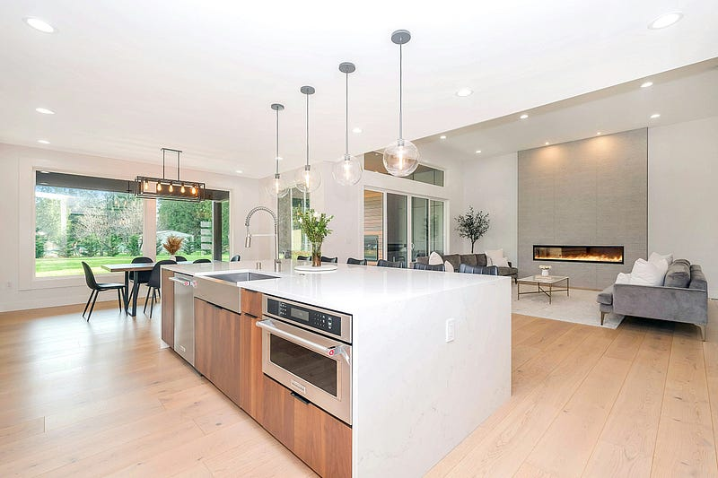

* * *

### 好想要退休！土地為王？多災多難的澳洲投資房心路歷程

唉～ 文章一開始，EC 就想要先大嘆一口氣！最近我的投資房又發生一些令人百思不得其解的事，回頭一想，這個投資房從購入開始就一路不順 (everything could go wrong, all went wrong 😂)，難道是我命犯房地產投資？囧

以下請聽我細細到來！

* * *

  1. 購房時：貸款仲介 (mortgage broker) 在我的 offer 被賣家接受之後才告知我貸款下不來。請問那我們之前一個月的溝通是在搞笑嗎?
  2. 過戶前：房子是帶租約，但租約遠低於市場行情(大概低 $50澳幣/週)，賣房仲介跟我說「租客已經在找房子了，他們打算提前搬走，所以你不用擔心」，結果後來租客根本沒有要搬家的意思。
  3. 過戶後：前屋主拒絕把事先預收的租客租金歸還給我，這完全是侵占吧!
  4. 物業出租：我的物業管理仲介，在沒有通知我的情況下幫我的房子刊登了新的招租廣告 囧

如果你對於 EC 如此水逆的房地產投資之旅有興趣，那就請你繼續看下去吧XD

礙於篇幅，我就先寫最近發生的事件4! 如果你們對於其他 **房地產投資鬼故事** 有興趣，歡迎敲碗~

Photo by [Zac Gudakov](https://unsplash.com/@zacgudakov?utm_source=medium&utm_medium=referral) on [Unsplash](https://unsplash.com?utm_source=medium&utm_medium=referral)

### 物業管理仲介在沒有通知我的情況下，擅自出租我的房子

這個事情其實就發生在兩週前 (10/19)，我突發奇想說來重新驗算一下我的投資房的投資報酬率 (rental yield)，順便來做投資房的相關分析，因為有一些房子的細節我有點不太確定(例如土地大小跟室內面積)，所以我就隨手上網 google 了我的投資房地址。

結果一點進去 [realestate.com.au](https://www.realestate.com.au/) (澳洲最大的房地產網站，大家就把它想像成台灣的 591 吧)，發現我的房子正在招租中…….???????

我當下超級困惑，還想說是不是我打錯地址? 但仔細看發現沒錯啊，照片的確是我的房子，登廣告的確實是我的物業管理 (Property Manager)。但我怎麼什麼消息都沒收到，我的房子就被放上去出租了???? 也太驚悚了吧，難道我的物業管理可以在沒有經過我的允許之下，就再度出租我的房子嗎? 現有的租客呢? 到底發生了什麼事???

於是我只好寫了一封信給他們，大意就是為什麼房子又再度招租了? 之前有通知過我但我沒收到信嗎?

> 前情提要，我的物業管理公司是一個三人小公司，我從去年 11 月買了投資房之後就開始跟他們合作。當時我面試了兩家物業管理，因為他們家讓我覺得更誠懇，所以我就選了他們。當時跟我簽約的人是 T 先生，我當初是因為他很認真跟我解釋合約所以才選他們家。在過去一年中，我比較常接觸的是另一位 S 小姐，因為她很努力幫我跟前屋主追討積欠的租金，我對她的印象也很好。這次負責招租的是 A 先生，這是他們公司裡面唯一一位我還沒有接觸過的負責人。

過了一陣子我就收到了 S 小姐的回信跟簡訊解釋，大意就是說現有的租客很突然要提前解約 (澳洲叫 break lease)，因為現在租房市場情況不是很樂觀，所以他們想要盡快把房子放到租房市場上招租，這樣才能減少我的損失。

因為是租客 break lease，所以租房的廣告費跟招租期間的租金租客會負責 (會直接從租客的四週押金 bond 裡面扣，最多扣完四週為止)。她對於沒有事先通知我感到很抱歉!

我想說好吧，既然她很有誠意地道歉了，我也沒有實際損失，雖然心裡有點不太舒服，但我覺得也就算了(但說真的，這樣難道沒有違法嗎?XDDD 我以為他們只是我聘請的物業管理，這些重大的決定應該要事先知會我並獲得我的允許吧? 而且我後來仔細看了一下，廣告是 10/1 5發的，就算他們登廣告之前來不及通知我，登廣告後到我發現那天也過了四天，這四天也都沒想過要通知我嗎? 那如果我沒有自己發現這件事，他們打算什麼時候通知我呢?)

總之當下我沒有太過計較， S 小姐解釋後我也就接受了，接著我就再回信詢問一下後續處理事宜。 S 小姐也是很快就看到信了，她傳簡訊跟我說這部分問題比較專業，她會請負責的 A 先生直接回覆。

後續我也收到 A 先生的回覆了，但他在信中一句抱歉也沒說，真心是一句都沒有，就單純只是回答了我的問題。之後我又回信問了一個不緊急的問題，這個問題他到現在還沒回覆我(已經兩週了XD)

### 開放看房 Open House

上週六是這個房子的第一次 open house，星期一我傳簡訊給 S 小姐詢問 open house 的情況。在我的認知中，一個好的物業管理，會在每次開放看房後跟房東進行簡單的匯報，例如當天有幾組人去看房，這些人分別是怎麼樣的租客，收到幾份申請等等，告知房東第一手租房現況。

S 小姐一樣請 A 先生直接打電話跟我說明。A 先生在電話中說，最近的租房市場情況真的不好，週六只有一個人去看房，他們也完全沒收到申請。

這次我終於跟 A 先生講到電話(他一樣是一句抱歉都沒有提喔囧)，我本來不想提到之前發生的事，但想了一想，後來還是在電話中主動提起說我覺得他們之前沒有通知我，就把我的房子放出去招租，這件事讓我很不受尊重。而且就算事前來不及，事後也沒有通知我，真的是讓我滿不開心的。

他給我的解釋有兩點：

1\. 他們公司之前有發生過類似的情形，為了等房東同意，過了八天才發廣告，break lease 的租客後來把他們告上 QCAT (Queensland Civil and Administrative Tribunal，約等同於法院) 說那八天的租金，不能算是租客的責任。那一場官司他們輸了，從此以後他們就很怕沒有即時投放招租廣告這件事。

2\. 他覺得這種『小事』不需要知會房東，反正是租客 break lease，找租客的過程中現任租客會負責支付前四周的租金。四週後如果還是找不到租客，因為我有買房東保險，所以後續的租金可以直接跟保險公司申請理賠，因此他們覺得完全不需要通知房東ＸＤ

我就直接跟他說，很明顯我們的價值觀不相符，而且我覺得很不受尊重。後來他說如果我希望的話，之後他每週open house 會再跟我會報 (從他的語氣中他覺得很沒必要，找到新租客再跟我說就好。但從我的角度，我覺得每次open house 完給我一通簡短電話報告情況很正常吧? 這個要求很過分嗎囧)。

### 道不同不相為謀

講完這通電話，我覺得我跟 A 先生的價值觀不同，他也已經破壞了我對於他們公司的信任。這個世界上的物業管理這麼多，我覺得沒有必要繼續合作下去了，因為我真的覺得很不舒服。

後來跟室友分享，室友覺得這位 A 先生也是滿滿的嘈點:

  1. 如果租客 break lease (毀約提早搬出) 都不算大事，那什麼叫作大事??? 要租客出現生命危險或是房子整個毀壞才算是大事嗎?
  2. 開放看房之後給房東一個簡短的匯報很正常吧? 不然你怎麼知道是因為市場真的不好，還是你的物業管理很無能找不到新租客?

聽完之後我更確定要換物業管理公司了。

### 事情還沒完

後來我火速找好了新的物業管理 (大家還記得我去年其實面試了兩家物業管理公司嗎? 我其實對另一家的印象也不錯，所以立刻就聯繫了他們)，然後發信給現任物業管理通知解約。

按照我們之前簽的物業管理合同，我必須要發 30 天通知才能解約(或是如果雙方同意的話，也可以縮短通知期)。由於上面發生的事件，我在通知上就寫說希望可以縮短 notice period，然後我就接到 A 先生的電話。

首先，他還是沒有道歉(唉，我覺得真的是價值觀不一致，因為他真的從頭到尾都覺得自己沒錯)。他說「如果我只是對他個人不滿的話，他可以把我的案子交給 S 小姐全權處理」。我說「我覺得我們雙方的價值觀不同，我覺得可能沒有必要再合作下去」，然後還感謝了一下他們團隊之前的付出 (我真的是一個 decent human being XD)。

他接受了這件事之後，就說要縮短 notice period 沒問題，有些交接事宜需要需要先跟我討論。我說「這件事不需要透過我吧? 我已經找好了新的物業管理，你們雙方都是專業人士，你們自己交接不就好了嗎? 如果有需要徵詢我的地方，我的新物業管理 An 小姐會通知我。」

結果接下來就是一陣鬼打牆，A 先生非常堅持要跟我討論所有的事情，並且希望我能同意他的做法。我說「可是我不是專業人士啊，我怎麼知道在這種情況下通常物業管理都怎麼處理? 你們雙方我都支付了專業費用，難道交接事宜不該是你們幫我處理嗎?」講到最後真的有理講不清，於是我只好跟 A 先生說，如果你很堅持，那我們就約個時間三方通話吧。

### 請幫我集氣事情能迅速圓滿落幕

總之事情的最後是，我們應該還是會按照合約上的三十天通知期，希望在這段時間內 A 先生有辦法幫我找到新租客，然後把舊租客跟保險公司的事情結清再轉交給 An 小姐處理。這樣事情比較單純!

所以請大家祝我好運吧XDDD 希望很快就可以找到新租客，事情能圓滿落幕，然後我再也不用跟 A 先生有所交集!!! 跟他溝通真是太心累了….

以上就是 EC 房產投資的鬼故事之一，如果你還想看其他鬼故事，記得留言敲碗~ 越多人敲碗，就越快有續集XDD

* * *

👩‍💻 **需要職涯導師嗎？澳洲雲端架構師 EC 提供轉職工程師、澳洲求職、移民生活等全方位諮詢服務。**

👉點擊 [<<澳洲雲端架構師 EC：專為轉職者量身打造的職涯諮詢｜海外職場×履歷優化 × 面試攻略 × DevOps /雲端職涯>>](./2018-01-03-ec-consultation/index.md)，開啟你的職涯新篇章!

**📱 想追蹤更多？**

  * 📘 [Facebook 粉專：澳洲雲端架構師 EC](https://www.facebook.com/cloudarchitectec)
  * 🧵 [Threads：Cloud Architect EC](https://www.threads.com/@cloud_architect_ec)
  * ☕ 喜歡我的創作分享？[請 EC 喝杯咖啡吧](https://donate.stripe.com/8wM8xU44n5Ld9Q4bIJ)
  * 📩 合作信箱：[cloudarchitectec@gmail.com](mailto:cloudarchitectec@gmail.com)

