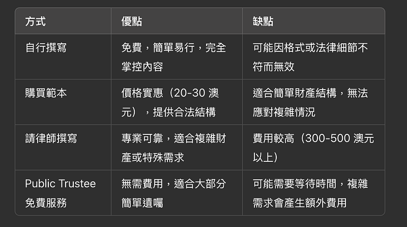
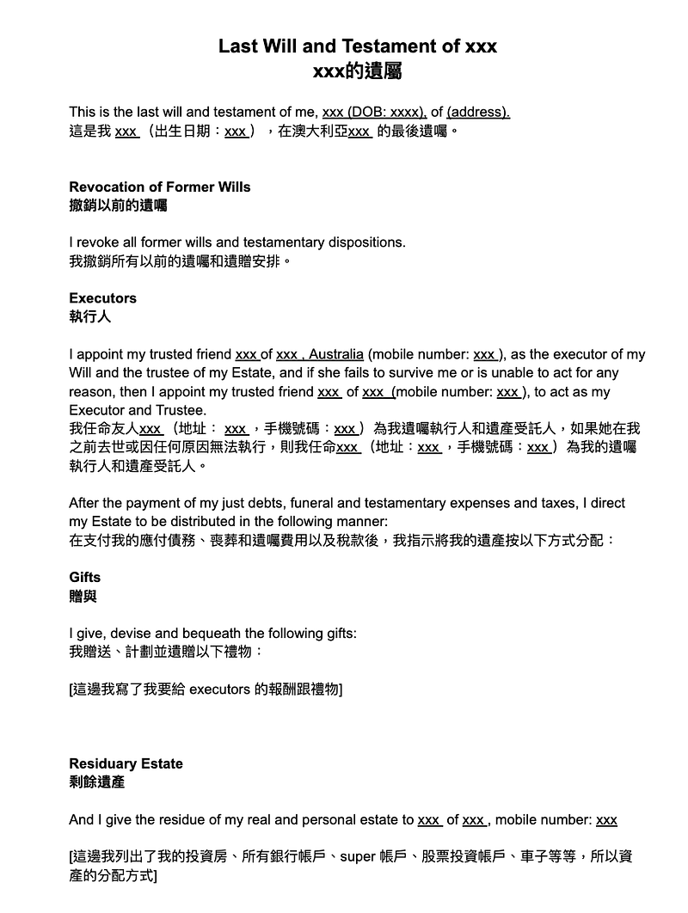
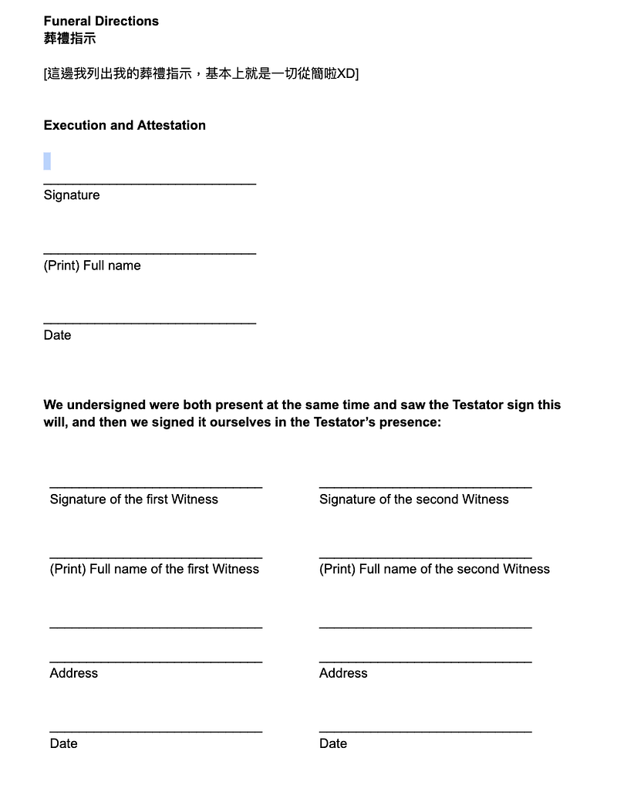

* * *

### 好想要退休！錢財乃身外之物，生不帶來，死不帶去，但你知道在澳洲要怎麼立遺屬嗎？

### 正文開始之前的閒聊

哈囉，大家好久不見～

EC 最近真心是忙到翻天，前一陣子還在粉絲頁分享了一下我究竟在忙些什麼，詳請請見以下文章。如果還沒有加入我的臉書粉專，記得去追蹤我喔～

[**澳洲雲端架構師 EC**  
 _Medium 經營兩年，居然粉絲破千了！真是可喜可賀😆 有在關注 EC 的朋友就知道，我 11 月完全沒有發一篇文章，因為工作/生活真是太忙了QAQ 來個近況更新吧～ 工作方面：臨危受命去扛一個緊急且重要的秘密…_ www.facebook.com](https://www.facebook.com/share/p/1XXXxuM7rB/)

最近手中的工作終於到了要收尾的階段，澳洲也即將迎來澳洲人最重要的聖誕假期，希望之後就可以有多一點時間寫作！(也希望你們不要忘記我喔QAQ)

除此之外， EC 在跨年期間要去昆士蘭北部的礦業小鎮 [Gladstone](https://g.co/kgs/VkhwGXn) (距離布里斯本約六個小時的車程) road trip。一月底要跟另外兩個從台灣飛來的朋友去墨爾本看澳網，二月底要去韓國跟台灣（我成功買到捷星布里斯本直飛首爾的黑五特價機票，來回只要 400 澳幣，約 8000 台幣，簡直太誇張！）

因為韓國跟台灣很近，我立刻就加買了韓國飛台灣的廉航機票，是一個自己開外站機票的概念?XDD

應讀者要求，我應該會想辦法三月時在台北辦一個小型讀者見面會，之後應該會找機會做個問卷調查，請大家敬請期待囉～

喔對，我七八月還想去紐西蘭滑雪一週，如果你有興趣一起，歡迎留言或私訊我XDDD 我行程都規劃好了，結果我稍微猶豫了一下，捷星的黑五特價機票就賣完了，捶心肝啊！！！

* * *

### 正文開始

Photo by [Giacomo Folli](https://unsplash.com/@giacomofolli?utm_source=medium&utm_medium=referral) on [Unsplash](https://unsplash.com?utm_source=medium&utm_medium=referral)

身為一個總是超前部署的人，EC 最近不止計算了退休年限，還研究了一下要怎麼寫遺囑XDDD 在大家在想我是不是想太多之前，先讓我細細道來：

### 為什麼想要立遺囑

生命無常，如果你跟 EC 一樣是個計劃狂，希望事情盡可能往自己規劃的方式去發展。提前做好遺囑規劃，其實是一種對自己負責，也對家人負責的做法喔～

雖然我們都希望能活得長長久久，但誰也無法預料未來。與其將來讓家人為了遺產分配或法律程序而煩惱，不如在生前就安排好所有細節，把自己的意願明確地寫在遺囑裡。這不僅是對家人的一種保護，也是一種對自己人生的責任感！

我覺得這點尤其是對於異鄉遊子，或是像 EC 這樣獨自移民國外的人來說，尤其重要。因為我覺得如果意外發生，我在台灣的家人絕對會不知道要怎麼處理澳洲的事宜、他們也不會知道我在澳洲到底有什麼資產、錢都放在哪裡，也不會知道我希望如何分配自己的財產跟安排身後事，這時候往往凸顯了遺屬的重要性。所以我覺得比起忌諱談論這件事，不如把遺屬當成一個有法律效率的說明書，規則都寫清楚了，大家就按著上面的條列事項執行即可XD

### 寫遺囑有什麼好處

  1. **清楚劃分遺產** ：避免親友之間因為財產分配產生爭執。也避免親友完全不知道你的資產放在哪裡，然後那些資產就無人問津！畢竟這些都是我們辛苦賺來的錢錢，還是不要浪費的好（當然自己賺的錢錢，自己花光光是最好啦XDD）
  2. **指定監護人** ：若你有未成年的孩子，可以在遺囑中指定他們的監護人，確保孩子由你信任的人照顧。說到這個，其實我有朋友指定我作為他們家兩隻貓的監護人(照顧者)XDDD 他們的說法是「我們的貓咪就跟我們的孩子一樣，必須要交給我們知道會好好對待他們的人」。我當下聽了覺得很有道理，也很感動（居然有朋友這麼信任我）。所以就算是單身的人，其實也該好好思考一下你希望交由誰來照顧你的寵物或是植物XD
  3. **節省法律費用與時間** ：有遺囑的情況下，財產分配會更簡單迅速，減少家人在悲傷之餘還要面對繁瑣的手續。
  4. **確保遺願實現** ：在遺囑裡，你可以安排財產捐贈、特定物品的歸屬，甚至是你的葬禮形式。這裡可以寫的地方很多，例如我有朋友想要在小酒吧舉行儀式，播放的歌單是她喜歡的流行樂，超可愛！想想是不是就覺得也沒什麼好避而不談的？白紙黑字寫下來之後，你除了可以擁有夢幻婚禮，還可以擁有夢幻葬禮耶XDDD 至於我自己，我是覺得人掛了就灰飛煙滅了，葬禮辦再大我也享受不到，一切從簡即可。但這裡也可以看出每個人想要的東西不一樣，老話一句，通通寫下來，確保到時候事情可以照你希望的方式進行，讚讚～

### 在澳洲寫遺囑有什麼規定？

(以下以 EC 所在的昆州為例)

  1. **法律年齡** ：必須年滿 18 歲才能合法立遺囑。
  2. **書面形式** ：遺囑必須以書面形式撰寫。
  3. **見證人** ：需要至少兩位年滿 18 歲的見證人。見證人的規定其實滿簡單的，只要成年即可，甚至也沒有規定他們需不需要有澳洲 PR 或是澳洲公民。唯一要注意的點是，兩位見證人不能是遺囑受益人喔！
  4. **簽名與日期** ：遺囑必須由本人簽名並註明日期，見證人需在場見證。
  5. **清晰的意圖** ：遺囑需清楚表達你的意圖，包括受益人、遺產分配方式以及遺囑執行人（executor）。

### 遺囑的格式

其實在澳洲/昆士蘭並沒有遺屬的制式範本，只要依照規定格式書寫，就算是自己打字的，也具有法律效力。遺屬的選擇如下：

  1. **自行撰寫** ：我研究過後，目前是選擇這一種。因為我有自己想要書寫的格式，也想要製作一個中英雙語的版本，讓台灣的家人也可以無痛閱讀。而且說真的，可以免費自己完成的事，為什麼要花錢靠別人？XDDD (完全一句話道盡 EC 的做人準則：最喜歡把事情掌握在自己手中，而且錢一定要花在刀口上～哈哈)
  2. **購買範本** ：你可以到澳洲郵局（Australia Post）或文具店（news agency）購買遺囑範本，價格大約在 20 到 30 澳元之間。這種範本很簡單，適合財產結構不複雜、想要填填表格就完成的人。
  3. **請律師撰寫** ：如果你的財產或家庭情況較為複雜，則可以考慮尋求律師協助。律師能確保遺囑的合法性並針對特殊需求給出建議。律師費用因情況而異，通常在 300 至 500 澳元之間，較為複雜的遺囑可能需要更高費用。我個人認為找律師的注意事項包括：1.確認律師具備專業執照並熟悉遺產規劃法律、2.與律師溝通清楚你的財務狀況與期望。
  4. **免費的 Public Trustee 服務** ：昆州居民可以透過 Public Trustee 的免費遺囑服務撰寫遺囑。這項服務對大部分簡單遺囑是免費的，若涉及複雜的財產分配或信託設定，可能會產生額外費用。更多資訊可參考 Public Trustee 官方網站: <https://www.pt.qld.gov.au/about-us/contact-us/book-an-appointment> (我個人其實也預訂了這個服務，只是他們要等超級久，至少 2–3 個月跑不掉。等我嘗試過後如果有新發現，我再回來跟你們分享XD)

身為表格控，EC 怎麼能不幫你們把優缺點比較表做好？（儘管拿去用吧，不用謝XD）

### 遺囑範例

以下就來跟大家分享我自己的範例！順便跟你們說明ㄧ下哪些格式是必須的，那些是 EC 自己覺得很重要應該要列進去的。

  1. **首段就請直接切題表達主旨** ：這裡的 DOB 是我自己加的，格式上其實只要寫名字跟地址就可以 (這點我朋友也跟我吐槽過，澳洲人真的很奇怪，寫地址這種隨時可能會變化的東西要幹嘛？ 我非常同意！！！我根本覺得應該要寫生日跟身分證字號吧XDD 但澳洲沒有身分證字號，所以我也就算了哈哈)
  2. **Revocation of Former Wills：** 這點很重要喔！每次有新的一版遺屬，都要記得加上這一行，讓先前的遺屬無效。
  3. **Executors 遺屬執行人** : 這點其實也沒硬性規定，一般人可能就是指定家人或律師。我是指定我在澳洲最信任的好朋友，因為他們了解澳洲，中英文又好，人還很聰明XD 我個人覺得，如果是家人的話，執行人最好不要是遺產受益人或是利益相關者。如果是律師，需要注意的是，執行遺囑是另一筆費用喔，很多律師甚至是用資產的百分比來計算，所以可能會是一筆不小的花費，一定要先問清楚。
  4. **Residue estate** : 這邊基本上就是描述在喪葬費用和法律費用付清後，剩下來的財產分配。我個人是列滿細的，銀行帳號都列了XD 想說我辛苦賺的錢錢絕對不能白白放在那裡，或被充公～如果你有什麼東西特別想要留給什麼人，例如豪宅Ａ留給 Ｘ、水景豪華公寓 B 留給 Ｙ，你最愛的鋼彈公仔要留給 Ｚ 之類的（以上我是都沒有啦XD）。總之，任何你特別在意的地方，大寫特寫就對了，反正執行人也只能盡可能照你說的辦～哈哈
  5. **葬禮指示** ：其實這點也沒有硬性規定，但我覺得就算你完全不在乎，還是稍微簡單描述一下比較好，不然大家可能也不知道要怎麼辦？當然如果你有心目中的理想葬禮，那就跟上面一樣，請你大寫特寫XD
  6. **簽名與見證人簽名：** 這邊上面已經提過了，基本上就是你要在兩位見證人面前簽名，然後兩位見證人也要簽名，記得簽名要寫日期～

Page 1Page 2

### 最後的建議

寫遺囑雖然看似沉重，但其實是對自己和家人的負責。我建議大家找一個合適的時間，開始規劃自己的遺囑內容，甚至可以諮詢專業人士的意見。最後，記得將遺囑妥善保管並告知信任的家人或朋友。另外執行人真心是一個吃力不討好的工作，我個人建議在遺囑裡面直接列好給執行人的報酬/餽贈，給現金最直接好用XD

那麼今天的分享就到這裡啦～ 很好奇你們對於這篇的心得，是覺得聖誕佳節前夕為什麼要談這個傷心事？還是覺得天啊真是太實用了，我之前都沒想過這件事？都歡迎你們留言跟我分享喔～


