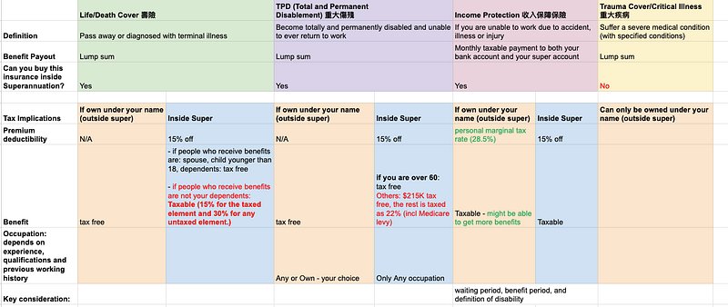
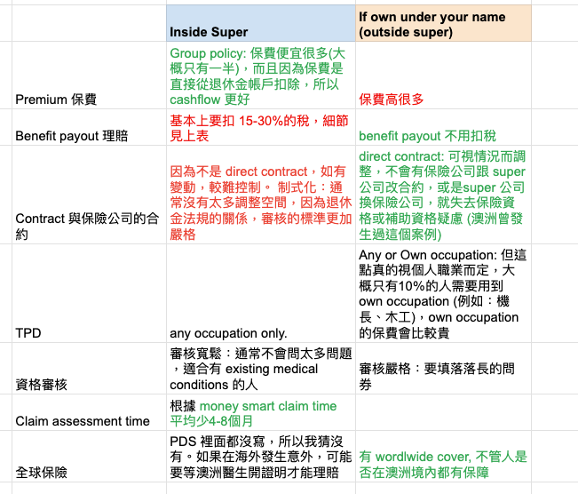
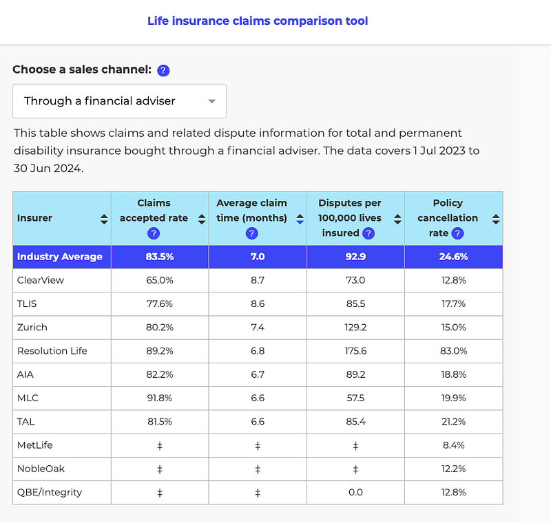

* * *

### 好想要退休！澳洲人壽保險知識分享，在澳洲打拼的你，有足夠的保障嗎？

### **前言**

Q: 什麼時候才覺得自己真的是個大人了？  
A: 當我發現自己已經開始需要研究保險的時候XDDD

有鑒於上次寫的那邊遺囑分享文點閱率有夠低，所以這次我就不寫大長篇了，但還是簡單跟大家分享一下澳洲的人壽保險 (我看一個澳洲 youtuber 用human insurance 來形容，我覺得用得非常巧妙)。

人壽保險是我們在意外或疾病面前的最後一道防線。澳洲的保險分類雖然簡單，但選擇起來卻一點都不馬虎。本文幫助你快速了解澳洲的人壽保險種類與差異，希望大家都可以根據自身情況、審慎評估過後選擇最適合你的保險方案！

Photo by [Vlad Deep](https://unsplash.com/@vladdeep?utm_source=medium&utm_medium=referral) on [Unsplash](https://unsplash.com?utm_source=medium&utm_medium=referral)

### 澳洲人壽保險分類

我跟台灣的保險不熟，感覺台灣的保險有萬萬種？不過澳洲非常簡單，基本上就分四種：

  * **Life/Death Cover（壽險）** ：保障死亡後的家人生活費用。
  * **TPD（重大傷殘險）** ：若因永久性傷殘無法工作，可獲得一筆金額。
  * **Income Protection（收入保障保險）** ：短期內因傷病無法工作，補足薪資損失。
  * **Trauma Cover（重大疾病險）** ：針對癌症、心臟病等重大疾病提供資金支持。

詳情請見我的精美表格分析，居然還上色，我真是太棒了！

### 澳洲人壽保險的 3 個重要知識點

#### 1\. 透過退休金帳戶購買保險，真的划算嗎？

  * 澳洲允許從退休金帳戶（Superannuation）中扣款支付保險費，不用自己從口袋掏錢:
  * **單身人士請注意** ：單身的人建議不要從退休金購買，不然最後保險給付要被扣一堆稅（以保150萬澳幣的重大傷殘險來說，約有30萬會拿去繳稅，真心是非。常。多！）
  * **如果你有心研究保險，也建議你不要透過 super 買：** 根據各大專家的說法，super預設的保險額度其實都不太夠
  * **家庭人士適合** ：方便且免去額外開銷壓力。

**EC 建議** ：如果想完全控制保險安排，建議別透過 Super 購買。以下 EC 製作的精美對照表，讓你一次看清兩者的差異：

* * *

#### 2\. 買保險比想像中麻煩！

既然要買保險，那就要挑保險公司。

我在澳洲政府的網站 MoneySmart 上看了有相關政府統計數字的保險公司。結果不查不得了，幾乎一半以上的保險公司都不接受妳線上購買直接保險，也不會給你保單估價，一定要打電話給他們（然後他們會派專人跟你對談，談過你才能買）。很多保險公司還規定你要透過 Financial Advisor (這在澳洲應該是需要專業執照的專業人士) 才能購買保險XDD 這多麽嚴格的審核機制哈哈

> 題外話，澳洲的各式比價網站，例如 Canstar、iSelect、Compare the Market 這些民間組織都是盈利的，如果廠商願意付錢，他們的產品就可以在比價結果中被優先顯示，所以我是不用這些網站的，請認明中立的政府比價網 MoneySmart：<https://moneysmart.gov.au/how-life-insurance-works/life-insurance-claims-comparison-tool>

**EC 建議** ：

  * 避免踩雷，請盡量使用政府推薦的中立比價工具 [MoneySmart](https://moneysmart.gov.au/how-life-insurance-works/life-insurance-claims-comparison-tool)，而非商業比價網站。
  * 很多保險公司不提供線上投保，需透過專人聯繫。
  * 部分公司甚至要求找持牌財務顧問（Financial Advisor）才能購買。

#### 3\. 選對保險策略的重要性

在選擇人壽保險時，以下兩點需特別注意：

  * 瞭解不同保險的稅務影響。
  * 根據家庭狀況，選擇適合的保障範圍與方式。

### 推薦影片資源

如果你想進一步了解保險架構與稅務，以下影片值得一看（均為英文）：

  * **Structuring Life insurance | Super vs personal name | The misconception about insurance in super: 這個人把稅務概念講得很清楚**

  * **Human Insurance | Insurance inside your superannuation explained: Human Insurance 的使用者XD 補足了稅務以外的基本概念 （他還有很多其他 super 相關的影片也很棒）**

**Should I get my insurance inside Super: 這個杯杯也講得很好，但是他的訂閱數有夠低，大家也可以多多支持！**

### 結論

其實還有更多細節我沒提，感覺認真要寫可以寫出一篇小論文XDD

研究完之類發現，我這個人不管做什麼領域，感覺都可以做得不錯耶，我好厲害哈哈哈哈哈哈

你的保險策略是什麼？歡迎跟我留言分享喔～

（說要簡單寫，結果還是寫了一整篇。如果要認真寫，豈不是要寫出一本書？XDDD）


