---

title: "2025 墨爾本澳網行 (下)：免費公關票真香！居然能在一週內再訪澳網球場，也太幸運！"
date: 2025-02-07
slug: "2025-02-07-2025-mel-trip-2"
cover:
  image: "images/medium-1*rctNiVKYK_NaY1TD67jocQ.jpg"
  alt: "墨爾本咖啡精美拉花藝術"
  caption: "好美的拉花"
images: ['images/medium-1*rctNiVKYK_NaY1TD67jocQ.jpg', 'images/medium-1*SPFTKyvJhd-FnKQwg66kCQ.jpg', 'images/medium-1*GY-fO6zKuhRvGK5CED2Hpw.jpg', 'images/medium-1*UCY9_hJWWmzWu8q_6TddKA.jpg', 'images/medium-1*w8rOPWZCbTDr_zygFZmaoQ.jpg', 'images/medium-1*FXalAHkrCLZVNdcUc8SayQ.jpg', 'images/medium-1*T1JRodpGaceALuPHQPm6aw.jpg', 'images/medium-1*MR9BNPjuKLLNCXU0r8mCoQ.jpg', 'images/medium-1*DcSz0m953gzRKE_fqpiVPw.jpg', 'images/medium-1*q9ifLVc6P2Fw--BX7g7LIg.jpg', 'images/medium-1*bXFBntatWX9wEfdQ9exDVw.jpg', 'images/medium-1*iR83-274K4ZP27L9BpUkcg.jpg']
categories: ["旅行紀錄"]
tags: ["墨爾本", "旅遊", "澳網"]
episodeseries: ["2025 墨爾本澳網行"]
---

**1/21 Tue**

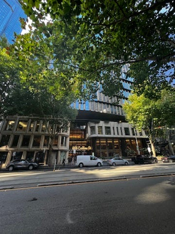 AWS 墨爾本辦公室

早上先跟我的 AWS SA 同事 Aish 去喝咖啡，她也是讀 coding bootcamp 然後轉職進 AWS，跟我的背景一樣。我其中最印象深刻的是她跟我說「EC, you are not an ordinary person! You are so brave to take on so many challenges and you really inspire me」。

因為背景相似，我們當年在 AWS 就很常吐苦水。沒想到一轉眼過去，她在 AWS 都已經四年多了，我也換到轉職後的第三個工作。我覺得 Amazon 其實是一個很磨練心智的地方，希望她可以早日找回快樂的自己。

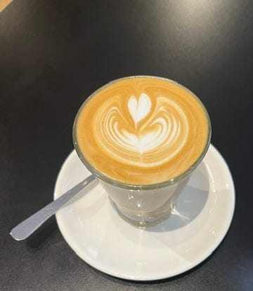

*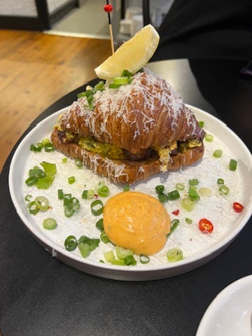咖啡廳*

下午終於要跟另一個來自台灣的朋友 Rita 見面啦❤️ 我們先在咖啡廳 Cuff 小聊了一下（餐點擺盤好看且好吃，但不到超級驚艷，咖啡普通），接著跟著 Jen 還有 Rita 的另一個朋友 Leslie 跑去 Yarra River 河畔喝酒，真是太舒適了！雖然調酒很淡又很普，但是 vibes 100 分。

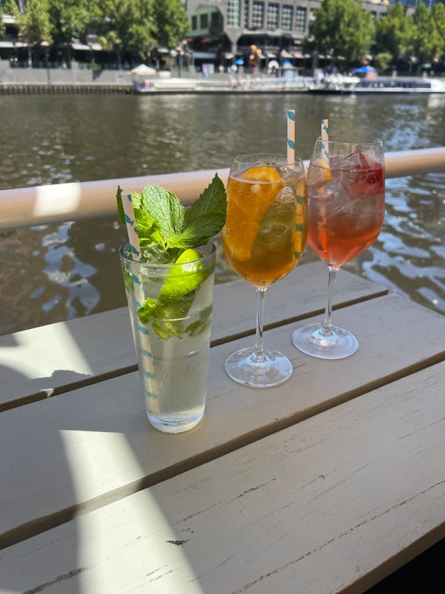

*Yarra River 河畔*

接著大家開始分開走行程，我跟 Rita 一邊散步一邊聊天，大聊了好幾個小時！真的好爽😆😆😆 身心舒暢，我也獲得了更多請假出國旅遊的小 tips，必須找時間來驗證一下！

**1/22 Tue**

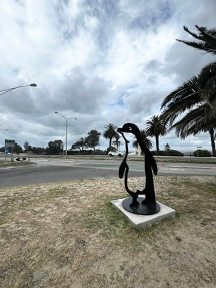

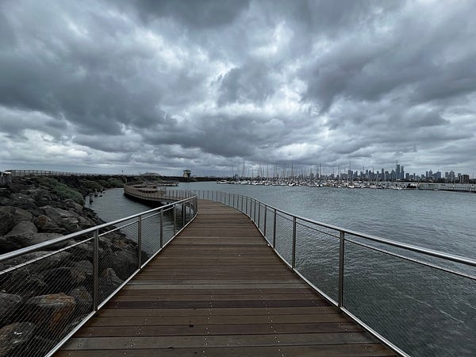

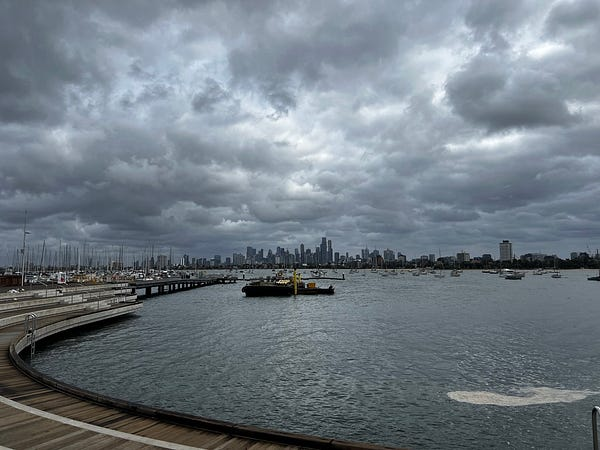

*St Kilda Beach*

今天我很早就出門了，跑去 St Kilda beach 重溫了一下回憶。今天墨爾本她氣溫終於恢復正常，立刻驟降 10 幾度，在加上海風狂吹，真是冷爆我！！！

接著我就回市區去參觀了一下墨爾本的 Shell 辦公室，甚至還參加了一場 stand up (我人在布里斯本的經理在連線畫面中看到我人在墨爾本辦公室簡直傻眼🤣），然後跟墨爾本同事一起吃午餐，這是我們開始工作 18 個月後第一次真人見面，太有趣了😆

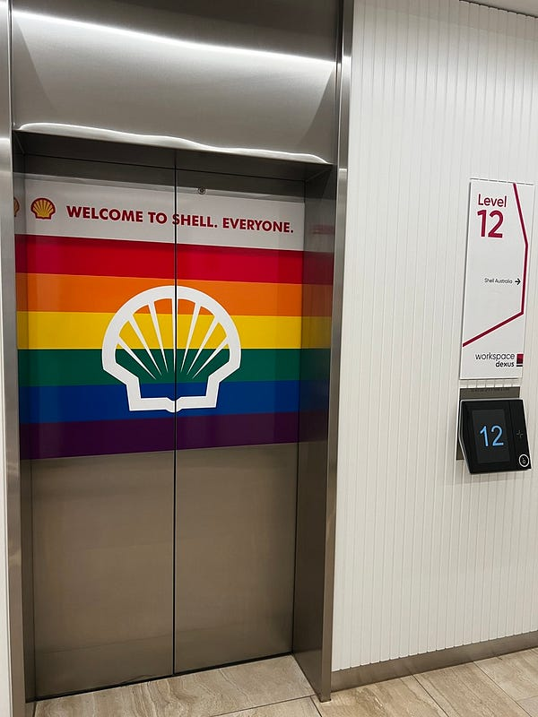

*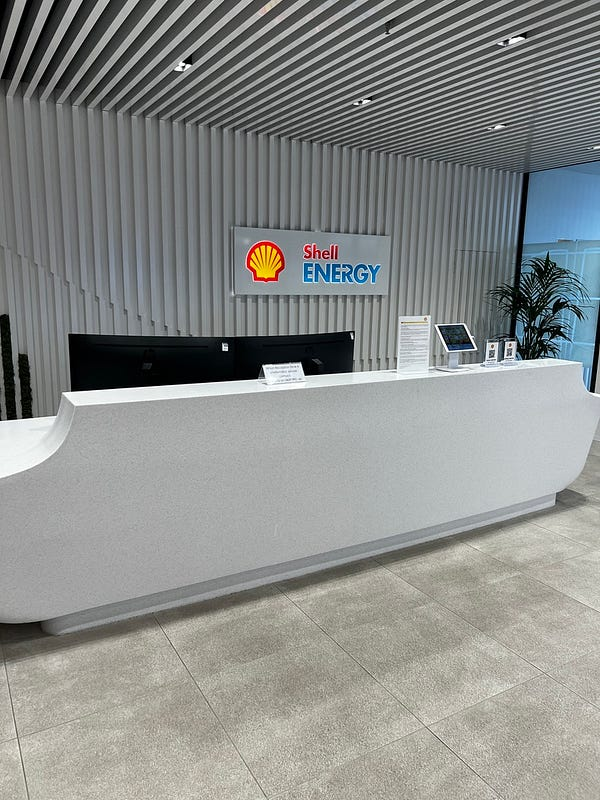Shell 墨爾本辦公室*

不知道是不是只有我，但我個人非常喜歡去世界各地參觀辦公室😆 例如 Amazon 的我去過澳洲的坎培拉、雪梨、墨爾本、布里斯本、伯斯，還去過新加坡跟台灣。微軟的我去過坎培拉、雪梨、布里斯本跟台灣的。我覺得很有趣，雖然每個公司都會有統一的風格，但每個辦公室都會有細緻的差別。像 Amazon 各地的辦公室都會有在地化特色，很可愛😆 （但我身邊的人不管是 Shell 同事或是其他朋友聽到我要去參觀墨爾本辦公室都覺得很不可思議😂)

跟同事聚餐完，我沒什麼特別的行程（其實我這趟墨爾本之行真的就是毫無行程🤣)，本來想說去喝個咖啡或是去其他景點逛逛，然後悠悠哉哉去搭晚上七點回布村的飛機。

沒想到 Rita 突然傳訊息說她朋友可以拿到澳網的免費公開票，問我要不要再去一次。於是我立刻跳下電車，跑去 officeworks 把門牌印出來，然後跑去 Flinders station 集合，又一起前往澳網了😆😆😆

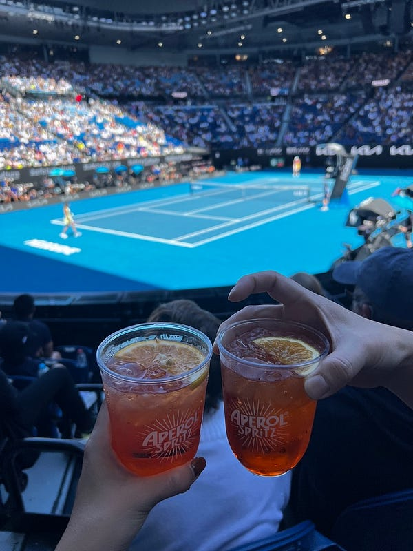

*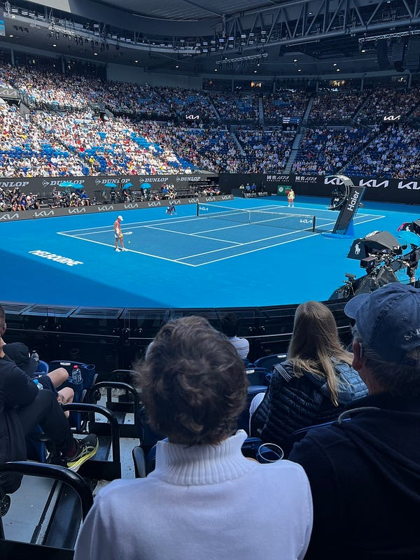公關票位子超棒！！！*

公關票也是主場球場 RLA 的坐票，而且位子有夠近，大概場邊第五排，有夠誇張😍 只可惜因為要搭飛機的原因，我只來得及看到女單的尾聲以及男單的第一盤，但還是一次非常特別又有趣的體驗！而且我們拍了很多可愛的照片❤️❤️❤️

接著我就一路趕回旅館拿寄放的行李，回 Southern cross station 去搭 skybus，然後捷星果不期然的大誤點（前後加起來可能有一個多小時)😂

接著回到布里斯本搭上倒數第二班 airtrain，然後我在火車上打這兩篇，打完剛好到家😆
