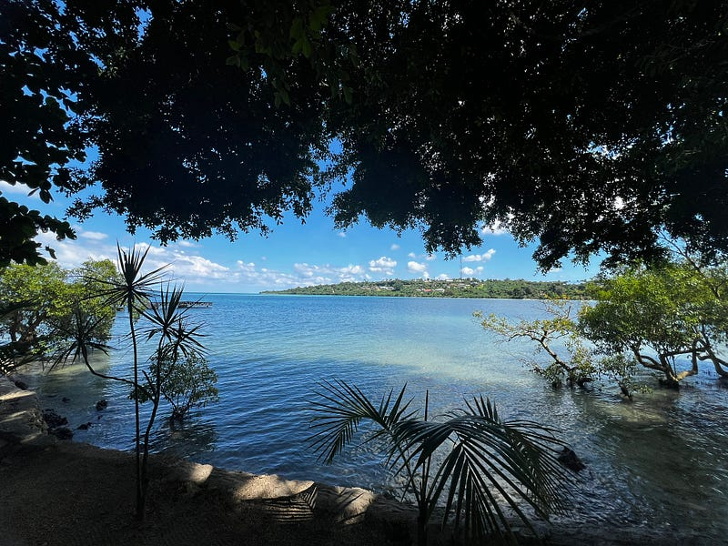
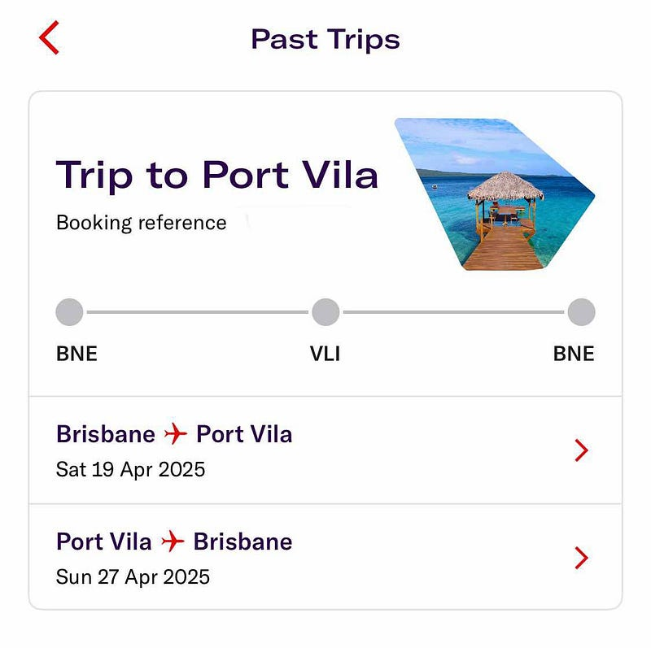
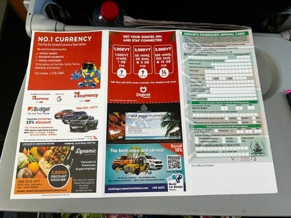
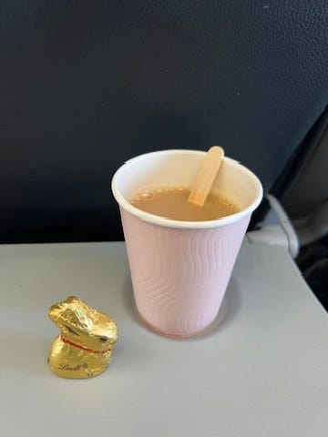
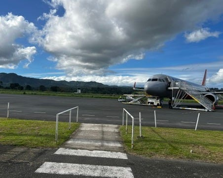
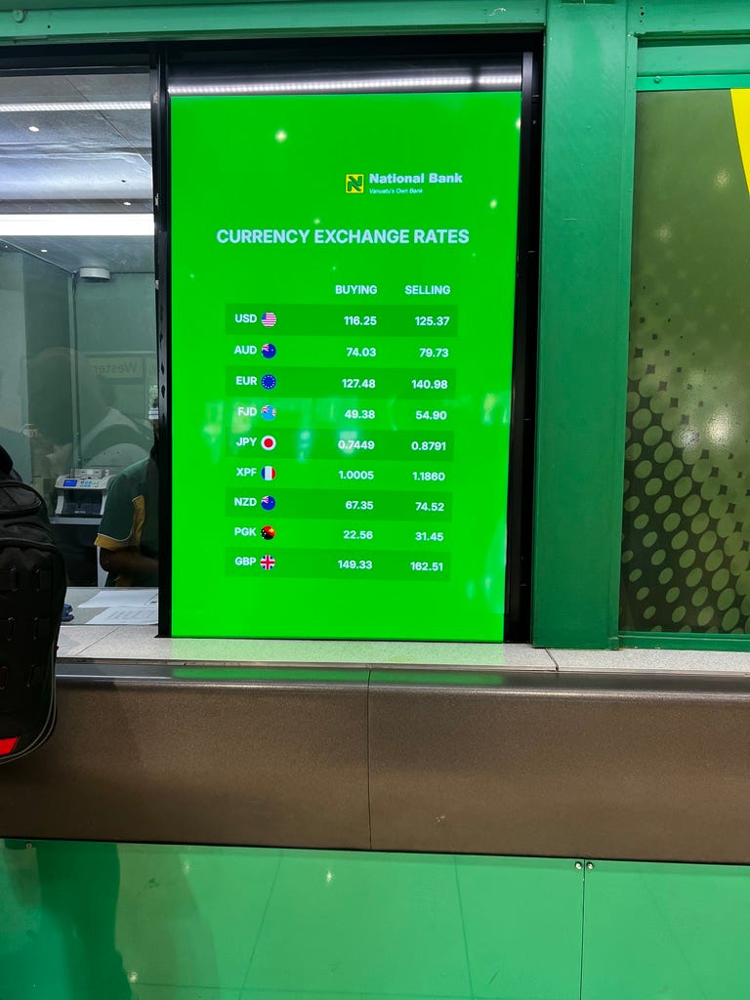
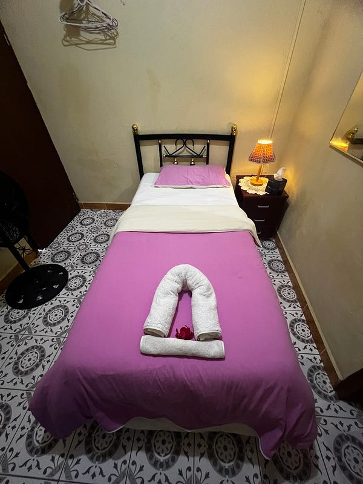
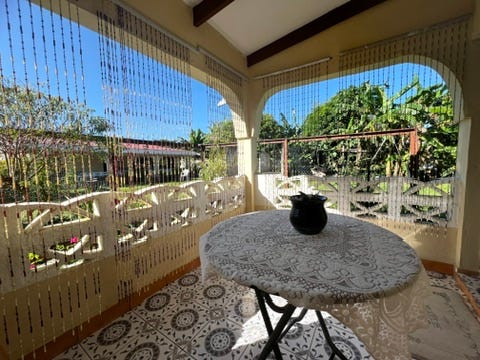

* * *

### 太平洋小島上的大冒險：2025.04.19 Vanuatu Day 1 一個女生勇闖萬那杜

### 前言

大家好久不見XDDD

2025 年莫名地有太多旅行計劃，現在才五月初，我已經國內旅遊一次（墨爾本澳網行）＋出國旅遊三次了哈哈哈哈

最近在職場上有點不思進取，所以 Medium 已經荒蕪一片。玩樂的心倒是非常高漲，例如我從萬那杜回來之後，又開始在想七八月要不要去紐西蘭滑雪（我老闆一定想說這個人到底在幹麻XD）。

總之這次要來跟大家分享我最近的一次旅行體驗：Vanuatu (台灣翻作「萬那杜」，中國翻譯為「瓦努阿圖」)。

Vanuatu 是一個海島國家，由 80 幾個小島組成。離澳洲非常近，從布里斯本出發的飛行時間約 2–3 小時。網路上的中文遊記不多，我只看到 YouTuber 小象的影片，還有另外兩個香港女生 2023 年寫的遊記（他們寫到一半也斷更了）。另外值得一提的是 Vanuatu 的首都 Port Vila 在 2024.12 月歷經了國家史上最大的 7.3 級大地震，一直到我 2025.04 月去，市中心看起來都還是一片廢墟，災後重建感覺遙遙無期。

  * 小象的影片，總共有 3 集（她是在大地震前去的，所以 Port Vila 的現況跟影片中非常不同）

  * 香港女生的遊記

[**瓦努阿圖旅行①〜Port Vila (Efate Island)〜 - MAAIKKAA BLOG**  
 _趁著農場工作結束和新生活開始的空檔，我們在2023年5月去了瓦努阿圖旅行！去瓦努阿圖的原因有三個..._ maaikkaa.com](https://maaikkaa.com/%e7%93%a6%e5%8a%aa%e9%98%bf%e5%9c%96%e6%97%85%e8%a1%8c%e3%80%9cport-villa-efate-island%e2%91%a0%e3%80%9c/)

其實我並沒有特別喜歡海島旅行，但對於短期一週出國的行程我實在不喜歡太長的飛行時間（我給自己的限定是單程5小時以內），於是選來選去就很容易選到一些澳洲附近的海島～ 這個系列的最後一篇會有斐濟跟萬那杜的比較，就請大家敬請期待吧（是說我的斐濟遊記還沒寫完，會陸續補上）。

### 遊記

這次去萬那杜做的是 Virgin Australia，雖然飛機上不供餐，但因為是復活節，所以空姐發了小兔子巧克力給大家。

萬那杜的入境卡上居然還有當地店家的廣告，我真的是要笑死耶😆😆😆 通常這種入關感覺都很嚴肅，萬那杜是我第一個看到在入境卡上打廣告的國家。

一下飛機，頓時又有種回到屏東的感覺。

不知道大家記不記得，我在斐濟遊記裡也提到我覺得他們的山看起來像是屏東的大武山XD

### 排隊再排隊

Port Vila 的機場不大，一下飛機之後，走幾步路就到了海關。雖然有十個關口，但處理速度還是一般般，但一想到反正在今年二月在韓國也是排了一個多小時才入關，就覺得也是見怪不怪。

雖然關口分了本地居民跟遊客，但一堆澳洲遊客都偷排到本地居民那幾個關口，因為速度真的比較快（千萬不要說澳洲人都會守規矩了，他們也是會鑽漏洞的lol)。守規矩的我排了一個多小時才通關，是兩班飛機裡的倒數第五個通關乘客。

好不容易入境，嗯，機場的免費 wifi 完全連不上~ 哈哈哈

只好再度開始排隊買sim card 跟換匯！

我必須要說，在我這十幾年的旅行生涯中，我真的很少有帶著大筆澳幣現金出國到當地換匯的經驗，但沒辦法，在這裡基本上刷卡要嘛行不通，要嘛要高額手續費 (3–5%)。

### 第一次坐公車就被騙錢

大概落地約兩個小時後，我終於出了這個機場（從停機坪到入境完成大概200公尺的距離）。

接著我拖著行李準備前往民宿！

出發前我看了很多評論說住宿點離機場走路只要五分鐘，但 Google maps 卻說要走20分鐘⋯⋯我試著走了一下，但覺得不太安全（因為根本沒人行道，我只能走在馬路上)。我一邊走一邊狂打電話給民宿主人，但她沒接，走回機場問工作人員，她說要嘛照著地圖走，要嘛搭公車。

然後我就被公車司機騙錢了，明明公車費用只要150vt，但他收我1000vt (雖然說其實也才台幣200多，但被騙錢真心不爽）。途中公車司機還一直想說服我去住其他地方 (後來民宿主人跟我說司機推薦的旅館根本沒營業，他可能只是想把我騙去繞一圈騙錢囧）。

### 民宿介紹

到了民宿之後，主人是個當地人老奶奶 Joy，人感覺非常nice，英文也很好！跟我介紹了一下住宿環境，在這15分鐘之內，我立刻被蚊子叮兩個包囧

我訂的是共用廚房跟浴室的單人房，一晚40澳/台幣$800含早餐（當初看上它評價超好，而且離機場很近)。其實房間真的很乾淨，還有一個延伸陽台。但是真的很有阿罵家的感覺，有兩個櫃子都是門一打開櫃門就掉下來的那種（聲明：不是我暴力，一次是奶奶開的、一次是我開的）。

本來我明天訂了 Pele island 一日遊，結果我從今天早上就開始萬般追問明天的接送時間，tour guide 一直撐到七點才說，因為明天沒有其他人跟團，所以要取消之後為什麼不早點跟我說我還可以訂其他tour 啊!

他說可以改訂週一的團，本來我也想說算了，就跟他改週一。後來想想這種浪費我時間的人還是不要給他賺好了（這個人在當地臉書社團評價超高，所以即使他一開始的報價比另一個人貴，我還是選了他，結果⋯⋯）。

剛剛訂了另一個人的週一團，便宜了vt3000，剛好把被騙的錢賺回來。至於這個團是否週一真的會成行呢？讓我們拭目以待!

安頓完已經五點多，據說走到最近的超市要30分鐘，但基於安全考量我就沒有出門了。帶來的泡麵第一天就派上用場（不然我可能要餓死在這裡），因為這次搭的 Virgin Australia 沒有附餐。

### 獨旅的醍醐味就是在路上遇到的旅人！

我在 Joy 的民宿遇到一個移民瑞士30年的菲律賓姐姐，跟她的瑞士老公正在環遊世界中（目前已經兩年半了，超狂！）。他們之前在澳洲住了三個月，也去台灣環島過。

我跟姐姐大聊了一個小時！菲律賓姐姐比我早到兩天，她跟我說這裡有些旅館，雖然沒有營業，但還是可以從booking.com或 Agoda 上預訂，而且還會扣你錢。然後等你到了旅館之後會發現那裡根本不營業 ，這裡到底是一個怎樣的地方 囧

PS: 打完這篇之後發現，我其實還有一個被騙的地方。民宿奶奶說有供應熱水，但其實沒有，我剛剛洗了一個冷水澡哈哈哈哈哈哈哈哈哈哈


